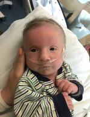
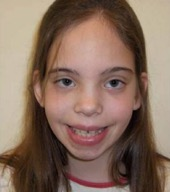
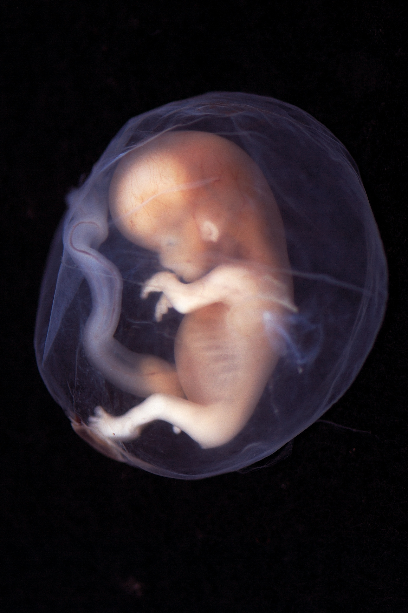
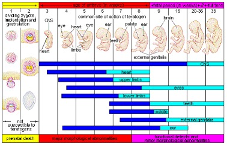
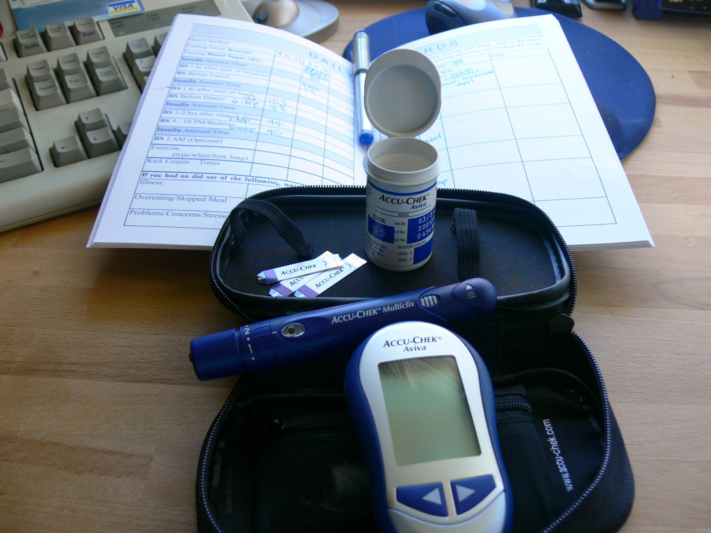
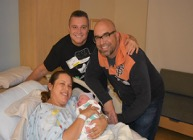

# Conception, Heredity, & Prenatal Development

<style>
div.solid {
border: 5px solid #FFA500;
border-radius: 5px;
padding: 20px;
}
</style>

<div class = "solid">

After this chapter, you should be able to:

1. Evaluate roles of nature and nurture in development.

2. Define genes and chromosomes.

3. Differentiate mitosis and meiosis.

4. Explain dominant and recessive patterns on inheritance.

5. List common genetic disorders and chromosomal abnormalities.

6. Describe changes that occur within each of the three periods of prenatal development.

7. Recognize the risks to prenatal development posed by exposure to teratogens.

8. Evaluate different types of prenatal assessment.


In this chapter, we will begin by examining some of the ways in which heredity helps to shape the way we are. We will look at what happens genetically during conception, and describe some known genetic and chromosomal disorders. Next we will consider what happens during prenatal development, including the impact of teratogens. We will also discuss the impact that both the mother and father have on the developing fetus.^[[Lifespan Development: A Psychological Perspective](http://dept.clcillinois.edu/psy/LifespanDevelopment.pdf) (page 34) by Martha Lally and Suzanne Valentine-French is licensed under [CC BY-NC-SA 3.0](https://creativecommons.org/licenses/by-nc-sa/3.0/)]

</div>
<br/>


## Heredity

### Nature and Nurture

Most scholars agree that there is a constant interplay between nature (heredity) and nurture (the environment). It is difficult to isolate the root of any single characteristic as a result solely of nature or nurture, and most scholars believe that even determining the extent to which nature or nurture impacts a human feature is difficult to answer. In fact, almost all human features are polygenic (a result of many genes) and multifactorial (a result of many factors, both genetic and environmental). It’s as if one’s genetic make-up sets up a range of possibilities, which may or may not be realized depending upon one’s environmental experiences. For instance, a person might be genetically predisposed to develop diabetes, but the person’s lifestyle may determine whether or not they actually develop the disease. 

This bidirectional interplay between nature and nurture is the **epigenetic framework**, which suggests that the environment can affect the expression of genes just as genetic predispositions can impact a person’s potentials. And environmental circumstances can trigger symptoms of a genetic disorder.^[[Lifespan Development - Module 3: Prenatal Development](https://courses.lumenlearning.com/lifespandevelopment2/chapter/lesson-3-heredity-prenatal-development-and-birth/) by [Lumen Learning](https://courses.lumenlearning.com/) references [Psyc 200 Lifespan Psychology](http://opencourselibrary.org/econ-201/) by Laura Overstreet, licensed under [CC BY 4.0](https://creativecommons.org/licenses/by/4.0/)]

#### Environment Correlations

**Environment Correlations** refer to the processes by which genetic factors contribute to variations in the environment (Plomin, DeFries, Knopik, & Neiderhiser, 2013). There are three types of genotype-environment correlations: 

**Passive genotype-environment correlation** occurs when children passively inherit the genes and the environments their family provides. Certain behavioral characteristics, such as being athletically inclined, may run in families. The children have inherited both the genes that would enable success at these activities, and given the environmental encouragement to engage in these actions. 

```{r fig-2-1, out.width = "50%", fig.cap="Two skiers.^[[Image](https://unsplash.com/photos/R-iI2W-BC3A) by [Alexey Ruban](https://unsplash.com/@intelligenciya) on [Unsplash](https://unsplash.com/)]"}

knitr::include_graphics("https://images.unsplash.com/photo-1487239954692-e6a970698056?ixlib=rb-1.2.1&ixid=eyJhcHBfaWQiOjEyMDd9&auto=format&fit=crop&w=676&q=80")
```


**Evocative genotype-environment correlation** refers to how the social environment reacts to individuals based on their inherited characteristics. For example, whether one has a more outgoing or shy temperament will affect how he or she is treated by others. 

**Active genotype-environment** correlation occurs when individuals seek out environments that support their genetic tendencies. This is also referred to as niche picking. For example, children who are musically inclined seek out music instruction and opportunities that facilitate their natural musical ability. 

Conversely, **Genotype-Environment Interactions** involve genetic susceptibility to the environment. Adoption studies provide evidence for genotype-environment interactions. For example, the Early Growth and Development Study (Leve, Neiderhiser, Scaramella, & Reiss, 2010) followed 360 adopted children and their adopted and biological parents in a longitudinal study. Results have shown that children whose biological parents exhibited psychopathology, exhibited significantly fewer behavior problems when their adoptive parents used more structured parenting than unstructured. Additionally, elevated psychopathology in adoptive parents increased the risk for the children’s development of behavior problems, but only when the biological parents’ psychopathology was high. Consequently, the results show how environmental effects on behavior differ based on the genotype, especially stressful environments on genetically at-risk children.^[[Lifespan Development: A Psychological Perspective](http://dept.clcillinois.edu/psy/LifespanDevelopment.pdf) (page 40) by Martha Lally and Suzanne Valentine-French is licensed under [CC BY-NC-SA 3.0](https://creativecommons.org/licenses/by-nc-sa/3.0/)]

### Genes and Chromosomes

Now, let’s look more closely at just nature. Nature refers to the contribution of genetics to one’s development. The basic building block of the nature perspective is the gene. **Genes** are recipes for making proteins, while proteins influence the structure and functions of cells. Genes are located on the chromosomes and there are an estimated 20,500 genes for humans, according to the Human Genome Project (NIH, 2015).

```{r fig-2-2, out.width = "50%", fig.cap="DNA’s location in the cell.^[[Image](https://commons.wikimedia.org/wiki/File:Eukaryote_DNA-en.svg) by [Radio89](https://commons.wikimedia.org/w/index.php?title=User:Radio89&action=edit&redlink=1) is licensed under [CC BY-SA 3.0](https://creativecommons.org/licenses/by-sa/3.0/deed.en)]"}

knitr::include_graphics("https://upload.wikimedia.org/wikipedia/commons/thumb/e/e2/Eukaryote_DNA-en.svg/800px-Eukaryote_DNA-en.svg.png")
```

Normal human cells contain 46 chromosomes (or 23 pairs; one from each parent) in the nucleus of the cells. After conception, most cells of the body are created by a process called mitosis. **Mitosis** is defined as the cell’s nucleus making an exact copy of all the chromosomes and splitting into two new cells. 

However, the cells used in sexual reproduction, called the gametes (sperm or ova), are formed in a process called **meiosis**. In meiosis, the gamete’s chromosomes duplicate, and then divide twice resulting in four cells containing only half the genetic material of the original gamete. Thus, each sperm and egg possesses only 23 chromosomes and combine to produce the normal 46. 


```{r include=F}

table_02_01 <- read_csv("tables/table-02-01.csv")

```


```{r table-2-1}

table_02_01 %>% 
   kable(caption = "Mitosis & Meiosis^[[Lifespan Development: A Psychological Perspective](http://dept.clcillinois.edu/psy/LifespanDevelopment.pdf) (page 34) by Martha Lally and Suzanne Valentine-French is licensed under [CC BY-NC-SA 3.0](https://creativecommons.org/licenses/by-nc-sa/3.0/) (content modified: image made into table)]") %>% 
     collapse_rows(columns = 1:2, valign = "top")
```

<br/>

```{r fig-2-3, out.width = "50%", fig.cap="Mitosis and Meiosis.^[[Image](https://commons.wikimedia.org/wiki/File:Mitosis_vs._meiosis.png) by [Community College Consortium for Bioscience Credentials](https://commons.wikimedia.org/w/index.php?title=User:C3bc-taaccct&action=edit&redlink=1) is licensed under [CC BY 3.0](https://creativecommons.org/licenses/by/3.0/deed.en)]"}

knitr::include_graphics("https://upload.wikimedia.org/wikipedia/commons/thumb/0/0d/Mitosis_vs._meiosis.png/557px-Mitosis_vs._meiosis.png")
```


Given the amount of genes present and the unpredictability of the meiosis process, the likelihood of having offspring that are genetically identical (and not twins) is one in trillions (Gould & Keeton, 1997). 

Of the 23 pairs of chromosomes created at conception, 22 pairs are similar in length. These are called **autosomes**. The remaining pair, or **sex chromosomes**, may differ in length. If a child receives the combination of XY, the child will be genetically male. If the child receives the combination XX, the child will be genetically female.^[[Lifespan Development: A Psychological Perspective](http://dept.clcillinois.edu/psy/LifespanDevelopment.pdf) (page 34-35) by Martha Lally and Suzanne Valentine-French is licensed under [CC BY-NC-SA 3.0](https://creativecommons.org/licenses/by-nc-sa/3.0/)]

Here is an image (called a karyogram) of what the 23 pairs of chromosomes look like. Notice the differences between the sex chromosomes in female (XX) and male (XY).  

```{r fig-2-4, out.width = "50%", fig.cap="The 23 pairs of chromosomes.^[[Image](https://es.m.wikipedia.org/wiki/Archivo:Human_chromosomesXXY01.png) by [Nami-ja](https://ja.wikipedia.org/wiki/User:Nami-ja) is in the public domain]"}

knitr::include_graphics("https://upload.wikimedia.org/wikipedia/commons/thumb/a/ae/Human_chromosomesXXY01.png/768px-Human_chromosomesXXY01.png")
```


#### Genotypes and Phenotypes & Patterns on Inheritance

The word **genotype** refers to the sum total of all the genes a person inherits. The word **phenotype** refers to the features that are actually expressed. Look in the mirror. What do you see, your genotype or your phenotype? What determines whether or not genes are expressed? 
Because genes are inherited in pairs on the chromosomes, we may receive either the same version of a gene from our mother and father, that is, be **homozygous** for that characteristic the gene influences. If we receive a different version of the gene from each parent, that is referred to as **heterozygous**. 

In the homozygous situation we will display that characteristic. It is in the heterozygous condition that it becomes clear that not all genes are created equal. Some genes are **dominant**, meaning they express themselves in the phenotype even when paired with a different version of the gene, while their silent partner is called recessive. **Recessive** genes express themselves only when paired with a similar version gene. Geneticists refer to different versions of a gene as alleles. Some dominant traits include having facial dimples, curly hair, normal vision, and dark hair. Some recessive traits include red hair, being nearsighted, and straight hair.

Most characteristics are not the result of a single gene; they are **polygenic**, meaning they are the result of several genes. In addition, the dominant and recessive patterns described above are usually not that simple either. Sometimes the dominant gene does not completely suppress the recessive gene; this is called incomplete dominance.^[[Lifespan Development: A Psychological Perspective](http://dept.clcillinois.edu/psy/LifespanDevelopment.pdf) (page 35) by Martha Lally and Suzanne Valentine-French is licensed under [CC BY-NC-SA 3.0](https://creativecommons.org/licenses/by-nc-sa/3.0/)]

#### Genetic Disorders

Most of the known **genetic disorders** are dominant gene-linked; however, the vast majority of dominant gene linked disorders are not serious or debilitating. For example, the majority of those with Tourette's Syndrome suffer only minor tics from time to time and can easily control their symptoms. When dominant-gene linked diseases are serious, they do not tend to become symptomatic until later in life. Huntington's Disease is a dominant gene linked disorder that affects the nervous system and is fatal, but does not appear until midlife. 

Recessive gene disorders, such as cystic fibrosis and sickle-cell anemia, are less common but may actually claim more lives because they are less likely to be detected as people are unaware that they are carriers of the disease. 

Some genetic disorders are sex-linked; the defective gene is found on the X-chromosome. Males have only one X chromosome so are at greater risk for sex-linked disorders due to a recessive gene such as hemophilia, color-blindness, and baldness. For females to be affected by recessive genetic defects, they need to inherit the recessive gene on both X-chromosomes. But if the defective gene is dominant, females are equally at risk.

Here are tables of some genetic disorders:

**Recessive Disorders (Homozygous)**: The individual inherits a gene change from both parents. If the gene is inherited from just one parent, the person is a carrier and does not have the condition.


```{r include=F}

table_02_02 <- read_csv("tables/table-02-02.csv")

```


```{r table-2-2}

table_02_02 %>% 
   kable(caption = "Recessive Disorders (Homozygous)^[[Lifespan Development: A Psychological Perspective](http://dept.clcillinois.edu/psy/LifespanDevelopment.pdf) (page 36-37) by Martha Lally and Suzanne Valentine-French is licensed under [CC BY-NC-SA 3.0](https://creativecommons.org/licenses/by-nc-sa/3.0/)]") %>% 
     collapse_rows(columns = 1:2, valign = "top")

```

<br/>

**Autosomal Dominant Disorders (Heterozygous)**: In order to have the disorder, the individual only needs to inherit the gene change from one parent.


```{r include=F}

table_02_03 <- read_csv("tables/table-02-03.csv")

```


```{r table-2-3}

table_02_03 %>% 
   kable(caption = "Autosomal Dominant Disorders (Heterozygous)^[[Lifespan Development: A Psychological Perspective](http://dept.clcillinois.edu/psy/LifespanDevelopment.pdf) (page 36-37) by Martha Lally and Suzanne Valentine-French is licensed under [CC BY-NC-SA 3.0](https://creativecommons.org/licenses/by-nc-sa/3.0/)]")

```

<br/>


**Sex-Linked Disorders**: When the X chromosome carries the mutated gene, the disorder is referred to as an X-linked disorder. Males are more affected than females because they possess only one X chromosome without an additional X chromosome to counter the harmful gene.


```{r include=F}

table_02_04 <- read_csv("tables/table-02-04.csv")

```


```{r table-2-4}

table_02_04 %>% 
   kable(caption = "Sex-Linked Disorders^[[Lifespan Development: A Psychological Perspective](http://dept.clcillinois.edu/psy/LifespanDevelopment.pdf) (page 36-37) by Martha Lally and Suzanne Valentine-French is licensed under [CC BY-NC-SA 3.0](https://creativecommons.org/licenses/by-nc-sa/3.0/)]")
```

<br/>


**Chromosomal Abnormalities**: A chromosomal abnormality occurs when a child inherits too many or two few chromosomes. The most common cause of chromosomal abnormalities is the age of the mother. As the mother ages, the ovum is more likely to suffer abnormalities due to longer term exposure to environmental factors. Consequently, some gametes do not divide evenly when they are forming. Therefore, some cells have more than 46 chromosomes. In fact, it is believed that close to half of all zygotes have an odd number of chromosomes. Most of these zygotes fail to develop and are spontaneously aborted by the mother’s body.^[[Lifespan Development: A Psychological Perspective](http://dept.clcillinois.edu/psy/LifespanDevelopment.pdf) (page 38) by Martha Lally and Suzanne Valentine-French is licensed under [CC BY-NC-SA 3.0](https://creativecommons.org/licenses/by-nc-sa/3.0/)]

Here is a table of some autosomal chromosomal disorders:

**Autosomal Chromosome Disorders**: The individual inherits too many or two few chromosomes.


```{r include=F}

table_02_05 <- read_csv("tables/table-02-05.csv")

```


```{r table-2-5}

table_02_05 %>% 
   kable(caption = "Autosomal Chromosomal Disorders^[[Trisomy 9 Mosaicism Diagnosed In Utero](https://www.hindawi.com/journals/ogi/2010/379534/) by [Hironori Takahashi](https://www.hindawi.com/78979210/), [Satoshi Hayashi](https://www.hindawi.com/20267181/), [Yumiko Miura](https://www.hindawi.com/21648754/), [Keiko Tsukamoto](https://www.hindawi.com/42320186/), [Rika Kosaki](https://www.hindawi.com/84073549/), [Yushi Itoh](https://www.hindawi.com/93015326/), and [Haruhiko Sago](https://www.hindawi.com/65675123/) is licensed under CC BY 3.0; [Lifespan Development: A Psychological Perspective](http://dept.clcillinois.edu/psy/LifespanDevelopment.pdf) (page 39) by Martha Lally and Suzanne Valentine-French is licensed under [CC BY-NC-SA 3.0](https://creativecommons.org/licenses/by-nc-sa/3.0/)]")

```


```{r fig-2-5, fig.cap="Infant boy with Trisomy 9 Mosaicism.^[Image by Ashley Onken used with permission]"}



```

```{r fig-2-6, fig.cap="Girl with XXX Syndrome.^[[Image](https://www.ncbi.nlm.nih.gov/pmc/articles/PMC2883963/) is in the public domain]"}


```


When the abnormality is on 23rd pair, the result is a **sex-linked chromosomal abnormality**. This happens when a person has less than or more than two sex chromosomes.^[[Lifespan Development: A Psychological Perspective](http://dept.clcillinois.edu/psy/LifespanDevelopment.pdf) (page 38) by Martha Lally and Suzanne Valentine-French is licensed under [CC BY-NC-SA 3.0](https://creativecommons.org/licenses/by-nc-sa/3.0/)] 

Here is a table of some sex-linked chromosomal disorders:  


```{r include=F}

table_02_06 <- read_csv("tables/table-02-06.csv")

```

```{r table-2-6}

table_02_06 %>% 
        kable(caption = "Sex-Linked Chromosomal Disorders^[[XYY Syndrome](https://en.wikipedia.org/wiki/XYY_syndrome) by [Wikipedia](https://en.wikipedia.org/wiki/Main_Page) is licensed under [CC BY-SA 3.0](https://en.wikipedia.org/wiki/Wikipedia:Text_of_Creative_Commons_Attribution-ShareAlike_3.0_Unported_License); [Triple X Syndrome](https://en.wikipedia.org/wiki/Triple_X_syndrome) by [Wikipedia](https://en.wikipedia.org/wiki/Main_Page) is licensed under [CC BY-SA 3.0](https://en.wikipedia.org/wiki/Wikipedia:Text_of_Creative_Commons_Attribution-ShareAlike_3.0_Unported_License); [Lifespan Development: A Psychological Perspective](http://dept.clcillinois.edu/psy/LifespanDevelopment.pdf) (page 39) by Martha Lally and Suzanne Valentine-French is licensed under [CC BY-NC-SA 3.0](https://creativecommons.org/licenses/by-nc-sa/3.0/)]")

```


## Prenatal Development

Now we turn our attention to prenatal development which is divided into three periods: The germinal period, the embryonic period, and the fetal period. The following is an overview of some of the changes that take place during each period.

### The Germinal Period

The **germinal period** (about 14 days in length) lasts from **conception** to implantation of the fertilized egg in the lining of the uterus. At ejaculation millions of sperm are released into the vagina, but only a few reach the egg and typically only one fertilizes the egg. Once a single sperm has entered the wall of the egg, the wall becomes hard and prevents other sperm from entering. After the sperm has entered the egg, the tail of the sperm breaks off and the head of the sperm, containing the genetic information from the father, unites with the nucleus of the egg. It is typically fertilized in the top section of the fallopian tube and continues its journey to the uterus. As a result, a new cell is formed. This cell, containing the combined genetic information from both parents, is referred to as a **zygote**. 

```{r fig-2-7, out.width = "50%", fig.cap="Sperm and ovum at conception.^[[Image](https://commons.wikimedia.org/wiki/File:Sperm-egg.jpg) is in the public domain]"}

knitr::include_graphics("https://upload.wikimedia.org/wikipedia/commons/8/86/Sperm-egg.jpg")

```

During this time, the organism begins cell division through mitosis. After five days of mitosis there are 100 cells, which is now called a blastocyst. The blastocyst consists of both an inner and outer group of cells. The inner group of cells, or embryonic disk will become the embryo, while the outer group of cells, or trophoblast, becomes the support system which nourishes the developing organism. This stage ends when the blastocyst fully implants into the uterine wall (U.S. National Library of Medicine, 2015). 

```{r fig-2-8, out.width = "50%", fig.cap="The cycle of fertilization.^[[Image](https://commons.wikimedia.org/wiki/File:Human_Fertilization.png#/media/File:Human_Fertilization) by [Ttrue12](https://commons.wikimedia.org/w/index.php?title=User:Ttrue12&action=edit&redlink=1) is licensed under [CC BY-SA 3.0](https://creativecommons.org/licenses/by-sa/3.0/deed.en)]"}

knitr::include_graphics("https://upload.wikimedia.org/wikipedia/commons/thumb/5/5b/Human_Fertilization.png/800px-Human_Fertilization.png")

```


Mitosis is a fragile process and fewer than one half of all zygotes survive beyond the first two weeks (Hall, 2004). Some of the reasons for this include: the egg and sperm do not join properly, thus their genetic material does not combine, there is too little or damaged genetic material, the zygote does not replicate, or the blastocyst does not implant into the uterine wall. The failure rate is higher for in vitro conceptions. The figure below illustrates the journey of the ova from its release to its fertilization, cell duplication, and implantation into the uterine lining.^[[Lifespan Development: A Psychological Perspective](http://dept.clcillinois.edu/psy/LifespanDevelopment.pdf) (page 42-43) by Martha Lally and Suzanne Valentine-French is licensed under [CC BY-NC-SA 3.0](https://creativecommons.org/licenses/by-nc-sa/3.0/)]

### The Embryonic Period

Starting the third week, the blastocyst has implanted in the uterine wall. Upon implantation this multi-cellular organism is called an **embryo**. Now blood vessels grow forming the **placenta**. The placenta is a structure connected to the uterus that provides nourishment and oxygen from the mother to the developing embryo via the umbilical cord. 

During this period, cells continue to **differentiate**. Growth during prenatal development occurs in two major directions: from head to tail called **cephalocaudal development** and from the midline outward referred to as **proximodistal development**. This means that those structures nearest the head develop before those nearest the feet and those structures nearest the torso develop before those away from the center of the body (such as hands and fingers). You will see that this pattern continues after birth.

The head develops in the fourth week and the precursor to the heart begins to pulse. In the early stages of the embryonic period, gills and a tail are apparent. However, by the end of this stage they disappear and the organism takes on a more human appearance. 

```{r fig-2-9, out.width = "50%", fig.cap="A human embryo.^[[Image](https://commons.wikimedia.org/wiki/File:Human_embryo.jpg) by [Anatomist90](https://commons.wikimedia.org/wiki/User:Anatomist90) is licensed under [CC BY-SA 3.0](https://creativecommons.org/licenses/by-sa/3.0/deed.en)]"}

knitr::include_graphics("https://upload.wikimedia.org/wikipedia/commons/thumb/9/9c/Human_embryo.jpg/800px-Human_embryo.jpg")

```

About 20 percent of organisms fail during the embryonic period, usually due to gross chromosomal abnormalities, often before the mother even knows that she is pregnant. It is during this stage that the major structures of the body are taking form, making the embryonic period the time when the organism is most vulnerable to the greatest amount of damage if exposed to harmful substances. Prospective mothers are not often aware of the risks they introduce to the developing embryo during this time. The embryo is approximately 1 inch in length and weighs about 4 grams at the end of eight weeks. The embryo can move and respond to touch at this time.^[[Lifespan Development: A Psychological Perspective](http://dept.clcillinois.edu/psy/LifespanDevelopment.pdf) (page 43) by Martha Lally and Suzanne Valentine-French is licensed under [CC BY-NC-SA 3.0](https://creativecommons.org/licenses/by-nc-sa/3.0/)]

### The Fetal Period

From the ninth week until birth (which is forty weeks for a full-term pregnancy), the organism is referred to as a fetus. During this stage, the major structures are continuing to develop. By the third month, the fetus has all its body parts including external genitalia. The fetus is about 3 inches long and weighs about 28 grams. In the following weeks, the fetus will develop hair, nails, teeth and the excretory and digestive systems will continue to develop.

```{r fig-2-10, out.width = "50%", fig.cap="A human fetus.^[[Image](https://www.flickr.com/photos/lunarcaustic/2433149102/in/photostream/) by [lunar caustic](https://www.flickr.com/photos/lunarcaustic/) is licensed under [CC BY-SA 2.0](https://creativecommons.org/licenses/by-sa/2.0/)]"}



```

During the 4th - 6th months, the eyes become more sensitive to light and hearing develops. The respiratory system continues to develop, and reflexes such as sucking, swallowing and hiccupping, develop during the 5th month. Cycles of sleep and wakefulness are present at this time as well. The first chance of survival outside the womb, known as the age of viability is reached at about 24 weeks (Morgan, Goldenberg, & Schulkin, 2008). Many practitioners hesitate to resuscitate before 24 weeks. The majority of the neurons in the brain have developed by 24 weeks, although they are still rudimentary, and the glial or nurse cells that support neurons continue to grow. At 24 weeks the fetus can feel pain (Royal College of Obstetricians and Gynecologists, 1997). 

Between the 7th - 9th months, the fetus is primarily preparing for birth. It is exercising its muscles and its lungs begin to expand and contract. The fetus gains about 5 pounds and 7 inches during this last trimester of pregnancy, and during the 8th month a layer of fat develops under the skin. This layer of fat serves as insulation and helps the baby regulate body temperature after birth. 

At around 36 weeks the fetus is almost ready for birth. It weighs about 6 pounds and is about 18.5 inches long. By week 37 all of the fetus’s organ systems are developed enough that it could survive outside the mother’s uterus without many of the risks associated with premature birth. The fetus continues to gain weight and grow in length until approximately 40 weeks. By then the fetus has very little room to move around and birth becomes imminent. The progression through the stages is shown in the following figure.^[[Lifespan Development: A Psychological Perspective](http://dept.clcillinois.edu/psy/LifespanDevelopment.pdf) (page 44-45) by Martha Lally and Suzanne Valentine-French is licensed under [CC BY-NC-SA 3.0](https://creativecommons.org/licenses/by-nc-sa/3.0/)]

```{r fig-2-11, out.width = "50%", fig.cap="The development of a fetus.^[[Image](https://cnx.org/contents/Sr8Ev5Og@4.100:b7opmCF3@3/Stages-of-Development) by [CNX Psychology](https://cnx.org/) is licensed under [CC BY 4.0](https://creativecommons.org/licenses/by/4.0/)]"}

knitr::include_graphics("https://cnx.org/resources/b5cf3171c2f5f69c833056b04330e45890ce5710/CNX_Psych_09_02_Stages.jpg")

```


<style>
div.blue {background-color:#e6f0ff; border-radius: 5px; padding: 20px;}
</style>
<div class = "blue">
#### Monozygotic and Dizygotic Twins

**Monozygotic** or identical twins occur when a fertilized egg splits apart in the first two weeks of development. The result is the creation of two separate, but genetically identical offspring. That is, they possess the same genotype and often the same phenotype. About one-third of twins are monozygotic twins. 

Sometimes, however, two eggs or ova are released and fertilized by two separate sperm. The result is **dizygotic** or fraternal twins. These two individuals share the same amount of genetic material as would any two children from the same mother and father. In other words, they possess a different genotype and phenotype. 

Older mothers are more likely to have dizygotic twins than are younger mothers, and couples who use fertility drugs are also more likely to give birth to dizygotic twins.^[[Lifespan Development: A Psychological Perspective](http://dept.clcillinois.edu/psy/LifespanDevelopment.pdf) (page 36) by Martha Lally and Suzanne Valentine-French is licensed under [CC BY-NC-SA 3.0](https://creativecommons.org/licenses/by-nc-sa/3.0/)]


```{r fig-2-12, out.width = "25%", fig.cap="Monozygotic Twins^[[Image](https://commons.wikimedia.org/wiki/File:TwinGirls.jpg) is in the public domain]"}

knitr::include_graphics("https://upload.wikimedia.org/wikipedia/commons/4/4b/TwinGirls.jpg")

```

```{r fig-2-13, fig.cap="Dizygotic Twins^[Image by Jennifer Paris used with permission]"}


```

</div>

### Teratogen 
Good prenatal care is essential to protect against maternal and fetal/infant mortality and birth complications. The embryo and fetus is most at risk for some of the most severe problems during the first three months of development. Unfortunately, this is a time at which many mothers are unaware that they are pregnant. Today, we know many of the factors that can jeopardize the health of the developing child. The study of factors that contribute to birth defects is called teratology. **Teratogens** are environmental factors that can contribute to birth defects, and include some maternal diseases, pollutants, drugs and alcohol. 

Factors influencing prenatal risks: There are several considerations in determining the type and amount of damage that might result from exposure to a particular teratogen (Berger, 2005). These include: 

* **The timing of the exposure**: Structures in the body are vulnerable to the most severe damage when they are forming. If a substance is introduced during a particular structure's critical period (time of development), the damage to that structure may be greater. For example, the ears and arms reach their critical periods at about 6 weeks after conception. If a mother exposes the embryo to certain substances during this period, the arms and ears may be malformed. (see figure below)

* **The amount of exposure**: Some substances are not harmful unless the amounts reach a certain level. The critical level depends in part on the size and metabolism of the mother. 

* **The number of teratogens**: Fetuses exposed to multiple teratogens typically have more problems than those exposed to only one. 

* **Genetics**: Genetic makeup also plays a role on the impact a particular teratogen might have on the child. This is suggested by fraternal twins exposed to the same prenatal environment, but they do not experience the same teratogenic effects. The genetic makeup of the mother can also have an effect; some mothers may be more resistant to teratogenic effects than others.

* **Being male or female**: Males are more likely to experience damage due to teratogens than are females. It is believed that the Y chromosome, which contains fewer genes than the X, may have an impact.^[[Lifespan Development: A Psychological Perspective](http://dept.clcillinois.edu/psy/LifespanDevelopment.pdf) (page 46-47) by Martha Lally and Suzanne Valentine-French is licensed under [CC BY-NC-SA 3.0](https://creativecommons.org/licenses/by-nc-sa/3.0/)]

```{r fig-2-14, fig.cap="The development of an embryo into a fetus.^[[Image](http://opencourselibrary.org/econ-201/) by Laura Overstreet is licensed under [CC BY-NC-SA 3.0](http://creativecommons.org/licenses/by-nc-sa/3.0/)]"}



```

There are four categories of teratogens:

1. **Physical teratogens**: These could be saunas, hot tubs, or infections that raise a pregnant woman's body temperature to 102 degrees Fahrenheit or higher. This is associated with neural tube defects, spontaneous abortions, and various cardiovascular abnormalities.

2. **Metabolic conditions affecting pregnant females**: Metabolic conditions are abnormalities in the chemical process of producing energy from food, and thereby affect the development and function of the body. If a pregnant woman is malnourished, then her fetus likely lacks the nutrients essential for its development. These include: malnutrition, diabetes, and thyroid disorders.

3. **Infections**: Different maternal infections, including rubella virus, herpes simplex virus, and syphilis can cause congenital abnormalities in fetuses.

4. **Drugs and chemicals**: When pregnant females ingest or absorb these, they may cause a variety of different effects based on specific agent, amount of exposure, and timing. This category includes: radiation, heavy metals (including lead), insecticides and herbicides, prescription and over the counter drugs, illicit and recreational drugs, alcohol, cigarettes, nicotine, caffeine, and even some vitamins.^[[The Embryo Project Encyclopedia](https://embryo.asu.edu/pages/teratogens) by Chanapa Tantibanchachai is licensed under [CC BY-NC-SA 3.0](https://creativecommons.org/licenses/by-nc-sa/3.0/)]

While there are many, many potential teratogens, the following tables look at the effects of some different types of teratogens. The risks of exposure vary based on lifestyle and health. The effects may vary greatly depending on the factors mentioned previously. Protection and prevention will vary based on the method of exposure. 


```{r include=F}

table_02_07 <- read_csv("tables/table-02-07.csv")

```


```{r table-2-7}

table_02_07 %>% 
        kable(caption = "Drugs as Teratogens") %>% 
        column_spec(1, width = "15em")

```


<br/>

```{r include=F}

table_02_08 <- read_csv("tables/table-02-08.csv")

```


```{r table-2-8}

table_02_08 %>% 
        kable(caption = "Environmental Teratogens") %>% 
        column_spec(1, width = "15em")

```

<br/>


```{r include=F}

table_02_09 <- read_csv("tables/table-02-09.csv")

```


```{r table-2-9}

table_02_09 %>% 
        kable(caption = "Maternal Infections as Teratogens") %>% 
        column_spec(1, width = "15em")

```

<br/>


```{r include=F}

table_02_10 <- read_csv("tables/table-02-10.csv")

```


```{r table-2-10}

table_02_10 %>% 
        kable(caption = "Teratogens from Animals/Pets") %>% 
        column_spec(1, width = "15em")

```


### Maternal Factors

There are additional factors that affect the outcome of pregnancy for both mother and child. Let’s look at these next. 


```{r fig-2-15, out.width = "50%", fig.cap="A pregnant woman relaxing in a tub.^[[Image](https://www.flickr.com/photos/newlifehotels/3508874204/https://www.flickr.com/photos/newlifehotels/3508874204/) by [Thomas Pompernigg](https://www.flickr.com/photos/newlifehotels/) is licensed under [CC BY-SA 2.0](https://creativecommons.org/licenses/by-sa/2.0/)]"}


```


#### Mothers over 35

Most women over 35 who become pregnant are in good health and have healthy pregnancies. However, according to the March of Dimes (2016d), women over age 35 are more likely to have an increased risk of: 

* Fertility problems 
* High blood pressure 
* Diabetes
* Miscarriages 
* Placenta Previa 
* Cesarean section 
* Premature birth 
* Stillbirth 
* A baby with a genetic disorder or other birth defects 

Because a woman is born with all her eggs, environmental teratogens can affect the quality of the eggs as women get older. Also, a woman’s reproductive system ages which can adversely affect the pregnancy. Some women over 35 choose special prenatal screening tests, such as a maternal blood screening, to determine if there are any health risks for the baby. 

Although there are medical concerns associated with having a child later in life, there are also many positive consequences to being a more mature parent. Older parents are more confident, less stressed, and typically married, providing family stability. Their children perform better on math and reading tests, and they are less prone to injuries or emotional troubles (Albert, 2013). Women who choose to wait are often well educated and lead healthy lives. According to Gregory (2007), older women are more stable, demonstrate a stronger family focus, possess greater self-confidence, and have more money. Having a child later in one’s career equals overall higher wages. In fact, for every year a woman delays motherhood, she makes 9% more in lifetime earnings. Lastly, women who delay having children actually live longer. 

#### Teenage Pregnancy

A teenage mother is at a greater risk for having pregnancy complications including anemia, and high blood pressure. These risks are even greater for those under age 15. Infants born to teenage mothers have a higher risk for being premature and having low birthweight or other serious health problems. Premature and low birthweight babies may have organs that are not fully developed which can result in breathing problems, bleeding in the brain, vision loss, serious intestinal problems, and higher likelihood of dying. Reasons for these health issues include that teenagers are the least likely of all age groups to get early and regular prenatal care and they may engage in negative behaviors including eating unhealthy food, smoking, drinking alcohol, and taking drugs. 

#### Gestational Diabetes

Seven percent of pregnant women develop **gestational diabetes** (March of Dimes, 2015b). Diabetes is a condition where the body has too much glucose in the bloodstream. 

```{r fig-2-16, out.width = "50%", fig.cap="A gestational diabetes kit.^[[Image](https://www.flickr.com/photos/94953676@N00/187457292/) by [Jessica Merz](https://www.flickr.com/photos/jessicafm/) is licensed under [CC BY 2.0](https://creativecommons.org/licenses/by/2.0/)]"}



```

Most pregnant women have their glucose level tested between 24 to 28 weeks of pregnancy. Gestational diabetes usually goes away after the mother gives birth, but it might indicate a risk for developing diabetes later in life. If untreated, gestational diabetes can cause premature birth, stillbirth, the baby having breathing problems at birth, jaundice, or low blood sugar. Babies born to mothers with gestational diabetes can also be considerably heavier (more than 9 pounds) making the labor and birth process more difficult. For expectant mothers, untreated gestational diabetes can cause preeclampsia (high blood pressure and signs that the liver and kidneys may not be working properly) discussed later in the chapter. 

Risk factors for gestational diabetes include age (being over age 25), being overweight or gaining too much weight during pregnancy, family history of diabetes, having had gestational diabetes with a prior pregnancy, and race and ethnicity (African-American, Native American, Hispanic, Asian, or Pacific Islander have a higher risk). Eating healthy and maintaining a healthy weight during pregnancy can reduce the chance of gestational diabetes. Women who already have diabetes and become pregnant need to attend all their prenatal care visits, and follow the same advice as those for women with gestational diabetes as the risk of preeclampsia, premature birth, birth defects, and stillbirth are the same. 

#### High Blood Pressure (Hypertension)

Hypertension is a condition in which the pressure against the wall of the arteries becomes too high. There are two types of high blood pressure during pregnancy, gestational and chronic. Gestational hypertension only occurs during pregnancy and goes away after birth. Chronic high blood pressure refers to women who already had hypertension before the pregnancy or to those who developed it during pregnancy and it did not go away after birth. 


Figure 2.17 – A woman having her blood pressure taken.^[Image by [rawpixel](https://unsplash.com/@rawpixel) on [Unsplash](https://unsplash.com/)

According to the March of Dimes (2015c), about 8 in every 100 pregnant women have high blood pressure. High blood pressure during pregnancy can cause premature birth and low birth weight (under five and a half pounds), placental abruption, and mothers can develop preeclampsia. 

#### Rh Disease

Rh is a protein found in the blood. Most people are Rh positive, meaning they have this protein. Some people are Rh negative, meaning this protein is absent. Mothers who are Rh negative are at risk of having a baby with a form of anemia called Rh disease (March of Dimes, 2009). A father who is Rh-positive and mother who is Rh-negative can conceive a baby who is Rh-positive. Some of the fetus’s blood cells may get into the mother’s bloodstream and her immune system is unable to recognize the Rh factor. 

The immune system starts to produce antibodies to fight off what it thinks is a foreign invader. Once her body produces immunity, the antibodies can cross the placenta and start to destroy the red blood cells of the developing fetus. As this process takes time, often the first Rh positive baby is not harmed, but as the mother’s body will continue to produce antibodies to the Rh factor across her lifetime, subsequent pregnancies can pose greater risk for an Rh positive baby. In the newborn, Rh disease can lead to jaundice, anemia, heart failure, brain damage and death.

#### Weight Gain during Pregnancy

 According to March of Dimes (2016f), during pregnancy most women need only an additional 300 calories per day to aid in the growth of the fetus. Gaining too little or too much weight during pregnancy can be harmful. Women who gain too little may have a baby who is low-birth weight, while those who gain too much are likely to have a premature or large baby. There is also a greater risk for the mother developing preeclampsia and diabetes, which can cause further problems during the pregnancy. 

The table below shows the healthy weight gain during pregnancy. Putting on the weight slowly is best. Mothers who are concerned about their weight gain should talk to their health care provider. 


```{r include=F}

table_02_11 <- read_csv("tables/table-02-11.csv")

```


```{r table-2-11}

table_02_11 %>% 
   kable(caption = "Weight Gain during Pregnancy") %>% 
   column_spec(1, width = "15em") %>% 
   footnote(general = "Mothers of twins or higher order multiples need to gain more in each category.")

```


#### Stress

Feeling stressed is common during pregnancy, but high levels of stress can cause complications including having a premature baby or a low-birthweight baby. Babies born early or too small are at an increased risk for health problems. Stress-related hormones may cause these complications by affecting a woman’s immune systems resulting in an infection and premature birth. Additionally, some women deal with stress by smoking, drinking alcohol, or taking drugs, which can lead to problems in the pregnancy. High levels of stress in pregnancy have also been correlated with problems in the baby’s brain development and immune system functioning, as well as childhood problems such as trouble paying attention and being afraid (March of Dimes, 2012b). 

#### Depression

Depression is a significant medical condition in which feelings of sadness, worthlessness, guilt, and fatigue interfere with one’s daily functioning. Depression can occur before, during, or after pregnancy, and 1 in 7 women are treated for depression sometime between the year before pregnancy and year after pregnancy (March of Dimes, 2015a). Women who have experienced depression previously are more likely to have depression during pregnancy. Consequences of depression include the baby being born premature, having a low birthweight, being more irritable, less active, less attentive, and having fewer facial expressions. 

About 13% of pregnant women take an antidepressant during pregnancy. It is important that women taking antidepressants during pregnancy discuss the medication with a health care provider as some medications can cause harm to the developing organism. 

### Paternal Impact 

The age of fathers at the time of conception is also an important factor in health risks for children. According to Nippoldt (2015), offspring of men over 40 face an increased risk of miscarriages, autism, birth defects, achondroplasia (bone growth disorder) and schizophrenia. These increased health risks are thought to be due to accumulated chromosomal aberrations and mutations during the maturation of sperm cells in older men (Bray, Gunnell, & Smith, 2006). However, like older women, the overall risks are small. 

In addition, men are more likely than women to work in occupations where hazardous chemicals, many of which have teratogenic effects or may cause genetic mutations, are used (Cordier, 2008). These may include petrochemicals, lead, and pesticides that can cause abnormal sperm and lead to miscarriages or diseases. Men are also more likely to be a source of second hand smoke for their developing offspring. As noted earlier, smoking by either the mother or around the mother can hinder prenatal development.^[[Lifespan Development: A Psychological Perspective](http://dept.clcillinois.edu/psy/LifespanDevelopment.pdf) (page 52-55) by Martha Lally and Suzanne Valentine-French is licensed under [CC BY-NC-SA 3.0](https://creativecommons.org/licenses/by-nc-sa/3.0/)]
 

```{r fig-2-18, out.width = "50%", fig.cap="A USDA employee pouring hazardous chemicals into a storage container.^[[Image](https://commons.wikimedia.org/wiki/File:Hazardous-pesticide.jpg) by [USDA](https://www.usda.gov/) is in the public domain]"}

knitr::include_graphics("https://upload.wikimedia.org/wikipedia/commons/e/e7/Hazardous-pesticide.jpg")

```


#### Prenatal Assessment

A number of assessments are suggested to women as part of their routine prenatal care to find conditions that may increase the risk of complications for the mother and fetus (Eisenberg, Murkoff, & Hathaway, 1996). These can include blood and urine analyses and screening and diagnostic tests for birth defects. 

```{r fig-2-19, out.width = "50%", fig.cap="A woman receiving an ultrasound.^[[Image](https://pixabay.com/photos/patient-ultrasound-pregnant-470514/) by [MedicalPrudens](https://pixabay.com/en/users/MedicalPrudens-481982/) is licensed under [CC0 1.0](https://creativecommons.org/publicdomain/zero/1.0/deed.en)]"}

knitr::include_graphics("https://cdn.pixabay.com/photo/2014/10/02/18/50/patient-470514_960_720.jpg")

```

**Ultrasound** is one of the main screening tests done in combination with blood tests. The ultrasound is a test in which sound waves are used to examine the fetus. There are two general types. Transvaginal ultrasounds are used in early pregnancy, while transabdominal ultrasounds are more common and used after 10 weeks of pregnancy (typically, 16 to 20 weeks). 

Ultrasounds are used to check the fetus for defects or problems. It can also find out the age of the fetus, location of the placenta, fetal position, movement, breathing and heart rate, amount of amniotic fluid in the uterus, and number of fetuses. Most women have at least one ultrasound during pregnancy, but if problems are noted, additional ultrasounds may be recommended. 

When diagnosis of a birth defect is necessary, ultrasounds help guide the more invasive diagnostic tests of amniocentesis and chorionic villus sampling. **Amniocentesis** is a procedure in which a needle is used to withdraw a small amount of amniotic fluid and cells from the sac surrounding the fetus and later tested. 

```{r fig-2-20, out.width = "50%", fig.cap="Amniocentesis.^[[Image](https://commons.wikimedia.org/wiki/File:Amniocentesis.png) by [BruceBlaus](https://commons.wikimedia.org/wiki/User:BruceBlaus) is licensed under [CC BY-SA 4.0](https://creativecommons.org/licenses/by-sa/4.0/deed.en)]"}

knitr::include_graphics("https://upload.wikimedia.org/wikipedia/commons/thumb/9/92/Amniocentesis.png/600px-Amniocentesis.png")

```

**Chorionic Villus Sampling** is a procedure in which a small sample of cells is taken from the placenta and tested. Both amniocentesis and chorionic villus sampling have a risk of miscarriage, and consequently they are not done routinely.^[[Lifespan Development: A Psychological Perspective](http://dept.clcillinois.edu/psy/LifespanDevelopment.pdf) (page 34-35) by Martha Lally and Suzanne Valentine-French is licensed under [CC BY-NC-SA 3.0](https://creativecommons.org/licenses/by-nc-sa/3.0/)]

#### Complications of Pregnancy

There are a number of common side effects of pregnancy. Not everyone experiences all of these, nor to the same degree. And although they are considered "minor", this is not to say that these problems are not potentially very uncomfortable. These side effects include nausea (particularly during the first 3-4 months of pregnancy as a result of higher levels of estrogen in the system), heartburn, gas, hemorrhoids, backache, leg cramps, insomnia, constipation, shortness of breath or varicose veins (as a result of carrying a heavy load on the abdomen). These are minor issues.

But there are also serious complications of pregnancy which can pose health risks to mother and child and that often require hospitalization.

**Hyperemesis gravidarum** is characterized by severe nausea, vomiting, weight loss, and possibly dehydration. Signs and symptoms may also include vomiting many times a day and feeling faint. The exact causes of hyperemesis gravidarum are unknown. Risk factors include the first pregnancy, multiple pregnancy, obesity, prior or family history of HG, trophoblastic disorder, and a history of eating disorders. Treatment includes drinking fluids and a bland diet. Medication, intravenous fluids, and hospitalization may be required. Hyperemesis gravidarum is estimated to affect 0.3–2.0% of pregnant women. Those affected have a low risk of miscarriage but a higher risk of premature birth.

**Ectopic Pregnancy** occurs when the zygote becomes attached to the fallopian tube before reaching the uterus. About 1 in 50 pregnancies in the United States are tubal pregnancies and this number has been increasing because of the higher rates of pelvic inflammatory disease and Chlamydia (Carroll, 2007). Abdominal pain, vaginal bleeding, nausea and fainting are symptoms of ectopic pregnancy.

```{r fig-2-21, out.width = "50%", fig.cap="An ectopic pregnancy.^[[Image](https://commons.wikimedia.org/wiki/File:Ectopic_Pregnancy_Diagram.jpg) by [Takatakatakumi](https://commons.wikimedia.org/w/index.php?title=User:Takatakatakumi&action=edit&redlink=1) is licensed under [CC BY-SA 3.0](https://creativecommons.org/licenses/by-sa/3.0/deed.en)]"}

knitr::include_graphics("https://upload.wikimedia.org/wikipedia/commons/thumb/b/b3/Ectopic_Pregnancy_Diagram.jpg/800px-Ectopic_Pregnancy_Diagram.jpg")

```

**Spontaneous abortion** is experienced in an estimated 20-40 percent of undiagnosed pregnancies and in another 10 percent of diagnosed pregnancies. Usually the body aborts due to chromosomal abnormalities, and this typically happens before the 12th week of pregnancy. Cramping and bleeding result and normal periods return after several months. Some women are more likely to have repeated miscarriages due to chromosomal, amniotic, or hormonal problems, but miscarriage can also be a result of defective sperm (Carrell et. al., 2003).

**Preeclampsia**, also known as **Toxemia**, is characterized by a sharp rise in blood pressure, a leakage of protein into the urine as a result of kidney problems, and swelling of the hands, feet, and face during the third trimester of pregnancy. Preeclampsia is the most common complication of pregnancy. When preeclampsia causes seizures, the condition is known as eclampsia, which is the second leading cause of maternal death in the United States. Preeclampsia is also a leading cause of fetal complications, which include low birth weight, premature birth, and stillbirth. Treatment is typically bed rest and sometimes medication. If this treatment is ineffective, labor may be induced.

**Maternal Mortality**: Approximately 1000 women die in childbirth around the world each day (World Health Organization, 2010). Rates are highest in Sub-Saharan Africa and South Asia, although there has been a substantial decrease in these rates. The campaign to make childbirth safe for everyone has led to the development of clinics accessible to those living in more isolated areas and training more midwives to assist in childbirth.^[[Hyperemesis Gravidarum](https://en.wikipedia.org/wiki/Hyperemesis_gravidarum) by [Wikipedia](https://en.wikipedia.org/wiki/Main_Page) is licensed under [CC BY-SA 3.0](https://en.wikipedia.org/wiki/Wikipedia:Text_of_Creative_Commons_Attribution-ShareAlike_3.0_Unported_License); [Lifespan Development: A Psychological Perspective](http://dept.clcillinois.edu/psy/LifespanDevelopment.pdf) (page 58) by Martha Lally and Suzanne Valentine-French is licensed under [CC BY-NC-SA 3.0](https://creativecommons.org/licenses/by-nc-sa/3.0/)]


<style>
div.blue {background-color:#e6f0ff; border-radius: 5px; padding: 20px;}
</style>
<div class = "blue">
##### Infertility and Building Families

**Infertility**

When a couple has failed to conceive a child in a year, they receive the diagnosis of infertility. Infertility affects about 10 to 15 percent of couples in the United States (Mayo Clinic, 2015). 
Male factors create infertility in about a third of the cases. For men, the most common cause is a lack of sperm production or low sperm production. 

Female factors cause infertility in another third of cases. For women, one of the most common causes of infertility is the failure to ovulate. Another cause of infertility in women is Pelvic Inflammatory Disease (PID), which is an infection of a woman’s reproductive organs (Carroll, 2007). 

Both male and female factors contribute to the remainder of cases of infertility.^[[Lifespan Development: A Psychological Perspective](http://dept.clcillinois.edu/psy/LifespanDevelopment.pdf) (page 57) by Martha Lally and Suzanne Valentine-French is licensed under [CC BY-NC-SA 3.0](https://creativecommons.org/licenses/by-nc-sa/3.0/)]

**Options for Building Families**

There are numerous options to pursue parenthood and building families. Let’s briefly explore some of these.

**Assisted Reproductive Technology**

Assisted reproductive technology (ART) is the technology used to achieve pregnancy in procedures such as fertility medication (to stimulate ovulation), surgical procedures, artificial insemination IUI), in vitro fertilization (IVF) and surrogacy. These options are available for people who are experiencing infertility or cannot conceive children naturally (which also includes single parents, and gay/lesbian couples).^[[Assisted Reproductive Technology](https://fertilitypedia.org/edu/therapies/assisted-reproductive-technology) by [Fertilitypedia](https://fertilitypedia.org/) is licensed under [CC BY-SA 4.0](http://creativecommons.org/licenses/by-sa/4.0/)]

*Intrauterine insemination*: (IUI) as a type of artificial insemination involves the placement of sperm directly into the uterus at the time of ovulation, either in a natural menstrual cycle or following ovarian stimulation.^[[Intrauterine Insemination](https://fertilitypedia.org/edu/therapies/intrauterine-insemination) by [Fertilitypedia](https://fertilitypedia.org/) is licensed under [CC BY-SA 4.0](http://creativecommons.org/licenses/by-sa/4.0/)]

*In vitro fertilization* (IVF): IVF generally starts with stimulating the ovaries to increase egg production. Most fertility medications are agents that stimulate the development of follicles in the ovary. Examples are gonadotropins and gonadotropin releasing hormone. After stimulation, the physician surgically extracts one or more eggs from the ovary, and unites them with sperm in a laboratory setting, with the intent of producing one or more embryos. Fertilization takes place outside the body, and the fertilized egg is reinserted into the woman's reproductive tract, in a procedure called embryo transfer.^[[Assisted Reproductive Technology](https://fertilitypedia.org/edu/therapies/assisted-reproductive-technology) by [Fertilitypedia](https://fertilitypedia.org/) is licensed under [CC BY-SA 4.0](http://creativecommons.org/licenses/by-sa/4.0/)]


```{r fig-2-22, out.width = "50%", fig.cap="The IVF process.^[[Image](https://commons.wikimedia.org/wiki/File:IVF.jpg) by [Manu5](https://commons.wikimedia.org/w/index.php?title=User:Manu5&action=edit&redlink=1) is licensed under [CC BY-SA 4.0](http://creativecommons.org/licenses/by-sa/4.0/)]"}

knitr::include_graphics("https://upload.wikimedia.org/wikipedia/commons/thumb/8/86/IVF.jpg/800px-IVF.jpg")

```

*Donor Gametes & Embryos*: People can also use sperm, ova (eggs), and embryos from donors in conjunction with ART. These donations take place through agencies and donor banks or between private individuals. In the U.S., donors can be compensated for their donations. 

*Surrogacy*: In surrogacy, one woman (surrogate mother) carries a child for another person/s (commissioning person/couple), based on a legal agreement before conception requiring the child to be relinquished to the commissioning person/couple following birth. There are different types of surrogacy which relate to whether or not the ova used to conceive the child are her own (traditional surrogacy) or not (gestational surrogacy).^[[Surrogacy](https://fertilitypedia.org/edu/therapies/surrogacy) by [Fertilitypedia](https://fertilitypedia.org/) is licensed under [CC BY-SA 4.0](http://creativecommons.org/licenses/by-sa/4.0/)]

*Adoption*: People can also choose to pursue adoption to build their families (with or without experiencing infertility). Adoption can take place through the foster care system, privately, or through agencies. Adoptions can be domestic (within the U.S.) or international. And they can be open (with differing amounts of contact between biological/birth families and adoptive families) or closed.  

Family Built with Surrogacy 	 


```{r fig-2-23, fig.cap="This same-sex couple used a surrogate.^[Photo by Daryn Crawford used with permission]"}



```

Family Built through Adoption

```{r fig-2-24, fig.cap="This single mother adopted her daughter.^[Photo by Michaela Szidloski used with permission]"}


```


</div>

<br/>

<style>
div.solid {
border: 5px solid #FFA500;
border-radius: 5px;
padding: 20px;
}
</style>

<div class = "solid">

In this chapter we looked at: 

* Heredity, including genetic disorders and chromosomal abnormalities

* Conception 

* The germinal, embryonic, and fetal stages of prenatal development

* Influences on prenatal development including teratogens and maternal and paternal factors

* Complications of pregnancy

* Infertility and options for building families


Now let’s explore birth and the newborn baby.

</div>
<br/>
