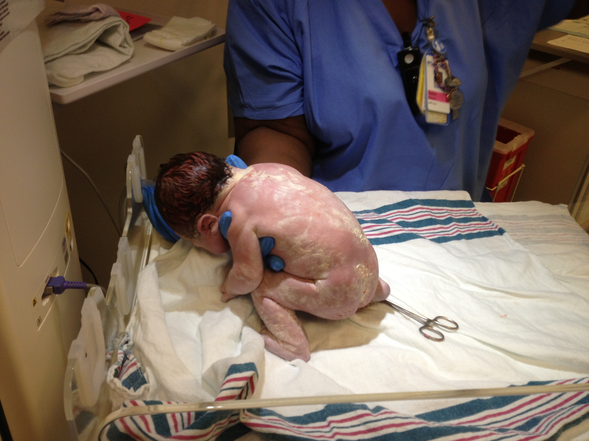

# Birth and the Newborn

<style>
div.solid {
border: 5px solid #FFA500;
border-radius: 5px;
padding: 20px;
}
</style>

<div class = "solid">

After this chapter, you should be able to:

* Compare and contrast different methods of childbirth preparation.

* Describe the stages of vaginal delivery.

* Explain why induction or Caesarean section may be necessary.

* Differentiate the common procedures for assessing the condition of the newborn.

* Examine problems newborns experience before, during, and after birth.


After around 266 days of developing inside the womb (for a full-term pregnancy), comes the arduous process of childbirth. After birth, newborns have to regulate their own body temperature, breathe for themselves, and take in all of their nutrition through feeding. Let’s look at both the process of birth and some attributes of the newborn.

</div>

<br/>

## Preparing for Childbirth

Prepared childbirth refers to being not only in good physical condition to help provide a healthy environment for the baby to develop, but also helping individuals to prepare to accept their new roles as parents. Additionally, parents can receive information and training that will assist them for delivery and life with the baby. The more future parents can learn about childbirth and the newborn, the better prepared they will be for the adjustment they must make to a new life.

### Approaches to Childbirth 

There are many different approaches to childbirth that influence how expectant parents prepare. The following table describes a few of these:


```{r include=F}

table_03_01 <- read_csv("tables/table-03-01.csv")

```


```{r table-3-1}

table_03_01 %>% 
        kable(caption = "Approaches to Childbirth^[[Lifespan Development: A Psychological Perspective](http://dept.clcillinois.edu/psy/LifespanDevelopment.pdf) (page 34-35) by Martha Lally and Suzanne Valentine-French is licensed under [CC BY-NC-SA 3.0](https://creativecommons.org/licenses/by-nc-sa/3.0/); [Lifespan Development - Module 3: Prenatal Development](https://courses.lumenlearning.com/suny-hccc-ss-152-1/chapter/childbirth/) by [Lumen Learning](https://courses.lumenlearning.com/) references [Psyc 200 Lifespan Psychology](http://opencourselibrary.org/econ-201/) by Laura Overstreet, licensed under [CC BY 4.0](https://creativecommons.org/licenses/by/4.0/)]") %>% 
        column_spec(1, width = "15em")

```


```{r fig-3-1, out.width="50%", fig.cap="Expectant parents in a childbirth preparation class.^[[Image](https://www.flickr.com/photos/10190034@N05/2961636277/in/photolist-2UG8H9-2TEQ1g-2UG9yw-2UBJdF-2UBJBB-2UG8SG-2UBJ1F-2UBJ7Z-2UBJJn-2UG9m3-2UG9uJ-8MN14Z-8MR1wh-8MMWJa-8MR5VN-4vPBHE-aDXfTf-g2KR8-8MQZK3-2UBHHk-2UG919-e9dM71-KKhQK-5i8wmJ-8MR1E9-8MN1wx-aeQiNe-dddPzR-dddLnk-8MR5Cw-5SdC1f-aBoMFE-8MN1cv-oUUuYJ-3yCwYi-8MR1nq-8MQZ8S-8MQZZs-5QozpQ-8MR5bu-8MN1Wa-8Rmdnh-zARYov-G7W4pJ-zyyNHq-yDYGme-rXsoxp-5JMQMm-5vHahr-PuCHL) by [liz.schrenk](https://www.flickr.com/photos/10190034@N05/) is licensed under [CC BY-NC-ND 2.0](https://creativecommons.org/licenses/by-nc-nd/2.0/)]"}


``` 

### Choosing Location of Childbirth & Who Will Deliver

The vast majority of births occur in a hospital setting. However, one percent of women choose to deliver at home (Martin, Hamilton, Osterman, Curtin, & Mathews, 2015). Women who are at low risk for birth complications can successfully deliver at home. More than half (67%) of home deliveries are by certified nurse midwives. Midwives are trained and licensed to assist in delivery and are far less expensive than the cost of a hospital delivery. However, because of the potential for a complication during the birth process, most medical professionals recommend that delivery take place in a hospital. In addition to home births, one-third of out-of-hospital births occur in freestanding clinics, birthing centers, in physician’s offices, or other locations.^[[Lifespan Development: A Psychological Perspective](http://dept.clcillinois.edu/psy/LifespanDevelopment.pdf) (page 34-35) by Martha Lally and Suzanne Valentine-French is licensed under [CC BY-NC-SA 3.0](https://creativecommons.org/licenses/by-nc-sa/3.0/); [Lifespan Development - Module 3: Prenatal Development](https://courses.lumenlearning.com/suny-hccc-ss-152-1/chapter/childbirth/) by [Lumen Learning](https://courses.lumenlearning.com/) references [Psyc 200 Lifespan Psychology](http://opencourselibrary.org/econ-201/) by Laura Overstreet, licensed under [CC BY 4.0](https://creativecommons.org/licenses/by/4.0/)]


## Childbirth

### Onset of Labor

Childbirth typically occurs within a week of a woman’s due date, unless the woman is pregnant with more than one fetus, which usually causes her to go into labor early. As a pregnancy progresses into its final weeks, several physiological changes occur in response to hormones that trigger labor. 

A common sign that labor is beginning is the so-called “bloody show.” During pregnancy, a plug of mucus accumulates in the cervical canal, blocking the entrance to the uterus. Approximately 1–2 days prior to the onset of true labor, this plug loosens and is expelled, along with a small amount of blood. 

As labor nears, the mothers’ pituitary gland produces oxytocin. This begins to stimulate stronger, more painful uterine contractions, which—in a positive feedback loop—stimulate the secretion of prostaglandins from fetal membranes. Like oxytocin, prostaglandins also enhance uterine contractile strength. The fetal pituitary gland also secretes oxytocin, which increases prostaglandins even further.

And the stretching of the cervix by a full-term fetus in the head-down position is regarded as a stimulant to uterine contractions. Combined, these stimulate true labor.^[28[.4 Maternal Changes During Pregnancy, Labor, and Birth](http://library.open.oregonstate.edu/aandp/chapter/28-4-maternal-changes-during-pregnancy-labor-and-birth/) by Lindsay M. Biga, Sierra Dawson, Amy Harwell, Robin Hopkins, Joel Kaufmann, Mike LeMaster, Philip Matern, Katie Morrison-Graham, Devon Quick, and Jon Runyeon is licensed under [CC BY-NC-SA 4.0](http://creativecommons.org/licenses/by-nc-sa/4.0/)] 

### Stages of Birth for Vaginal Delivery

#### The First Stage

Uterine contractions signify that the first stage of labor has begun. These contractions may initially last about 30 seconds and be spaced 15 to 20 minutes apart. These increase in duration and frequency to more than a minute in length and about 3 to 4 minutes apart. Typically, doctors advise that they be called when contractions are coming about every 5 minutes. Some women experience false labor or Braxton-Hicks Contractions, especially with the first child. These may come and go. They tend to diminish when the mother begins walking around. Real labor pains tend to increase with walking. In one out of 8 pregnancies, the amniotic sac or water in which the fetus is suspended may break before labor begins. In such cases, the physician may induce labor with the use of medication if it does not begin on its own in order to reduce the risk of infection. Normally this sac does not rupture until the later stages of labor. 

The first stage of labor is typically the longest. During this stage the cervix or opening to the uterus dilates to 10 centimeters or just under 4 inches. This may take around 12-16 hours for first children or about 6-9 hours for women who have previously given birth. Labor may also begin with a discharge of blood or amniotic fluid.

```{r fig-3-2, out.width="50%", fig.cap="Early cervical dilation.^[[Image](https://openstax.org/books/anatomy-and-physiology/pages/28-4-maternal-changes-during-pregnancy-labor-and-birth) by [OpenStax](https://cnx.org/) is licensed under [CC BY 3.0](http://creativecommons.org/licenses/by/3.0/)]"}

knitr::include_graphics("https://openstax.org/resources/5977156db7fb8d9873006a8d227432c478590b0b")

```


#### The Second Stage

The passage of the baby through the birth canal is the second stage of labor. This stage takes about 10-40 minutes. Contractions usually come about every 2-3 minutes. The mother pushes and relaxes as directed by the medical staff. Normally the head is delivered first. The baby is then rotated so that one shoulder can come through and then the other shoulder. The rest of the baby quickly passes through. At this stage, an episiotomy, or incision made in the tissue between the vaginal opening and anus, may be performed to avoid tearing the tissue of the back of the vaginal opening (Mayo Clinic, 2016). The baby's mouth and nose are suctioned out. The umbilical cord is clamped and cut.^[[Lifespan Development: A Psychological Perspective](http://dept.clcillinois.edu/psy/LifespanDevelopment.pdf) (page 60) by Martha Lally and Suzanne Valentine-French is licensed under [CC BY-NC-SA 3.0](https://creativecommons.org/licenses/by-nc-sa/3.0/)] 


#### The Third Stage

The third and final stage of labor is relatively painless. During this stage, the placenta or afterbirth is delivered. This is typically within 20 minutes after delivery. If an episiotomy was performed it is stitched up during this stage.^[[Lifespan Development: A Psychological Perspective](http://dept.clcillinois.edu/psy/LifespanDevelopment.pdf) (page 60) by Martha Lally and Suzanne Valentine-French is licensed under [CC BY-NC-SA 3.0](https://creativecommons.org/licenses/by-nc-sa/3.0/)] 


### Additional Considerations

More than 50% of women giving birth at hospitals use an epidural anesthesia during delivery (American Pregnancy Association, 2015). An epidural block is a regional analgesic that can be used during labor and alleviates most pain in the lower body without slowing labor. The epidural block can be used throughout labor and has little to no effect on the baby. Medication is injected into a small space outside the spinal cord in the lower back. It takes 10 to 20 minutes for the medication to take effect. An epidural block with stronger medications, such as anesthetics, can be used shortly before a Cesarean Section or if a vaginal birth requires the use of forceps or vacuum extraction.^[[Lifespan Development: A Psychological Perspective](http://dept.clcillinois.edu/psy/LifespanDevelopment.pdf) (page 60) by Martha Lally and Suzanne Valentine-French is licensed under [CC BY-NC-SA 3.0](https://creativecommons.org/licenses/by-nc-sa/3.0/)] 

Women giving birth can also receive other pain medications (although medications given through injection can have negative side effects on the baby). In emergency situations (such as the need for a C-section), women may be given general anesthesia. They can also choose not to utilize any pain medications. That is often referred to as **natural childbirth**. 

```{r fig-3-5, out.width="50%", fig.cap="Natural childbirth.^[[Image](https://www.flickr.com/photos/usarak/12976615034) by [U.S. Army Alaska](https://www.flickr.com/photos/usarak/) is licensed under [CC BY 2.0](https://creativecommons.org/licenses/by/2.0/)]"}


```


Women can also use alternate positions (including standing, squatting, being on hands and knees, and using a birthing stool) and laboring, and even delivering in tubs of warm water to help relieve the pain of childbirth.  

### Medical Interventions in Childbirth

Sometimes women cannot go into labor on their own and/or deliver vaginally. Let’s look at induction of labor and Cesarean Sections. 

Sometimes a baby’s arrival may need to be induced before labor begins naturally. **Induction of labor** may be recommended for a variety of reasons when there is concern for the health of the mother or baby. For example: 

* The mother is approaching two weeks beyond her due date and labor has not started naturally 

* The mother’s water has broken, but contractions have not begun 

* There is an infection in the mother’s uterus 

* The baby has stopped growing at the expected pace 

* There is not enough amniotic fluid surrounding the baby 

* The placenta peels away, either partially or completely, from the inner wall of the uterus before delivery 

* The mother has a medical condition that might put her or her baby at risk, such as high blood pressure or diabetes (Mayo Clinic, 2014).

A Cesarean Section (C-section) is surgery to deliver the baby by being removed through the mother's abdomen. In the United States, about one in three women have their babies delivered this way (Martin et al., 2015). Most C-sections are done when problems occur during delivery unexpectedly. These can include: 

* Health problems in the mother 

* Signs of distress in the baby 

* Not enough room for the baby to go through the vagina 

* The position of the baby, such as a breech presentation where the head is not in the downward position. 


```{r fig-3-7, out.width="50%", fig.cap="A baby being delivered by C-section.^[[Image](https://unsplash.com/photos/-P2djqAwM8U) by [Patricia Prudente](https://unsplash.com/@apsprudente) on [Unsplash](https://unsplash.com/)]"}

knitr::include_graphics("https://images.unsplash.com/photo-1507688270584-0566e2c493f6?ixlib=rb-1.2.1&ixid=eyJhcHBfaWQiOjEyMDd9&auto=format&fit=crop&w=751&q=80")

``` 


C-sections are also more common among women carrying more than one baby. Although the surgery is relatively safe for mother and baby, it is considered major surgery and carries health risks. Additionally, it also takes longer to recover from a C-section than from vaginal birth. After healing, the incision may leave a weak spot in the wall of the uterus. This could cause problems with an attempted vaginal birth later. In the past, doctors were hesitant to allow a vaginal birth after a C-section. However, now more than half of women who have a C-section go on to have a vaginal birth later^[[Lifespan Development: A Psychological Perspective](http://dept.clcillinois.edu/psy/LifespanDevelopment.pdf) (page 61) by Martha Lally and Suzanne Valentine-French is licensed under [CC BY-NC-SA 3.0](https://creativecommons.org/licenses/by-nc-sa/3.0/)].  This is referred to as a **Vaginal Birth After Cesarean (VBAC)**.


## The Newborn
 
```{r  fig-3-8, out.width="50%",fig.cap="A new mother holding her newborn.^[[Image](https://www.nellis.af.mil/News/Article/285215/nellis-welcomes-first-newborn-dependent-of-2011/) by the [U.S. Air Force](https://www.nellis.af.mil/) is in the public domain]"}

knitr::include_graphics("https://media.defense.gov/2011/Jan/05/2000295238/780/780/0/110104-F-4402G-049.JPG")

```


### Assessing the Newborn

The Apgar assessment is conducted one minute and five minutes after birth. This is a very quick way to assess the newborn's overall condition. Five measures are assessed: Heart rate, respiration, muscle tone (assessed by touching the baby's palm), reflex response (the Babinski reflex is tested), and color. A score of 0 to 2 is given on each feature examined. An Apgar of 5 or less is cause for concern. The second Apgar should indicate improvement with a higher score^[[Lifespan Development: A Psychological Perspective](http://dept.clcillinois.edu/psy/LifespanDevelopment.pdf) (page 63) by Martha Lally and Suzanne Valentine-French is licensed under [CC BY-NC-SA 3.0](https://creativecommons.org/licenses/by-nc-sa/3.0/)]. 

```{r  fig-3-9, fig.cap="The Apgar assessment.^[[Image](https://www.eventmedicinegroup.org/patientassessment/) by [Event Medicine Group](https://www.eventmedicinegroup.org/)]"}

knitr::include_graphics("https://static1.squarespace.com/static/59c1c42518b27d3cf3d0368c/t/59dd31292994ca33d2d87319/1507668266241/APGAR.png")

```


Another way to assess the condition of the newborn is the Neonatal Behavioral Assessment Scale (NBAS). The baby's motor development, muscle tone, and stress response are assessed. This tool has been used around the world to further assess the newborn, especially those with low Apgar scores, and to make comparisons of infants in different cultures (Brazelton & Nugent, 1995).

Newborns are also routinely screened for different conditions. Within the first 24 to 48 hours after birth, babies born in hospitals undergo a simple heel stick and a few drops of blood are collected on a special paper card. Providers test those dried blood spots for a variety of different congenital disorders, or conditions that are present when the baby is born. In California, newborns are now screened for 80 different genetic and congenital disorders.

```{r  fig-3-10, out.width="50%",fig.cap="A medical professional performing the heel stick test.^[[Image](https://commons.wikimedia.org/wiki/File:Phenylketonuria_testing.jpg) by the [U.S. Air Force](https://www.af.mil/) is in the public domain]"}

knitr::include_graphics("https://upload.wikimedia.org/wikipedia/commons/thumb/1/16/Phenylketonuria_testing.jpg/800px-Phenylketonuria_testing.jpg")

```


Newborns are also screened for hearing disorders and certain serious heart problems using methods other than dried blood spots^[[Newborn Screening](https://www.nichd.nih.gov/health/topics/newborn) is in the public domain; [Newborn Screening Program (NBS)](https://www.cdph.ca.gov/Programs/CFH/DGDS/Pages/nbs/default.aspx) by the [California Department of Public Health](https://www.cdph.ca.gov/Pages/CDPHHome.aspx) is in the public domain]. 

### Problems of the Newborn

#### Anoxia

Anoxia is a temporary lack of oxygen to the brain. Difficulty during delivery may lead to anoxia which can result in brain damage or in severe cases, death. Babies who suffer both low birth weight and anoxia are more likely to suffer learning disabilities later in life as well. 

#### Low Birth Weight

A child is considered low birth weight if he or she weighs less than 5 pounds 8 ounces (2500 grams). About 8.2 percent of babies born in the United States are of low birth weight (Center for Disease Control, 2015a). Sixty-seven percent of these babies are also preterm. 

A low birth weight baby has difficulty maintaining adequate body temperature because it lacks the fat that would otherwise provide insulation. Such a baby is also at more risk for infection.  
Very low birth weight babies (2 pounds or less) have an increased risk of developing cerebral palsy. Many causes of low birth weight are preventable with proper prenatal care. 

#### Preterm

A newborn might also have a low birth weight if it is born at less than 37 weeks gestation, which qualifies it as a preterm baby (CDC, 2015c). Early birth can be triggered by anything that disrupts the mother's system. For instance, vaginal infections can lead to premature birth because such infection causes the mother to release anti-inflammatory chemicals which, in turn, can trigger contractions. Smoking and the use of other teratogens can lead to preterm birth. A significant consequence of preterm birth includes respiratory distress syndrome, which is characterized by weak and irregular breathing (see the image below). Premature babies often cannot yet regulate their own temperature or feed by nursing or bottle. They may struggle to regulate their heart rate effectively and may experience jaundice. They often require care in the Neonatal Intensive Care Unit (NICU) until they are as healthy as a full-term baby.

 
```{r  fig-3-11,fig.cap="a premature baby on CPAP in the NICU.^[Photo by Jennifer Paris used with permission]"}


```

#### Small-for-Date Infants

Infants that have birth weights that are below expectation based on their gestational age are referred to as small-for-date. These infants may be full term or preterm (see image below), but still weigh less than 90% of all babies of the same gestational age. This is a very serious situation for newborns as their growth was adversely affected. Regev et al. (2003) found that small-for-date infants died at rates more than four times higher than other infants.

 
```{r  fig-3-12,fig.cap="This baby was born at 32 weeks and only weighed 2 pounds and 15 ounces.^[Photo by Jennifer Paris used with permission]"}


```

#### Postmature

When babies are not born by 42 weeks gestation, or two weeks after their due date, they are considered overdue or **postmature.** There are some concerns about how long the placenta can function and most doctors will consider induction for overdue babies. 

#### Stillborn

When a fetus (unborn baby) dies while still inside the mother (after 20-24 weeks gestation) or dies during delivery (childbirth). It is said that the delivered baby is **stillborn**. The causes of many stillbirths are unknown, even when special tests are done to learn the cause. Possible causes include: nicotine, alcohol, or drugs taken by the mother during pregnancy, physical trauma, radiation poisoning, Rh disease, and umbilical cord problems. The number of stillbirths in the United States is about 1 in 115 births, which is about 26,000 a year, or one every 20 minutes.^[^[[Lifespan Development: A Psychological Perspective](http://dept.clcillinois.edu/psy/LifespanDevelopment.pdf) (page 62-63) by Martha Lally and Suzanne Valentine-French is licensed under [CC BY-NC-SA 3.0](https://creativecommons.org/licenses/by-nc-sa/3.0/); [Stillbirth by Wikipedia]() by [Wikipedia](https://simple.wikipedia.org/wiki/Main_Page) is licensed under [CC BY-SA 3.0](https://simple.wikipedia.org/wiki/Wikipedia:Text_of_Creative_Commons_Attribution-ShareAlike_3.0_Unported_License)]
] 

### Characteristics of Newborns

#### Size

The average newborn in the United States weighs about 7.5 pounds and is about 20 inches in length. For the first few days of life, infants typically lose about 5 percent of their body weight as they eliminate waste and get used to feeding. This often goes unnoticed by most parents, but can be cause for concern for those who have a smaller infant. This weight loss is temporary, however, and is followed by a rapid period of growth.

 
```{r fig-3-13, fig.cap="A newborn being weighed.^[[Image](https://www.flickr.com/photos/clockwerks/5013891/) by [Trei Brundrett](https://www.flickr.com/photos/clockwerks/) is licensed under [CC BY-SA 2.0](https://creativecommons.org/licenses/by-sa/2.0/)]"}


```

#### Body Proportions

The head initially makes up about 50 percent of our entire length when we are developing in the womb. At birth, the head makes up about 25 percent of our length (think about how much of your length would be head if the proportions were still the same!).

 
```{r fig-3-14, out.width="50%", fig.cap="Body proportions from infancy to adulthood.^[[Image](https://commons.wikimedia.org/wiki/File:Male_figures_showing_proportons_in_five_ages._Wellcome_M0000429.jpg) is in the public domain]"}

knitr::include_graphics("https://upload.wikimedia.org/wikipedia/commons/thumb/3/30/Male_figures_showing_proportons_in_five_ages._Wellcome_M0000429.jpg/800px-Male_figures_showing_proportons_in_five_ages._Wellcome_M0000429.jpg")

```

#### Brain Development

Some of the most dramatic physical change that occurs during this period is in the brain. At birth, the brain is about 25 percent its adult weight and this is not true for any other part of the body. While most of the brain’s 100 to 200 billion neurons are present at birth, they are not fully mature. During the next several years dendrites or connections between neurons will undergo a period of transient exuberance or temporary dramatic growth.^[[Lifespan Development - Chapter 4: Infancy - Physical Development](https://courses.lumenlearning.com/suny-hccc-ss-152-1/chapter/physical-development/) by [Lumen Learning](https://courses.lumenlearning.com/) references [Psyc 200 Lifespan Psychology](http://opencourselibrary.org/econ-201/) by Laura Overstreet, licensed under [CC BY 4.0](https://creativecommons.org/licenses/by/4.0/)] 


#### Appearance at Birth

During labor and birth, the infant's skull changes shape to fit through the birth canal, sometimes causing the child to be born with a misshapen or elongated head. It will usually return to normal on its own within a few days or weeks. 

Some newborns have a fine, downy body hair called **lanugo**. It may be particularly noticeable on the back, shoulders, forehead, ears and face of premature infants. Lanugo disappears within a few weeks. Likewise, not all infants are born with lush heads of hair. Some may be nearly bald while others may have very fine, almost invisible hair. Some babies are even born with a full head of hair. Amongst fair-skinned parents, this fine hair may be blond, even if the parents are not. The picture on the left shows lanugo on the shoulders of newborn twins.

 	 
```{r fig-3-15, out.width="50%", fig.cap="Lanugo on the shoulder and back of twin girls.^[[Image](https://commons.wikimedia.org/wiki/File:Lanugo.png) is in the public domain]"}

knitr::include_graphics("https://upload.wikimedia.org/wikipedia/commons/thumb/9/98/Lanugo.png/800px-Lanugo.png")

```

```{r fig-3-16, out.width="50%", fig.cap="A newborn baby covered in vernix.^[[Image](https://www.flickr.com/photos/upsand/7377877798/in/photostream/) by [Upsilon Andromedae](https://www.flickr.com/photos/upsand/) is licensed under [CC BY 2.0](https://creativecommons.org/licenses/by/2.0/)]"}



```

Immediately after birth, a newborn's skin is often grayish to dusky blue in color. As soon as the newborn begins to breathe, usually within a minute or two, the skin's color returns to its normal tone. Newborns are wet, covered in streaks of blood, and coated with a white substance known as vernix, which is thought to act as an antibacterial barrier, seen in the picture on the right. 

The scalp may also be temporarily bruised or swollen, especially in hairless newborns, and the area around the eyes may be puffy.

The newborn may also have Mongolian spots (blue or blue black birthmark on the lower back), various other birthmarks, or peeling skin, particularly on the wrists, hands, ankles, and feet.^[[Mongolian Spot](https://en.wiktionary.org/wiki/Mongolian_spot) by [Wiktionary](https://en.wiktionary.org/wiki/Wiktionary:Main_Page) is licensed under [CC BY-SA 3.0](https://creativecommons.org/licenses/by-sa/3.0/)]  

A newborn's genitals are enlarged and reddened, with male infants having an unusually large scrotum. The breasts may also be enlarged, even in male infants. This is caused by naturally-occurring maternal hormones and is a temporary condition.

The umbilical cord of a newborn is bluish-white in color. After birth, the umbilical cord is normally cut, leaving a 1–2 inch stub. The umbilical stub will dry out, shrivel, darken, and spontaneously fall off within about 3 weeks. Occasionally, hospitals may apply triple dye to the umbilical stub to prevent infection, which may temporarily color the stub and surrounding skin purple.
 
```{r  fig-3-17, out.width="50%",fig.cap="The clamping and cutting of a newborn’s umbilical cord.^[[Image](https://www.wikidoc.org/index.php/File:Newborn_umbilical_suction.jpg) by [NNethala](https://www.wikidoc.org/index.php/User:NNethala) is licensed under [CC BY-SA 3.0](https://creativecommons.org/licenses/by-sa/3.0/)]"}

knitr::include_graphics("https://s3.amazonaws.com/static.wd7.us/7/79/Newborn_umbilical_suction.jpg")

```

Newborns lose many of the above physical characteristics quickly. Thus older babies look very different. While older babies are considered "cute," newborns can be "unattractive" by the same criteria and first time parents may need to be educated in this regard.^[[Infant](https://www.wikidoc.org/index.php/Infant) by [WikiDoc](http://www.wikidoc.org/index.php/Main_Page) is licensed under [CC BY-SA 3.0](https://creativecommons.org/licenses/by-sa/3.0/)]

#### Sleep

A newborn typically sleeps approximately 16.5 hours per 24-hour period. The infant sleeps in several periods throughout the day and night, which means they wake often throughout the day and night. (Salkind, 2005).^[^[[Lifespan Development: A Psychological Perspective](http://dept.clcillinois.edu/psy/LifespanDevelopment.pdf) (page 71) by Martha Lally and Suzanne Valentine-French is licensed under [CC BY-NC-SA 3.0](https://creativecommons.org/licenses/by-nc-sa/3.0/)]
]

 
```{r fig-3-18, out.width="50%", fig.cap="An older newborn baby.^[[Image](https://unsplash.com/photos/ejitsg30lns) by [brytny.com](https://unsplash.com/@brytny) on [Unsplash](https://unsplash.com/)]"}

knitr::include_graphics("https://images.unsplash.com/photo-1522851104951-0375cc433ed2?ixlib=rb-1.2.1&ixid=eyJhcHBfaWQiOjEyMDd9&auto=format&fit=crop&w=750&q=80")

```

#### Reflexes

Newborns are equipped with a number of **reflexes**, which are involuntary movements in response to stimulation. Some of the more common reflexes, such as the sucking reflex and rooting reflex, are important to feeding. The grasping and stepping reflexes are eventually replaced by more voluntary behaviors. Within the first few months of life these reflexes disappear, while other reflexes, such as the eye-blink, swallowing, sneezing, gagging, and withdrawal reflex stay with us as they continue to serve important functions.^[^[[Lifespan Development: A Psychological Perspective](http://dept.clcillinois.edu/psy/LifespanDevelopment.pdf) (page 73) by Martha Lally and Suzanne Valentine-French is licensed under [CC BY-NC-SA 3.0](https://creativecommons.org/licenses/by-nc-sa/3.0/)]
]

#### Sensory Capacities

Throughout much of history, the newborn was considered a passive, disorganized being who possessed minimal abilities. However, current research techniques have demonstrated just how developed the newborn is with especially organized sensory and perceptual abilities. 

##### Vision

The womb is a dark environment void of visual stimulation. Consequently, vision is the most poorly developed sense at birth and time is needed to build those neural pathways between the eye and the brain. Newborns typically cannot see further than 8 to 16 inches away from their faces, and their visual acuity is about 20/400, which means that an infant can see something at 20 feet that an adult with normal vision could see at 400 feet. Thus, the world probably looks blurry to young infants. 

 
```{r fig-3-19, out.width="50%",fig.cap="A newborn gazing up at a parent.^[[Image](https://www.publicdomainpictures.net/en/view-image.php?image=54223&picture=man-holding-newborn) is in the public domain]"}

knitr::include_graphics("https://www.publicdomainpictures.net/pictures/60000/velka/man-holding-newborn.jpg")

```

##### Hearing

The infant’s sense of hearing is very keen at birth, and the ability to hear is evidenced as soon as the 7th month of prenatal development. In fact, an infant can distinguish between very similar sounds as early as one month after birth and can distinguish between a familiar and unfamiliar voice even earlier. Infants are especially sensitive to the frequencies of sounds in human speech and prefer the exaggeration of infant-directed speech, which will be discussed later. Newborns also prefer their mother’s voices over another female when speaking the same material (DeCasper & Fifer, 1980). Additionally, they will register in utero specific information heard from their mother’s voice.^[[Lifespan Development: A Psychological Perspective](http://dept.clcillinois.edu/psy/LifespanDevelopment.pdf) (page 76-77) by Martha Lally and Suzanne Valentine-French is licensed under [CC BY-NC-SA 3.0](https://creativecommons.org/licenses/by-nc-sa/3.0/)]


<style>
div.blue {background-color:#e6f0ff; border-radius: 5px; padding: 20px;}
</style>
<div class = "blue">
##### Early Hearing

DeCasper and Spence (1986) tested 16 infants whose mothers had previously read to them prenatally. The mothers read several passages to their fetuses, including the first 28 paragraphs of The Cat in the Hat, beginning when they were 7 months pregnant. The fetuses had been exposed to the stories on average of 67 times or 3.5 hours. 

During the testing, the infants were able to choose between recordings of two stories, one of which was a story their mothers read to them while in the womb, based on how fast they sucked on their pacifiers. They showed a preference for the stories that their mothers read to them while in the womb.^[[Lifespan Development: A Psychological Perspective](http://dept.clcillinois.edu/psy/LifespanDevelopment.pdf) (page 76) by Martha Lally and Suzanne Valentine-French is licensed under [CC BY-NC-SA 3.0](https://creativecommons.org/licenses/by-nc-sa/3.0/)]
  

 
```{r fig-3-20, out.width="50%", fig.cap="A collection of children’s books.^[[Image](https://pixabay.com/photos/children-s-books-books-library-583367/) by [kamiel79](https://pixabay.com/users/kamiel79-673500/) on [pixabay](https://pixabay.com/)]"}

knitr::include_graphics("https://cdn.pixabay.com/photo/2014/12/29/22/45/childrens-books-583367_960_720.jpg")

```

</div>

##### Touch and Pain

Immediately after birth, a newborn is sensitive to touch and temperature, and is also highly sensitive to pain, responding with crying and cardiovascular responses (Balaban & Reisenauer, 2013). Newborns who are circumcised, which is the surgical removal of the foreskin of the penis, without anesthesia experience pain as demonstrated by increased blood pressure, increased heart rate, decreased oxygen in the blood, and a surge of stress hormones (United States National Library of Medicine, 2016). Research has demonstrated that infants who were circumcised without anesthesia experienced more pain and fear during routine childhood vaccines. Fortunately, many circumcisions are now done with the use of local anesthetics.

##### Taste and Smell

Studies of taste and smell demonstrate that babies respond with different facial expressions, suggesting that certain preferences are innate. Newborns can distinguish between sour, bitter, sweet, and salty flavors and show a preference for sweet flavors. Newborns also prefer the smell of their mothers. An infant only 6 days old is significantly more likely to turn toward its own mother’s breast pad than to the breast pad of another baby’s mother (Porter, Makin, Davis, & Christensen, 1992), and within hours of birth an infant also shows a preference for the face of its own mother (Bushnell, 2001; Bushnell, Sai, & Mullin, 1989). 

Infants seem to be born with the ability to perceive the world in an intermodal way; that is, through stimulation from more than one sensory modality. For example, infants who sucked on a pacifier with a smooth surface preferred looking at visual models of a pacifier with a smooth surface. But those that were given a pacifier with a textured surface preferred to look at a visual model of a pacifier with a textured surface.^[[Lifespan Development: A Psychological Perspective](http://dept.clcillinois.edu/psy/LifespanDevelopment.pdf) (page 76-77) by Martha Lally and Suzanne Valentine-French is licensed under [CC BY-NC-SA 3.0](https://creativecommons.org/licenses/by-nc-sa/3.0/)]
 

 
```{r fig-3-21, out.width="50%", fig.cap="A baby sucking on a pacifier.^[[Image](https://pixabay.com/photos/baby-mother-infant-pacifier-105065/) by [Beeki](https://pixabay.com/en/users/Beeki-2666/) is licensed under [CC0 1.0](https://creativecommons.org/publicdomain/zero/1.0/deed.en)]"}

knitr::include_graphics("https://cdn.pixabay.com/photo/2013/04/16/08/20/baby-105065_960_720.jpg")

```

<br/>

<style>
div.solid {
border: 5px solid #FFA500;
border-radius: 5px;
padding: 20px;
}
</style>

<div class = "solid">

In this chapter we looked at:

* methods of childbirth preparation

* the process of childbirth (for both vaginal and Cesarean deliveries)

* assessing newborn health

* problems for the newborn

* characteristics of newborns (including appearance, reflexes, and perceptual abilities)

In the next three chapters we will explore the first three years of life more. Many rapid changes occur during these foundational years. 

</div>
<br/>
