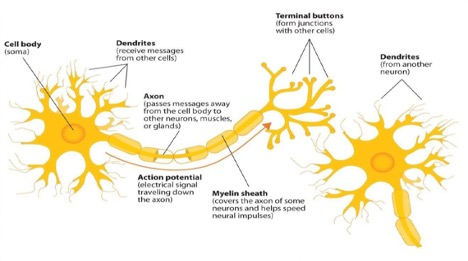
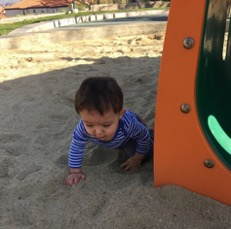
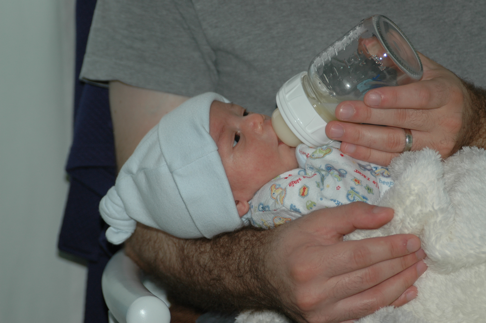
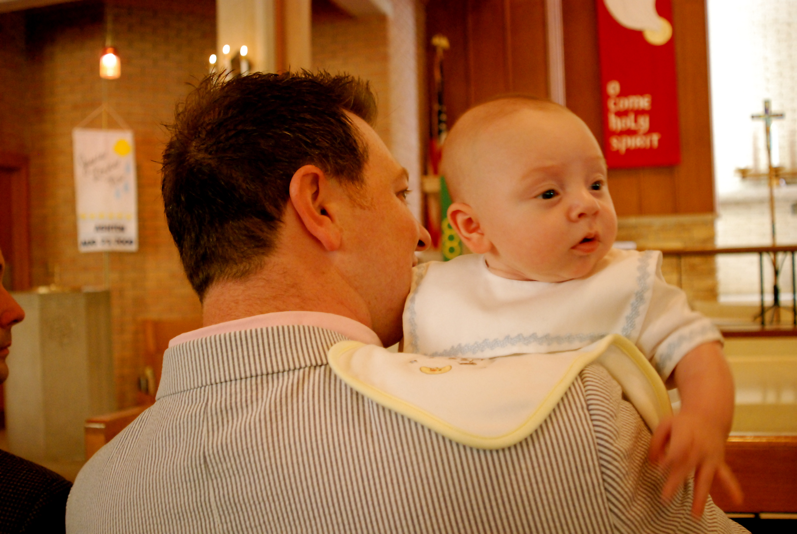

# Physical Development in Infancy & Toddlerhood

<style>
div.solid {
border: 5px solid #FFA500;
border-radius: 5px;
padding: 20px;
}
</style>

<div class = "solid">

After this chapter, you should be able to:

1. Describe the physical changes that occur during the first two years of life.

2. Identify common infant reflexes.

3. Discuss the sleep needs during the first two years of life.

4. Summarize the sequence of both fine and gross motor skills.

5. Recognize the developing sensory capacities of infants and toddlers.

6. Explain how to meet the evolving nutritional needs of infants and toddlers. 


Welcome to the story of development from infancy through toddlerhood; from birth until about two years of age. Researchers have given this part of the life span more attention than any other period, perhaps because changes during this time are so dramatic and so noticeable and perhaps because we have assumed that what happens during these years provides a foundation for one’s life to come. However, it has been argued that the significance of development during these years has been overstated (Bruer, 1999). Nevertheless, this is the period of life that contemporary educators, healthcare providers, and parents have focused on most heavily. We will examine growth and nutrition during infancy, as well as other prominent physical changes that take place during this time.^[[Lifespan Development - Module 4: Infancy](https://courses.lumenlearning.com/lifespandevelopment2/chapter/introduction-to-infancy/) by [Lumen Learning](https://courses.lumenlearning.com/) references Psyc 200 Lifespan Psychology by Laura Overstreet, licensed under [CC BY 4.0](http://opencourselibrary.org/econ-201/)]

 
```{r fig-4-1, out.width="50%", fig.cap="A sleeping newborn.^[[Image](https://unsplash.com/photos/WCbCRXk7nmU) by [Carlo Navarro](https://unsplash.com/@carlonavarro) on [Unsplash](https://unsplash.com/)]"}

knitr::include_graphics("https://images.unsplash.com/photo-1489087584469-437d40177a45?ixlib=rb-1.2.1&ixid=eyJhcHBfaWQiOjEyMDd9&auto=format&fit=crop&w=750&q=80")

```

</div>

<br/>


## Rapid Physical Changes 

As mentioned in the previous chapter, the average newborn in the United States weighs about 7.5 pounds and is about 20 inches in length. After about a 5% weight loss in the first few days, there is a period of rapid growth. By the time an infant is 4 months old, it usually doubles in weight and by one year has tripled its birth weight. By age 2, the weight has quadrupled. The average length at one year is about 26-32 inches.^[[Lifespan Development - Module 4: Infancy](https://courses.lumenlearning.com/lifespandevelopment2/chapter/introduction-to-infancy/) by [Lumen Learning](https://courses.lumenlearning.com/) references Psyc 200 Lifespan Psychology by Laura Overstreet, licensed under [CC BY 4.0](http://opencourselibrary.org/econ-201/)]

Two hormones are very important to this growth process. The first is Human Growth Hormone (HGH) which influences all growth except that in the Central Nervous System (CNS). The hormone influencing growth in the CNS is called Thyroid Stimulating Hormone. Together these hormones influence the growth in early childhood. 

Sleep is very important to the growth process as these hormones are released as children sleep each night. As a result, children need 11 to 14 hours of sleep from 2 to 6 years old. Parents may establish rituals, such as reading a story, taking a bath, brushing teeth, etc. to help children wind down and get the sleep they so desperately need.^[[Children’s Development](https://docs.google.com/document/d/1k1xtrXy6j9_NAqZdGv8nBn_I6-lDtEgEFf7skHjvE-Y/edit) by Ana R. Leon is licensed under [CC BY 4.0](http://opencourselibrary.org/econ-201/)]

 
```{r fig-4-2, fig.cap="An infant sleeping.^[Image by Andres and Antoinette Ricardo used with permission]"}


```


## Proportions of the Body 

Another dramatic physical change that takes place in the first several years of life is the change in body proportions. The head initially makes up about 50 percent of our entire length when we are developing in the womb. At birth, the head makes up about 25 percent of our length (think about how much of your length would be head if the proportions were still the same!). By age 25 it comprises about 20 percent our length. Imagine now how difficult it must be to raise one’s head during the first year of life! And indeed, if you have ever seen a 2 to 4 month old infant lying on the stomach trying to raise the head, you know how much of a challenge this is. The comparison in this graphic was originally introduced in the last chapter.

 
```{r fig-4-3, out.width="50%", fig.cap="Shown from left to right: Human body proportions at birth, at 2 years, at 6 years, at 12 years, and at 19 years.^[[Image](https://commons.wikimedia.org/wiki/File:Human_development_neoteny_body_and_head_proportions_pedomorphy_maturation_aging_growth.png) by [Ephert](https://commons.wikimedia.org/w/index.php?title=User:Ephert&action=edit&redlink=1) is licensed under C[C BY-SA 4.0](https://creativecommons.org/licenses/by-sa/4.0/deed.en)]"}

knitr::include_graphics("https://upload.wikimedia.org/wikipedia/commons/2/2a/Human_development_neoteny_body_and_head_proportions_pedomorphy_maturation_aging_growth.png")

```


Some of the most dramatic physical change that occurs during this period is in the brain. At birth, the brain is about 25 percent its adult weight and this is not true for any other part of the body. By age 2, it is at 75 percent its adult weight, at 95 percent by age 6 and at 100 percent by age 7 years.

While most of the brain’s 100 to 200 billion neurons are present at birth, they are not fully mature and during the next several years dendrites or connections between neurons will undergo a period of transient exuberance or temporary dramatic growth. 


Components of the Neuron
 
```{r fig-4-4, fig.cap="The neuron.^[[Image](http://dept.clcillinois.edu/psy/IntroductionToPsychologyText.pdf) by Martha Lally and Suzanne Valentine-French is licensed under [CC BY-NC-SA 3.0](http://creativecommons.org/licenses/by-nc-sa/3.0/)]"}



```

There is a proliferation of these dendrites during the first two years so that by age 2, a single neuron might have thousands of dendrites. After this dramatic increase, the neural pathways that are not used will be eliminated thereby making those that are used much stronger. . Because of this proliferation of dendrites, by age two a single neuron might have thousands of dendrites. 

Synaptogenesis, or the formation of connections between neurons, continues from the prenatal period forming thousands of new connections during infancy and toddlerhood. This period of rapid neural growth is referred to as Synaptic Blooming.  This activity is occurring primarily in the cortex or the thin outer covering of the brain involved in voluntary activity and thinking. 

The prefrontal cortex that is located behind our forehead continues to grow and mature throughout childhood and experiences an additional growth spurt during adolescence. It is the last part of the brain to mature and will eventually comprise 85 percent of the brain’s weight. Experience will shape which of these connections are maintained and which of these are lost. Ultimately, about 40 percent of these connections will be lost (Webb, Monk, and Nelson, 2001). As the prefrontal cortex matures, the child is increasingly able to regulate or control emotions, to plan activity, strategize, and have better judgment. Of course, this is not fully accomplished in infancy and toddlerhood, but continues throughout childhood and adolescence. 

Another major change occurring in the central nervous system is the development of myelin, a coating of fatty tissues around the axon of the neuron. Myelin helps insulate the nerve cell and speed the rate of transmission of impulses from one cell to another. This enhances the building of neural pathways and improves coordination and control of movement and thought processes. The development of myelin continues into adolescence but is most dramatic during the first several years of life.^[[Lifespan Development - Module 4: Infancy](https://courses.lumenlearning.com/lifespandevelopment2/chapter/introduction-to-infancy/) by [Lumen Learning](https://courses.lumenlearning.com/) references Psyc 200 Lifespan Psychology by Laura Overstreet, licensed under [CC BY 4.0](http://opencourselibrary.org/econ-201/)]

 
```{r fig-4-5, fig.cap="MRI scans of the human brain.^[[Image](https://commons.wikimedia.org/wiki/File:Human_brain_development_1wk-3mo-1yr-2yr-10yr-T1W-MRI.PNG) is in the public domain]"}

knitr::include_graphics("https://upload.wikimedia.org/wikipedia/commons/thumb/8/84/Human_brain_development_1wk-3mo-1yr-2yr-10yr-T1W-MRI.PNG/800px-Human_brain_development_1wk-3mo-1yr-2yr-10yr-T1W-MRI.PNG")

```

## Reflexes

Infants are equipped with a number of reflexes which are involuntary movements in response to stimulation. These include the sucking reflex (infants suck on objects that touch their lips automatically), the rooting reflex (which involves turning toward any object that touches the cheek), the palmar grasp (the infant will tightly grasp any object placed in its palm), and the dancing reflex (evident when the infant is held in a standing position and moves its feet up and down alternately as if dancing). These movements occur automatically and are signals that the infant is functioning well neurologically. Within the first several weeks of life these reflexes are replaced with voluntary movements or motor skills.^[[Lifespan Development - Module 4: Infancy](https://courses.lumenlearning.com/lifespandevelopment2/chapter/introduction-to-infancy/) by [Lumen Learning](https://courses.lumenlearning.com/) references Psyc 200 Lifespan Psychology by Laura Overstreet, licensed under [CC BY 4.0](http://opencourselibrary.org/econ-201/)] 

Infants and children grow and develop at a rapid pace during the first few years of life. The development of both gross and fine motor skills helps a child go from a completely dependent newborn to an independently functioning toddler in about a 3-year span.^[[Children’s Development](https://docs.google.com/document/d/1k1xtrXy6j9_NAqZdGv8nBn_I6-lDtEgEFf7skHjvE-Y/edit) by Ana R. Leon is licensed under [CC BY 4.0]((http://opencourselibrary.org/econ-201/))]


### Some Common Infant Reflexes^[[Lifespan Development: A Psychological Perspective](http://dept.clcillinois.edu/psy/LifespanDevelopment.pdf) (page 74) by Martha Lally and Suzanne Valentine-French is licensed under [CC BY-NC-SA 3.0](https://creativecommons.org/licenses/by-nc-sa/3.0/) (modified by Antoinette Ricardo)]

**Sucking**

Suck on anything that touches the lips

```{r fig-4-6, out.width="50%", fig.cap="[Image](https://commons.wikimedia.org/wiki/File:Breastfeeding_infant.jpg) is in the public domain"}

knitr::include_graphics("https://upload.wikimedia.org/wikipedia/commons/1/1e/Breastfeeding_infant.jpg")

```

**Rooting**

Turning the head when the cheek is touched

```{r fig-4-7, fig.cap="[Image](https://commons.wikimedia.org/wiki/File:Rooting.jpg) is in the public domain"}

knitr::include_graphics("https://upload.wikimedia.org/wikipedia/commons/4/44/Rooting.jpg")

```


**Grasp**

Fingers automatically grip anything that touches the palm of the hand

```{r fig-4-8, out.width="50%", fig.cap="[Image](https://www.flickr.com/photos/superman_ha_muerto/4806047519) by [Raul Luna](https://www.flickr.com/photos/superman_ha_muerto/) is licensed under [CC BY 2.0](https://creativecommons.org/licenses/by/2.0/)"}

knitr::include_graphics("figures/figure-04-10.jpg")

```


**Babinski**

The toes will fan out and curl when the sole of the foot is stroked from heel to toe

```{r fig-4-9, out.width="50%", fig.cap="[Image](https://commons.wikimedia.org/wiki/File:Babinski-newborn.jpg) by [Medicus of Borg](https://commons.wikimedia.org/wiki/User:Medicus_of_Borg) is licensed under [CC BY-SA 3.0](https://creativecommons.org/licenses/by-sa/3.0/deed.en)"}

knitr::include_graphics("https://upload.wikimedia.org/wikipedia/commons/b/bc/Babinski-newborn.jpg")

```

**Moro**

A sudden noise or loss of support to the head and neck will cause infants to spread out their arms and legs then quickly contract the limbs inward

```{r fig-4-10, fig.cap="[Image](https://commons.wikimedia.org/wiki/File:Moro_reflex.jpg) by [Raul Luna](https://www.flickr.com/photos/superman_ha_muerto/) is licensed under [CC BY 2.0](https://creativecommons.org/licenses/by/2.0/)"}

knitr::include_graphics("https://upload.wikimedia.org/wikipedia/commons/5/58/Moro_reflex.jpg")

```


**Tonic Neck**  
When lying on the back with the head to one side infants will extend the arm and leg on that side while flexing the limbs on the opposite side (looks like a fencer pose).

```{r fig-4-11, out.width="50%", fig.cap="[Image](https://commons.wikimedia.org/wiki/File:Asymmetrical_tonic_neck_reflex_(ATNR)_in_a_two-week-old_female.jpg) by [Samuel Finlayson](https://commons.wikimedia.org/w/index.php?title=User:Sgfin&action=edit&redlink=1) is licensed under [CC BY-SA 4.0](https://creativecommons.org/licenses/by-sa/4.0/deed.en)"}

knitr::include_graphics("https://upload.wikimedia.org/wikipedia/commons/thumb/8/87/Asymmetrical_tonic_neck_reflex_%28ATNR%29_in_a_two-week-old_female.jpg/412px-Asymmetrical_tonic_neck_reflex_%28ATNR%29_in_a_two-week-old_female.jpg")

```

**Stepping**  
Legs move in stepping like motion when feet touch a smooth surface

```{r fig-4-12, fig.cap="[Image](https://commons.wikimedia.org/wiki/File:Walking_reflex.jpg) is in the public domain"}

knitr::include_graphics("https://upload.wikimedia.org/wikipedia/commons/b/bf/Walking_reflex.jpg")

```

## Gross Motor Skills

Voluntary movements involve the use of large muscle groups and are typically large movements of the arms, legs, head, and torso. They are referred to as gross motor skills (or large motor skills). These skills begin to develop first. Examples include moving to bring the chin up when lying on the stomach, moving the chest up, rocking back and forth on hands and knees, and then crawling. But it also includes exploring an object with one’s feet as many babies do as early as 8 weeks of age if seated in a carrier or other device that frees the hips. This may be easier than reaching for an object with the hands, which requires much more practice (Berk, 2007). And sometimes an infant will try to move toward an object while crawling and surprisingly move backward because of the greater amount of strength in the arms than in the legs! This also tends to lead infants to pulling up on furniture, usually with the goal of reaching a desired object.  Usually this will also lead to taking steps and eventually walking.^[[Children’s Development](https://docs.google.com/document/d/1k1xtrXy6j9_NAqZdGv8nBn_I6-lDtEgEFf7skHjvE-Y/edit) by Ana R. Leon is licensed under [CC BY 4.0](http://opencourselibrary.org/econ-201/)]

### Physical Gross Motor Milestones

As stated above, children grow very quickly and meet physical milestones rapidly in the first few years of life. The following is a table of the major milestones (behaviors or physical skills seen in infants and children as they grow and develop that typically occur within normal range) that occur in children during those first formative years.^[[Developmental milestones](https://medlineplus.gov/ency/article/002002.htm) record by the [U.S. National Library of Medicine](https://www.nlm.nih.gov/?_ga=2.58822506.616924368.1548699218-46975777.1544213635) is in the public domain]

```{r include=F}

table_04_02 <- read_csv("tables/table-04-02.csv")

```


```{r table-4-2}

table_04_02 %>% 
  kable(caption = "Gross Motor Milestones^[[Developmental Milestones](https://www.cdc.gov/ncbddd/actearly/milestones/index.html) by the [CDC](https://www.cdc.gov/) is in the public domain]") %>% 
  column_spec(1, background = "white") %>% 
  collapse_rows(columns = 1, valign = "top")
```

 
```{r fig-4-13, out.width="50%", fig.cap="An infant playing in the sand.^[ Image by Andres and Antoinette Ricardo used with permission]"}



```


## Fine Motor Skills

More exact movements of the feet, toes, hands, and fingers are referred to as **fine motor skills** (or small motor skills). These include the ability to reach and grasp an object in coordination with vision. Newborns cannot grasp objects voluntarily but do wave their arms toward objects of interest. At about 4 months of age, the infant is able to reach for an object, first with both arms and within a few weeks, with only one arm. Grasping an object involves the use of the fingers and palm, but no thumbs. 

Use of the thumb comes at about 9 months of age when the infant is able to grasp an object using the forefinger and thumb. This is known as the **pincer grip**. This ability greatly enhances the ability to control and manipulate an object and infants take great delight in this newfound ability. They may spend hours picking up small objects from the floor and placing them in containers. And as those objects will often next go into the mouth, caregivers must be vigilant about keeping items small enough to be choking hazards out of reach of little fingers. By 9 months, an infant can also watch a moving object, reach for it as it approaches and grab it. This is quite a complicated set of actions if we remember how difficult this would have been just a few months earlier.^[[Children’s Development](https://docs.google.com/document/d/1k1xtrXy6j9_NAqZdGv8nBn_I6-lDtEgEFf7skHjvE-Y/edit) by Ana R. Leon is licensed under [CC BY 4.0](http://opencourselibrary.org/econ-201/)]

 
```{r fig-4-14, out.width="50%", fig.cap="An infant feeding themselves.^[[Image](https://www.flickr.com/photos/dm3photography/12186486823) by [Matt Preston](https://www.flickr.com/photos/dm3photography/) is licensed under [CC BY-SA 2.0](https://creativecommons.org/licenses/by-sa/2.0/)]"}

knitr::include_graphics("figures/figure-04-14.jpg")

```

### Physical Fine Motor Milestones

While fine motor skills are slower to develop (in accordance with proximodistal development), pretty remarkable progress is made in fine motor development during the first two years. As stated above, in the first few years of life children go from having no intentional fine motor control to being able to manipulate objects to play and learn, as well as beginning to care of themselves. The following is a table of the major milestones in fine motor development.


```{r include=F}

table_04_03 <- read_csv("tables/table-04-03.csv")

```


```{r table-4-3}

table_04_03 %>% 
  kable(caption = "Fine Motor Milestones^[[Developmental Milestones](https://www.cdc.gov/ncbddd/actearly/milestones/index.html) by the [CDC](https://www.cdc.gov/) is in the public domain]") %>% 
  column_spec(1, width = "15em", background = "white") %>% 
  collapse_rows(columns = 1, valign = "top")


```


## Sensory Capacities

Throughout much of history, the newborn was considered a passive, disorganized being who possessed minimal abilities. William James, an early psychologist, had described the newborn’s world as “a blooming, buzzing confusion,” (Shaffer, 1985). However, current research techniques have demonstrated just how developed the newborn is with especially organized sensory and perceptual abilities. 

### Vision

The womb is a dark environment void of visual stimulation. Consequently, vision is the most poorly developed sense at birth and time is needed to build those neural pathways between the eye and the brain. Newborns typically cannot see further than 8 to 16 inches away from their faces (which is about the distance from the newborn's face to the mother/caregiver when an infant is breastfeeding/bottle-feeding). Their visual acuity is about 20/400, which means that an infant can see something at 20 feet that an adult with normal vision could see at 400 feet. Thus, the world probably looks blurry to young infants. Because of their poor visual acuity, they look longer at checkerboards with fewer large squares than with many small squares. Infants' thresholds for seeing a visual pattern are higher than adults'. Thus, toys for infants are sometimes manufactured with black and white patterns rather than pastel colors because the higher contrast between black and white makes the pattern more visible to the immature visual system. By about 6 months, infants' visual acuity improves and approximates adult 20/25 acuity.

  
```{r fig-4-15, out.width="50%", fig.cap="An infant looking up at the person feeding them.^[[Image](https://pixabay.com/photos/baby-young-people-plush-boy-child-472926/) by [Ben_Kerckx](https://pixabay.com/en/users/Ben_Kerckx-69781/) on [Pixabay](https://pixabay.com/)]"}

knitr::include_graphics("https://cdn.pixabay.com/photo/2014/10/04/12/07/baby-472926_960_720.jpg")

```

When viewing a person’s face, newborns do not look at the eyes the way adults do; rather, they tend to look at the chin—a less detailed part of the face. However, by 2 or 3 months, they will seek more detail when exploring an object visually and begin showing preferences for unusual images over familiar ones, for patterns over solids, for faces over patterns, and for three-dimensional objects over flat images. Newborns have difficulty distinguishing between colors, but within a few months they are able to discriminate between colors as well as adults do. Sensitivity to binocular depth cues, which require inputs from both eyes, is evident by about 3 months and continues to develop during the first 6 months. By 6 months, the infant can perceive depth perception in pictures as well (Sen, Yonas, & Knill, 2001). Infants who have experience crawling and exploring will pay greater attention to visual cues of depth and modify their actions accordingly (Berk, 2007). 

### Hearing

The infant’s sense of hearing is very keen at birth, and the ability to hear is evident as soon as the 7th month of prenatal development. In fact, an infant can distinguish between very similar sounds as early as one month after birth and can distinguish between a familiar and unfamiliar voice even earlier. Infants are especially sensitive to the frequencies of sounds in human speech and prefer the exaggeration of infant-directed speech, which will be discussed later. Additionally, infants are innately ready to respond to the sounds of any language, but some of this ability will be lost by 7 or 8 months as the infant becomes familiar with the sounds of a particular language and less sensitive to sounds that are part of an unfamiliar language. 

Newborns also prefer their mother’s voices over another female when speaking the same material (DeCasper & Fifer, 1980). Additionally, they will register in utero specific information heard from their mother’s voice. You may remember the Cat in the Hat study featured in the last chapter that illustrates this. 

### Touch and Pain

Immediately after birth, a newborn is sensitive to touch and temperature, and is also highly sensitive to pain, responding with crying and cardiovascular responses (Balaban & Reisenauer, 2013). Newborns who are **circumcised**, which is the surgical removal of the foreskin of the penis, without anesthesia experience pain as demonstrated by increased blood pressure, increased heart rate, decreased oxygen in the blood, and a surge of stress hormones (United States National Library of Medicine, 2016). Research has demonstrated that infants who were circumcised without anesthesia experienced more pain and fear during routine childhood vaccines. Fortunately, local painkillers are now used during many circumcision. 

### Taste and Smell

Studies of taste and smell demonstrate that babies respond with different facial expressions, suggesting that certain preferences are innate. Newborns can distinguish between sour, bitter, sweet, and salty flavors and show a preference for sweet flavors. Newborns also prefer the smell of their mothers. An infant only 6 days old is significantly more likely to turn toward its own mother’s breast pad than to the breast pad of another baby’s mother (Porter, Makin, Davis, & Christensen, 1992), and within hours of birth an infant also shows a preference for the face of its own mother (Bushnell, 2001; Bushnell, Sai, & Mullin, 1989). 

Infants seem to be born with the ability to perceive the world in an intermodal way; that is, through stimulation from more than one sensory modality. For example, infants who sucked on a pacifier with either a smooth or textured surface preferred to look at a corresponding (smooth or textured) visual model of the pacifier. By 4 months, infants can match lip movements with speech sounds and can match other audiovisual events. Although sensory development emphasizes the afferent processes used to take in information from the environment, these sensory processes can be affected by the infant's developing motor abilities. Reaching, crawling, and other actions allow the infant to see, touch, and organize his or her experiences in new ways.^[[Lifespan Development: A Psychological Perspective](http://dept.clcillinois.edu/psy/LifespanDevelopment.pdf) by Martha Lally and Suzanne Valentine-French is licensed under [CC BY-NC-SA 3.0](https://creativecommons.org/licenses/by-nc-sa/3.0/)]

 
```{r fig-4-16, out.width="50%", fig.cap="The responses of infants to different tastes.^[[Image](https://www.mdpi.com/2306-5710/2/4/29/htm) by [Alice Vilela](https://www.mdpi.com/search?authors=Alice%20Vilela&orcid=0000-0002-1615-2418) and [Fernanda Cosme](https://www.mdpi.com/search?authors=Fernanda%20Cosme&orcid=) is licensed under [CC BY 4.0](http://creativecommons.org/licenses/by/4.0/)]"}

knitr::include_graphics("https://www.mdpi.com/beverages/beverages-02-00029/article_deploy/html/images/beverages-02-00029-g004-550.jpg")

```


## Nutrition

Nutritional needs change with age. Let’s examine how caregivers should nourish children during the first years of life and some risks to nutrition that they should be aware of.

### Breastfeeding

Breast milk is considered the ideal diet for newborns. Colostrum, the first breast milk produced during pregnancy and just after birth has been described as “liquid gold” (United States Department of Health and Human Services (USDHHS), 2011). It is very rich in nutrients and antibodies. Breast milk changes by the third to fifth day after birth, becoming much thinner, but containing just the right amount of fat, sugar, water and proteins to support overall physical and neurological development. For most babies, breast milk is also easier to digest than formula. Formula fed infants experience more diarrhea and upset stomachs. The absence of antibodies in formula often results in a higher rate of ear infections and respiratory infections. Children who are breastfed have lower rates of childhood leukemia, asthma, obesity, type 1 and 2 diabetes, and a lower risk of SIDS. The USDHHS recommends that mothers breastfeed their infants until at least 6 months of age and that breast milk be used in the diet throughout the first year or two. 

 
```{r fig-4-17, out.width="50%", fig.cap="A nurse helping a new mother to breastfeed.^[[Image](https://health.mil/News/Gallery/Photos/2015/08/04/World-Breastfeeding-Week-spotlights-lifelong-benefits-of-nursing-final-version) by the [Military Health System](https://health.mil/) is in the public domain]"}

knitr::include_graphics("https://health.mil/-/media/Images/MHS/Photos/World-Breastfeeding-Week-spotlights-lifelong-benefits-of-nursing-final-version.ashx?h=428&la=en&w=720&hash=ADDA7573A37D14DB5FC53F240B80B6ABD953CF43DC43C976F914121598DD8428")

```

#### Maternal Benefits of Breastfeeding

Several recent studies have reported that it is not just babies that benefit from breastfeeding. Breastfeeding stimulates contractions in the mother’s uterus to help it regain its normal size, and women who breastfeed are more likely to space their pregnancies further apart. Mothers who breastfeed are at lower risk of developing breast cancer (Islami et al., 2015), especially among higher risk racial and ethnic groups (Islami et al., 2015; Redondo et al., 2012). Women who breastfeed have lower rates of ovarian cancer (Titus-Ernstoff, Rees, Terry, & Cramer, 2010), reduced risk for developing Type 2 diabetes (Schwarz et al., 2010; Gunderson, et al., 2015), and rheumatoid arthritis (Karlson, Mandl, Hankinson, & Grodstein, 2004). In most studies these benefits have been seen in women who breastfeed longer than 6 months. 

#### Challenges to Breastfeeding

However, most mothers who breastfeed in the United States stop breastfeeding at about 6-8 weeks, often in order to return to work outside the home (USDHHS, 2011). Mothers can certainly continue to provide breast milk to their babies by expressing and freezing the milk to be bottle-fed at a later time or by being available to their infants at feeding time. However, some mothers find that after the initial encouragement they receive in the hospital to breastfeed, the outside world is less supportive of such efforts. Some workplaces support breastfeeding mothers by providing flexible schedules and welcoming infants, but many do not. In addition, not all women may be able to breastfeed. Women with HIV are routinely discouraged from breastfeeding as the infection may pass to the infant. Similarly, women who are taking certain medications or undergoing radiation treatment may be told not to breastfeed (USDHHS, 2011). 

#### Cost of Breastfeeding

In addition to the nutritional benefits of breastfeeding, breast milk does not have to be purchased. Anyone who has priced formula recently can appreciate this added incentive to breastfeeding. Prices for a year’s worth of formula and feeding supplies can cost well over $1,500 (USDHHS, 2011). 

But there are also those who challenge the belief that breast milk is free. For breastmilk to be completely beneficial for infants the mother's life choices will ultimately affect the quality of the nutrition an infant will receive. Let's consider the nutritional intake of the mother. Breastfeeding will both limit some food and drink choices as well as necessitate an increased intake of healthier options. A simple trip down the supermarket aisles will show you that nutritious and healthier options can be more expensive than some of the cheaper more processed options. A large variety of vegetable and fruits must be consumed, accompanied by the right proportions and amounts of the whole grains, dairy products, and fat food groups. Additionally, it is also encouraged for breastfeeding mothers to take vitamins regularly. That raises the question of how free breastfeeding truly is.

<style>
div.blue {background-color:#e6f0ff; border-radius: 5px; padding: 20px;}
</style>
<div class = "blue">

##### A Historic Look at Breastfeeding

The use of wet nurses, or lactating women hired to nurse others' infants, during the middle ages eventually declined and mothers increasingly breastfed their own infants in the late 1800s. In the early part of the 20th century, breastfeeding began to go through another decline. By the 1950s, it was practiced less frequently as formula began to be viewed as superior to breast milk. 

In the late 1960s and 1970s, greater emphasis began to be placed on natural childbirth and breastfeeding and the benefits of breastfeeding were more widely publicized. Gradually rates of breastfeeding began to climb, particularly among middle-class educated mothers who received the strongest messages to breastfeed. 

Today, women receive consultation from lactation specialists before being discharged from the hospital to ensure that they are informed of the benefits of breastfeeding and given support and encouragement to get their infants to get used to taking the breast. This does not always happen immediately and first time mothers, especially, can become upset or discouraged. In this case, lactation specialists and nursing staff can encourage the mother to keep trying until baby and mother are comfortable with the feeding.^[[Children’s Development](https://docs.google.com/document/d/1k1xtrXy6j9_NAqZdGv8nBn_I6-lDtEgEFf7skHjvE-Y/edit) by Ana R. Leon is licensed under [CC BY 4.0](http://opencourselibrary.org/econ-201/)]

</div>

#### Alternatives to Breastfeeding

There are many reasons that mothers struggle to breastfeed or should not breastfeed, including: low milk supply, previous breast surgeries, illicit drug use, medications, infectious disease, and inverted nipples. Other mothers choose not to breastfeed. Some reasons for this include: lack of personal comfort with nursing, the time commitment of nursing, inadequate or unhealthy diet, and wanting more convenience and flexibility with who and when an infant can be fed. For these mothers and infants, formula is available. Besides breast milk, infant formula is the only other milk product that the medical community considers nutritionally acceptable for infants under the age of one year (as opposed to cow's milk, goat's milk, or follow-on formula). It can be used in addition to breastfeeding (supplementing) or as an alternative to breastmilk.

The most commonly used infant formulas contain purified cow's milk whey and casein as a protein source, a blend of vegetable oils as a fat source, lactose as a carbohydrate source, a vitamin-mineral mix, and other ingredients depending on the manufacturer. In addition, there are infant formulas which use soybeans as a protein source in place of cow's milk (mostly in the United States and Great Britain) and formulas which use protein hydrolysed into its component amino acids for infants who are allergic to other proteins.^[[Infant Formula](https://en.wikipedia.org/wiki/Infant_formula) by [Wikipedia](https://en.wikipedia.org/wiki/Main_Page) is licensed under [CC BY-SA 3.0](https://en.wikipedia.org/wiki/Wikipedia:Text_of_Creative_Commons_Attribution-ShareAlike_3.0_Unported_License)]

 
```{r fig-4-18, out.width="50%", fig.cap="A father bottle-feeding his infant.^[[Image](https://www.flickr.com/photos/ilya/3143204816) by [Ilya Haykinson](https://www.flickr.com/photos/ilya/) is licensed under [CC BY-SA 2.0](https://creativecommons.org/licenses/by-sa/2.0/)]"}



```

One early argument given to promote the practice of breastfeeding was that it promoted bonding and healthy emotional development for infants. However, this does not seem to be the case. Breastfed and bottle-fed infants adjust equally well emotionally (Ferguson & Woodward, 1999). This is good news for mothers who may be unable to breastfeed for a variety of reasons and for fathers who might feel left out. 

### When, What, and How to Introduce Solid Foods

The American Academy of Pediatrics recommends children be introduced to foods other than breast milk or infant formula when they are about 6 months old. Every child is different. Here are some signs that show that an infant is ready for foods other than breast milk or infant formula:

* Child can sit with little or no support.

* Child has good head control.

* Child opens his or her mouth and leans forward when food is offered.


#### How Should Foods Be Introduced?

The American Academy of Pediatrics says that for most children, foods do not need to be given in a certain order. Children can begin eating solid foods at about 6 months old. By the time they are 7 or 8 months old, children can eat a variety of foods from different food groups. These foods include infant cereals, meat or other proteins, fruits, vegetables, grains, yogurts and cheeses, and more.

If feeding infant cereals, it is important to offer a variety of fortified infant cereals such as oat, barley, and multi-grain instead of only rice cereal. The Food and Drug Administration does not recommend only providing infant rice cereal because there is a risk for children to be exposed to arsenic. 

Children should be allowed to try one food at a time at first and there should be 3 to 5 days before another food is introduced. This helps caregivers see if the child has any problems with that food, such as food allergies. 

 
```{r fig-4-19, out.width="50%", fig.cap="A baby being fed solid food.^[[Image](https://pixabay.com/photos/baby-people-food-child-228422/) by [Ben_Kerckx](https://pixabay.com/en/users/Ben_Kerckx-69781/) on [Pixabay](https://pixabay.com/)]"}

knitr::include_graphics("https://cdn.pixabay.com/photo/2013/12/14/08/48/baby-228422_960_720.jpg")

```

The eight most common allergenic foods are milk, eggs, fish, shellfish, tree nuts, peanuts, wheat, and soybeans. It is no longer recommended that caregivers delay introducing these foods to all children, but if there is a family history of food allergies, the child’s doctor or nurse should be consulted.^[[When, What, and How to Introduce Solid Foods](https://www.cdc.gov/nutrition/InfantandToddlerNutrition/foods-and-drinks/when-to-introduce-solid-foods.html) by the [CDC](https://www.cdc.gov/) is in the public domain]  

It may take numerous attempts before a child gains a taste for it. So caregivers should not give up if a food is refused on first offering. 

### USDA Infant Meal Patterns

The United States Department of Agriculture Food and Nutrition Service provides the following guidance for the day time feeding of infants and toddlers. 

#### Infant Meal Patterns^[[Infant Meals](https://fns-prod.azureedge.net/sites/default/files/cacfp/CACFP_InfantMealPattern_FactSheet_V2.pdf) by the [USDA](https://www.usda.gov/) is in the public domain ]

```{r include=F}

table_04_04 <- read_csv("tables/table-04-04.csv")

```


```{r table4-4}

options(knitr.kable.NA = '')

table_04_04 %>% 
  kable() %>% 
  column_spec(1:2, width = "15em", background = "white") %>% 
  collapse_rows(columns = 1:2, valign = "top")

```

*Required when infant is developmentally ready. All serving sizes are minimum quantities of the food components that are required to be served.

<br/>

The nutrition recommendations for toddlers are on the following page.

#### Meal Patterns for Children (1-2 years)^[[Child and Adult Meals](https://fns-prod.azureedge.net/sites/default/files/cacfp/CACFP_MealBP.pdf) by the [USDA](https://www.usda.gov/) is in the public domain]

```{r include=F}

table_04_05 <- read_csv("tables/table-04-05.csv")

```


```{r table-4-5}

table_04_05 %>% 
  kable() %>% 
  column_spec(1, width = "15em", background = "white") %>% 
  collapse_rows(columns = 1:1, valign = "top")

```

Note: All serving sizes are minimum quantities of the food components that are required to be served.

<br/>

### Child Malnutrition 

There can be serious effects for children when there are deficiencies in their nutrition. Let’s explore a few types of nutritional concerns.

#### Wasting

Children in developing countries and countries experiencing the harsh conditions of war are at risk for two major types of malnutrition, also referred to as wasting. Infantile **marasmus** refers to starvation due to a lack of calories and protein. Children who do not receive adequate nutrition lose fat and muscle until their bodies can no longer function. Babies who are breastfed are much less at risk of malnutrition than those who are bottle-fed. 

After weaning, children who have diets deficient in protein may experience **kwashiorkor** or the “disease of the displaced child,” often occurring after another child has been born and taken over breastfeeding. This results in a loss of appetite and swelling of the abdomen as the body begins to break down the vital organs as a source of protein.

Around the world the rates of wasting have been dropping. However, according to the World Health Organization and UNICEF, in 2014 there were 50 million children under the age of five that experienced these forms of wasting, and 16 million were severely wasted (UNICEF, 2015). Worldwide, these figures indicate that nearly  1 child in every 13 suffers from some form of wasting. The majority of these children live in Asia (34.3 million) and Africa (13.9 million). Wasting can occur as a result of severe food shortages, regional diets that lack certain proteins and vitamins, or infectious diseases that inhibit appetite (Latham, 1997). 

 
```{r fig-4-20, out.width="25%", fig.cap="A child suffering from wasting.^[[Image](https://commons.wikimedia.org/wiki/File:Starved_girl.jpg) by the [CDC](https://www.cdc.gov/) is in the public domain]"}

knitr::include_graphics("https://upload.wikimedia.org/wikipedia/commons/thumb/4/47/Starved_girl.jpg/394px-Starved_girl.jpg")

```

The consequences of wasting depend on how late in the progression of the disease parents and guardians seek medical treatment for their children. Unfortunately, in some cultures families do not seek treatment early, and as a result by the time a child is hospitalized the child often dies within the first three days after admission (Latham, 1997). Several studies have reported long- term cognitive effects of early malnutrition (Galler & Ramsey, 1989; Galler, Ramsey, Salt & Archer, 1987; Richardson, 1980), even when home environments were controlled (Galler, Ramsey, Morley, Archer & Salt, 1990). Lower IQ scores (Galler et al., 1987), poor attention (Galler & Ramsey, 1989), and behavioral issues in the classroom (Galler et al., 1990) have been reported in children with a history of serious malnutrition in the first few years of life.^[[Lifespan Development: A Psychological Perspective](http://dept.clcillinois.edu/psy/LifespanDevelopment.pdf) by Martha Lally and Suzanne Valentine-French is licensed under [CC BY-NC-SA 3.0](https://creativecommons.org/licenses/by-nc-sa/3.0/)]

#### Milk Anemia

Milk Anemia in the United States: About 9 million children in the United States are malnourished (Children’s Welfare, 1998). More still suffer from milk anemia, a condition in which milk consumption leads to a lack of iron in the diet. This can be due to the practice of giving toddlers milk as a pacifier-when resting, when riding, when waking, and so on. Appetite declines somewhat during toddlerhood and a small amount of milk (especially with added chocolate syrup) can easily satisfy a child’s appetite for many hours. The calcium in milk interferes with the absorption of iron in the diet as well. Many preschools and daycare centers give toddlers a drink after they have finished their meal in order to prevent spoiling their appetites.^[[Children’s Development](https://docs.google.com/document/d/1k1xtrXy6j9_NAqZdGv8nBn_I6-lDtEgEFf7skHjvE-Y/edit) by Ana R. Leon is licensed under [CC BY 4.0](http://opencourselibrary.org/econ-201/)]

#### Failure to Thrive

**Failure to thrive** (FTT) occurs in children whose nutritional intake is insufficient for supporting normal growth and weight gain. FTT typically presents before two years of age, when growth rates are highest. Parents may express concern about picky eating habits, poor weight gain, or smaller size compared relative to peers of similar age. Physicians often identify FTT during routine office visits, when a child's growth parameters are not tracking appropriately on growth curves.

FTT can be caused by physical or mental issues within the child (such as errors of metabolism, acid reflux, anemia, diarrhea, Cystic fibrosis, Crohn’s disease, celiac disease, cleft palate, tongue tie, milk allergies, hyperthyroidism, congenital heart disease, etc.) It can also be caused by caregiver’s actions (environmental), including inability to produce enough breastmilk, inadequate food supply, providing an insufficient number of feedings, and neglect. These causes may also co-exist. For instance, a child who is not getting sufficient nutrition may act content so that caregivers do not offer feedings of sufficient frequency or volume, and a child with severe acid reflux who appears to be in pain while eating may make a caregiver hesitant to offer sufficient feedings.^[[Failure to Thrive](https://en.wikipedia.org/wiki/Failure_to_thrive) by [Wikipedia](https://en.wikipedia.org/wiki/Main_Page) is licensed under [CC BY-SA 3.0](https://en.wikipedia.org/wiki/Wikipedia:Text_of_Creative_Commons_Attribution-ShareAlike_3.0_Unported_License)]

## Health

Infants depend on the adults that care for them to promote and protect their health. The following section addresses common physical conditions that can affect infants, the danger of shaking babies, and the importance of immunizations. 

### Common Physical Conditions and Issues during Infancy

Some physical conditions and issues are very common during infancy. Many are normal, and the infant's caregivers can deal with them if they occur. Mostly, it is a matter of the caregivers learning about what is normal for their infant and getting comfortable with the new routine in the household. New parents and caregivers often have questions about the following:

* Bowel Movements

* Colic

* Diaper Rash

* Spitting Up/Vomiting

* Teething

* Urination

* Jaundice

#### Bowel Movements

Infants' bowel movements go through many changes in color and consistency, even within the first few days after birth. While the color, consistency, and frequency of stool will vary, hard or dry stools may indicate dehydration and increased frequency of watery stools may indicate diarrhea.

 
```{r fig-4-21, out.width="50%", fig.cap="An infant getting their diaper changed.^[[Image](https://www.flickr.com/photos/brooklyn_skinny/2595442952) by [Kevin Phillips](https://www.flickr.com/photos/brooklyn_skinny/) is licensed under [CC BY 2.0](https://creativecommons.org/licenses/by/2.0/)]"}


```

#### Colic

Many infants are fussy in the evenings, but if the crying does not stop and gets worse throughout the day or night, it may be caused by colic. According to the American Academy of Pediatrics, about one-fifth of all infants develop colic, usually starting between 2 and 4 weeks of age. They may cry inconsolably or scream, extend or pull up their legs, and pass gas. Their stomachs may be enlarged. The crying spells can occur anytime, although they often get worse in the early evening. 

The colic will likely improve or disappear by the age of 3 or 4 months. There is no definite explanation for why some infants get colic. Health care providers can help ensure there is no medical reason behind the crying. 

Some infants seem to be soothed by being held, rocked, or wrapped snugly in a blanket. Some like a pacifier. 

 
```{r fig-4-22, out.width="50%", fig.cap="A father holding a crying infant.^[[Image](https://www.flickr.com/photos/david_martin_foto/23988232984/in/photostream/) by [David D](https://www.flickr.com/photos/david_martin_foto/) is licensed under [CC BY 2.0](https://creativecommons.org/licenses/by/2.0/)]"}

knitr::include_graphics("figures/figure-04-22.jpg")

```

<style>
div.blue {background-color:#e6f0ff; border-radius: 5px; padding: 20px;}
</style>
<div class = "blue">

##### Shaken Baby Syndrome

Here is a PSA from the Center for Disease Control (CDC)

> The crying.
>
> The late-night feedings.
>
> The diaper changes.
>
> The exhaustion.
>
> If you’ve ever been around a baby who won’t stop crying, you know there’s potential to get frustrated. Focus on calming yourself and understand that you may not be able to calm your baby. It’s not your fault or your baby’s.^[[Coping with Crying 3 PSA](https://tools.cdc.gov/podcasts/media/pdf/CopingWithCrying_3_Dad_PSA_30.pdf) by the [CDC](https://www.cdc.gov/) is in the public domain]

It’s normal for healthy babies to cry and some babies cry much more than others. And they cannot always be consoled and caregivers can feel pushed to the limit. When caregivers lose control and shake a baby it can have devastating effects.

Shaken Baby Syndrome (SBS) is a severe form of physical child abuse. SBS may be caused from vigorously shaking an infant by the shoulders, arms, or legs. The “whiplash” effect can cause intracranial (within the brain) or intraocular (within the eyes) bleeding. Often there is no obvious external head trauma. Still, children with SBS may display some outward signs:

* Change in sleeping pattern or inability to be awakened

* Confused, restless, or agitated state

* Convulsions or seizures

* Loss of energy or motivation

* Slurred speech

* Uncontrollable crying

* Inability to be consoled

* Inability to nurse or eat

SBS can result in death, mental retardation or developmental delays, paralysis, severe motor dysfunction, spasticity, blindness, and seizures.

**Who’s at Risk?**
Small children are especially vulnerable to this type of abuse. Their heads are large in comparison to their bodies, and their neck muscles are weak. Children under one year of age are at highest risk, but SBS has been reported in children up to five years of age. Shaking often occurs in response to a baby crying or having a toilet-training accident. The perpetrator tends to be male and is primarily the biological father or the mother’s boyfriend or partner. Caregivers are responsible for about 9%-21% of cases. The explanation typically provided by the caregiver—”I was playing with the baby”—does not begin to account for the severity of trauma. Many times there is also a history of child abuse.


**Can It Be Prevented?**
SBS is completely preventable. However, it is not known whether educational efforts will effectively prevent this type of abuse. Home visitation programs are shown to prevent child abuse in general. Because the child’s father or the mother’s partner often causes SBS, they should be included in home visitation programs. Home visits bring community resources to families in their homes. Health professionals provide information, healthcare, psychological support, and other services that can help people to be more effective parents and care-givers.

**The Bottom Line**

* Shaking a baby can cause death or permanent brain damage. It can result in life-long disability.

* Healthy strategies for dealing with a crying baby include: 
     
     * finding the reason for the crying
     
     * checking for signs of illness or discomfort, such as diaper rash, teething, tight clothing;
     
     * feeding or burping;
     
     * soothing the baby by rubbing its back; gently rocking; offering a pacifier; singing or talking;
     
     * taking a walk using a stroller or a drive in a properly-secured car seat; 
     
     * or calling the doctor if sickness is suspected

* All babies cry. Caregivers often feel overwhelmed by a crying baby. Calling a friend, relative, or neighbor for support or assistance lets the caregiver take a break from the situation. If immediate support is not available, the caregiver could place the baby in a crib (making sure the baby is safe), close the door, and check on the baby every five minutes.^[[Shaken Baby Syndrome](https://www.cdc.gov/healthcommunication/toolstemplates/entertainmented/tips/ShakenBaby.html) by the [CDC](https://www.cdc.gov/) is in the public domain] 

 
```{r fig-4-23, out.width="50%", fig.cap="Medical professionals caring for an infant.^[[Image](https://www.af.mil/News/Article-Display/Article/130295/medical-team-transports-newborn-from-puerto-rico/) by the [U.S. Air Force](http://www.af.mil/) is in the public domain]"}

knitr::include_graphics("https://media.defense.gov/2006/Jul/26/2000547535/780/780/0/060721-F-2842R-107.JPG")

```


**Abusive Head Trauma**

Shaken baby syndrome is part abusive head trauma (AHT), severe form of physical child abuse that results in an injury to the brain of a child. This is important to note because: 

* Abusive head trauma is a leading cause of physical child abuse deaths in children under 5 in the United States.

* Abusive head trauma accounts for approximately one third of all child maltreatment deaths.

* The most common trigger for abusive head trauma is inconsolable crying.

* Babies less than one year old are at greatest risk of injury from abusive head trauma.^[[Preventing Abusive Head Trauma in Children](https://www.cdc.gov/violenceprevention/childabuseandneglect/Abusive-Head-Trauma.html) by the [CDC](https://www.cdc.gov/) is in the public domain] 


</div>

#### Teething

Although newborns usually have no visible teeth, baby teeth begin to appear generally about 6 months after birth. During the first few years, all 20 baby teeth will push through the gums, and most children will have their full set of these teeth in place by age 3.

An infant's front four teeth usually appear first, at about 6 months of age, although some children don't get their first tooth until 12-14 months. As their teeth break through the gums, some infants become fussy, and irritable; lose their appetite; or drool more than usual. 

The FDA does not recommend gum-numbing medications with an ingredient called benzocaine because they can cause a potentially fatal condition in young children. Safe forms of relief include a chilled teething ring or gently rubbing the child's gums with a clean finger. 

#### Spitting Up/Vomiting

Spitting up is a common occurrence for young infants and is usually not a sign of a more serious problem. But if an infant is not gaining weight or shows other signs of illness, a health care provider should be consulted.

 
```{r fig-4-24, out.width="50%", fig.cap="A father holding his baby with a cloth protecting his shoulder from spit-up.^[[Image](https://www.flickr.com/photos/cckaiser/3879801804) by [Colin](https://www.flickr.com/photos/cckaiser/) is licensed under [CC BY 2.0](https://creativecommons.org/licenses/by/2.0/)]"}



```

#### Urination

Infants urinate as often as every 1 to 3 hours or as infrequently as every 4 to 6 hours. In case of sickness or if the weather is very hot, urine output might drop by half and still be normal. If an infant shows any signs of distress while urinating or if any blood is found in a wet diaper medical care should be sought.

#### Diaper Rash

A rash on the skin covered by a diaper is quite common. It is usually caused by irritation of the skin from being in contact with stool and urine. It can get worse during bouts of diarrhea. Diaper rash usually can be prevented by frequent diaper changes.

#### Jaundice

Jaundice can cause an infant's skin, eyes, and mouth to turn a yellowish color. The yellow color is caused by a buildup of bilirubin, a substance that is produced in the body during the normal process of breaking down old red blood cells and forming new ones.

Normally the liver removes bilirubin from the body. But, for many infants, in the first few days after birth, the liver is not yet working at its full power. As a result, the level of bilirubin in the blood gets too high, causing the infant's color to become slightly yellow—this is jaundice.  Although jaundice is common and usually not serious, in some cases, high levels of bilirubin could cause brain injury. All infants with jaundice need to be seen by a health care provider.
Many infants need no treatment. Their livers start to catch up quickly and begin to remove bilirubin normally, usually within a few days after birth. For some infants, health care providers prescribe phototherapy—a treatment using a special lamp—to help break down the bilirubin in their bodies.
 
```{r fig-4-25, fig.cap="An infant receiving treatment for jaundice.^[Image by Andres and Antoinette Ricardo used with permission]"}


```

### Protecting Health through Immunization

One way we can protect a child’s health (and those around them) is through immunization. The vaccines (given through injection) may hurt a little…but the diseases they can prevent can hurt a lot more! Immunization shots, or vaccinations, are essential. They protect against things like measles, mumps, rubella, hepatitis B, polio, diphtheria, tetanus and pertussis (whooping cough). Immunizations are important for adults as well as for children. Here’s why.

The immune system helps the human body fight germs by producing substances to combat them. Once it does, the immune system “remembers” the germ and can fight it again. Vaccines contain germs that have been killed or weakened. When given to a healthy person, the vaccine triggers the immune system to respond and thus build immunity.

Before vaccines, people became immune only by actually getting a disease and surviving it. Immunizations are an easier and less risky way to become immune.

Vaccines are the best defense we have against serious, preventable, and sometimes deadly contagious diseases. Vaccines are some of the safest medical products available, but like any other medical product, there may be risks. Accurate information about the value of vaccines as well as their possible side effects helps people to make informed decisions about vaccination.

 
```{r fig-4-26, out.width="50%", fig.cap="A nurse giving an infant vaccinations.^[[Image](https://commons.wikimedia.org/wiki/File:Immunizations.JPG) by [Maria Immaculata Hospital](https://commons.wikimedia.org/w/index.php?title=User:Maria_Immaculata_Hospital&action=edit&redlink=1) is licensed under [CC BY-SA 4.0](https://creativecommons.org/licenses/by-sa/4.0/deed.en)]"}

knitr::include_graphics("https://upload.wikimedia.org/wikipedia/commons/thumb/c/c6/Immunizations.JPG/401px-Immunizations.JPG")

```

#### Potential Side Effects

Vaccines, like all medical products, may cause side effects in some people. Most of these side effects are minor, such as redness or swelling at the injection site. Read further to learn about possible side effects from vaccines.

Any vaccine can cause side effects. For the most part these are minor (for example, a sore arm or low-grade fever) and go away within a few days.^[[Disease Prevention and Healthy Lifestyles](https://courses.lumenlearning.com/diseaseprevention/chapter/immunity-and-immunizations/) references [Contemporary Health Issues](http://hlth21fall2012.wikispaces.com/) by Judy Baker, Ph.D., licensed under [CC BY-SA 4.0](https://creativecommons.org/licenses/by-sa/4.0/)]  Serious side effects after vaccination, such as severe allergic reaction, are very rare.^[[Making the Vaccine Decision](https://www.cdc.gov/vaccines/parents/vaccine-decision/index.html) by the [CDC](https://www.cdc.gov/) is in the public domain] 

Remember, vaccines are continually monitored for safety, and like any medication, vaccines can cause side effects. However, a decision not to immunize a child also involves risk and could put the child and others who come into contact with him or her at risk of contracting a potentially deadly disease.

#### How Well Do Vaccines Work?

Vaccines work really well. No medicine is perfect, of course, but most childhood vaccines produce immunity about 90–100% of the time.

What about the argument made by some people that vaccines don’t work that well . . . that diseases would be going away on their own because of better hygiene or sanitation, even if there were no vaccines?

That simply isn’t true. Certainly better hygiene and sanitation can help prevent the spread of disease, but the germs that cause disease will still be around, and as long as they are they will continue to make people sick.

All vaccines must be licensed (approved) by the Food and Drug Administration (FDA) before being used in the United States, and a vaccine must go through extensive testing to show that it works and that it is safe before the FDA will approve it. Among these tests are clinical trials, which compare groups of people who get a vaccine with groups of people who get a control. A vaccine is approved only if FDA makes the determination that it is safe and effective for its intended use.

If you look at the history of any vaccine-preventable disease, you will virtually always see that the number of cases of disease starts to drop when a vaccine is licensed. Vaccines are the most effective tool we have to prevent infectious diseases.

#### Opposition to Vaccines

In 2010, a pertussis (whooping cough) outbreak in California sickened 9,143 people and resulted in 10 infant deaths: the worst outbreak in 63 years (Centers for Disease Control 2011b). Researchers, suspecting that the primary cause of the outbreak was the waning strength of pertussis vaccines in older children, recommended a booster vaccination for 11–12-year-olds and also for pregnant women (Zacharyczuk 2011). Pertussis is most serious for babies; one in five needs to be hospitalized, and since they are too young for the vaccine themselves, it is crucial that people around them be immunized (Centers for Disease Control 2011b). Several states, including California, have been requiring the pertussis booster for older children in recent years with the hope of staving off another outbreak.

But what about people who do not want their children to have this vaccine, or any other? That question is at the heart of a debate that has been simmering for years. Vaccines are biological preparations that improve immunity against a certain disease. Vaccines have contributed to the eradication and weakening of numerous infectious diseases, including smallpox, polio, mumps, chicken pox, and meningitis.

 
```{r fig-4-27, out.width="50%", fig.cap="These two young children contracted polio.^[[Image](https://commons.wikimedia.org/wiki/File:Polio_physical_therapy.jpg) by the [CDC](https://www.cdc.gov/) is in the public domain]"}

knitr::include_graphics("https://upload.wikimedia.org/wikipedia/commons/thumb/f/f3/Polio_physical_therapy.jpg/476px-Polio_physical_therapy.jpg")

```

However, many people express concern about potential negative side effects from vaccines. These concerns range from fears about overloading the child’s immune system to controversial reports about devastating side effects of the vaccines.^[[Disease Prevention and Healthy Lifestyles](https://courses.lumenlearning.com/diseaseprevention/chapter/immunity-and-immunizations/) references [Contemporary Health Issues](http://hlth21fall2012.wikispaces.com/) by Judy Baker, Ph.D., licensed under [CC BY-SA 4.0](https://creativecommons.org/licenses/by-sa/4.0/)]

Although children continue to get several vaccines up to their second birthday, these vaccines do not overload the immune system. Every day, an infant’s healthy immune system successfully fights off thousands of antigens – the parts of germs that cause their immune system to respond. Even if your child receives several vaccines in one day, vaccines contain only a tiny amount of antigens compared to the antigens your baby encounters every day.

This is the case even if your child receives combination vaccines. Combination vaccines take two or more vaccines that could be given individually and put them into one shot. Children get the same protection as they do from individual vaccines given separately—but with fewer shots.^[[Making the Vaccine Decision](https://www.cdc.gov/vaccines/parents/vaccine-decision/index.html) by the [CDC](https://www.cdc.gov/) is in the public domain] 

One misapprehension is that the vaccine itself might cause the disease it is supposed to be immunizing against.^[[Disease Prevention and Healthy Lifestyles](https://courses.lumenlearning.com/diseaseprevention/chapter/immunity-and-immunizations/) references [Contemporary Health Issues](http://hlth21fall2012.wikispaces.com/) by Judy Baker, Ph.D., licensed under [CC BY-SA 4.0](https://creativecommons.org/licenses/by-sa/4.0/)]  Vaccines help develop immunity by imitating an infection, but this “imitation” infection does not cause illness. Instead it causes the immune system to develop the same response as it does to a real infection so the body can recognize and fight the vaccine-preventable disease in the future. Sometimes, after getting a vaccine, the imitation infection can cause minor symptoms, such as fever. Such minor symptoms are normal and should be expected as the body builds immunity.^[[Making the Vaccine Decision](https://www.cdc.gov/vaccines/parents/vaccine-decision/index.html) by the [CDC](https://www.cdc.gov/) is in the public domain] 

Another commonly circulated concern is that vaccinations, specifically the MMR vaccine (MMR stands for measles, mumps, and rubella), are linked to autism. The autism connection has been particularly controversial. In 1998, a British physician named Andrew Wakefield published a study in Great Britain’s Lancet magazine that linked the MMR vaccine to autism. The report received a lot of media attention, resulting in British immunization rates decreasing from 91 percent in 1997 to almost 80 percent by 2003, accompanied by a subsequent rise in measles cases (Devlin 2008). A prolonged investigation by the British Medical Journal proved that not only was the link in the study nonexistent, but that Dr. Wakefield had falsified data in order to support his claims (CNN 2011). Dr. Wakefield was discredited and stripped of his license, but the doubt still lingers in many parents’ minds.

In the United States, many parents still believe in the now discredited MMR-autism link and refuse to vaccinate their children. Other parents choose not to vaccinate for various reasons like religious or health beliefs. In one instance, a boy whose parents opted not to vaccinate returned home to the U.S. after a trip abroad; no one yet knew he was infected with measles. The boy exposed 839 people to the disease and caused 11 additional cases of measles, all in other unvaccinated children, including one infant who had to be hospitalized. 

 
```{r fig-4-28, out.width="50%", fig.cap="A baby with measles^[[Image](https://www.flickr.com/photos/cdcglobal/13627881194) by [CDC Global](https://www.flickr.com/photos/cdcglobal/) is licensed under [CC BY 2.0](https://creativecommons.org/licenses/by/2.0/)]"}

knitr::include_graphics("figures/figure-04-28.jpg")

```

According to a study published in Pediatrics (2010), the outbreak cost the public sector $10,376 per diagnosed case. The study further showed that the intentional non-vaccination of those infected occurred in students from private schools, public charter schools, and public schools in upper-socioeconomic areas (Sugerman et al. 2010).^[[Disease Prevention and Healthy Lifestyles](https://courses.lumenlearning.com/diseaseprevention/chapter/immunity-and-immunizations/) references [Contemporary Health Issues](http://hlth21fall2012.wikispaces.com/) by Judy Baker, Ph.D., licensed under [CC BY-SA 4.0](https://creativecommons.org/licenses/by-sa/4.0/)]

### The Immunization Schedule

On-time vaccination throughout childhood is essential because it helps provide immunity before children are exposed to potentially life-threatening diseases. Vaccines are tested to ensure that they are safe and effective for children to receive at the recommended ages.^[[For Parents: Vaccines for Your Children](https://www.cdc.gov/vaccines/parents/index.html) by the [CDC](https://www.cdc.gov/) is in the public domain]

Fully vaccinated children in the U.S. are protected against sixteen potentially harmful diseases. Vaccine-preventable diseases can be very serious, may require hospitalization, or even be deadly — especially in infants and young children.^[[Vaccines for Your Children: Protect Your Child at Every Age](https://www.cdc.gov/vaccines/parents/protecting-children/index.html) by the [CDC](https://www.cdc.gov/) is in the public domain]

Here is the schedule from the CDC to ensure a child is fully vaccinated:

https://www.cdc.gov/vaccines/schedules/easy-to-read/child-easyread.html

```{r fig-4-29, out.width="50%", fig.cap="Immunizations schedule.^[[Image]() by the [CDC](https://www.cdc.gov/) is in the public domain]"}

# knitr::include_graphics("")

```
 
```{r fig-4-30, out.width="50%", fig.cap="Vaccine-Preventable Diseases.^[[Image]() by the [CDC](https://www.cdc.gov/) is in the public domain]"}

# knitr::include_graphics("")

```

### Safety in Infancy and Toddlerhood

There are different risks to infant safety. According to the CDC, nonfatal injury rates varied by age group.

* Nonfatal suffocation rates were highest for those less than 1 year of age.

* Rates for fires or burns, and drowning were highest for children 4 years and younger.

* Children 1 to 4 years of age had the highest rates of nonfatal falls and poisoning.


And the leading causes of injury death also differed by age group.

* For children less than 1 year of age, two–thirds of injury deaths were due to suffocation.

* Drowning was the leading cause of injury or death for those 1 to 4 years of age.^[[Protect the Ones You Love: Child Injuries are Preventable](https://www.cdc.gov/safechild/child_injury_data.html) by the [CDC](https://www.cdc.gov/) is in the public domain]


<style>
div.blue {background-color:#e6f0ff; border-radius: 5px; padding: 20px;}
</style>
<div class = "blue">

##### Car Seat Safety

Motor vehicle injuries are a leading cause of death among children in the United States. But many of these deaths can be prevented.

* In the United States, 723 children ages 12 years and younger died as occupants in motor vehicle crashes during 2016, and more than 128,000 were injured in 2016.

* One CDC study found that, in one year, more than 618,000 children ages 0-12 rode in vehicles without the use of a child safety seat or booster seat or a seat belt at least some of the time.

* Of the children ages 12 years and younger who died in a crash in 2016 (for which restraint use was known), 35% were not buckled up.^[[Child Passenger Safety: Get the Facts](https://www.cdc.gov/motorvehiclesafety/child_passenger_safety/cps-factsheet.html) by the [CDC](https://www.cdc.gov/) is in the public domain]

Buckling children in age- and size-appropriate car seats, booster seats, and seat belts reduces the risk of serious and fatal injuries:

* Car seat use reduces the risk for injury in a crash by 71-82% for children when compared to seat belt use alone.

* Booster seat use reduces the risk for serious injury by 45% for children aged 4–8 years when compared with seat belt use alone.

* For older children and adults, seat belt use reduces the risk for death and serious injury by approximately half.^[[Child Passenger Safety: Get the Facts](https://www.cdc.gov/motorvehiclesafety/child_passenger_safety/cps-factsheet.html) by the [CDC](https://www.cdc.gov/) is in the public domain]

 
```{r fig-4-31, fig.cap="The different types of car seats based on age.^[[Image](https://www.cdc.gov/motorvehiclesafety/child_passenger_safety/cps-factsheet.html) by the [CDC](https://www.cdc.gov/) is in the public domain]"}

knitr::include_graphics("https://www.cdc.gov/motorvehiclesafety/images/child_passenger_safety/VS_cps_share_image-small.png")

```

</div>

## Sleep in Infancy and Toddlerhood

A newborn typically sleeps approximately 16.5 hours per 24-hour period. This is usually polyphasic sleep in that the infant is accumulating the 16.5 hours over several sleep periods throughout the day (Salkind, 2005). The infant is averaging 15 hours per 24-hour period by one month, and 14 hours by 6 months. By the time children turn two, they are averaging closer to 10 hours per 24 hours. Additionally, the average newborn will spend close to 50% of the sleep time in the Rapid Eye Movement (REM) phase, which decreases to 25% to 30% in childhood.^[[Lifespan Development: A Psychological Perspective](http://dept.clcillinois.edu/psy/LifespanDevelopment.pdf) by Martha Lally and Suzanne Valentine-French is licensed under [CC BY-NC-SA 3.0](https://creativecommons.org/licenses/by-nc-sa/3.0/)]

<style>
div.blue {background-color:#e6f0ff; border-radius: 5px; padding: 20px;}
</style>
<div class = "blue">

### Sudden Infant Death Syndrome and Safe Sleep

Sudden Infant Death Syndrome (SIDS) is identified when the death of a healthy infant occurs suddenly and unexpectedly, and medical and forensic investigation findings (including an autopsy) are inconclusive. SIDS is the leading cause of death in infants 1 to 12 months old, and approximately 1,500 infants died of SIDS in 2013 (CDC, 2015). Because SIDS is diagnosed when no other cause of death can be determined, possible causes of SIDS are regularly researched. One leading hypothesis suggests that infants who die from SIDS have abnormalities in the area of the brainstem responsible for regulating breathing (Weekes-Shackelford & Shackelford, 2005).^[[Lifespan Development: A Psychological Perspective](http://dept.clcillinois.edu/psy/LifespanDevelopment.pdf) by Martha Lally and Suzanne Valentine-French is licensed under [CC BY-NC-SA 3.0](https://creativecommons.org/licenses/by-nc-sa/3.0/)]

 
```{r fig-4-32, out.width="50%", fig.cap="A baby sleeping safely.^[[Image](https://safetosleep.nichd.nih.gov/safesleepbasics/risk/factors) by the [U.S. Department of Health and Human Services](https://www.hhs.gov/) is in the public domain]"}

knitr::include_graphics("https://safetosleep.nichd.nih.gov/sites/default/files/inline-images/known-risk-factors.png")

```

#### Risk Factors

Babies are at higher risk for SIDS if they:

* Sleep on their stomachs

* Sleep on soft surfaces, such as an adult mattress, couch, or chair or under soft coverings

* Sleep on or under soft or loose bedding

* Get too hot during sleep

* Are exposed to cigarette smoke in the womb or in their environment, such as at home, in the car, in the bedroom, or other areas

* Sleep in an adult bed with parents, other children, or pets; this situation is especially dangerous if:

     * The adult smokes, has recently had alcohol, or is tired.

     * The baby is covered by a blanket or quilt.

     * The baby sleeps with more than one bed-sharer.

     * The baby is younger than 11 to 14 weeks of age.

#### Reducing the Risks

There have been dramatic improvements in reducing baby deaths during sleep since the 1990s, when recommendations were introduced to place babies on their back for sleep. However, since the late 1990s, declines have slowed. 

 
```{r fig-4-33, out.width="75%", fig.cap="A graph showing the decline in sleep-related infant deaths.^[[Image](https://www.cdc.gov/vitalsigns/safesleep/index.html) by the [CDC](https://www.cdc.gov/) is in the public domain]"}

knitr::include_graphics("https://www.cdc.gov/vitalsigns/safesleep/images/vs-0118-Safe-Sleep-1185px.png")

```

In 2012, the Back to Sleep campaign became the Safe to Sleep campaign. Safe to Sleep aims to educate all caregivers about SIDS and safe sleep practices. Current recommendations to reduce the risk of SIDS and other sleep related causes of infant death:

* Always place baby on his or her back to sleep (for naps and at night).
* Use a firm and flat surface.
* Use only a tight fitting sheet on the sleep surface; no other bedding or soft items in the sleep area.
* Breastfeed.
* Share your room with a baby, but on a separate surface designed for infants (not your bed).
* Do not put soft objects, toys, crib bumpers, or loose bedding under, over, or anywhere near baby’s sleep area.
* Do no smoke during pregnancy or allow smoking around baby.
* Consider giving baby a pacifier.
* Do not let baby get too hot during sleep.
* Get regular health care (including vaccines).
* Avoid products that go against safe sleep recommendations, especially those that claim to prevent or reduce the risk of SIDS.
* Do not use heart or breathing monitors to reduce the risk of SIDS.^[[Ways to Reduce the Risk of SIDS and Other Sleep-Related Causes of Infant Death](https://safetosleep.nichd.nih.gov/safesleepbasics/risk/reduce) by the [CDC](https://www.cdc.gov/) is in the public domain] 

</div>


<br/>

<style>
div.solid {
border: 5px solid #FFA500;
border-radius: 5px;
padding: 20px;
}
</style>

<div class = "solid">

In this chapter we looked at:

* Physical changes during the first two years

* Some common infant reflexes

* How fine and gross motor skills develop 

* Sensory capacities during the first two years

* Health and safety for infants and toddlers

* The sleep needs during the first two years and ways to reduce the risk of SIDS


In the next chapter we are going to be taking a closer look at theories that help us explain the cognitive and language development during infancy and toddlerhood. 

</div>
<br/>


