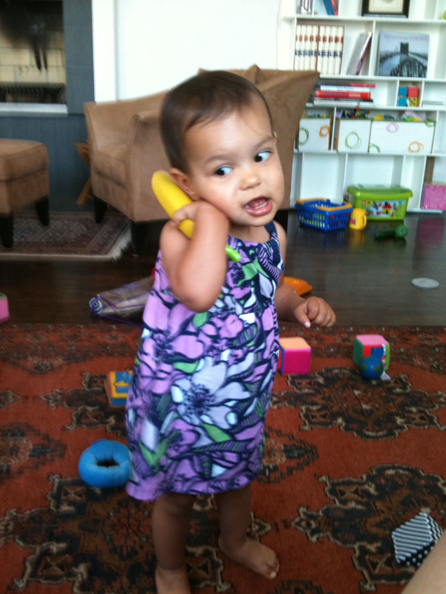

# Cognitive Development in Infancy and Toddlerhood

<style>
div.solid {
border: 5px solid #FFA500;
border-radius: 5px;
padding: 20px;
}
</style>

<div class = "solid">

After this chapter, you should be able to:

1. Describe the substages of the Piaget’s sensorimotor stage.

2. Explain how the social environment affects cognitive development according to Vygotsky’s theory.

3. Discuss the progression of language development during the first two years. 

4. Compare the theories of language development.

5. Define classical and operant conditioning.

6. Summarize the different types of memory


In an effort to better understand the large spectrum of cognition that infants and toddlers go through, it is important to analyze and comprehend various theories that relate to their growth and development. This chapter will take a look at the following theorists:  Piaget, Vygotsky, Chomsky, Skinner, Pavlov, Watson, Bandura, and Bronfenbrenner.


</div>

<br/>

## Piaget

Jean Piaget is the most noted theorist when it comes to children's cognitive development. He believed that children's cognition develops in stages. He explained this growth in the following stages:

1. Sensory Motor Stage (Birth through 2 years old)

2. Preoperational Stage (2-7 years old)

3. Concrete Operational Stage (7-11 years old)

4. Formal Operational Stage (12 years old- adulthood)

In this cognitive chapter we will focus on his first stage which occurs in infancy.^[[Children’s Development](https://docs.google.com/document/d/1k1xtrXy6j9_NAqZdGv8nBn_I6-lDtEgEFf7skHjvE-Y/edit) by Ana R. Leon is licensed under [CC BY 4.0](http://opencourselibrary.org/econ-201/)]
 

### Piaget and Sensorimotor Intelligence 

Piaget describes intelligence in infancy as sensorimotor or based on direct, physical contact. Infants taste, feel, pound, push, hear, and move in order to experience the world. Let’s explore the transition infants make from responding to the external world reflexively as newborns to solving problems using mental strategies as two years old.


```{r include=F}

table_05_01 <- read_csv("tables/table-05-01.csv")

```

```{r table-5-1}

table_05_01 %>% 
        kable(caption = "Substages of Piaget’s Sensorimotor Stage^[[Children’s Development](https://docs.google.com/document/d/1k1xtrXy6j9_NAqZdGv8nBn_I6-lDtEgEFf7skHjvE-Y/edit) by Ana R. Leon is licensed under [CC BY 4.0](http://opencourselibrary.org/econ-201/)]") %>% 
        column_spec(1, width = "15em")


```

 
```{r fig-5-1, out.width="50%", fig.cap="An infant sitting in a highchair.^[[Image](https://commons.wikimedia.org/wiki/File:%E3%83%99%E3%83%93%E3%83%BC%E3%83%81%E3%82%A7%E3%82%A2_(5633407456).jpg) by [holycalamity](https://www.flickr.com/people/55107041@N00) is licensed under [CC BY-SA 2.0](https://creativecommons.org/licenses/by-sa/2.0/deed.en)]"}

knitr::include_graphics("https://upload.wikimedia.org/wikipedia/commons/thumb/4/4a/%E3%83%99%E3%83%93%E3%83%BC%E3%83%81%E3%82%A7%E3%82%A2_%285633407456%29.jpg/800px-%E3%83%99%E3%83%93%E3%83%BC%E3%83%81%E3%82%A7%E3%82%A2_%285633407456%29.jpg")

```


### Evaluating Piaget’s Sensorimotor Stage

Piaget opened up a new way of looking at infants with his view that their main task is to coordinate their sensory impressions with their motor activity. However, the infant’s cognitive world is not as neatly packaged as Piaget portrayed it, and some of Piaget’s explanations for the cause of change are debated. In the past several decades, sophisticated experimental techniques have been devised to study infants, and there have been a large number of research studies on infant development. Much of the new research suggests that Piaget’s view of sensorimotor development needs to be modified (Baillargeon, 2014; Brooks & Meltzoff, 2014; Johnson & Hannon, 2015).

#### Object Permanence

One necessary modification would be to when children develop object permanence. Infants seem to be able to recognize that objects have permanence at much younger ages than Piaget proposed (even as young as 3.5 months of age).

#### The A-not-B Error 

The data does not always support Piaget’s claim that certain processes are crucial in transitions from one stage to the next. For example, in Piaget’s theory, an important feature in the progression into substage 4, coordination of secondary circular reactions, is an infant’s inclination to search for a hidden object in a familiar location rather than to look for the object in a new location. Thus, if a toy is hidden twice, initially at location A and subsequently at location B, 8- to 12-month-old infants search correctly at location A initially. But when the toy is subsequently hidden at location B, they make the mistake of continuing to search for it at location A. **A-not-B error** is the term used to describe this common mistake. Older infants are less likely to make the A-not-B error because their concept of object permanence is more complete.

Researchers have found, however, that the A-not-B error does not show up consistently (Sophian, 1985). The evidence indicates that A-not-B errors are sensitive to the delay between hiding the object at B and the infant’s attempt to find it (Diamond, 1985). Thus, the A-not-B error might be due to a failure in memory. Another explanation is that infants tend to repeat a previous motor behavior (Clearfield & others, 2006; Smith, 1999).

## Vygotsky

### Development Is Determined By Environmental Factors

Piaget set the tone for much of current-day research but his theory has also received a great deal of criticism. Many believe that Piaget ignored the huge influence that society and culture have in shaping a child’s development. At a similar time, another researcher named Lev Vygotsky (1896–1934) had come to similar conclusions as Piaget about children’s development, in thinking that children learned about the world through physical interaction with it. However, where Piaget felt that children moved naturally through different stages of development, based on biological predispositions and their own individual interactions with the world, Vygotsky claimed that adult or peer intervention was a much more important part of the developmental process. 

Vygotsky concentrated more on the child’s immediate social and cultural environment and his or her interactions with adults and peers. He argued that development occurred first through children’s immediate social interactions, and then moved to the individual level as they began to internalize their learning. While Piaget saw the child as actively discovering the world through individual interactions with it, Vygotsky saw the child as more of an apprentice, learning through a social environment of others who had more experience and were sensitive to the child’s needs and abilities.^[[Children’s Development](https://docs.google.com/document/d/1k1xtrXy6j9_NAqZdGv8nBn_I6-lDtEgEFf7skHjvE-Y/edit) by Ana R. Leon is licensed under [CC BY 4.0](http://opencourselibrary.org/econ-201/)] 

 
```{r fig-5-2, out.width="50%", fig.cap="An adult playing Legos with a child.^[[Image](https://pixabay.com/photos/child-human-play-toys-children-3048218/) by [Tabeajaichhalt](https://pixabay.com/en/users/Tabeajaichhalt-745002/) on [Pixabay](https://pixabay.com/)]"}

knitr::include_graphics("https://cdn.pixabay.com/photo/2017/12/29/18/15/child-3048218_960_720.jpg")

```

## Cognitive Milestones

Children are actively learning about the world as they perceive it from the time they are in the womb. Here is a table of some of the cognitive milestones infants and toddlers typically develop. 

```{r include=F}

table_05_02 <- read_csv("tables/table-05-02.csv")

```


```{r table-5-2}

table_05_02 %>% 
        kable(caption = "Cognitive Milestones^[[Developmental Milestones](https://www.cdc.gov/ncbddd/actearly/milestones/index.html) by the [CDC](https://www.cdc.gov/) is in the public domain]") %>% 
        column_spec(1, width = "15em", background = "white") %>% 
        collapse_rows(columns = 1, valign = "top")


```

## Language Development in Infancy and Toddlerhood

Do newborns communicate? Absolutely! However, they do not communicate with the use of language. Instead, they communicate their thoughts and needs with body posture (being relaxed or still), gestures, cries, and facial expressions. A person who spends adequate time with an infant can learn which cries indicate pain and which ones indicate hunger, discomfort, or frustration as well as translate their vocalizations, movements, gestures and facial expressions.  
 
```{r fig-5-3, fig.cap="An infant looking up at the camera.^[Image by Andres and Antoinette Ricardo used with permission]"}


```

### Stages of Language Development

1.	Intentional Vocalizations: Cooing and taking turns: Infants begin to vocalize and repeat vocalizations within the first couple of months of life. That gurgling, musical vocalization called cooing can serve as a source of entertainment to an infant who has been laid down for a nap or seated in a carrier on a car ride. Cooing serves as practice for vocalization as well as the infant hears the sound of his or her own voice and tries to repeat sounds that are entertaining. Infants also begin to learn the pace and pause of conversation as they alternate their vocalization with that of someone else and then take their turn again when the other person’s vocalization has stopped. Cooing initially involves making vowel sounds like “oooo”. Later, consonants are added to vocalizations such as “nananananana”. 

2.	Babbling and gesturing: At about four to six months of age, infants begin making even more elaborate vocalizations that include the sounds required for any language. Guttural sounds, clicks, consonants, and vowel sounds stand ready to equip the child with the ability to repeat whatever sounds are characteristic of the language heard. Eventually, these sounds will no longer be used as the infant grows more accustomed to a particular language. Deaf babies also use gestures to communicate wants, reactions, and feelings. Because gesturing seems to be easier than vocalization for some toddlers, sign language is sometimes taught to enhance one’s ability to communicate by making use of the ease of gesturing. The rhythm and pattern of language is used when deaf babies sign just as it is when hearing babies babble. 

3.	Understanding: At around ten months of age, the infant can understand more than he or she can say. You may have experienced this phenomenon as well if you have ever tried to learn a second language. You may have been able to follow a conversation more easily than to contribute to it. 

4.	Holophrastic speech: Children begin using their first words at about 12 or 13 months of age and may use partial words to convey thoughts at even younger ages. These one word expressions are referred to as **holophrastic speech**. For example, the child may say “ju” for the word “juice” and use this sound when referring to a bottle. The listener must interpret the meaning of the holophrase and when this is someone who has spent time with the child, interpretation is not too difficult. They know that “ju” means “juice” which means the baby wants some milk! But, someone who has not been around the child will have trouble knowing what is meant. Imagine the parent who to a friend exclaims, “Ezra’s talking all the time now!” The friend hears only “ju da ga” which, the parent explains, means “I want some milk when I go with Daddy.”  

 
```{r fig-5-4, out.width="50%", fig.cap="Two children playing with toys.^[[Image](https://www.af.mil/News/Article-Display/Article/121559/airmen-take-time-to-help-terminally-ill-children/) by the [U.S. Air Force](https://www.af.mil/) is in the public domain]"}

knitr::include_graphics("https://media.defense.gov/2008/Dec/18/2000647800/780/780/0/081212-F-9999B-103.JPG")

```

5.	Underextension: A child who learns that a word stands for an object may initially think that the word can be used for only that particular object. Only the family’s Irish Setter is a “doggie”. This is referred to as **underextension**. More often, however, a child may think that a label applies to all objects that are similar to the original object. In overextension all animals become “doggies”, for example. 	

6.	First words and cultural influences: First words if the child is using English tend to be nouns. The child labels objects such as cup or ball. In a verb-friendly language such as Chinese, however, children may learn more verbs. This may also be due to the different emphasis given to objects based on culture. Chinese children may be taught to notice action and relationship between objects while children from the United States may be taught to name an object and its qualities (color, texture, size, etc.). These differences can be seen when comparing interpretations of art by older students from China and the United States.  

7.	Vocabulary growth spurt: One year olds typically have a vocabulary of about 50 words. But by the time they become toddlers, they have a vocabulary of about 200 words and begin putting those words together in telegraphic speech (I think of it now as 'text message' speech because texting is more common and is similar in that text messages typically only include the minimal amount of words to convey the message).  

8.	Two word sentences and **telegraphic speech**: Words are soon combined and 18 month old toddlers can express themselves further by using expressions such as “baby bye-bye” or “doggie pretty”. Words needed to convey messages are used, but the articles and other parts of speech necessary for grammatical correctness are not yet used. These expressions sound like a telegraph (or perhaps a better analogy today would be that they read like a text message) where unnecessary words are not used. “Give baby ball” is used rather than “Give the baby the ball.” Or a text message of “Send money now!” rather than “Dear Mother.  I really need some money to take care of my expenses.”^[[Children’s Development](https://docs.google.com/document/d/1k1xtrXy6j9_NAqZdGv8nBn_I6-lDtEgEFf7skHjvE-Y/edit) by Ana R. Leon is licensed under [CC BY 4.0](http://opencourselibrary.org/econ-201/)]
 

 
```{r fig-5-5, out.width="50%", out.extra='angle=90', fig.cap="A toddler playing with a toy telephone.^[[Image](https://www.flickr.com/photos/salim/4787057545) by [Salim Virji](https://www.flickr.com/photos/salim/) is licensed under [CC BY-SA 2.0](https://creativecommons.org/licenses/by-sa/2.0/)]"}



```

### Language Milestones

In the first two years of life, children go from communicating by crying to being able to express themselves with words. Here is a table of common language milestones for infants and toddlers.


```{r include=F}

table_05_03 <- read_csv("tables/table-05-03.csv")

```


```{r table-5-3}

table_05_03 %>% 
        kable(caption = "Language Milestones^[[Developmental Milestones]() by the [CDC]() is in the public domain]") %>% 
        column_spec(1, width = "15em", background = "white") %>% 
        collapse_rows(columns = 1, valign = "top")


```

### Child-Directed Speech

Why is a horse a “horsie”? Have you ever wondered why adults tend to use “baby talk” or that sing-song type of intonation and exaggeration used when talking to children? This represents a universal tendency and is known as **child-directed speech** or parentheses (historically referred to as motherese). It involves exaggerating the vowel and consonant sounds, using a high-pitched voice, and delivering the phrase with great facial expression. Why is this done? It may be in order to clearly articulate the sounds of a word so that the child can hear the sounds involved. Or it may be because when this type of speech is used, the infant pays more attention to the speaker and this sets up a pattern of interaction in which the speaker and listener are in tuned with one another.^[[Children’s Development](https://docs.google.com/document/d/1k1xtrXy6j9_NAqZdGv8nBn_I6-lDtEgEFf7skHjvE-Y/edit) by Ana R. Leon is licensed under [CC BY 4.0](http://opencourselibrary.org/econ-201/)]


### Theories of Language Development (Early Childhood)

The following two theories of language development represent two extremes in the level of interaction required for language to occur (Berk, 2007).  

#### Chomsky and the Language Acquisition Device

The view known as nativism advocated by Noam Chomsky suggests that infants are equipped with a neurological construct referred to as the language acquisition device or LAD that makes infants ready for language. Language develops as long as the infant is exposed to it. No teaching, training, or reinforcement is required for language to develop.  

#### Social Pragmatics

Another view emphasizes the child’s active engagement in learning language out of a need to communicate. The child seeks information, memorizes terms, imitates the speech heard from others and learns to conceptualize using words as language is acquired. Many would argue that all three of these dynamics foster the acquisition of language (Berger, 2004).^[[Children’s Development](https://docs.google.com/document/d/1k1xtrXy6j9_NAqZdGv8nBn_I6-lDtEgEFf7skHjvE-Y/edit) by Ana R. Leon is licensed under [CC BY 4.0](http://opencourselibrary.org/econ-201/)]


## Theories of Cognitive Development, Learning, and Memory

### Pavlov

Ivan Pavlov (1880-1937) was a Russian physiologist interested in studying digestion. As he recorded the amount of salivation his laboratory dogs produced as they ate, he noticed that they actually began to salivate before the food arrived as the researcher walked down the hall and toward the cage. The dogs knew that the food was coming because they had learned to associate the footsteps with the food. The key word here is “learned”. A learned response is called a “conditioned” response. 

Pavlov began to experiment with this “psychic” reflex. He began to ring a bell, for instance, prior to introducing the food. Sure enough, after making this connection several times, the dogs could be made to salivate to the sound of a bell. Once the bell had become an event to which the dogs had learned to salivate, it was called a conditioned stimulus. The act of salivating to a bell was a response that had also been learned, now termed in Pavlov’s jargon, a conditioned response. 

Notice that the response, salivation, is the same whether it is conditioned or unconditioned (unlearned or natural). What changed is the stimulus to which the dog salivates. One is natural (unconditioned) and one is learned (conditioned).  

 
```{r fig-5-6, fig.cap="Pavlov’s experiments with dogs and conditioning.^[[Image](https://commons.wikimedia.org/wiki/File:Pavlov%27s_dog_conditioning.svg) by [Maxxl²](https://commons.wikimedia.org/wiki/User:Maxxl2) is licensed under [CC BY-SA 4.0](https://creativecommons.org/licenses/by-sa/4.0/)]"}

knitr::include_graphics("https://upload.wikimedia.org/wikipedia/commons/thumb/7/70/Pavlov%27s_dog_conditioning.svg/510px-Pavlov%27s_dog_conditioning.svg.png")

```

Let’s think about how classical conditioning is used on us. One of the most widespread applications of classical conditioning principles was brought to us by the psychologist, John B. Watson.^[[Lifespan Development - Module 4: Infancy](https://courses.lumenlearning.com/lifespandevelopment2/chapter/introduction-to-infancy/) by [Lumen Learning](http://opencourselibrary.org/econ-201/) references [Psyc 200 Lifespan Psychology](http://opencourselibrary.org/econ-201/) by Laura Overstreet, licensed under [CC BY 4.0](https://creativecommons.org/licenses/by/4.0/)]

### Classical Conditioning

Classical conditioning is a form of learning whereby a **conditioned stimulus** (CS) becomes associated with an unrelated **unconditioned stimulus** (US), in order to produce a behavioral response known as a **conditioned response** (CR). The conditioned response is the learned response to the previously neutral stimulus. The unconditioned stimulus is usually a biologically significant stimulus such as food or pain that elicits an **unconditioned response** (UR) from the start. The conditioned stimulus is usually neutral and produces no particular response at first, but after conditioning it elicits the conditioned response.

If we look at Pavlov's experiment, we can identify these four factors at work:

* The unconditioned response was the salivation of dogs in response to seeing or smelling their food.

* The unconditioned stimulus was the sight or smell of the food itself.

* The conditioned stimulus was the ringing of the bell. During conditioning, every time the animal was given food, the bell was rung. This was repeated during several trials. After some time, the dog learned to associate the ringing of the bell with food and to respond by salivating. After the conditioning period was finished, the dog would respond by salivating when the bell was rung, even when the unconditioned stimulus (the food) was absent.

* The conditioned response, therefore, was the salivation of the dogs in response to the conditioned stimulus (the ringing of the bell).^[[Children’s Development](https://docs.google.com/document/d/1k1xtrXy6j9_NAqZdGv8nBn_I6-lDtEgEFf7skHjvE-Y/edit) by Ana R. Leon is licensed under [CC BY 4.0](http://opencourselibrary.org/econ-201/)]


#### Neurological Response to Conditioning

Consider how the conditioned response occurs in the brain. When a dog sees food, the visual and olfactory stimuli send information to the brain through their respective neural pathways, ultimately activating the salivary glands to secrete saliva. This reaction is a natural biological process as saliva aids in the digestion of food. When a dog hears a buzzer and at the same time sees food, the auditory stimuli activates the associated neural pathways. However, since these pathways are being activated at the same time as the other neural pathways, there are weak synapse reactions that occur between the auditory stimuli and the behavioral response. Over time, these synapses are strengthened so that it only takes the sound of a buzzer to activate the pathway leading to salivation.

### Operant Conditioning

Operant conditioning is a theory of behaviorism, a learning perspective that focuses on changes in an individual's observable behaviors. In **operant conditioning** theory, new or continued behaviors are impacted by new or continued consequences. Research regarding this principle of learning was first studied by Edward L. Thorndike in the late 1800's, then brought to popularity by B.F. Skinner in the mid-1900's. Much of this research informs current practices in human behavior and interaction.

#### Skinner's Research

Thorndike's initial research was highly influential on another psychologist, B.F. Skinner. Almost half a century after Thorndike's first publication of the principles of operant conditioning, Skinner attempted to prove an extension to this theory—that all behaviors were in some way a result of operant conditioning. Skinner theorized that if a behavior is followed by reinforcement, that behavior is more likely to be repeated, but if it is followed by punishment, it is less likely to be repeated. He also believed that this learned association could end, or become extinct, if the reinforcement or punishment was removed.

To prove this, he placed rats in a box with a lever that when tapped would release a pellet of food. Over time, the amount of time it took for the rat to find the lever and press it became shorter and shorter, until finally the rat would spend most of its time near the lever eating. This behavior became less consistent when the relationship between the lever and the food was compromised. This basic theory of operant conditioning is still used by psychologists, scientists, and educators today.

#### Shaping, Reinforcement Principles, and Schedules of Reinforcement

Operant conditioning can be viewed as a process of action and consequence. Skinner used this basic principle to study the possible scope and scale of the influence of operant conditioning on animal behavior. His experiments used shaping, reinforcement, and reinforcement schedules in order to prove the importance of the relationship that animals form between behaviors and results.

All of these practices concern the setup of an experiment. **Shaping** is the conditioning paradigm of an experiment. The form of the experiment in successive trials is gradually changed to elicit a desired target behavior. This is accomplished through reinforcement, or reward, of the segments of the target behavior, and can be tested using a large variety of actions and rewards.

The experiments were taken a step further to include different schedules of reinforcement that become more complicated as the trials continued. By testing different reinforcement schedules, Skinner learned valuable information about the best ways to encourage a specific behavior, or the most effective ways to create a long-lasting behavior. Much of this research has been replicated on humans, and now informs practices in various environments of human behavior.^[[Children’s Development](https://docs.google.com/document/d/1k1xtrXy6j9_NAqZdGv8nBn_I6-lDtEgEFf7skHjvE-Y/edit) by Ana R. Leon is licensed under [CC BY 4.0](http://opencourselibrary.org/econ-201/)]


#### Positive and Negative Reinforcement

Sometimes, adding something to the situation is reinforcing as in the cases we described above with cookies, praise and money. **Positive reinforcement** involves adding something to the situation in order to encourage a behavior. Other times, taking something away from a situation can be reinforcing. For example, the loud, annoying buzzer on your alarm clock encourages you to get up so that you can turn it off and get rid of the noise. Children whine in order to get their parents to do something and often, parents give in just to stop the whining. In these instances, negative reinforcement has been used.

 
```{r fig-5-7, fig.cap="Reinforcement in operant conditioning.^[[Image](https://commons.wikimedia.org/wiki/File:Operant_conditioning_diagram.png) by [Curtis Neveu](https://commons.wikimedia.org/w/index.php?title=User:Studentne&action=edit&redlink=1) is licensed under [CC BY-SA 3.0](https://creativecommons.org/licenses/by-sa/3.0/deed.en) (Modified from source image)]"}

knitr::include_graphics("https://upload.wikimedia.org/wikipedia/commons/thumb/1/16/Operant_conditioning_diagram.png/658px-Operant_conditioning_diagram.png")

```

Operant conditioning tends to work best if you focus on trying to encourage a behavior or move a person into the direction you want them to go rather than telling them what not to do. **Reinforcers** are used to encourage a behavior; **punishers** are used to stop behavior. A punisher is anything that follows an act and decreases the chance it will reoccur. But often a punished behavior doesn’t really go away. It is just suppressed and may reoccur whenever the threat of punishment is removed. For example, a child may not cuss around you because you’ve washed his mouth out with soap, but he may cuss around his friends. Or a motorist may only slow down when the trooper is on the side of the freeway. Another problem with punishment is that when a person focuses on punishment, they may find it hard to see what the other does right or well. And punishment is stigmatizing; when punished, some start to see themselves as bad and give up trying to change.

Reinforcement can occur in a predictable way, such as after every desired action is performed, or intermittently, after the behavior is performed a number of times or the first time it is performed after a certain amount of time. The schedule of reinforcement has an impact on how long a behavior continues after reinforcement is discontinued. So a parent who has rewarded a child’s actions each time may find that the child gives up very quickly if a reward is not immediately forthcoming.  Think about the kinds of behaviors that may be learned through classical and operant conditioning. But sometimes very complex behaviors are learned quickly and without direct reinforcement. Bandura’s Social Learning covered later in the chapter explains how.^[[Lifespan Development - Module 4: Infancy](https://courses.lumenlearning.com/lifespandevelopment2/chapter/introduction-to-infancy/) by [Lumen Learning](http://opencourselibrary.org/econ-201/) references [Psyc 200 Lifespan Psychology](http://opencourselibrary.org/econ-201/) by Laura Overstreet, licensed under [CC BY 4.0](https://creativecommons.org/licenses/by/4.0/)]


### Watson and Behaviorism

Another theorist who added to the spectrum of the behavioral movement was John B. Watson.  Watson believed that most of our fears and other emotional responses are classically conditioned. He had gained a good deal of popularity in the 1920s with his expert advice on parenting offered to the public. He believed that parents could be taught to help shape their children’s behavior and tried to demonstrate the power of classical conditioning with his famous experiment with an 18 month old boy named “Little Albert”. Watson sat Albert down and introduced a variety of seemingly scary objects to him: a burning piece of newspaper, a white rat, etc. But Albert remained curious and reached for all of these things. Watson knew that one of our only inborn fears is the fear of loud noises so he proceeded to make a loud noise each time he introduced one of Albert’s favorites, a white rat. After hearing the loud noise several times paired with the rat, Albert soon came to fear the rat and began to cry when it was introduced. 

Watson filmed this experiment for posterity and used it to demonstrate that he could help parents achieve any outcomes they desired, if they would only follow his advice. Watson wrote columns in newspapers and in magazines and gained a lot of popularity among parents eager to apply science to household order. Parenting advice was not the legacy Watson left us, however. Where he really made his impact was in advertising. After Watson left academia, he went into the world of business and showed companies how to tie something that brings about a natural positive feeling to their products to enhance sales. Thus the union of sex and advertising!^[[Lifespan Development - Module 4: Infancy](https://courses.lumenlearning.com/lifespandevelopment2/chapter/introduction-to-infancy/) by [Lumen Learning](http://opencourselibrary.org/econ-201/) references [Psyc 200 Lifespan Psychology](http://opencourselibrary.org/econ-201/) by Laura Overstreet, licensed under [CC BY 4.0](https://creativecommons.org/licenses/by/4.0/)]


Sometimes we do things because we’ve seen it pay off for someone else. They were operantly conditioned, but we engage in the behavior because we hope it will pay off for us as well. This is referred to as vicarious reinforcement (Bandura, Ross and Ross, 1963).

 
```{r fig-5-8, out.width="50%", fig.cap="A photograph taken during Little Albert research.^[[Image](https://commons.wikimedia.org/wiki/File:Little-albert.jpg) is in the public domain]"}

knitr::include_graphics("https://upload.wikimedia.org/wikipedia/commons/c/cc/Little-albert.jpg")

```

### Do parents socialize children or do children socialize parents?

Bandura (1986) suggests that there is interplay between the environment and the individual. We are not just the product of our surroundings, rather we influence our surroundings. There is interplay between our personality and the way we interpret events and how they influence us. This concept is called reciprocal determinism. An example of this might be the interplay between parents and children. Parents not only influence their child’s environment, perhaps intentionally through the use of reinforcement, etc., but children influence parents as well. Parents may respond differently with their first child than with their fourth. Perhaps they try to be the perfect parents with their firstborn, but by the time their last child comes along they have very different expectations both of themselves and their child. Our environment creates us and we create our environment. 

 
```{r fig-5-9, out.width="50%", fig.cap="A smiling infant playing with toys.^[[Image](https://pixabay.com/en/alegre-toy-child-teddy-snowman-1434719/) by [OmarMedinaFilms](https://pixabay.com/en/users/OmarMedinaFilms-818453/) on [Pixabay](https://pixabay.com/)]"}

knitr::include_graphics("https://cdn.pixabay.com/photo/2016/06/03/23/29/alegre-1434719_960_720.jpg")

```

### Social Learning Theory

Albert Bandura is a leading contributor to social learning theory. He calls our attention to the ways in which many of our actions are not learned through conditioning; rather, they are learned by watching others (1977). Young children frequently learn behaviors through imitation. Sometimes, particularly when we do not know what else to do, we learn by modeling or copying the behavior of others. A new employee, on his or her first day of a new job might eagerly look at how others are acting and try to act the same way to fit in more quickly. Adolescents struggling with their identity rely heavily on their peers to act as role-models. Newly married couples often rely on roles they may have learned from their parents and begin to act in ways they did not while dating and then wonder why their relationship has changed. 

## Memory and Attention

### Memory

If we want to remember something tomorrow, we have to consolidate it into long-term memory today. **Long-term memory** is the final, semi-permanent stage of memory. Unlike sensory and short-term memory, long-term memory has a theoretically infinite capacity, and information can remain there indefinitely. Long-term memory has also been called reference memory, because an individual must refer to the information in long-term memory when performing almost any task. Long-term memory can be broken down into two categories: explicit and implicit memory.

### Explicit Memory

**Explicit memory**, also known as conscious or **declarative memory**, involves memory of facts, concepts, and events that require conscious recall of the information. In other words, the individual must actively think about retrieving the information from memory. This type of information is *explicitly* stored and retrieved—hence its name. Explicit memory can be further subdivided into semantic memory, which concerns facts, and episodic memory, which concerns primarily personal or autobiographical information.

### Episodic Memory

**Episodic memory** is used for more contextualized memories. They are generally memories of specific moments, or episodes, in one's life. As such, they include sensations and emotions associated with the event, in addition to the who, what, where, and when of what happened. An example of an episodic memory would be recalling your family's trip to the beach. Autobiographical memory (memory for particular events in one's own life) is generally viewed as either equivalent to, or a subset of, episodic memory. One specific type of autobiographical memory is a flashbulb memory, which is a highly detailed, exceptionally vivid "snapshot" of the moment and circumstances in which a piece of surprising and consequential (or emotionally arousing) news was heard. For example, many people remember exactly where they were and what they were doing when they heard of the terrorist attacks on September 11, 2001. This is because it is a flashbulb memory.

Semantic and episodic memory are closely related; memory for facts can be enhanced with episodic memories associated with the fact, and vice versa. For example, the answer to the factual question "Are all apples red?" might be recalled by remembering the time you saw someone eating a green apple. Likewise, semantic memories about certain topics, such as football, can contribute to more detailed episodic memories of a particular personal event, like watching a football game. A person that barely knows the rules of football will remember the various plays and outcomes of the game in much less detail than a football expert.

### Implicit Memory

In contrast to explicit (conscious) memory, **implicit** (also called "unconscious" or "procedural") **memory** involves procedures for completing actions. These actions develop with practice over time. Athletic skills are one example of implicit memory. You learn the fundamentals of a sport, practice them over and over, and then they flow naturally during a game. Rehearsing for a dance or musical performance is another example of implicit memory. Everyday examples include remembering how to tie your shoes, drive a car, or ride a bicycle. These memories are accessed without conscious awareness—they are automatically translated into actions without us even realizing it. As such, they can often be difficult to teach or explain to other people. Implicit memories differ from the semantic scripts described above in that they are usually actions that involve movement and motor coordination, whereas scripts tend to emphasize social norms or behaviors.

 
```{r fig-5-10, out.width="50%", fig.cap="A toddler walking.^[[Image](https://www.publicdomainpictures.net/en/view-image.php?image=17363&picture=small-toddler) on [Public Domain Pictures](https://www.publicdomainpictures.net/en/index.php)]"}

knitr::include_graphics("https://www.publicdomainpictures.net/pictures/20000/velka/small-toddler.jpg")

```

### Short-Term Memory Storage

Short-term memory is the ability to hold information for a short duration of time (on the order of seconds). In the process of encoding, information enters the brain and can be quickly forgotten if it is not stored further in the short-term memory. George A. Miller suggested that the capacity of short-term memory storage is approximately seven items plus or minus two, but modern researchers are showing that this can vary depending on variables like the stored items' phonological properties. When several elements (such as digits, words, or pictures) are held in short-term memory simultaneously, their representations compete with each other for recall, or degrade each other. Thereby, new content gradually pushes out older content, unless the older content is actively protected against interference by rehearsal or by directing attention to it.

Information in the short-term memory is readily accessible, but for only a short time. It continuously decays, so in the absence of rehearsal (keeping information in short-term memory by mentally repeating it) it can be forgotten.

 
```{r fig-5-11, fig.cap="Diagram of the memory storage process.^[[Image](https://en.wikipedia.org/wiki/File:Memory_consolidation.svg) by [Wikipedia](https://en.wikipedia.org/wiki/Main_Page) is licensed under [CC BY-SA 3.0](https://creativecommons.org/licenses/by-sa/3.0/)]"}

knitr::include_graphics("https://upload.wikimedia.org/wikipedia/en/1/1f/Memory_consolidation.svg")

```

### Long-Term Memory Storage

In contrast to short-term memory, **long-term memory** is the ability to hold semantic information for a prolonged period of time. Items stored in short-term memory move to long-term memory through rehearsal, processing, and use. The capacity of long-term memory storage is much greater than that of short-term memory, and perhaps unlimited. However, the duration of long-term memories is not permanent; unless a memory is occasionally recalled, it may fail to be recalled on later occasions. This is known as forgetting.

Long-term memory storage can be affected by traumatic brain injury or lesions. Amnesia, a deficit in memory, can be caused by brain damage. Anterograde amnesia is the inability to store new memories; retrograde amnesia is the inability to retrieve old memories. These types of amnesia indicate that memory does have a storage process.^[[Children’s Development](https://docs.google.com/document/d/1k1xtrXy6j9_NAqZdGv8nBn_I6-lDtEgEFf7skHjvE-Y/edit) by Ana R. Leon is licensed under [CC BY 4.0](http://opencourselibrary.org/econ-201/)]


<br/>

<style>
div.solid {
border: 5px solid #FFA500;
border-radius: 5px;
padding: 20px;
}
</style>

<div class = "solid">

In this chapter we looked at:

* Piaget’s sensorimotor stage.

* The impact of the social environment on children’s learning.

* The progression and theories of language development.

* Classical and operant conditioning and systems of reinforcement.

* The types of memory and how they work together.

In the following chapter, we will finish looking at the first two years of life by examining social and emotional development, including temperament and attachment.

</div>
<br/>
