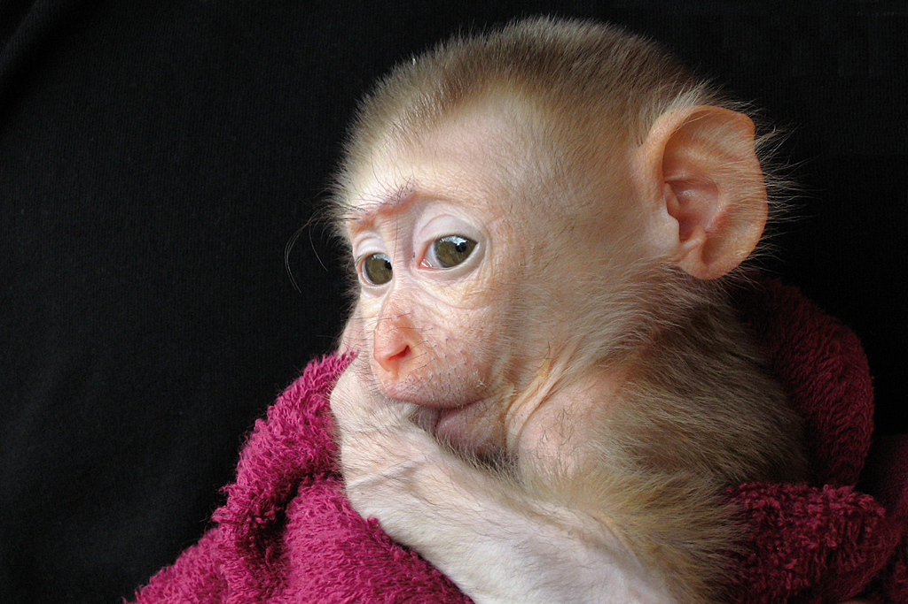

# Social and Emotional Development in Infancy and Toddlerhood

<style>
div.solid {
border: 5px solid #FFA500;
border-radius: 5px;
padding: 20px;
}
</style>

<div class = "solid">

After this chapter, you should be able to:

1. Classify types of temperament.

2. Discuss the roles of culture and gender in socialization. 

3. Describe the sequence of emotional development during the first two years.

4. Compare different theories of attachment and attachment styles.

5. Explain Erikson’s stage of trust versus mistrust.

6. Contrast child care options for families.


While temperament is determined by genetics and emotions develop through maturation, the early interactions we have with the adults that care for us as infants and toddlers are very important for healthy emotional development. Let’s examine some of the important interactions and milestones in social and emotional development during the first two years of life.

</div>

<br/>

## Temperament 

Perhaps you have spent time with a number of infants. How were they alike? How did they differ? How do you compare with your siblings or other children you have known well? You may have noticed that some seemed to be in a better mood than others and that some were more sensitive to noise or more easily distracted than others. These differences may be attributed to temperament. **Temperament** is the innate characteristics of the infant, including mood, activity level, and emotional reactivity, noticeable soon after birth. 

In a 1956 landmark study, Chess and Thomas (1996) evaluated 141 children’s temperament based on parental interviews. Referred to as the New York Longitudinal Study, infants were assessed on 10 dimensions of temperament including: 
 
* activity level 

* rhythmicity (regularity of biological functions) 

* approach/withdrawal (how children deal with new things) 

* adaptability to situations

* intensity of reactions 

* threshold of responsiveness (how intense a stimulus has to be for the child to react) 

* quality of mood 

* distractibility 

* attention span 

* persistence 
 

Based on the infants’ behavioral profiles, they were categorized into three general types of temperament: 

```{r include=F}

table_06_01 <- read_csv("tables/table-06-01.csv")

```


```{r table-6-1}

table_06_01 %>% 
        kable(caption = "Types of Temperament") %>% 
        column_spec(1, width = "15em") %>% 
        collapse_rows(columns = 1:2, valign = "top")


```


As can be seen the percentages do not equal 100% as some children were not able to be placed neatly into one of the categories. Think about how each type of child should be approached to improve interactions with them. An easy child requires less intervention, but still has needs that must not be overlooked. A slow-to-warm-up child may need to be given advance warning if new people or situations are going to be introduced. A child with a difficult temperament may need to be given extra time to burn off their energy. 

A caregiver's ability to work well and accurately read the child will enjoy a **goodness- of-fit**, meaning their styles match and communication and interaction can flow. Parents who recognize each child’s temperament and accept it, will nurture more effective interactions with the child and encourage more adaptive functioning.^[[Lifespan Development: A Psychological Perspective](http://dept.clcillinois.edu/psy/LifespanDevelopment.pdf) by Martha Lally and Suzanne Valentine-French is licensed under [CC BY-NC-SA 3.0](https://creativecommons.org/licenses/by-nc-sa/3.0/)]


 
```{r fig-6-1, out.width="50%", fig.cap="This adventurous child’s parents provide a good “fit” to her temperament.^[[Image](https://pxhere.com/en/photo/1516103) is licensed under [CC0 1.0](https://creativecommons.org/publicdomain/zero/1.0/)]"}

knitr::include_graphics("https://c.pxhere.com/photos/cb/e1/adventure_boy_carrying_child_dad_daylight_father_hike-1516103.jpg!d")

```

### Parenting Is Bidirectional

Not only do parents affect their children, children influence their parents. A child’s characteristics, such as temperament, affect parenting behaviors and roles. For example, an infant with an easy temperament may enable parents to feel more effective, as they are easily able to soothe the child and elicit smiling and cooing. On the other hand, a cranky or fussy infant elicits fewer positive reactions from his or her parents and may result in parents feeling less effective in the parenting role (Eisenberg et al., 2008). Over time, parents of more difficult children may become more punitive and less patient with their children (Clark, Kochanska, & Ready, 2000; Eisenberg et al., 1999; Kiff, Lengua, & Zalewski, 2011). Parents who have a fussy, difficult child are less satisfied with their marriages and have greater challenges in balancing work and family roles (Hyde, Else-Quest, & Goldsmith, 2004). Thus, child temperament is one of the child characteristics that influences how parents behave with their children. 

## Personality in Infancy and Toddlerhood

Temperament does not change dramatically as we grow up, but we may learn how to work around and manage our temperamental qualities. Temperament may be one of the things about us that stays the same throughout development. In contrast, **personality**, defined as an individual’s consistent pattern of feeling, thinking, and behaving, is the result of the continuous interplay between biological disposition and experience. 

Personality also develops from temperament in other ways (Thompson, Winer, & Goodvin, 2010). As children mature biologically, temperamental characteristics emerge and change over time. A newborn is not capable of much self-control, but as brain-based capacities for self- control advance, temperamental changes in self-regulation become more apparent. For example, a newborn who cries frequently doesn’t necessarily have a grumpy personality; over time, with sufficient parental support and increased sense of security, the child might be less likely to cry. 

In addition, personality is made up of many other features besides temperament. Children’s developing self-concept, their motivations to achieve or to socialize, their values and goals, their coping styles, their sense of responsibility and conscientiousness, as well as many other qualities are encompassed into personality. These qualities are influenced by biological dispositions, but even more by the child’s experiences with others, particularly in close relationships, that guide the growth of individual characteristics. Indeed, personality development begins with the biological foundations of temperament but becomes increasingly elaborated, extended, and refined over time. The newborn that parents gazed upon thus becomes an adult with a personality of depth and nuance.^[[Lifespan Development: A Psychological Perspective](http://dept.clcillinois.edu/psy/LifespanDevelopment.pdf) by Martha Lally and Suzanne Valentine-French is licensed under [CC BY-NC-SA 3.0](https://creativecommons.org/licenses/by-nc-sa/3.0/)]


### Culture and Personality

The term **culture** refers to all of the beliefs, customs, ideas, behaviors, and traditions of a particular society that are passed through generations. Culture is transmitted to people through language as well as through the modeling of behavior, and it defines which traits and behaviors are considered important, desirable, or undesirable.

Within a culture there are norms and behavioral expectations. These cultural norms can dictate which personality traits are considered important. The researcher Gordon Allport considered culture to be an important influence on traits and defined common traits as those that are recognized within a culture. These traits may vary from culture to culture based on differing values, needs, and beliefs. Positive and negative traits can be determined by cultural expectations: what is considered a positive trait in one culture may be considered negative in another, thus resulting in different expressions of personality across cultures.

 
```{r fig-6-2, out.width="50%", fig.cap="A family from a non-Western culture. ^[[Image](https://unsplash.com/photos/aeq3jJj0sUw) by [Theodor Goutas](https://unsplash.com/@tgoutas) on [Unsplash](https://unsplash.com/)]"}

knitr::include_graphics("https://images.unsplash.com/photo-1528726164383-33c4a223b78c?ixlib=rb-1.2.1&ixid=eyJhcHBfaWQiOjEyMDd9&auto=format&fit=crop&w=750&q=80")

```

Considering cultural influences on personality is important because Western ideas and theories are not necessarily applicable to other cultures (Benet-Martinez & Oishi, 2008). There is a great deal of evidence that the strength of personality traits varies across cultures, and this is especially true when comparing **individualist** cultures (such as European, North American, and Australian cultures) and **collectivist** cultures (such as Asian, African, and South American cultures). People who live in individualist cultures tend to believe that independence, competition, and personal achievement are important. In contrast, people who live in collectivist cultures tend to value social harmony, respectfulness, and group needs over individual needs. These values influence personality in different but substantial ways; for example, Yang (2006) found that people in individualist cultures displayed more personally-oriented personality traits, whereas people in collectivist cultures displayed more socially-oriented personality traits.^[[Lifespan Development - Module 4: Infancy](https://courses.lumenlearning.com/lifespandevelopment2/chapter/introduction-to-infancy/) by [Lumen Learning](http://opencourselibrary.org/econ-201/) references [Psyc 200 Lifespan Psychology](http://opencourselibrary.org/econ-201/) by Laura Overstreet, licensed under [CC BY 4.0](https://creativecommons.org/licenses/by/4.0/)]


### Gender and Personality

In much the same manner that cultural norms can influence personality and behavior, gender norms (the behaviors that males and females are expected to conform to in a given society) can also influence personality by emphasizing different traits between different genders.

 
```{r fig-6-3, out.width="50%", fig.cap="A female infant wearing stereotypically feminine clothing and accessories.^[[Image](https://pixabay.com/photos/baby-girl-infant-cute-baby-girl-2256033/) by [Abdullah Shakoor](https://pixabay.com/en/users/Abdullah_Shakoor-5012922/) on [Pixabay](https://pixabay.com/)]"}

knitr::include_graphics("https://cdn.pixabay.com/photo/2017/04/24/10/23/baby-2256033_960_720.jpg")

```

```{r fig-6-4, out.width="50%", fig.cap="A male infant wearing stereotypically masculine clothing.^[[Image](https://pxhere.com/en/photo/1418948) is licensed under [CC0 1.0](https://creativecommons.org/publicdomain/zero/1.0/)]"}

knitr::include_graphics("https://c.pxhere.com/images/ab/a9/f7589b0672b29c780e639f88771b-1418948.jpg!d")

```

Ideas of appropriate behavior for each gender (masculine and feminine) vary among cultures and tend to change over time. For example, aggression and assertiveness have historically been emphasized as positive masculine personality traits in the United States. Meanwhile, submissiveness and caretaking have historically been held as ideal feminine traits. While many **gender roles** remain the same, others change over time. In 1938, for example, only 1 out of 5 Americans agreed that a married woman should earn money in industry and business. By 1996, however, 4 out of 5 Americans approved of women working in these fields. This type of attitude change has been accompanied by behavioral shifts that coincide with changes in trait expectations and shifts in personal identity for men and women.^[[Lifespan Development - Module 4: Infancy](https://courses.lumenlearning.com/lifespandevelopment2/chapter/introduction-to-infancy/) by [Lumen Learning](http://opencourselibrary.org/econ-201/) references [Psyc 200 Lifespan Psychology](http://opencourselibrary.org/econ-201/) by Laura Overstreet, licensed under [CC BY 4.0](https://creativecommons.org/licenses/by/4.0/)]


## Infant Emotions

At birth, infants exhibit two emotional responses: attraction and withdrawal. They show attraction to pleasant situations that bring comfort, stimulation, and pleasure, and they withdraw from unpleasant stimulation such as bitter flavors or physical discomfort. At around two months, infants exhibit social engagement in the form of social smiling as they respond with smiles to those who engage their positive attention (Lavelli & Fogel, 2005). 

Social smiling becomes more stable and organized as infants learn to use their smiles to engage their parents in interactions. Pleasure is expressed as laughter at 3 to 5 months of age, and displeasure becomes more specific as fear, sadness, or anger between ages 6 and 8 months. Anger is often the reaction to being prevented from obtaining a goal, such as a toy being removed (Braungart-Rieker, Hill-Soderlund, & Karrass, 2010). In contrast, sadness is typically the response when infants are deprived of a caregiver (Papousek, 2007). Fear is often associated with the presence of a stranger, known as **stranger wariness**, or the departure of significant others known as **separation anxiety**. Both appear sometime between 6 and 15 months after object permanence has been acquired. Further, there is some indication that infants may experience jealousy as young as 6 months of age (Hart & Carrington, 2002). 


```{r fig-6-5, out.width="50%", fig.cap="An infant making an angry facial expression.^[[Image](https://unsplash.com/photos/lP51ekRTh9Y) by [Brytny.com](https://unsplash.com/@brytny) on [Unsplash](https://unsplash.com/)]"}

knitr::include_graphics("https://images.unsplash.com/photo-1522850968212-ab12050c75cc?ixlib=rb-1.2.1&ixid=eyJhcHBfaWQiOjEyMDd9&auto=format&fit=crop&w=334&q=80")

```

Emotions are often divided into two general categories: **Basic emotions** (primary emotions), such as interest, happiness, anger, fear, surprise, sadness and disgust, which appear first, and **self-conscious emotions** (secondary emotions), such as envy, pride, shame, guilt, doubt, and embarrassment. Unlike primary emotions, secondary emotions appear as children start to develop a self-concept, and require social instruction on when to feel such emotions. The situations in which children learn self-conscious emotions varies from culture to culture. Individualistic cultures teach us to feel pride in personal accomplishments, while in more collective cultures children are taught to not call attention to themselves, unless you wish to feel embarrassed for doing so (Akimoto & Sanbinmatsu, 1999). 
 
```{r fig-6-6, out.width="50%", fig.cap="An infant making a sad facial expression.^[[Image](https://www.flickr.com/photos/acheron0/5340364246) by [acheron0](https://www.flickr.com/photos/acheron0/) is licensed under [CC BY 2.0](https://creativecommons.org/licenses/by/2.0/)]"}


```

Facial expressions of emotion are important regulators of social interaction. In the developmental literature, this concept has been investigated under the concept of **social referencing**; that is, the process whereby infants seek out information from others to clarify a situation and then use that information to act (Klinnert, Campos, & Sorce, 1983). To date, the strongest demonstration of social referencing comes from work on the visual cliff. In the first study to investigate this concept, Campos and colleagues (Sorce, Emde, Campos, & Klinnert, 1985) placed mothers on the far end of the “cliff” from the infant. Mothers first smiled to the infants and placed a toy on top of the safety glass to attract them; infants invariably began crawling to their mothers. When the infants were in the center of the table, however, the mother then posed an expression of fear, sadness, anger, interest, or joy. The results were clearly different for the different faces; no infant crossed the table when the mother showed fear; only 6% did when the mother posed anger, 33% crossed when the mother posed sadness, and approximately 75% of the infants crossed when the mother posed joy or interest. 

Other studies provide similar support for facial expressions as regulators of social interaction. Researchers posed facial expressions of neutral, anger, or disgust toward babies as they moved toward an object and measured the amount of inhibition the babies showed in touching the object (Bradshaw, 1986). The results for 10- and 15-month olds were the same: Anger produced the greatest inhibition, followed by disgust, with neutral the least. This study was later replicated using joy and disgust expressions, altering the method so that the infants were not allowed to touch the toy (compared with a distractor object) until one hour after exposure to the expression (Hertenstein & Campos, 2004). At 14 months of age, significantly more infants touched the toy when they saw joyful expressions, but fewer touched the toy when the infants saw disgust. 

A final emotional change is in self-regulation. **Emotional self-regulation** refers to strategies we use to control our emotional states so that we can attain goals (Thompson & Goodvin, 2007). This requires effortful control of emotions and initially requires assistance from caregivers (Rothbart, Posner, & Kieras, 2006). Young infants have very limited capacity to adjust their emotional states and depend on their caregivers to help soothe themselves. Caregivers can offer distractions to redirect the infant’s attention and comfort to reduce the emotional distress. As areas of the infant’s prefrontal cortex continue to develop, infants can tolerate more stimulation. By 4 to 6 months, babies can begin to shift their attention away from upsetting stimuli (Rothbart et al, 2006). Older infants and toddlers can more effectively communicate their need for help and can crawl or walk toward or away from various situations (Cole, Armstrong, & Pemberton, 2010). This aids in their ability to self-regulate. Temperament also plays a role in children’s ability to control their emotional states, and individual differences have been noted in the emotional self-regulation of infants and toddlers (Rothbart & Bates, 2006).^[[Lifespan Development: A Psychological Perspective](http://dept.clcillinois.edu/psy/LifespanDevelopment.pdf) by Martha Lally and Suzanne Valentine-French is licensed under [CC BY-NC-SA 3.0](https://creativecommons.org/licenses/by-nc-sa/3.0/)]
 

 
```{r fig-6-7, out.width="50%", fig.cap="A toddler at a park.^[[Image](https://www.maxpixel.net/Baby-Cute-Toddler-Boy-Girl-Little-Kid-Child-1258934) is licensed under [CC0](https://creativecommons.org/publicdomain/zero/1.0/)]"}

knitr::include_graphics("https://www.maxpixel.net/static/photo/1x/Child-Little-Girl-Kid-Boy-Toddler-Baby-Cute-1258934.jpg")

```

**Development of sense of self**: During the second year of life, children begin to recognize themselves as they gain a sense of self as separate from their primary caregiver. In a classic experiment by Lewis and Brooks (1978) children 9 to 24 months of age were placed in front of a mirror after a spot of rouge was placed on their nose as their mothers pretended to wipe something off the child’s face. If the child reacted by touching his or her own nose rather than that of the “baby” in the mirror, it was taken to suggest that the child recognized the reflection as him or herself. Lewis and Brooks found that somewhere between 15 and 24 months most infants developed a sense of self-awareness. **Self-awareness** is the realization that you are separate from others (Kopp, 2011). Once a child has achieved self-awareness, the child is moving toward understanding social emotions such as guilt, shame or embarrassment, as well as, sympathy or empathy.^[[Lifespan Development: A Psychological Perspective](http://dept.clcillinois.edu/psy/LifespanDevelopment.pdf) by Martha Lally and Suzanne Valentine-French is licensed under [CC BY-NC-SA 3.0](https://creativecommons.org/licenses/by-nc-sa/3.0/)]

## Social Emotional Milestones

As infants and toddlers interact with other people, their social and emotional skills develop. Here is a table of social and emotional milestones that they typically experience during the first two years.

```{r include=F}

table_06_02 <- read_csv("tables/table-06-02.csv")

```


```{r table-6-2}

table_06_02 %>% 
        kable(caption = "Social and Emotional Milestones^[[Developmental Milestones](https://www.cdc.gov/ncbddd/actearly/milestones/index.html) by the [CDC](https://www.cdc.gov/) is in the public domain]") %>% 
        column_spec(1, width = "15em") %>% 
        collapse_rows(columns = 1, valign = "top")


```


## Forming Attachments

**Attachment** is the close bond with a caregiver from which the infant derives a sense of security. The formation of attachments in infancy has been the subject of considerable research as attachments have been viewed as foundations for future relationships. Additionally, attachments form the basis for confidence and curiosity as toddlers, and as important influences on self- concept. 

 
```{r fig-6-8a, fig.cap="The formation of attachment in action as a father snuggles a newborn.^[Image by Andres and Antoinette Ricardo used with permission]"}


```

### Freud’s Psychoanalytic Theory

According to Freud (1938) infants are oral creatures who obtain pleasure from sucking and mouthing objects. Freud believed the infant will become attached to a person or object that provides this pleasure. Consequently, infants were believed to become attached to their mother because she was the one who satisfied their oral needs and provided pleasure. Freud further believed that the infants will become attached to their mothers “if the mother is relaxed and generous in her feeding practices, thereby allowing the child a lot of oral pleasure,” (Shaffer, 1985, p. 435). 

### Harlow’s Research

In one classic study, Wisconsin University psychologists Harry and Margaret Harlow investigated the responses of young rhesus monkeys to explore if breastfeeding was the most important factor to attachment.

 
```{r fig-6-8b, out.width="50%", fig.cap="A rhesus monkey sucking its thumb.^[[Image](https://www.flickr.com/photos/30733371@N00/3183506822/) by [splotter_nl](https://www.flickr.com/photos/30733371@N00/) is licensed under [CC BY 2.0](https://creativecommons.org/licenses/by/2.0/)]"}



```

The infant monkeys were separated from their biological mothers, and two surrogate mothers were introduced to their cages. The first mother (the wire mother) consisted of a round wooden head, a mesh of cold metal wires, and a bottle of milk from which the baby monkey could drink. The second mother was a foam-rubber form wrapped in a heated terry-cloth blanket. The infant monkeys went to the wire mother for food, but they overwhelmingly preferred and spent significantly more time with the warm terry-cloth mother. The warm terry-cloth mother provided no food but did provide comfort (Harlow, 1958). The infant's need for physical closeness and touching is referred to as **contact comfort**. Contact comfort is believed to be the foundation for attachment. The Harlows’ studies confirmed that babies have social as well as physical needs. Both monkeys and human babies need a secure base that allows them to feel safe. From this base, they can gain the confidence they need to venture out and explore their worlds. 

### Bowlby’s Theory

Building on the work of Harlow and others, John Bowlby developed the concept of attachment theory. He defined attachment as the affectional bond or tie that an infant forms with the mother (Bowlby, 1969). An infant must form this bond with a primary caregiver in order to have normal social and emotional development. In addition, Bowlby proposed that this attachment bond is very powerful and continues throughout life. He used the concept of secure base to define a healthy attachment between parent and child (Bowlby, 1982). A **secure base** is a parental presence that gives the child a sense of safety as the child explores the surroundings.

 
```{r fig-6-9, out.width="50%", fig.cap="A mother offering a secure base as her infant plays on a slide.^[[Image](https://pxhere.com/en/photo/544112) is licensed under [CC0](https://creativecommons.org/publicdomain/zero/1.0/)]"}

knitr::include_graphics("https://c.pxhere.com/photos/5c/b3/supermarket_kids_baby_boy_mother_game-544112.jpg!d")

```

Bowlby said that two things are needed for a healthy attachment: The caregiver must be responsive to the child’s physical, social, and emotional needs; and the caregiver and child must engage in mutually enjoyable interactions (Bowlby, 1969). Additionally, Bowlby observed that infants would go to extraordinary lengths to prevent separation from their parents, such as crying, refusing to be comforted, and waiting for the caregiver to return. 

 
```{r fig-6-10, out.width="50%", fig.cap="This child is seeking comfort from an attachment figure.^[[Image](https://www.pexels.com/photo/baby-girl-cry-crying-mother-1420995/) on [Pexels](https://www.pexels.com/)]"}

knitr::include_graphics("https://images.pexels.com/photos/1420995/pexels-photo-1420995.jpeg?auto=compress&cs=tinysrgb&dpr=2&h=650&w=940")

```

Bowlby also observed that these same expressions were common to many other mammals, and consequently argued that these negative responses to separation serve an evolutionary function. Because mammalian infants cannot feed or protect themselves, they are dependent upon the care and protection of adults for survival. Thus, those infants who were able to maintain proximity to an attachment figure were more likely to survive and reproduce. 

### Erikson: Trust vs. Mistrust 

As previously discussed in chapter 1, Erikson formulated an eight-stage theory of psychosocial development. Erikson was in agreement on the importance of a secure base, arguing that the most important goal of infancy was the development of a basic sense of trust in one’s caregivers. Consequently, the first stage, trust vs. mistrust, highlights the importance of attachment. Erikson maintained that the first year to year and a half of life involves the establishment of a sense of trust (Erikson, 1982). Infants are dependent and must rely on others to meet their basic physical needs as well as their needs for stimulation and comfort. A caregiver who consistently meets these needs instills a sense of trust or the belief that the world is a trustworthy place. The caregiver should not worry about overly indulging a child’s need for comfort, contact or stimulation. 

 
```{r fig-6-11, out.width="50%", fig.cap="This baby-wearing father is creating trust with his infant child.^[[Image]() by [Ferenc Horvath](https://unsplash.com/@designhorf) on [Unsplash](https://unsplash.com/)]"}

# knitr::include_graphics("")

```

#### Problems Establishing Trust

Erikson (1982) believed that mistrust could contaminate all aspects of one’s life and deprive the individual of love and fellowship with others. Consider the implications for establishing trust if a caregiver is unavailable or is upset and ill-prepared to care for a child. Or if a child is born prematurely, is unwanted, or has physical problems that make him or her more challenging to parent. Under these circumstances, we cannot assume that the parent is going to provide the child with a feeling of trust. 

### Erikson: Autonomy vs. Shame and Doubt

As the child begins to walk and talk, an interest in independence or autonomy replaces a concern for trust. The toddler tests the limits of what can be touched, said, and explored. Erikson (1982) believed that toddlers should be allowed to explore their environment as freely as safety allows and in so doing will develop a sense of independence that will later grow to self-esteem, initiative, and overall confidence. If a caregiver is overly anxious about the toddler’s actions for fear that the child will get hurt or violate other’s expectation, the caregiver can give the child the message that he or she should be ashamed of their behavior and instill a sense of doubt in their own abilities. Parenting advice based on these ideas would be to keep your toddler safe, but let him or her learn by doing.


### Mary Ainsworth and the Strange Situation 

Developmental psychologist Mary Ainsworth, a student of John Bowlby, continued studying the development of attachment in infants. Ainsworth and her colleagues created a laboratory test that measured an infant’s attachment to his or her parent. The test is called **The Strange Situation** because it is conducted in a context that is unfamiliar to the child and therefore likely to heighten the child’s need for his or her parent (Ainsworth, 1979). 

```{r fig-6-12, out.width="50%", fig.cap="An infant crawling on the floor with toys around as done in the Strange Situation.^[[Image](https://www.publicdomainpictures.net/en/view-image.php?image=248590&picture=toddler-in-playroom) is in the public domain]"}

knitr::include_graphics("https://www.publicdomainpictures.net/pictures/250000/velka/toddler-in-playroom-1523018770d1D.jpg")

```

During the procedure, which lasts about 20 minutes, the parent and the infant are first left alone, while the infant explores the room full of toys. Then a strange adult enters the room and talks for a minute to the parent, after which the parent leaves the room. The stranger stays with the infant for a few minutes, and then the parent again enters and the stranger leaves the room. During the entire session, a video camera records the child’s behaviors, which are later coded by the research team. The investigators were especially interested in how the child responded to the caregiver leaving and returning to the room, referred to as the “reunion.” On the basis of their behaviors, the children are categorized into one of four groups where each group reflects a different kind of attachment relationship with the caregiver. One style is secure and the other three styles are referred to as insecure. 

* A child with a **secure attachment style** usually explores freely while the caregiver is present and may engage with the stranger. The child will typically play with the toys and bring one to the caregiver to show and describe from time to time. The child may be upset when the caregiver departs, but is also happy to see the caregiver return. 

* A child with an **ambivalent** (sometimes called resistant) **attachment style** is wary about the situation in general, particularly the stranger, and stays close or even clings to the caregiver rather than exploring the toys. When the caregiver leaves, the child is extremely distressed and is ambivalent when the caregiver returns. The child may rush to the caregiver, but then fails to be comforted when picked up. The child may still be angry and even resist attempts to be soothed. 

* A child with an **avoidant attachment style** will avoid or ignore the mother, showing little emotion when the mother departs or returns. The child may run away from the mother when she approaches. The child will not explore very much, regardless of who is there, and the stranger will not be treated much differently from the mother. 

* A child with a **disorganized/disoriented attachment style** seems to have an inconsistent way of coping with the stress of the strange situation. The child may cry during the separation, but avoid the mother when she returns, or the child may approach the mother but then freeze or fall to the floor. 

How common are the attachment styles among children in the United States? It is estimated that about 65 percent of children in the United States are securely attached. Twenty percent exhibit avoidant styles and 10 to 15 percent are ambivalent. Another 5 to 10 percent may be characterized as disorganized. 

Some cultural differences in attachment styles have been found (Rothbaum, Weisz, Pott, Miyake, & Morelli, 2010). For example, German parents value independence and Japanese mothers are typically by their children’s sides. As a result, the rate of insecure-avoidant attachments is higher in Germany and insecure-resistant attachments are higher in Japan. These differences reflect cultural variation rather than true insecurity, however (van Ijzendoorn and Sagi, 1999). 

Keep in mind that methods for measuring attachment styles have been based on a model that reflects middle-class, U. S. values and interpretation. Newer methods for assessment attachment styles involve using a **Q-sort technique** in which a large number of behaviors are recorded on cards and the observer sorts the cards in a way that reflects the type of behavior that occurs within the situation (Waters, 1987). There are 90 items in the third version of the Q-sort technique, and examples of the behaviors assessed include: 

* When child returns to mother after playing, the child is sometimes fussy for no clear reason. 

* When the child is upset or injured, the child will accept comforting from adults other than mother. 

* Child often hugs or cuddles against mother, without her asking or inviting the child to do so. 

* When the child is upset by mother’s leaving, the child continues to cry or even gets angry after she is gone. 

At least two researchers observe the child and parent in the home for 1.5-2 hours per visit. Usually two visits are sufficient to gather adequate information. The parent is asked if the behaviors observed are typical for the child. This information is used to test the validity of the Strange Situation classifications across age, cultures, and with clinical populations. 

### Caregiver Consistency

Having a consistent caregiver may be jeopardized if the infant is cared for in a child care setting with a high turnover of staff or if institutionalized and given little more than basic physical care. Infants who, perhaps because of being in orphanages with inadequate care, have not had the opportunity to attach in infancy may still form initial secure attachments several years later. However, they may have more emotional problems of depression, anger, or be overly friendly as they interact with others (O’Connor et. al., 2003). 

### Social Deprivation

Severe deprivation of parental attachment can lead to serious problems. According to studies of children who have not been given warm, nurturing care, they may show developmental delays, failure to thrive, and attachment disorders (Bowlby, 1982). **Non-organic failure to thrive** is the diagnosis for an infant who does not grow, develop, or gain weight on schedule. In addition, postpartum depression can cause even a well-intentioned mother to neglect her infant. 

 
```{r fig-6-13, out.width="50%", fig.cap="This is a residential nursery in 1888.^[[Image](https://commons.wikimedia.org/wiki/File:Prayer_Time_in_the_Nursery--Five_Points_House_of_Industry.png) is in the public domain]"}

knitr::include_graphics("https://upload.wikimedia.org/wikipedia/commons/d/dc/Prayer_Time_in_the_Nursery--Five_Points_House_of_Industry.png")

```

### Reactive Attachment Disorder

Children who experience social neglect or deprivation, repeatedly change primary caregivers that limit opportunities to form stable attachments, or are reared in unusual settings (such as institutions) that limit opportunities to form stable attachments can certainly have difficulty forming attachments. According to the Diagnostic and Manual of Mental Disorders, 5th  edition (American Psychiatric Association, 2013), those children experiencing neglectful situations and also displaying markedly disturbed and developmentally inappropriate attachment behavior, such as being inhibited and withdrawn, minimal social and emotional responsiveness to others, and limited positive affect, may be diagnosed with **Reactive Attachment Disorder**. This disorder often occurs with developmental delays, especially in cognitive and language areas. Fortunately, the majority of severely neglected children do not develop Reactive Attachment Disorder, which occurs in less than 10% of such children. The quality of the caregiving environment after serious neglect affects the development of this disorder. 

### Resiliency

Being able to overcome challenges and successfully adapt is **resiliency**. Even young children can exhibit strong resilience to harsh circumstances. Resiliency can be attributed to certain personality factors, such as an easy-going temperament. Some children are warm, friendly, and responsive, whereas others tend to be more irritable, less manageable, and difficult to console, and these differences play a role in attachment (Gillath, Shaver, Baek, & Chun, 2008; Seifer, Schiller, Sameroff, Resnick, & Riordan, 1996). It seems safe to say that attachment, like most other developmental processes, is affected by an inter play of genetic and socialization influences. 

Receiving support from others also leads to resiliency. A positive and strong support group can help a parent and child build a strong foundation by offering assistance and positive attitudes toward the newborn and parent. In a direct test of this idea, Dutch researcher van den Boom (1994) randomly assigned some babies’ mothers to a training session in which they learned to better respond to their children’s needs. The research found that these mothers’ babies were more likely to show a secure attachment style in comparison to the mothers in a control group that did not receive training.^[[Lifespan Development: A Psychological Perspective](http://dept.clcillinois.edu/psy/LifespanDevelopment.pdf) by Martha Lally and Suzanne Valentine-French is licensed under [CC BY-NC-SA 3.0](https://creativecommons.org/licenses/by-nc-sa/3.0/)]


 
```{r fig-6-14, out.width="50%", fig.cap="This infant massage class for new mothers could provide training and support for mothers.^[[Image](https://www.dvidshub.net/image/1165913/family-advocacy-program-prepares-returning-soldiers) is in the public domain]"}

knitr::include_graphics("https://cdn.dvidshub.net/media/thumbs/photos/1402/1165913/1000w_q95.jpg")

```

## Child Care

According to the U.S. Census Bureau in 2011, over sixty percent of families with children under five relied on regular child care arrangements. Around a quarter of those families used organized child care facilities as their primary arrangement.^[[Who's Minding the Kids](https://www.census.gov/prod/2013pubs/p70-135.pdf) by the [U.S. Census Bureau](https://www.census.gov/) is in the public domain ]

Child care involves supervising a child or children, usually from infancy to age thirteen, and typically refers to work done by somebody outside the child's immediate family. Child care is a broad topic covering a wide spectrum of contexts, activities, social and cultural conventions, and institutions. The majority of child care institutions that are available require that child care providers have extensive training in first aid and are CPR certified. In addition, background checks, drug testing, and reference verification are normally required.

It is traditional in Western society for children to be cared for by their parents or their legal guardians. In families where children live with one or both of their parents, the child care role may also be taken on by the child's extended family. If a parent or extended family is unable to care for the children, orphanages and foster homes are a way of providing for children's care, housing, and schooling.

### Child Care in the United States

Formal child care options include **center-based care** and **family child care homes**. Each state has different regulations for licensing child care centers, including teacher requirements. In some states, teaching in a child care center requires an associate’s degree in child development. States with quality standards built into their licensing programs may have higher requirements for support staff, such as teacher assistants. **Head Start** (a federally funded child care program for income qualified families) lead teachers must have a bachelor’s degree in Early Childhood Education. States vary in other standards set for daycare providers, such as teacher to child ratios.

 
```{r fig-6-15, out.width="50%", fig.cap="A caretaker reading to an infant.^[[Image]() by the [Air Force Medical Service](https://www.airforcemedicine.af.mil/MTF/Scott/News-Events/Article/766352/cdc-offers-peace-of-mind-safe-environment-for-children/) is in the public domain]"}

# knitr::include_graphics("")

```

State legislation may regulate the number and ages of children allowed before the home is considered an official family child care program and subject to licensing regulations. Often the nationally recognized Child Development Associate credential is the minimum standard for the individual leading this home care program. 

 
```{r fig-6-16, out.width="50%", fig.cap="A caretaker playing with a group of children.^[[Image](https://www.hanscom.af.mil/News/Features/Display/Article/382311/family-child-care-provider-loves-job-role-in-shaping-childrens-lives/) by the [U.S. Air Force](https://www.hanscom.af.mil/) is in the public domain]"}

knitr::include_graphics("https://media.defense.gov/2009/Apr/10/2000599328/780/780/0/090403-F-5800S-001.JPG")

```

In addition to these licensed options, parents may also choose to find their own caregiver or arrange childcare exchanges/swaps with another family. This care is typically provided by nannies, au pairs, or friends and family. The child is watched inside their own home or the caregiver's home, reducing exposure to outside children and illnesses. Depending on the number of children in the home, the children utilizing in-home care can enjoy the greatest amount of interaction with their caregiver and form a close bond. 

There are no required licensing or background checks for this type of in-home care, making parental vigilance essential in choosing an appropriate caregiver. The cost of in-home care is the highest of childcare options per child, though a household with many children may find this the most convenient and affordable option.^[[Lifespan Development - Module 4: Infancy](https://courses.lumenlearning.com/lifespandevelopment2/chapter/introduction-to-infancy/) by [Lumen Learning](http://opencourselibrary.org/econ-201/) references [Psyc 200 Lifespan Psychology](http://opencourselibrary.org/econ-201/) by Laura Overstreet, licensed under [CC BY 4.0](https://creativecommons.org/licenses/by/4.0/)]


<br/>

<style>
div.solid {
border: 5px solid #FFA500;
border-radius: 5px;
padding: 20px;
}
</style>

<div class = "solid">

In this chapter, we looked at:

* Temperament and goodness-of-fit.

* Cultural and gender influences.

* The development of emotions.

* Theories and styles of attachment.

* Erikson’s stage of trust versus distrust.

* Importance of attachment and things that can impede it.

* The types of child care available to families. 

</div>

<br/>
