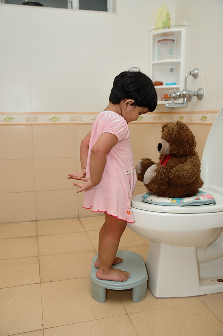
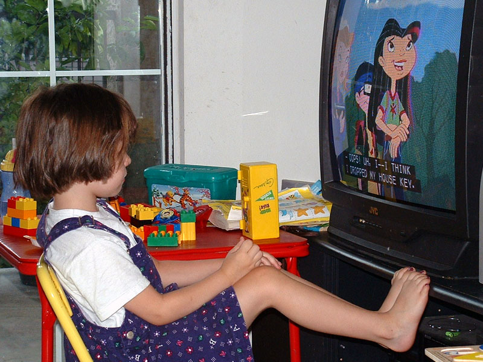

# Physical Development in Early Childhood

<style>
div.solid {
border: 5px solid #FFA500;
border-radius: 5px;
padding: 20px;
}
</style>

<div class = "solid">

After this chapter, you should be able to:

1. Describe the physical changes that occur in early childhood.

2. Explain how to provide health nutrition for 3- to 5-year-olds.

3. Summarize how to support the progression of motor skills with age appropriate activities.

4. Discuss the sleep needs during early childhood and sleep disorders that may affect children.

5. Explain the development behind toilet training and some elimination disorders that children may experience.

6. Recognize the importance of awareness of sexual development in early childhood.

7. Discuss risks to and a variety of ways to promote and protect children’s health and safety. 


During the early childhood years of three to five we see significant changes in the way children look, think, communicate, regulate their emotions, and interact with others. Children are often referred to as preschoolers during this time period. We’ll examine the physical changes of the preschooler in this chapter. 

 
```{r fig-7-1, out.width="50%", fig.cap="Two children walking across a bridge.^[[Image](https://unsplash.com/photos/DIZBFTl7c-A) by [Kevin Gent](https://unsplash.com/@kevinbgent) on [Unsplash](https://unsplash.com/)]"}

knitr::include_graphics("https://images.unsplash.com/photo-1509924603848-aca5e5f276d7?ixlib=rb-1.2.1&ixid=eyJhcHBfaWQiOjEyMDd9&auto=format&fit=crop&w=750&q=80")

```

</div>
<br/>

## Growth in Early Childhood 

Children between the ages of 2 and 6 years tend to grow about 3 inches in height each year and gain about 4 to 5 pounds in weight each year. The 3 year old is very similar to a toddler with a large head, large stomach, short arms and legs. But by the time the child reaches age 6, the torso has lengthened and body proportions have become more like those of adults. The average 6 year old weighs approximately 46 pounds and is about 46 inches in height. This growth rate is slower than that of infancy.

## Nutritional Concerns

That slower rate of growth is accompanied by a reduced appetite between the ages of 2 and 6. This change can sometimes be surprising to parents and lead to the development of poor eating habits. However, children between the ages of 2 and 3 need 1,000 to 1,400 calories, while children between the ages of 4 and 8 need 1,200 to 2,000 calories (Mayo Clinic, 2016a).^[[Children’s Development](https://docs.google.com/document/d/1k1xtrXy6j9_NAqZdGv8nBn_I6-lDtEgEFf7skHjvE-Y/edit) by Ana R. Leon is licensed under [CC BY 4.0](http://opencourselibrary.org/econ-201/); [Lifespan Development: A Psychological Perspective](http://dept.clcillinois.edu/psy/LifespanDevelopment.pdf) (page 34-35) by Martha Lally and Suzanne Valentine-French is licensed under [CC BY-NC-SA 3.0](https://creativecommons.org/licenses/by-nc-sa/3.0/)]


Caregivers who have established a feeding routine with their child can find the reduction in appetite a bit frustrating and become concerned that the child is going to starve. However, by providing adequate, sound nutrition, and limiting sugary snacks and drinks, the caregiver can be assured that 1) the child will not starve; and 2) the child will receive adequate nutrition. Preschoolers can experience iron deficiencies if not given well-balanced nutrition or if they are given too much milk as calcium interferes with the absorption of iron in the diet as well.

Caregivers need to keep in mind that they are setting up taste preferences at this age. Young children who grow accustomed to high fat, very sweet and salty flavors may have trouble eating foods that have more subtle flavors such as fruits and vegetables. Consider the following advice about establishing eating patterns for years to come (Rice, F.P., 1997). Notice that keeping mealtime pleasant, providing sound nutrition and not engaging in power struggles over food are the main goals.^[[Children’s Development](https://docs.google.com/document/d/1k1xtrXy6j9_NAqZdGv8nBn_I6-lDtEgEFf7skHjvE-Y/edit) by Ana R. Leon is licensed under [CC BY 4.0](http://opencourselibrary.org/econ-201/)]
 

## Tips for Establishing Healthy Eating Habits 

1. **Don’t try to force your child to eat or fight over food.** Of course, it is impossible to force someone to eat. But the real advice here is to avoid turning food into a power struggle so that food doesn’t become a way to gain favor with or express anger toward someone else.

2. **Recognize that appetite varies.** Children may eat well at one meal and have no appetite at another. Rather than seeing this as a problem, it may help to realize that appetites do vary. Continue to provide good nutrition at each mealtime (even if children don’t choose to eat the occasional meal).

3. **Keep it pleasant.** This tip is designed to help caregivers create a positive atmosphere during mealtime. Mealtimes should not be the time for arguments or expressing tensions. You do not want the child to have painful memories of mealtimes together or have nervous stomachs and problems eating and digesting food due to stress.

4. **No short order chefs.** While it is fine to prepare foods that children enjoy, preparing a different meal for each child or family member sets up an unrealistic expectation from others. Children probably do best when they are hungry and a meal is ready. Limiting snacks rather than allowing children to “graze” continuously can help create an appetite for whatever is being served.

5. **Limit choices.** If you give your preschool aged child choices, make sure that you give them one or two specific choices rather than asking “What would you like for lunch?” If given an open choice, children may change their minds or choose whatever their sibling does not choose! 

6. **Serve balanced meals.** Meals prepared at home tend to have better nutritional value than fast food or frozen dinners. Prepared foods tend to be higher in fat and sugar content as these ingredients enhance taste and profit margin because fresh food is often more costly and less profitable. However, preparing fresh food at home is not costly. It does, however, require more activity. Including children in meal preparation can provide a fun and memorable experience.

7. **Don’t bribe.** Bribing a child to eat vegetables by promising dessert is not a good idea. First, the child will likely find a way to get the dessert without eating the vegetables (by whining or fidgeting, perhaps, until the caregiver gives in). Secondly, it teaches the child that some foods are better than others. Children tend to naturally enjoy a variety of foods until they are taught that some are considered less desirable than others. A child, for example, may learn the broccoli they have enjoyed is seen as yucky by others unless it’s smothered in cheese sauce!^[[Children’s Development](https://docs.google.com/document/d/1k1xtrXy6j9_NAqZdGv8nBn_I6-lDtEgEFf7skHjvE-Y/edit) by Ana R. Leon is licensed under [CC BY 4.0](http://opencourselibrary.org/econ-201/)]


 
```{r fig-7-2, out.width="50%", fig.cap="Two children cooking together.^[[Image]() by the [Air Force Medical Service](https://www.airforcemedicine.af.mil/) is in the public domain]"}

# knitr::include_graphics("")

```

### USDA Meal Patterns for Young Children

The United States Department of Agriculture Food and Nutrition Service provides the following guidance for the daytime feeding of children age 3 to 5. 

```{r include=F}

table_07_01 <- read_csv("tables/table-07-01.csv")

```


```{r table-7-1}

table_07_01 %>% 
        kable(caption = "Meal Patterns^[https://fns-prod.azureedge.net/sites/default/files/cacfp/CACFP_MealBP.pdf]") %>%         column_spec(1, width = "15em", background = "white") %>% 
        collapse_rows(columns = 1, valign = "top")


```


## Brain Maturation

### Brain Weight 

The brain is about 75 percent its adult weight by two years of age. By age 6, it is approximately 95 percent its adult weight. Myelination and the development of dendrites continues to occur in the cortex and as it does, we see a corresponding change in the child’s abilities. Significant development in the **prefrontal cortex** (the area of the brain behind the forehead that helps us to think, strategize, and control emotion) makes it increasingly possible to control emotional outbursts and to understand how to play games. Consider 4- or 5-year-old children and how they might approach a game of soccer. Chances are, every move would be a response to the commands of a coach standing nearby calling out, “Run this way! Now, stop. Look at the ball. Kick the ball!” And when the child is not being told what to do, he or she is likely to be looking at the clover on the ground or a dog on the other side of the fence! Understanding the game, thinking ahead, coordinating movement, and handling losing improve with practice and myelination.^[[Lifespan Development - Module 5: Early Childhood](https://courses.lumenlearning.com/lifespandevelopment2/chapter/module/) by [Lumen Learning](http://opencourselibrary.org/econ-201/) references [Psyc 200 Lifespan Psychology](http://opencourselibrary.org/econ-201/) by Laura Overstreet, licensed under [CC BY 4.0](https://creativecommons.org/licenses/by/4.0/)]


### Visual Pathways

Children’s drawings are representative of the development of visual pathways; as children’s brains mature the images in their drawings change. Early scribbles and dots illustrate the use of simple motor skills. No real connection is made between an image being visualized and what is created on paper.
At age 3, the child begins to draw wispy creatures with heads and not much other detail. Gradually pictures begin to have more detail and incorporate more parts of the body. Arm buds become arms and faces take on noses, lips and eventually eyelashes. 

 
```{r fig-7-3, out.width="50%", fig.cap="Early scribbles.^[[Image](https://commons.wikimedia.org/wiki/File:Child_scribble_age_1y10m.jpg) by [Wikimedia]() is licensed under [CC BY-SA 3.0]()]"}

knitr::include_graphics("https://upload.wikimedia.org/wikipedia/commons/thumb/d/d2/Child_scribble_age_1y10m.jpg/800px-Child_scribble_age_1y10m.jpg")

```

```{r fig-7-4, out.width="50%", fig.cap="Creatures with heads.^[[Image](https://torange.biz/two-dolls-children-drawing-18722) by [torange.biz](https://torange.biz/) is Licensed under [CC-BY 4.0](https://creativecommons.org/licenses/by/4.0/)]"}

knitr::include_graphics("https://torange.biz/photo/18/ICO/childhood-childrens-drawings-people-two-dolls-18722.jpg")

```


```{r fig-7-5, out.width="50%", fig.cap="A detailed face.^[[Image](https://torange.biz/childrens-drawing-portrait-42891) by [torange.biz](https://torange.biz/) is Licensed under [CC-BY 4.0](https://creativecommons.org/licenses/by/4.0/)]"}

knitr::include_graphics("https://torange.biz/photo/42/ICO/childrens-childhood-drawings-people-drawing-portrait-42891.jpg")

```


### Growth in the Hemispheres and Corpus Callosum

Between ages 3 and 6, the left hemisphere of the brain grows dramatically. This side of the brain or hemisphere is typically involved in language skills. The right hemisphere continues to grow throughout early childhood and is involved in tasks that require spatial skills such as recognizing shapes and patterns. The corpus callosum which connects the two hemispheres of the brain undergoes a growth spurt between ages 3 and 6 and results in improved coordination between right and left hemisphere tasks. 

## Motor Skill Development 

Early childhood is a time when children are especially attracted to motion and song. Days are filled with jumping, running, swinging and clapping and every place becomes a playground. Even the booth at a restaurant affords the opportunity to slide around in the seat or disappear underneath and imagine being a sea creature in a cave! Of course, this can be frustrating to a caregiver, but it’s the business of early childhood. 

### Gross Motor Skills in Early Childhood

Children continue to improve their gross motor skills as they run and jump. They frequently ask their caregivers to “look at me” while they hop or roll down a hill. Children’s songs are often accompanied by arm and leg movements or cues to turn around or move from left to right. 

#### Gross Motor Milestones

Here is a table showing the progression of gross motor skills that children will typically develop during early childhood:

```{r include=F}

table_07_02 <- read_csv("tables/table-07-02.csv")

```


```{r table-7-2}

table_07_02 %>% 
        kable(caption = "Gross Motor Milestones^[[Developmental Milestones](https://www.cdc.gov/ncbddd/actearly/milestones/index.html) by the [CDC](https://www.cdc.gov/) is in the public domain]") %>% 
        column_spec(1, width = "15em", background = "white") %>% 
        collapse_rows(columns = 1, valign = "top")


```


#### Activities to Support Gross Motor Skills

Here are some activities focused on play that young children enjoy and that support their gross motor skill development. 

* Tricycle

* Slides

* Swings

* Sit-n-Spin

* Mini trampoline

* Bowling pins (can use plastic soda bottles also)

* Tent (try throwing blankets over chairs and other furniture to make a fort)

* Playground ladders

* Suspension bridge on playground

* Tunnels (try throwing a bean bag chair underneath for greater challenge)

* Ball play (kick, throw, catch)

* Simon Says 

* Target games with bean bags, ball, etc.

* Dancing/moving to music

* Pushing self on scooter or skateboard while on stomach

 
```{r fig-7-6, out.width="50%", fig.cap="Children riding tricycles together.^[[Image](https://www.hanscom.af.mil/News/Photos/igphoto/2000320622/) by [Hanscom Air Force Base](https://www.hanscom.af.mil/) is in the public domain]"}

knitr::include_graphics("https://media.defense.gov/2010/Sep/30/2000320622/888/591/0/100921-F-0672W-003.JPG")

```

### Fine Motor Skills in Early Childhood

Fine motor skills are also being refined as they continue to develop more dexterity, strength, and endurance. Fine motor skills are very important as they are foundational to self-help skills and later academic abilities (such as writing). 

#### Fine Motor Milestones

Here is a table showing how fine motor skills progress during early childhood for children that are typically developing.

```{r include=F}

table_07_03 <- read_csv("tables/table-07-03.csv")

```


```{r table-7-3}

table_07_03 %>% 
        kable(caption = "Fine Motor Milestones^[[Developmental Milestones](https://www.cdc.gov/ncbddd/actearly/milestones/index.html) by the [CDC](https://www.cdc.gov/) is in the public domain]") %>% 
        column_spec(1, width = "15em", background = "white") %>% 
        collapse_rows(columns = 1, valign = "top")

```


#### Activities to Support Fine Motor Skills

Here are some fun activities that will help children continue to refine their fine motor abilities. Fine motor skills are slower to develop than gross motor skills, so it is important to have age appropriate expectations and play-based activities for children.

* Pouring water into a container

* Drawing and coloring

* Using scissors

* Finger painting

* Fingerplays and songs (such as the Itsy, Bitsy Spider)

* Play dough

* Lacing and beading

* Practicing with large tweezers, tongs, and eye droppers


```{r fig-7-7, out.width="50%", fig.cap="Children coloring.^[[Image](https://www.spangdahlem.af.mil/News/Photos/igphoto/2000988922/) by [Spangdahlem Air Base](https://www.spangdahlem.af.mil/) is in the public domain]"}

knitr::include_graphics("https://media.defense.gov/2014/Nov/06/2000988922/1088/820/0/141105-F-JZ627-031.JPG")

```


## Sleep and Early Childhood 

Along with food and water, sleep is one of the human body's most important physiological needs—we cannot live without it. Extended sleeplessness (i.e., lack of sleep for longer than a few days) has severe psychological and physical effects. Research on rats has found that a week of no sleep leads to loss of immune function, and two weeks of no sleep leads to death.

Recently, neuroscientists have learned that at least one vital function of sleep is related to learning and memory. New findings suggest that sleep plays a critical role in flagging and storing important memories, both intellectual and physical, and perhaps in making subtle connections that were invisible during waking hours.^[[Children’s Development](https://docs.google.com/document/d/1k1xtrXy6j9_NAqZdGv8nBn_I6-lDtEgEFf7skHjvE-Y/edit) by Ana R. Leon is licensed under [CC BY 4.0](http://opencourselibrary.org/econ-201/)]


### How Much Sleep Do We Need?

The amount of sleep an individual needs varies depending on multiple factors including age, physical condition, psychological condition, and energy exertion. Just like any other human characteristic, the amount of sleep people need to function best differs among individuals, even those of the same age and gender. 

Though there is no magic sleep number, there are general rules for how much sleep certain age groups need. For instance, children need more sleep per day in order to develop and function properly: up to 18 hours for newborn babies, with a declining rate as a child ages. A newborn baby spends almost 9 hours a day in REM sleep. By the age of five, only slightly over two hours is spent in REM. Studies show that young children need about 10 to 11 hours of sleep, adolescents need between 8.5 and 9.25, and adults generally need between 7 and 9 hours.

```{r fig-7-8, out.width="50%", fig.cap="A child sleeping.^[[Image](https://www.publicdomainpictures.net/en/view-image.php?image=11407&picture=child-sleeping) by Peter Griffin is in the public domain]"}

knitr::include_graphics("https://www.publicdomainpictures.net/pictures/20000/velka/child-sleeping-296129540376404b.jpg")

```

### Sleepwalking (Somnambulism)

Sleepwalking (sometimes called sleepwalking disorder, **somnambulism**, or noctambulation) causes a person to get up and walk during the early hours of sleep. The person may sit up and look awake (though they're actually asleep), get up and walk around, move items, or dress or undress themselves. They will have a blank stare and still be able to perform complex tasks. Some individuals also talk while in their sleep, saying meaningless words and even having arguments with people who are not there. A person who sleepwalks will be confused upon waking up and may also experience anxiety and fatigue.

Sleepwalking can be dangerous—people have been known to seriously hurt themselves during sleepwalking episodes. It is most common in children, but it also occurs occasionally in adults. For adults, alcohol, sedatives, medications, medical conditions and mental disorders are all associated with sleepwalking.

### Sleep Terrors and Nightmare Disorder

Sleep terrors are characterized by a sudden arousal from deep sleep with a scream or cry, accompanied by some behavioral manifestations of intense fear. Sleep terrors typically occur in the first few hours of sleep, during stage 3 NREM sleep. Night terrors tend to happen during periods of arousal from delta sleep (i.e., slow-wave sleep). They are worse than nightmares, causing significant disorientation, panic, and anxiety. They can last up to 10 minutes, and the person may be screaming and difficult to wake. In some cases, sleep terrors continue into adulthood.

Distinct from sleep terrors is nightmare disorder. Also known as "dream anxiety disorder," nightmare disorder is characterized by frequent nightmares. The nightmares, which often portray the individual in a situation that jeopardizes their life or personal safety, usually occur during the second half of the sleeping process, called the REM stage. Though many people experience nightmares, those with nightmare disorder experience them more frequently.^[[Children’s Development](https://docs.google.com/document/d/1k1xtrXy6j9_NAqZdGv8nBn_I6-lDtEgEFf7skHjvE-Y/edit) by Ana R. Leon is licensed under [CC BY 4.0](http://opencourselibrary.org/econ-201/)]


## Toilet Training 

Toilet training typically occurs after the second birthday. Some children show interest by age 2, but others may not be ready until months later. The average age for girls to be toilet trained is 29 months and for boys it is 31 months, and 98% of children are trained by 36 months (Boyse & Fitzgerald, 2010). The child’s age is not as important as his/her physical and emotional readiness. If started too early, it might take longer to train a child. 

According to The Mayo Clinic (2016b) the following questions can help parents determine if a child is ready for toilet training: 

* Does your child seem interested in the potty chair or toilet, or in wearing underwear? 

* Can your child understand and follow basic directions? 

* Does your child tell you through words, facial expressions or posture when he or she needs to go? 

* Does your child stay dry for periods of two hours or longer during the day? 

* Does your child complain about wet or dirty diapers? 

* Can your child pull down his or her pants and pull them up again? 

* Can your child sit on and rise from a potty chair? 

If a child resists being trained or it is not successful after a few weeks, it is best to take a break and try again when they show more significant interest in the process. Most children master daytime bladder control first, typically within two to three months of consistent toilet training. However, nap and nighttime training might take months or even years. 

 
```{r fig-7-9, out.width="50%", fig.cap="A child learning to be toilet trained.^[[Image](https://www.flickr.com/photos/bansal98/4626893485) by [Manish Bansal](https://www.flickr.com/photos/bansal98/) is licensed under [CC-BY-2.0](https://creativecommons.org/licenses/by/2.0/)]"}



```

### Elimination Disorders

Some children experience elimination disorders including:

* enuresis - the repeated voiding of urine into bed or clothes (involuntary or intentional) after age 5 

* encopresis - the repeated passage of feces into inappropriate places (involuntary or intentional). 


The prevalence of enuresis is 5%-10% for 5 year-olds, 3%-5% for 10 year-olds and approximately 1% for those 15 years of age or older. Around 1% of 5 year- olds have encopresis, and it is more common in males than females. These are diagnosed by a medical professional and may require treatment.^[[Lifespan Development: A Psychological Perspective](http://dept.clcillinois.edu/psy/LifespanDevelopment.pdf) by Martha Lally and Suzanne Valentine-French is licensed under [CC BY-NC-SA 3.0](https://creativecommons.org/licenses/by-nc-sa/3.0/)]


## Sexual Development in Early Childhood

Self-stimulation is common in early childhood for both boys and girls. Curiosity about the body and about others’ bodies is a natural part of early childhood as well. Consider this example. A girl asks her mother: “So it’s okay to see a boy’s privates as long as it’s the boy’s mother or a doctor?” The mother hesitates a bit and then responds, “Yes. I think that’s alright.” “Hmmm,” the girl begins, “When I grow up, I want to be a doctor!” While this subject can feel uncomfortable to deal with, caregivers can teach children to be safe and know what is appropriate without frightening them or causing shame.

As children grow, they are more likely to show their genitals to siblings or peers, and to take off their clothes and touch each other (Okami et al., 1997). Masturbation is common for both boys and girls. Boys are often shown by other boys how to masturbate. But girls tend to find out accidentally. And boys masturbate more often and touch themselves more openly than do girls (Schwartz, 1999).

Caregivers should respond to this without undue alarm and without making the child feel guilty about their bodies. Instead, messages about what is going on and the appropriate time and place for such activities help the child learn what is appropriate.^[[Lifespan Development - Module 5: Early Childhood](https://courses.lumenlearning.com/lifespandevelopment2/chapter/module/) by [Lumen Learning](http://opencourselibrary.org/econ-201/) references [Psyc 200 Lifespan Psychology](http://opencourselibrary.org/econ-201/) by Laura Overstreet, licensed under [CC BY 4.0](https://creativecommons.org/licenses/by/4.0/)]

## Health in Early Childhood

While preschoolers are becoming more and more independent, they depend on their caregivers to keep protecting and promoting their health.^[[Prevalence of Childhood Obesity in the United States](https://www.cdc.gov/obesity/data/childhood.html) by the [CDC](https://www.cdc.gov/) is in the public domain
]


### Childhood Obesity

Childhood obesity is a complex health issue. It occurs when a child is well above the normal or healthy weight for his or her age and height. Childhood obesity is a serious problem in the United States putting children at risk for poor health. In 2015-2016, 13.9% of 2- to 5-year-olds were obese. 

Where people live can affect their ability to make healthy choices. Obesity disproportionally affects children from low-income families.

#### Causes of Obesity

The causes of excess weight gain in young people are similar to those in adults, including factors such as a person’s behavior and genetics. Behaviors that influence excess weight gain include:

* eating high calorie, low-nutrient foods

* not getting enough physical exercise

* sedentary activities (such as watching television or other screen devices)

* medication use

* sleep routines

 

```{r fig-7-10, out.width="50%", fig.cap="A child watching TV instead of playing.^[[Image](https://www.flickr.com/photos/oddharmonic/2405784549) by [Melissa Gutierrez](https://www.flickr.com/photos/oddharmonic/) is licensed under [CC-BY-2.0](https://creativecommons.org/licenses/by-sa/2.0/)]"}



```

#### Consequences of Obesity

The consequences of childhood obesity are both immediate and long term. It can affect physical as well as social and emotional well-being.

* More Immediate Health Risks

     * High blood pressure and high cholesterol, which are risk factors for cardiovascular disease (CVD).

     * Increased risk of impaired glucose tolerance, insulin resistance, and type 2 diabetes.

     * Breathing problems, such as asthma and sleep apnea.

     * Joint problems and musculoskeletal discomfort.

     * Fatty liver disease, gallstones, and gastro-esophageal reflux (i.e., heartburn).
* Childhood obesity is also related to

     * Psychological problems such as anxiety and depression.

     * Low self-esteem and lower self-reported quality of life.

     * Social problems such as bullying and stigma.
* Future Health Risks

     * Children who have obesity are more likely to become adults with obesity.11 Adult obesity is associated with increased risk of a number of serious health conditions including heart disease, type 2 diabetes, and cancer.

     * If children have obesity, their obesity and disease risk factors in adulthood are likely to be more severe.^[[Childhood Obesity Causes & Consequences](https://www.cdc.gov/obesity/childhood/causes.html) by the [CDC](https://www.cdc.gov/) is in the public domain]

### Food Allergies

A **food allergy** occurs when the body has a specific and reproducible immune response to certain foods. The body’s immune response can be severe and life threatening, such as anaphylaxis. Although the immune system normally protects people from germs, in people with food allergies, the immune system mistakenly responds to food as if it were harmful.

Eight foods or food groups account for 90% of serious allergic reactions in the United States: milk, eggs, fish, crustacean shellfish, wheat, soy, peanuts, and tree nuts.

The symptoms and severity of allergic reactions to food can be different between individuals, and can also be different for one person over time. Anaphylaxis is a sudden and severe allergic reaction that may cause death.4Not all allergic reactions will develop into anaphylaxis.

* Children with food allergies are two to four times more likely to have asthma or other allergic conditions than those without food allergies.

* The prevalence of food allergies among children increased 18% during 1997-2007, and allergic reactions to foods have become the most common cause of anaphylaxis in community health settings.

* Although difficult to measure, research suggests that approximately 4% of children and adolescents are affected by food allergies.

The CDC recommends that as part of maintaining a healthy and safe environment for children, caregivers should:

* Be aware of any food allergies.

* Educate other children and all adults that care for a child with food allergies.

* Ensure the daily management of food allergies. 

* Prepare for food allergy emergencies.^[[Food Allergies in Schools](https://www.cdc.gov/healthyschools/foodallergies/index.htm) by the [CDC](https://www.cdc.gov/) is in the public domain]

### Oral Health

Tooth decay (cavities) is one of the most common chronic conditions of childhood in the United States. Untreated tooth decay can cause pain and infections that may lead to problems with eating, speaking, playing, and learning. The good news is that tooth decay is preventable. 
Fluoride varnish, a high concentration fluoride coating that is painted on teeth, can prevent about one-third (33%) of decay in the primary (baby) teeth. Children living in communities with fluoridated tap water have fewer decayed teeth than children who live in areas where their tap water is not fluoridated. Similarly, children who brush daily with fluoride toothpaste will have less tooth decay.

Applying dental sealants to the chewing surfaces of the back teeth is another way to prevent tooth decay. Studies in children show that sealants reduce decay in the permanent molars by 81% for 2 years after they are placed on the tooth and continue to be effective for 4 years after placement.^[[Children’s Oral Health](https://www.cdc.gov/OralHealth/children_adults/child.htm) by the [CDC](https://www.cdc.gov/) is in the public domain]

The first visit to the dentist should happen after the first tooth erupts. After that, children should be seeing the dentist every six months.^[Content by Jennifer Paris is licensed under [CC BY 4.0](https://creativecommons.org/licenses/by/4.0/legalcode)]

```{r fig-7-11, out.width="50%", fig.cap="A dentist checking a child’s teeth.^[[Image](https://www.keesler.af.mil/News/Article-Display/Article/361709/childrens-dental-health-month-br-dental-clinic-provides-free-treatment-for-kids/) by [Keesler Air Force Base](https://www.keesler.af.mil/) is in the public domain]"}

knitr::include_graphics("https://media.defense.gov/2011/Feb/24/2000282939/780/780/0/110224-F-KJ415-002.JPG")

```

### Protection from Illness

Two important ways to help protect children from illness are immunization and handwashing. 

#### Immunizations

While vaccines begin in infancy, it is important for children to receive additional doses of vaccines to keep them protected. These boosters, given between ages 4 and 6, are doses of the vaccines they received earlier in life to help them maintain the best protection against vaccine-preventable diseases.

 
```{r fig-7-12, out.width="50%", fig.cap="Vaccines.^[[Image](https://www.ramstein.af.mil/News/Article-Display/Article/304938/vaccines-more-than-just-a-one-time-deal/) by [Ramstein Air Base](https://www.ramstein.af.mil/) is in the public domain]"}

knitr::include_graphics("https://media.defense.gov/2009/Aug/26/2000495091/780/780/0/090826-F-1342R-006.JPG")

```

Many states require children to be fully vaccinated (unless they have a medical reason to be exempt) before they can enroll in licensed child care or public school. If vaccinations were missed, a health care provider can help the child’s caregivers to create a catch up schedule to ensure the child correctly “catches up” with the recommended childhood vaccination schedule.^[[Vaccines for Your Children: Protect Your Child at Every Age](https://www.cdc.gov/vaccines/parents/protecting-children/years-4-6.html) by the [CDC](https://www.cdc.gov/) is in the public domain]

#### Handwashing

Handwashing is one of the best ways to prevent the spread of illness. It’s important for children (and adults) to wash their hands often, especially when they are likely to get and spread germs, including:

* Before, during, and after preparing food.

* Before eating food.

* After blowing nose, coughing, or sneezing.

* After using the toilet.

* After touching an animal, animal feed, or animal waste.

* After touching garbage.

It’s important for children to learn how to properly wash their hands. When washing hands children (and adults) should follow these five steps every time.

1. Wet your hands with clean, running water (warm or cold), turn off the tap, and apply soap.

2. Lather your hands by rubbing them together with the soap. Lather the backs of your hands, between your fingers, and under your nails.

3. Scrub your hands for at least 20 seconds. Need a timer? Hum or sing the Happy Birthday song or ABCs from beginning to end twice.

4. Rinse your hands well under clean, running water.

5. Dry your hands using a clean towel or air dry them.^[[Wash Your Hands](https://www.cdc.gov/Features/HandWashing/) by the [CDC](https://www.cdc.gov/) is in the public domain]

 
```{r fig-7-13, out.width="50%", fig.cap="A mother helping her son wash his hands.^[[Image](https://pixnio.com/people/boy-enjoys-the-washing-of-hands-with-his-mother) is in the public domain]"}

knitr::include_graphics("https://pixnio.com/free-images/people/boy-enjoys-the-washing-of-hands-with-his-mother-725x483.jpg")

```

Caregivers can help keep children healthy by:

* Teaching them good handwashing techniques.

* Reminding their kids to wash their hands.

* Washing their own hands with the children.^[[Handwashing: A Family Activity](https://www.cdc.gov/handwashing/handwashing-family.html) by the [CDC](https://www.cdc.gov/) is in the public domain]

## Safety in Early Childhood

Child injuries are preventable, yet more than 9,000 children (from 0-19 years) died from injuries in the US in 2009. Car crashes, suffocation, drowning, poisoning, fires, and falls are some of the most common ways children are hurt or killed. The number of children dying from injury dropped nearly 30% over the last decade. However, injury is still the number 1 cause of death among children.^[[Child Injury](https://www.cdc.gov/vitalsigns/childinjury/index.html) by the [CDC](https://www.cdc.gov/) is in the public domain]

Children during early childhood are more at risk for certain injuries. Using data from 2000-2006, the CDC determined that:

* Drowning was the leading cause of injury death between 1 and 4 years of age. 

* Falls were the leading cause of nonfatal injury for all age groups less than 15.

* For children ages 0 to 9, the next two leading causes were being struck by or against an object and animal bites or insect stings.

* Rates for fires or burns, and drowning were highest for children 4 years and younger.^[[CDC Childhood Injury Report](https://www.cdc.gov/safechild/child_injury_data.html) by the [CDC](https://www.cdc.gov/) is in the public domain]

Here is a table summarizing some tips from the CDC to protect children from these injuries:


<!-- Check footnotes -->
```{r include=F}

table_07_04 <- read_csv("tables/table-07-04.csv")

```


```{r table-7-4}

table_07_04 %>% 
        kable(caption = "Preventing Injuries") %>% 
        column_spec(1, width = "15em", background = "white") %>% 
        collapse_rows(columns = 1, valign = "top")


```


```{r fig-7-14, out.width="50%", fig.cap="Children playing on a jungle gym at a park.^[[Image](https://www.maxpixel.net/Children-Web-Playground-Game-Device-3698745) is in the public domain]"}

knitr::include_graphics("https://www.maxpixel.net/static/photo/1x/Children-Web-Game-Device-Playground-3698745.jpg")

```

<br/>

<style>
div.solid {
border: 5px solid #FFA500;
border-radius: 5px;
padding: 20px;
}
</style>

<div class = "solid">

In this chapter we looked at: 

* The physical characteristics of preschoolers.

* Healthy nutrition.

* The changes in the brain.

* The progression of motor skills and developmentally appropriate ways to support that development.

* Sleep and sleep disorders.

* Toilet training and elimination disorders

* Sexual development in early childhood.

* And ways to keep children healthy and safe.

In the next chapter we’ll investigate how children understand the world and their communication abilities.

</div>
<br/>
