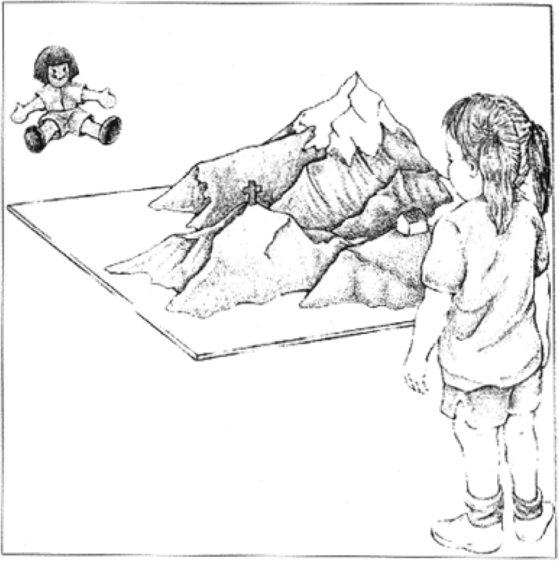
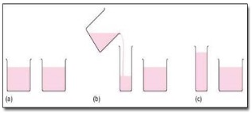
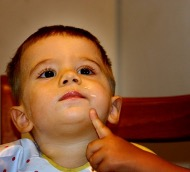

# Cognitive Development in Early Childhood

<style>
div.solid {
border: 5px solid #FFA500;
border-radius: 5px;
padding: 20px;
}
</style>

<div class = "solid">

After reading this chapter, you should be able to:

1. Compare and contrast Piaget and Vygotsky’s beliefs about cognitive development.

2. Explain the role of information processing in cognitive development.

3. Discuss how preschool-aged children understand their worlds.

4. Put cognitive and language milestones into the order in which they appear in typically developing children.

5. Discuss how early child education supports development and how our understanding of development influence education.

6. Describe autism spectrum disorder, including characteristics and possible interventions.


Early childhood is a time of pretending, blending fact and fiction, and learning to think of the world using language. As young children move away from needing to touch, feel, and hear about the world toward learning some basic principles about how the world works, they hold some pretty interesting initial ideas. For example, while adults have no concerns with taking a bath, a child of three might genuinely worry about being sucked down the drain.^[[Lifespan Development - Module 5: Early Childhood](https://courses.lumenlearning.com/lifespandevelopment2/chapter/module/) by [Lumen Learning](http://opencourselibrary.org/econ-201/) references [Psyc 200 Lifespan Psychology](http://opencourselibrary.org/econ-201/) by Laura Overstreet, licensed under [CC BY 4.0](https://creativecommons.org/licenses/by/4.0/)]


 
```{r fig-8-1, out.width="50%", fig.cap="A child in a bathtub.^[[Image](https://www.flickr.com/photos/igcameron/26553679416) by [Ian Cameron](https://www.flickr.com/photos/igcameron/) is licensed under [CC BY 2.0](https://creativecommons.org/licenses/by/2.0/)]"}


```

A child might protest if told that something will happen “tomorrow” but be willing to accept an explanation that an event will occur “today after we sleep.” Or the young child may ask, “How long are we staying? From here to here?” while pointing to two points on a table. Concepts such as tomorrow, time, size and distance are not easy to grasp at this young age. Understanding size, time, distance, fact and fiction are all tasks that are part of cognitive development in the preschool years.^[[Lifespan Development - Module 5: Early Childhood](https://courses.lumenlearning.com/lifespandevelopment2/chapter/module/) by [Lumen Learning](http://opencourselibrary.org/econ-201/) references [Psyc 200 Lifespan Psychology](http://opencourselibrary.org/econ-201/) by Laura Overstreet, licensed under [CC BY 4.0](https://creativecommons.org/licenses/by/4.0/)]


</div>
<br/>


## Piaget’s Preoperational Intelligence 

Piaget’s stage that coincides with early childhood is the **preoperational stage**. The word operational means logical, so these children were thought to be illogical. However, they were learning to use language or to think of the world symbolically. Let’s examine some of Piaget’s assertions about children’s cognitive abilities at this age.

### Pretend Play

Pretending is a favorite activity at this time. A toy has qualities beyond the way it was designed to function and can now be used to stand for a character or object unlike anything originally intended. A teddy bear, for example, can be a baby or the queen of a faraway land!

 
```{r fig-8-2, out.width="50%", fig.cap="A child pretending to buy items at a toy grocery store.^[[Image](https://commons.wikimedia.org/wiki/File:Pretend-city-grocery-store.jpg) by [Ermalfaro](https://commons.wikimedia.org/w/index.php?title=User:Ermalfaro&action=edit&redlink=1) is licensed under [CC BY-SA 4.0](https://creativecommons.org/licenses/by-sa/4.0/deed.en)]"}

knitr::include_graphics("https://upload.wikimedia.org/wikipedia/commons/1/16/Pretend-city-grocery-store.jpg")

```

According to Piaget, children’s pretend play helps them solidify new schemes they were developing cognitively. This play, then, reflects changes in their conceptions or thoughts. However, children also learn as they pretend and experiment. Their play does not simply represent what they have learned (Berk, 2007).

### Egocentrism

**Egocentrism** in early childhood refers to the tendency of young children to think that everyone sees things in the same way as the child. Piaget’s classic experiment on egocentrism involved showing children a 3-dimensional model of a mountain and asking them to describe what a doll that is looking at the mountain from a different angle might see. Children tend to choose a picture that represents their own view, rather than that of the doll. However, children tend to use different sentence structures and vocabulary when addressing a younger child or an older adult. This indicates some awareness of the views of others.

 
```{r fig-8-3, out.width="50%", fig.cap="Piaget’s egocentrism experiment.^[[Image](https://www.flickr.com/photos/rosenfeldmedia/14457048196) by [Rosenfeld Media](https://www.flickr.com/photos/rosenfeldmedia/) is licensed under [CC BY 2.0](https://creativecommons.org/licenses/by/2.0/)]"}



```

### Syncretism

**Syncretism** refers to a tendency to think that if two events occur simultaneously, one caused the other.  An example of this is a child putting on their bathing suit to turn it to summertime.

### Animism

Attributing lifelike qualities to objects is referred to as **animism**. The cup is alive, the chair that falls down and hits the child’s ankle is mean, and the toys need to stay home because they are tired.  Cartoons frequently show objects that appear alive and take on lifelike qualities. Young children do seem to think that objects that move may be alive but after age 3, they seldom refer to objects as being alive (Berk, 2007).

### Classification Errors

Preoperational children have difficulty understanding that an object can be classified in more than one way. For example, if shown three white buttons and four black buttons and asked whether there are more black buttons or buttons, the child is likely to respond that there are more black buttons. As the child’s vocabulary improves and more schemes are developed, the ability to classify objects improves.^[[Lifespan Development - Module 5: Early Childhood](https://courses.lumenlearning.com/lifespandevelopment2/chapter/module/) by [Lumen Learning](http://opencourselibrary.org/econ-201/) references [Psyc 200 Lifespan Psychology](http://opencourselibrary.org/econ-201/) by Laura Overstreet, licensed under [CC BY 4.0](https://creativecommons.org/licenses/by/4.0/)]


### Conservation Errors

**Conservation** refers to the ability to recognize that moving or rearranging matter does not change the quantity. Let’s look at an example. A father gave a slice of pizza to 10-year-old Keiko and another slice to 3-year-old Kenny. Kenny’s pizza slice was cut into five pieces, so Kenny told his sister that he got more pizza than she did. Kenny did not understand that cutting the pizza into smaller pieces did not increase the overall amount. This was because Kenny exhibited **Centration**, or focused on only one characteristic of an object to the exclusion of others. 

Kenny focused on the five pieces of pizza to his sister’s one piece even though the total amount was the same. Keiko was able to consider several characteristics of an object than just one. Because children have not developed this understanding of conservation, they cannot perform mental operations. 

The classic Piagetian experiment associated with conservation involves liquid (Crain, 2005). As seen below, the child is shown two glasses (as shown in a) which are filled to the same level and asked if they have the same amount. Usually the child agrees they have the same amount. The researcher then pours the liquid from one glass to a taller and thinner glass (as shown in b). The child is again asked if the two glasses have the same amount of liquid. The preoperational child will typically say the taller glass now has more liquid because it is taller. The child has concentrated on the height of the glass and fails to conserve.^[[Lifespan Development: A Psychological Perspective](http://dept.clcillinois.edu/psy/LifespanDevelopment.pdf) by Martha Lally and Suzanne Valentine-French is licensed under [CC BY-NC-SA 3.0](https://creativecommons.org/licenses/by-nc-sa/3.0/)]


 
```{r fig-8-4, fig.cap="Piagetian liquid conservation experiments.^[[Image](http://dept.clcillinois.edu/psy/LifespanDevelopment.pdf) by Martha Lally and Suzanne Valentine-French is licensed under [CC BY-NC-SA 3.0](https://creativecommons.org/licenses/by-nc-sa/3.0/)]"}

# 

```

### Cognitive Schemas

As introduced in the first chapter, Piaget believed that in a quest for cognitive equilibrium, we use schemas (categories of knowledge) to make sense of the world. And when new experiences fit into existing schemas, we use assimilation to add that new knowledge to the schema. But when new experiences do not match an existing schema, we use accommodation to add a new schema. During early childhood, children use accommodation often as they build their understanding of the world around them.

## Vygotsky’s Sociocultural Theory of Cognitive Development 

As introduced in Chapter 1, Lev Vygotsky was a Russian psychologist who argued that culture has a major impact on a child’s cognitive development. He believed that the social interactions with adults and more knowledgeable peers can facilitate a child’s potential for learning. Without this interpersonal instruction, he believed children’s minds would not advance very far as their knowledge would be based only on their own discoveries. Let’s review some of Vygotsky’s key concepts. 

### Zone of Proximal Development and Scaffolding

Vygotsky’s best known concept is the zone of proximal development (ZPD). Vygotsky stated that children should be taught in the ZPD, which occurs when they can perform a task with assistance, but not quite yet on their own. With the right kind of teaching, however, they can accomplish it successfully. A good teacher identifies a child’s ZPD and helps the child stretch beyond it. Then the adult (teacher) gradually withdraws support until the child can then perform the task unaided. Researchers have applied the metaphor of scaffolds (the temporary platforms on which construction workers stand) to this way of teaching. Scaffolding is the temporary support that parents or teachers give a child to do a task. 

 
```{r fig-8-5, out.width="50%", fig.cap="Zone of proximal development.^[[Image](https://commons.wikimedia.org/wiki/File:Zone_of_proximal_development.svg) by [Dcoetzee](https://commons.wikimedia.org/wiki/User:Dcoetzee) is licensed under [CC0 1.0](https://creativecommons.org/publicdomain/zero/1.0/deed.en)]"}

knitr::include_graphics("https://upload.wikimedia.org/wikipedia/commons/thumb/9/92/Zone_of_proximal_development.svg/654px-Zone_of_proximal_development.svg.png")

```

### Private Speech

Do you ever talk to yourself? Why? Chances are, this occurs when you are struggling with a problem, trying to remember something, or feel very emotional about a situation. Children talk to themselves too. Piaget interpreted this as **egocentric speech** or a practice engaged in because of a child’s inability to see things from another’s point of view. Vygotsky, however, believed that children talk to themselves in order to solve problems or clarify thoughts. As children learn to think in words, they do so aloud before eventually closing their lips and engaging in **private speech** or inner speech. 

Thinking out loud eventually becomes thought accompanied by internal speech, and talking to oneself becomes a practice only engaged in when we are trying to learn something or remember something. This inner speech is not as elaborate as the speech we use when communicating with others (Vygotsky, 1962).^[[Lifespan Development - Module 5: Early Childhood](https://courses.lumenlearning.com/lifespandevelopment2/chapter/module/) by [Lumen Learning](http://opencourselibrary.org/econ-201/) references [Psyc 200 Lifespan Psychology](http://opencourselibrary.org/econ-201/) by Laura Overstreet, licensed under [CC BY 4.0](https://creativecommons.org/licenses/by/4.0/)]


### Contrast with Piaget

Piaget was highly critical of teacher-directed instruction,  believing that teachers who take control of the child’s learning place the child into a passive role (Crain, 2005). Further, teachers may present abstract ideas without the child’s true understanding, and instead they just repeat back what they heard. Piaget believed children must be given opportunities to discover concepts on their own. As previously stated, Vygotsky did not believe children could reach a higher cognitive level without instruction from more learned individuals. Who is correct? Both theories certainly contribute to our understanding of how children learn. 

## Information Processing 

Information processing researchers have focused on several issues in cognitive development for this age group, including improvements in attention skills, changes in the capacity, and the emergence of executive functions in working memory. Additionally, in early childhood memory strategies, memory accuracy, and autobiographical memory emerge. Early childhood is seen by many researchers as a crucial time period in memory development (Posner & Rothbart, 2007). 

 
```{r fig-8-6, out.width="50%", fig.cap="How information is processed.^[[Image](https://commons.wikimedia.org/wiki/File:Information_processing_system_(english).svg) by [Gradient drift](https://en.wikipedia.org/wiki/User:Gradient_drift) is in the public domain]"}

knitr::include_graphics("https://upload.wikimedia.org/wikipedia/commons/thumb/3/38/Information_processing_system_%28english%29.svg/800px-Information_processing_system_%28english%29.svg.png")

```

### Attention 

Changes in attention have been described by many as the key to changes in human memory (Nelson & Fivush, 2004; Posner & Rothbart, 2007). However, attention is not a unified function; it is comprised of sub-processes. The ability to switch our focus between tasks or external stimuli is called **divided attention** or **multitasking**. This is separate from our ability to focus on a single task or stimulus, while ignoring distracting information, called **selective attention**. Different from these is **sustained attention**, or the ability to stay on task for long periods of time. Moreover, we also have attention processes that influence our behavior and enable us to inhibit a habitual or dominant response, and others that enable us to distract ourselves when upset or frustrated. 

### Divided Attention

Young children (age 3-4) have considerable difficulties in dividing their attention between two tasks, and often perform at levels equivalent to our closest relative, the chimpanzee, but by age five they have surpassed the chimp (Hermann, Misch, Hernandez-Lloreda & Tomasello, 2015; Hermann & Tomasello, 2015). Despite these improvements, 5-year-olds continue to perform below the level of school-age children, adolescents, and adults. 

### Selective Attention

Children’s ability with selective attention tasks improve as they age. However, this ability is also greatly influenced by the child’s temperament (Rothbart & Rueda, 2005), the complexity of the stimulus or task (Porporino, Shore, Iarocci & Burack, 2004), and along with whether the stimuli are visual or auditory (Guy, Rogers & Cornish, 2013). Guy et al. (2013) found that children’s ability to selectively attend to visual information outpaced that of auditory stimuli. This may explain why young children are not able to hear the voice of the teacher over the cacophony of sounds in the typical preschool classroom (Jones, Moore & Amitay, 2015). Jones and his colleagues found that 4 to 7 year-olds could not filter out background noise, especially when its frequencies were close in sound to the target sound. In comparison, 8- to 11-year-old children often performed similar to adults. 

 
```{r fig-8-7, out.width="50%", fig.cap="A group of children making crafts.^[[Image](https://www.jbcharleston.jb.mil/News/Photos/igphoto/2000441355/) by [Joint Base Charleston](https://www.jbcharleston.jb.mil/) is in the public domain]"}

knitr::include_graphics("https://media.defense.gov/2009/Nov/03/2000441355/431/300/0/091103-F-1443G-044.JPG")

```

### Sustained Attention

Most measures of sustained attention typically ask children to spend several minutes focusing on one task, while waiting for an infrequent event, while there are multiple distractors for several minutes. Berwid, Curko-Kera, Marks & Halperin (2005) asked children between the ages of 3 and 7 to push a button whenever a “target” image was displayed, but they had to refrain from pushing the button when a non-target image was shown. The younger the child, the more difficulty he or she had maintaining their attention. 

 
```{r fig-8-8a, out.width="50%", fig.cap="A child playing a game that measures her sustained attention.^[[Image](https://www.flickr.com/photos/fabola/28416526377) by [Fabrice Florin](https://www.flickr.com/photos/fabola/) is licensed under [CC BY-SA 2.0](https://creativecommons.org/licenses/by-sa/2.0/)]"}

knitr::include_graphics("figures/figure-08-08a.jpg")

```

### Memory 

Based on studies of adults, people with amnesia, and neurological research on memory, researchers have proposed several “types” of memory (see Figure 4.14). **Sensory memory** (also called the sensory register) is the first stage of the memory system, and it stores sensory input in its raw form for a very brief duration; essentially long enough for the brain to register and start processing the information. Studies of auditory sensory memory show that it lasts about one second in 2 year-olds, two seconds in 3-year-olds, more than two seconds in 4-year-olds, and three to five seconds in 6-year-olds (Glass, Sachse, & von Suchodoletz, 2008). Other researchers have also found that young children hold sounds for a shorter duration than do older children and adults, and that this deficit is not due to attentional differences between these age groups, but reflects differences in the performance of the sensory memory system (Gomes et al., 1999). The second stage of the memory system is called short-term or working memory. **Working memory** is the component of memory in which current conscious mental activity occurs. 

Working memory often requires conscious effort and adequate use of attention to function effectively. As you read earlier, children in this age group struggle with many aspects of attention and this greatly diminishes their ability to consciously juggle several pieces of information in memory. The capacity of working memory, that is the amount of information someone can hold in consciousness, is smaller in young children than in older children and adults. The typical adult and teenager can hold a 7 digit number active in their short-term memory. The typical 5-year-old can hold only a 4 digit number active. This means that the more complex a mental task is, the less efficient a younger child will be in paying attention to, and actively processing, information in order to complete the task. 

 
```{r fig-8-8b, out.width="50%", fig.cap="A child thinking.^[Image by [Leonid Mamchenkov](https://www.flickr.com/photos/mamchenkov/) is licensed under [CC BY 2.0](https://creativecommons.org/licenses/by/2.0/)]"}



```

Changes in attention and the working memory system also involve changes in executive function. **Executive function (EF)** refers to self-regulatory processes, such as the ability to inhibit a behavior or cognitive flexibility, that enable adaptive responses to new situations or to reach a specific goal. Executive function skills gradually emerge during early childhood and continue to develop throughout childhood and adolescence. Like many cognitive changes, brain maturation, especially the prefrontal cortex, along with experience influence the development of executive function skills. 

A child shows higher executive functioning skills when the parents are more warm and responsive, use scaffolding when the child is trying to solve a problem, and provide cognitively stimulating environments for the child (Fay-Stammbach, Hawes & Meredith, 2014). For instance, scaffolding was positively correlated with greater cognitive flexibility at age two and inhibitory control at age four (Bibok, Carpendale & Müller, 2009). In Schneider, Kron-Sperl and Hunnerkopf’s (2009) longitudinal study of 102 kindergarten children, the majority of children used no strategy to remember information, a finding that was consistent with previous research. As a result, their memory performance was poor when compared to their abilities as they aged and started to use more effective memory strategies. 

The third component in memory is **long-term memory**, which is also known as permanent memory. A basic division of long-term memory is between declarative and non-declarative memory. 

* **Declarative memories**, sometimes referred to as **explicit memories**, are memories for facts or events that we can consciously recollect. Declarative memory is further divided into semantic and episodic memory. 

     * **Semantic memories** are memories for facts and knowledge that are not tied to a timeline, 

     * **Episodic memories** are tied to specific events in time. 

* **Non- declarative memories**, sometimes referred to as **implicit memories**, are typically automated skills that do not require conscious recollection. 

**Autobiographical memory** is our personal narrative. Adults rarely remember events from the first few years of life. In other words, we lack autobiographical memories from our experiences as an infant, toddler and very young preschooler. Several factors contribute to the emergence of autobiographical memory including brain maturation, improvements in language, opportunities to talk about experiences with parents and others, the development of theory of mind, and a representation of “self” (Nelson & Fivush, 2004). Two-year-olds do remember fragments of personal experiences, but these are rarely coherent accounts of past events (Nelson & Ross, 1980). Between 2 and 2 1⁄2 years of age children can provide more information about past experiences. However, these recollections require considerable prodding by adults (Nelson & Fivush, 2004). Over the next few years children will form more detailed autobiographical memories and engage in more reflection of the past.

### Neo-Piagetians 

As previously discussed, Piaget’s theory has been criticized on many fronts, and updates to reflect more current research have been provided by the **Neo-Piagetians**, or those theorists who provide “new” interpretations of Piaget’s theory. Morra, Gobbo, Marini and Sheese (2008) reviewed Neo-Piagetian theories, which were first presented in the 1970s, and identified how these “new” theories combined Piagetian concepts with those found in Information Processing. Similar to Piaget’s theory, Neo-Piagetian theories believe in constructivism, assume cognitive development can be separated into different stages with qualitatively different characteristics, and advocate that children’s thinking becomes more complex in advanced stages. Unlike Piaget, Neo-Piagetians believe that aspects of information processing change the complexity of each stage, not logic as determined by Piaget. 

Neo-Piagetians propose that working memory capacity is affected by biological maturation, and therefore restricts young children’s ability to acquire complex thinking and reasoning skills. Increases in working memory performance and cognitive skills development coincide with the timing of several neurodevelopmental processes. These include myelination, axonal and synaptic pruning, changes in cerebral metabolism, and changes in brain activity (Morra et al., 2008). 

Myelination especially occurs in waves between birth and adolescence, and the degree of myelination in particular areas explains the increasing efficiency of certain skills. Therefore, brain maturation, which occurs in spurts, affects how and when cognitive skills develop. Additionally, all Neo-Piagetian theories support that experience and learning interact with biological maturation in shaping cognitive development.^[[Lifespan Development: A Psychological Perspective](http://dept.clcillinois.edu/psy/LifespanDevelopment.pdf) by Martha Lally and Suzanne Valentine-French is licensed under [CC BY-NC-SA 3.0](https://creativecommons.org/licenses/by-nc-sa/3.0/)]


## Children’s Understanding of the World

Both Piaget and Vygotsky believed that children actively try to understand the world around them. More recently developmentalists have added to this understanding by examining how children organize information and develop their own theories about the world. 

### Theory-Theory 

The tendency of children to generate theories to explain everything they encounter is called **theory-theory**. This concept implies that humans are naturally inclined to find reasons and generate explanations for why things occur. Children frequently ask question about what they see or hear around them. When the answers provided do not satisfy their curiosity or are too complicated for them to understand, they generate their own theories. In much the same way that scientists construct and revise their theories, children do the same with their intuitions about the world as they encounter new experiences (Gopnik & Wellman, 2012). One of the theories they start to generate in early childhood centers on the mental states; both their own and those of others. 

 
```{r fig-8-9, out.width="50%", fig.cap="What theories might this boy be creating?^[[Image](https://www.eglin.af.mil/News/Article-Display/Article/984422/kids-deploy-at-operation-hero/) by [Eglin Air Force Base](https://www.eglin.af.mil/) is in the public domain]"}

knitr::include_graphics("https://media.defense.gov/2016/Oct/24/2001657629/780/780/0/161022-F-OC707-302.JPG")

```

### Theory of Mind 

**Theory of mind** refers to the ability to think about other people’s thoughts. This mental mind reading helps humans to understand and predict the reactions of others, thus playing a crucial role in social development. One common method for determining if a child has reached this mental milestone is the false belief task, described below. 

The research began with a clever experiment by Wimmer and Perner (1983), who tested whether children can pass a false-belief test (see Figure 4.17). The child is shown a picture story of Sally, who puts her ball in a basket and leaves the room. While Sally is out of the room, Anne comes along and takes the ball from the basket and puts it inside a box. The child is then asked where Sally thinks the ball is located when she comes back to the room. Is she going to look first in the box or in the basket? The right answer is that she will look in the basket, because that’s where she put it and thinks it is; but we have to infer this **false belief** against our own better knowledge that the ball is in the box. 

 
```{r fig-8-10, out.width="10%", fig.cap="A ball.^[[Image](https://www.goodfreephotos.com/vector-images/yellow-snooker-ball-vector-file.png.php) is in the public domain]"}

knitr::include_graphics("https://www.goodfreephotos.com/cache/vector-images/yellow-snooker-ball-vector-file_800.png?cached=1522610567")

```

```{r fig-8-11, out.width="35%", fig.cap="A basket.^[https://www.maxpixel.net/Summer-Wicker-Basket-Garden-Basket-Harvest-3240230[Image]() is licensed under [CC0](https://creativecommons.org/publicdomain/zero/1.0/)]"}

knitr::include_graphics("https://www.maxpixel.net/static/photo/1x/Basket-Wicker-Basket-Summer-Harvest-Garden-3240230.png")

```


```{r fig-8-12, out.width="25%", fig.cap="A box.^[[Image](https://www.publicdomainpictures.net/en/view-image.php?image=169480&picture=carton-box) is in the public domain]"}

knitr::include_graphics("https://www.publicdomainpictures.net/pictures/170000/velka/carton-box-1463672673tzf.jpg")

```

This is very difficult for children before the age of four because of the cognitive effort it takes. Three-year-olds have difficulty distinguishing between what they once thought was true and what they now know to be true. They feel confident that what they know now is what they have always known (Birch & Bloom, 2003). Even adults need to think through this task (Epley, Morewedge, & Keysar, 2004). 

To be successful at solving this type of task the child must separate what he or she “knows” to be true from what someone else might “think” is true. In Piagetian terms, they must give up a tendency toward egocentrism. The child must also understand that what guides people’s actions and responses are what they “believe” rather than what is reality. In other words, people can mistakenly believe things that are false and will act based on this false knowledge. Consequently, prior to age four children are rarely successful at solving such a task (Wellman, Cross & Watson, 2001). 

Researchers examining the development of theory of mind have been concerned by the overemphasis on the mastery of false belief as the primary measure of whether a child has attained theory of mind. Wellman and his colleagues (Wellman, Fang, Liu, Zhu & Liu, 2006) suggest that theory of mind is comprised of a number of components, each with its own developmental timeline (see Table 4.2). 

Two-year-olds understand the diversity of desires, yet as noted earlier it is not until age four or five that children grasp false belief, and often not until middle childhood do they understand that people may hide how they really feel. In part, because children in early childhood have difficulty hiding how they really feel. 


<style>
div.blue {background-color:#e6f0ff; border-radius: 5px; padding: 20px;}
</style>
<div class = "blue">

#### Cultural Differences in Theory of Mind
     
Those in early childhood in the US, Australia, and Germany develop theory of mind in the sequence outlined above. Yet, Chinese and Iranian preschoolers acquire knowledge access before diverse beliefs (Shahaeian, Peterson, Slaughter & Wellman, 2011). Shahaeian and colleagues suggested that cultural differences in childrearing may account for this reversal. Parents in collectivistic cultures, such as China and Iran, emphasize conformity to the family and cultural values, greater respect for elders, and the acquisition of knowledge and academic skills more than they do autonomy and social skills (Frank, Plunkett & Otten, 2010). This could reduce the degree of familial conflict of opinions expressed in the family. In contrast, individualistic cultures encourage children to think for themselves and assert their own opinion, and this could increase the risk of conflict in beliefs being expressed by family members. 
     

```{r fig-8-13, out.width="50%", fig.cap="A family from a non-Western culture.^[[Image](https://www.flickr.com/photos/novecentino/409367365) by [Giorgio Montersino](https://www.flickr.com/photos/novecentino/) is licensed under [CC BY-SA 2.0](https://creativecommons.org/licenses/by-sa/2.0/)]"}


```
     
As a result, children in individualistic cultures would acquire insight into the question of diversity of belief earlier, while children in collectivistic cultures would acquire knowledge access earlier in the sequence. The role of conflict in aiding the development of theory of mind may account for the earlier age of onset of an understanding of false belief in children with siblings, especially older siblings (McAlister & Petersen, 2007; Perner, Ruffman & Leekman, 1994). 

</div>


This awareness of the existence of theory of mind is part of social intelligence, such as recognizing that others can think differently about situations. It helps us to be self-conscious or aware that others can think of us in different ways and it helps us to be able to be understanding or be empathetic toward others. Moreover, this mind reading ability helps us to anticipate and predict people’s actions. The awareness of the mental states of others is important for communication and social skills.^[[Lifespan Development: A Psychological Perspective](http://dept.clcillinois.edu/psy/LifespanDevelopment.pdf) by Martha Lally and Suzanne Valentine-French is licensed under [CC BY-NC-SA 3.0](https://creativecommons.org/licenses/by-nc-sa/3.0/)]

## Milestones of Cognitive Development

The many theories of cognitive development and the different research that has been done about how children understand the world, has allowed researchers to study the milestones that children who are typically developing experience in early childhood. Here is a table that summarizes those.

```{r include=F}

table_08_01 <- read_csv("tables/table-08-01.csv")

```


```{r table-8-1}

table_08_01 %>% 
        kable(caption = "Cognitive Milestones^[[Developmental Milestones](https://www.cdc.gov/ncbddd/actearly/milestones/index.html) by the [CDC](https://www.cdc.gov/) is in the public domain]") %>% 
        column_spec(1, width = "15em", background = "white") %>%
        collapse_rows(columns = 1, valign = "top")


```


## Language Development in Early Childhood

### Vocabulary Growth

A child’s vocabulary expands between the ages of 2 to 6 from about 200 words to over 10,000 words through a process called fast-mapping. Words are easily learned by making connections between new words and concepts already known. The parts of speech that are learned depend on the language and what is emphasized. Children speaking verb-friendly languages such as Chinese and Japanese, tend to learn nouns more readily. But, those learning less verb-friendly languages such as English, seem to need assistance in grammar to master the use of verbs (Imai, et al, 2008). 

 
```{r fig-8-14, out.width="50%", fig.cap="A woman instructing a girl on vocabulary.^[[Image](https://www.nps.gov/kova/planyourvisit/kids-programs.htm) by the [U.S. Department of the Interior](https://www.doi.gov/) is in the public domain]"}

knitr::include_graphics("https://www.nps.gov/kova/planyourvisit/images/arts_crafts_em_05.JPG?maxwidth=1200&maxheight=1200&autorotate=false")

```

### Literal Meanings

Children can repeat words and phrases after having heard them only once or twice. But they do not always understand the meaning of the words or phrases. This is especially true of expressions or figures of speech which are taken literally. For example, two preschool-aged girls began to laugh loudly while listening to a tape-recording of Disney’s “Sleeping Beauty” when the narrator reports, “Prince Phillip lost his head!” They imagine his head popping off and rolling down the hill as he runs and searches for it. Or a classroom full of preschoolers hears the teacher say, “Wow! That was a piece of cake!” The children began asking “Cake? Where is my cake? I want cake!”

### Overregularization

Children learn rules of grammar as they learn language but may apply these rules inappropriately at first. For instance, a child learns to add “ed” to the end of a word to indicate past tense. Then form a sentence such as “I goed there. I doed that.” This is typical at ages 2 and 3. They will soon learn new words such as “went” and “did” to be used in those situations.

### The Impact of Training

Remember Vygotsky and the zone of proximal development? Children can be assisted in learning language by others who listen attentively, model more accurate pronunciations and encourage elaboration. The child exclaims, “I goed there!” and the adult responds, “You went there? Say, ‘I went there.’ Where did you go?” Children may be ripe for language as Chomsky suggests, but active participation in helping them learn is important for language development as well. The process of scaffolding is one in which the adult (or more skilled peer) provides needed assistance to the child as a new skill is learned.

### Language Milestones

The prior aspects of language development in early childhood can also be summarized into the progression of milestones children typically experience from ages 3 to 5. Here is a table of those.

```{r include=F}

table_08_02 <- read_csv("tables/table-08-02.csv")

```


```{r table-8-2}

table_08_02 %>% 
        kable(caption = "Language Milestones^[[Developmental Milestones](https://www.cdc.gov/ncbddd/actearly/milestones/index.html) by the [CDC](https://www.cdc.gov/) is in the public domain]") %>% 
        column_spec(1, width = "15em", background = "white") %>%
        collapse_rows(columns = 1, valign = "top")


```


Now that we have addressed some of the cognitive areas of growth in early childhood, let’s take a look at the topic of school and its various applications. 

## Early Childhood Education 

Providing universal preschool has become an important lobbying point for federal, state, and local leaders throughout our country. In his 2013 State of the Union address, President Obama called upon congress to provide high quality preschool for all children. He continued to support universal preschool in his legislative agenda, and in December 2014 the President convened state and local policymakers for the White House Summit on Early Education (White House Press Secretary, 2014). 

However, universal preschool covering all four-year olds in the country would require significant funding. Further, how effective preschools are in preparing children for elementary school, and what constitutes high quality early childhood education have been debated. 
To set criteria for designation as a high quality preschool, the National Association for the Education of Young Children (NAEYC) identifies 10 standards (NAEYC, 2016). These include: 

* Positive relationships among all children and adults are promoted. 

* A curriculum that supports learning and development in social, emotional, physical, language, and cognitive areas. 

* Teaching approaches that are developmentally, culturally and linguistically appropriate. 

* Assessment of children’s progress to provide information on learning and development. 

* The health and nutrition of children are promoted, while they are protected from illness and injury. 

* Teachers possess the educational qualifications, knowledge, and commitment to promote children’s learning. 

* Collaborative relationships with families are established and maintained. 

* Relationships with agencies and institutions in the children’s communities are established to support the program’s goals. 

* The indoor and outdoor physical environments are safe and well-maintained. 

* Leadership and management personnel are well qualified, effective, and maintain licensure status with the applicable state agency. 

Parents should review preschool programs using the NAEYC criteria as a guide and template for asking questions that will assist them in choosing the best program for their child. 

 
```{r fig-8-15, out.width="50%", fig.cap="Children making crafts at preschool.^[[Image](https://www.flickr.com/photos/seattlecitycouncil/10877289634) by [Seattle City Council](https://www.flickr.com/photos/seattlecitycouncil/) is in the public domain]"}

knitr::include_graphics("figures/figure-08-15.jpg")

```

Selecting the right preschool is also difficult because there are so many types of preschools available. Zachry (2013) identified Montessori, Waldorf, Reggio Emilia, High Scope, Creative Curriculum and Bank Street as types of early childhood education programs that focus on children learning through discovery. Teachers act as facilitators of children’s learning and development and create activities based on the child’s developmental level. Here is a table summarizes characteristics of each type of program.


```{r include=F}

table_08_03 <- read_csv("tables/table-08-03.csv")

```


```{r table-8-3}

table_08_03 %>% 
   kable(caption = "Types of Early Childhood Education Programs^[Gordon, A. M., & Browne, K. W. (2016). Beginning essentials in early childhood education. (3rd ed.). Cengage: Boston.]") %>% 
   column_spec(1:2, background = "white") %>%
   collapse_rows(columns = 1:2, valign = "top")


```


<style>
div.blue {background-color:#e6f0ff; border-radius: 5px; padding: 20px;}
</style>
<div class = "blue">
### Head Start {-}

For children who live in poverty, Head Start has been providing preschool education since 1965 when it was begun by President Lyndon Johnson as part of his war on poverty. It currently serves nearly one million children and annually costs approximately 7.5 billion dollars (United States Department of Health and Human Services, 2015). However, concerns about the effectiveness of Head Start have been ongoing since the program began. Armor (2015) reviewed existing research on Head Start and found there were no lasting gains, and the average child in Head Start had not learned more than children who did not receive preschool education.

```{r fig-8-16, out.width="50%", fig.cap="A photograph from when Head Start began.^[[Image](https://www.flickr.com/photos/fabola/28416526377) by [Children’s Bureau Centennial](https://www.flickr.com/photos/67331818@N03/)]"}

# knitr::include_graphics("")

```
   
A recent report dated July 2015 evaluating the effectiveness of Head Start comes from the What Works Clearinghouse. The What Works Clearinghouse identifies research that provides reliable evidence of the effectiveness of programs and practices in education, and is managed by the Institute of Education Services for the United States Department of Education. After reviewing 90 studies on the effectiveness of Head Start, only one study was deemed scientifically acceptable and this study showed disappointing results (Barshay, 2015). This study showed that 3- and 4-year-old children in Head Start received “potentially positive effects” on general reading achievement, but no noticeable effects on math achievement and social-emotional development. 

Nonexperimental designs are a significant problem in determining the effectiveness of Head Start programs because a control group is needed to show group differences that would demonstrate educational benefits. Because of ethical reasons, low income children are usually provided with some type of pre-school programming in an alternative setting. Additionally, Head Start programs are different depending on the location, and these differences include the length of the day or qualification of the teachers. Lastly, testing young children is difficult and strongly dependent on their language skills and comfort level with an evaluator (Barshay, 2015).^[[Lifespan Development: A Psychological Perspective](http://dept.clcillinois.edu/psy/LifespanDevelopment.pdf) by Martha Lally and Suzanne Valentine-French is licensed under [CC BY-NC-SA 3.0](https://creativecommons.org/licenses/by-nc-sa/3.0/)]

</div>


## Applications to Early Education 

Understanding how children think and learn has proven useful for improving education. Activities like playing games that involve working with numbers and spatial relationships can give young children a developmental advantage over peers who have less exposure to the same concepts.

### Mathematics

Even before they enter kindergarten, the mathematical knowledge of children from low-income backgrounds lags far behind that of children from more affluent backgrounds. Ramani and Siegler (2008) hypothesized that this difference is due to the children in middle- and upper-income families engaging more frequently in numerical activities, for example playing numerical board games such as Chutes and Ladders. Chutes and Ladders is a game with a number in each square; children start at the number one and spin a spinner or throw a dice to determine how far to move their token. Playing this game seemed likely to teach children about numbers, because in it, larger numbers are associated with greater values on a variety of dimensions. In particular, the higher the number that a child’s token reaches, the greater the distance the token will have traveled from the starting point, the greater the number of physical movements the child will have made in moving the token from one square to another, the greater the number of number-words the child will have said and heard, and the more time will have passed since the beginning of the game. These spatial, kinesthetic, verbal, and time-based cues provide a broad-based, multisensory foundation for knowledge of numerical magnitudes (the sizes of numbers), a type of knowledge that is closely related to mathematics achievement test scores (Booth & Siegler, 2006).

Playing this numerical board game for roughly 1 hour, distributed over a 2-week period, improved low-income children’s knowledge of numerical magnitudes, ability to read printed numbers, and skill at learning novel arithmetic problems. The gains lasted for months after the game-playing experience (Ramani & Siegler, 2008; Siegler & Ramani, 2009). An advantage of this type of educational intervention is that it has minimal if any cost—a parent could just draw a game on a piece of paper.

### Reading

Cognitive developmental research has shown that phonemic awareness—that is, awareness of the component sounds within words—is a crucial skill in learning to read. To measure awareness of the component sounds within words, researchers ask children to decide whether two words rhyme, to decide whether the words start with the same sound, to identify the component sounds within words, and to indicate what would be left if a given sound were removed from a word. Kindergartners’ performance on these tasks is the strongest predictor of reading achievement in third and fourth grade, even stronger than IQ or social class background (Nation, 2008). Moreover, teaching these skills to randomly chosen 4- and 5-year-olds results in their being better readers years later (National Reading Panel, 2000).

### Continuing Brain Maturation

Understanding of cognitive development is advancing on many different fronts. One exciting area is linking changes in brain activity to changes in children’s thinking (Nelson et al., 2006). Although many people believe that brain maturation is something that occurs before birth, the brain actually continues to change in large ways for many years thereafter. For example, a part of the brain called the prefrontal cortex, which is located at the front of the brain and is particularly involved with planning and flexible problem solving, continues to develop throughout adolescence (Blakemore & Choudhury, 2006). Such new research domains, as well as enduring issues such as nature and nurture, continuity and discontinuity, and how to apply cognitive development research to education, insure that cognitive development will continue to be an exciting area of research in the coming years.^[[Children’s Development](https://docs.google.com/document/d/1k1xtrXy6j9_NAqZdGv8nBn_I6-lDtEgEFf7skHjvE-Y/edit) by Ana R. Leon is licensed under [CC BY 4.0](http://opencourselibrary.org/econ-201/)]


## Cognitive Differences 

Sometimes children’s brains work differently. One form of this neurodiversity is *Autism spectrum disorder*.

### Autism: Defining Spectrum Disorder 

Autism spectrum disorder (ASD) describes a range of conditions classified as neuro-developmental disorders in the fifth revision of the American Psychiatric Association's Diagnostic and Statistical Manual of Mental Disorders (DSM-5). The DSM-5, published in 2013, redefined the autism spectrum to encompass the previous (DSM-IV-TR) diagnoses of autism, Asperger syndrome, pervasive developmental disorder not otherwise specified (PDD-NOS), and childhood disintegrative disorder. These disorders are characterized by social deficits and communication difficulties, repetitive behaviors and interests, sensory issues, and in some cases, cognitive delays.

Asperger syndrome was distinguished from autism in the earlier DSM-IV by the lack of delay or deviance in early language development. Additionally, individuals diagnosed with Asperger syndrome did not have significant cognitive delays. PDD-NOS was considered "subthreshold autism" and "atypical autism" because it was often characterized by milder symptoms of autism or symptoms in only one domain (such as social difficulties). In the DSM-5, both of these diagnoses have been subsumed into autism spectrum disorder.

Autism spectrum disorders are considered to be on a spectrum because each individual with ASD expresses the disorder uniquely and has varying degrees of functionality. Many have above-average intellectual abilities and excel in visual skills, music, math, and the arts, while others have significant disabilities and are unable to live independently. About 25 percent of individuals with ASD are nonverbal; however, they may learn to communicate using other means.

#### Social Communication Symptoms

Social impairments in children with autism can be characterized by a distinctive lack of intuition about others. Unusual social development becomes apparent early in childhood. Infants with ASD show less attention to social stimuli, smile and look at others less often, and respond less to their own name. Toddlers with ASD differ more strikingly from social norms; for example, they may show less eye contact and turn-taking and may not have the ability to use simple movements to express themselves. Individuals with severe forms of ASD do not develop enough natural speech to meet their daily communication needs.
Restricted and Repetitive Behaviors
Children with ASD may exhibit repetitive or restricted behavior, including:

* Stereotypy—repetitive movement, such as hand flapping, head rolling, or body rocking.

* Compulsive behavior—exhibiting intention to follow rules, such as arranging objects in stacks or lines.

* Sameness—resistance to change; for example, insisting that the furniture not be moved or sticking to an unvarying pattern of daily activities.

* Restricted behavior—limits in focus, interest, or activity, such as preoccupation with a single television program, toy, or game.

* Self-injury—movements that injure or can injure the person, such as eye poking, skin picking, hand biting, and head banging.

 
```{r fig-8-17, out.width="50%", fig.cap="A boy stacking cans.^[[Image](https://commons.wikimedia.org/wiki/File:Autism-stacking-cans_edit.jpg) by [Countincr](https://en.wikipedia.org/wiki/User:Countincr) is licensed under [CC BY-SA 3.0](https://creativecommons.org/licenses/by-sa/3.0/deed.en)]"}

knitr::include_graphics("https://upload.wikimedia.org/wikipedia/commons/c/ca/Autism-stacking-cans_edit.jpg")

```

#### Etiology

While specific causes of ASD have yet to be found, many risk factors have been identified in the research literature that may contribute to its development. These risk factors include genetics, prenatal and perinatal factors, neuroanatomical abnormalities, and environmental factors. It is possible to identify general risk factors, but much more difficult to pinpoint specific factors.

#### Genetics

ASD affects information processing in the brain by altering how nerve cells and their synapses connect and organize; thus, it is categorized as a neuro-developmental disorder. The results of family and twin studies suggest that genetic factors play a role in the etiology of ASD and other pervasive developmental disorders. Studies have consistently found that the prevalence of ASD in siblings of children with ASD is approximately 15 to 30 times greater than the rate in the general population. In addition, research suggests that there is a much higher concordance rate among monozygotic (identical) twins compared to dizygotic (fraternal) twins. It appears that there is no single gene that can account for ASD; instead, there seem to be multiple genes involved, each of which is a risk factor for part of the autism syndrome through various groups. It is unclear whether ASD is explained more by rare mutations or by combinations of common genetic variants.

#### The Diversity of the Autism Spectrum

The rainbow-colored infinity symbol represents the diversity of the autism spectrum as well as the greater neurodiversity movement. The neurodiversity movement suggests that diverse neurological conditions appear as a result of normal variations in the human genome. It challenges the idea that such neurological differences are inherently pathological, instead asserting that differences should be recognized and respected as a social category on a par with gender, ethnicity, sexual orientation, or disability status.

 
```{r fig-8-18, out.width="50%", fig.cap="A symbol of the autism spectrum.^[[Image](https://en.wikipedia.org/wiki/Autism_rights_movement) is in the public domain]"}

knitr::include_graphics("https://upload.wikimedia.org/wikipedia/commons/thumb/7/76/Autism_spectrum_infinity_awareness_symbol.svg/259px-Autism_spectrum_infinity_awareness_symbol.svg.png")

```

#### Prenatal and Perinatal Factors

A number of prenatal and perinatal complications have been reported as possible risk factors for ASD. These risk factors include maternal gestational diabetes, maternal and paternal age over 30, bleeding after first trimester, use of prescription medication (such as valproate) during pregnancy, and meconium (the earliest stool of an infant) in the amniotic fluid. While research is not conclusive on the relation of these factors to ASD, each of these factors has been identified more frequently in children with ASD than in developing youth without ASD.

#### Environmental Factors

Evidence for environmental causes is anecdotal and has not been confirmed by reliable studies. In the last few decades, controversy surrounded the idea that vaccinations may be the cause for many cases of autism; however, these theories lack scientific evidence and are biologically implausible. Even still, parental concern about a potential vaccine link with autism has led to lower rates of childhood immunizations, outbreaks of previously controlled childhood diseases in some countries, and the preventable deaths of several children.

#### Treatment

There is no known cure for ASD, and treatment tends to focus on management of symptoms. The main goals when treating children with ASD are to lessen associated deficits and family distress and to increase quality of life and functional independence.^[[Children’s Development](https://docs.google.com/document/d/1k1xtrXy6j9_NAqZdGv8nBn_I6-lDtEgEFf7skHjvE-Y/edit) by Ana R. Leon is licensed under [CC BY 4.0](http://opencourselibrary.org/econ-201/)]
  Treatment for ASD should begin as soon as possible after diagnosis. Early treatment for ASD is important as proper care can reduce individuals’ difficulties while helping them learn new skills and make the most of their strengths.

The wide range of issues facing people with ASD means that there is no single best treatment for ASD.^[[Autism Spectrum Disorder](https://www.nimh.nih.gov/health/topics/autism-spectrum-disorders-asd/index.shtml) by the [National Institute of Mental Health](https://www.nimh.nih.gov/index.shtml) is in the public domain]  So treatment is typically tailored to the individual person's needs. Intensive, sustained special-education programs and behavior therapy yearly in life can help children acquire self-care, social, and job skills. The most widely used therapy is **applied behavior analysis** (ABA); other available approaches include developmental models, structured teaching, speech and language therapy, social skills therapy, and occupational therapy.^[[Children’s Development](https://docs.google.com/document/d/1k1xtrXy6j9_NAqZdGv8nBn_I6-lDtEgEFf7skHjvE-Y/edit) by Ana R. Leon is licensed under [CC BY 4.0](http://opencourselibrary.org/econ-201/)]


 
```{r fig-8-19, out.width="50%", fig.cap="A boy with ASD receiving therapy.^[[Image](https://www.edwards.af.mil/News/Article/395081/support-available-for-military-families-with-special-needs/) by [Edwards Air Force Base](https://www.edwards.af.mil/) is in the public domain]"}

knitr::include_graphics("https://media.defense.gov/2011/Jan/05/2000295349/780/780/0/110105-F-2196B-001.JPG")

```

There has been increasing attention to the development of evidenced-based interventions for young children with ASD. Although evidence-based interventions for children with ASD vary in their methods, many adopt a psychoeducational approach to enhancing cognitive, communication, and social skills while minimizing behaviors that are thought to be problematic.^[[Children’s Development](https://docs.google.com/document/d/1k1xtrXy6j9_NAqZdGv8nBn_I6-lDtEgEFf7skHjvE-Y/edit) by Ana R. Leon is licensed under [CC BY 4.0](http://opencourselibrary.org/econ-201/)]


<style>
div.solid {
border: 5px solid #FFA500;
border-radius: 5px;
padding: 20px;
}
</style>

<div class = "solid">

In this chapter we covered,

* Piaget’s preoperational stage.

* Vygotsky’s sociocultural theory.

* Information processing.

* How young children understand the world.

* Typical progression of cognitive and language development (milestones).

* Early childhood education.

* Autism spectrum disorder.

In the next chapter, we will finish covering early childhood education by looking at how children understand themselves and interact with the world. 

</div>


