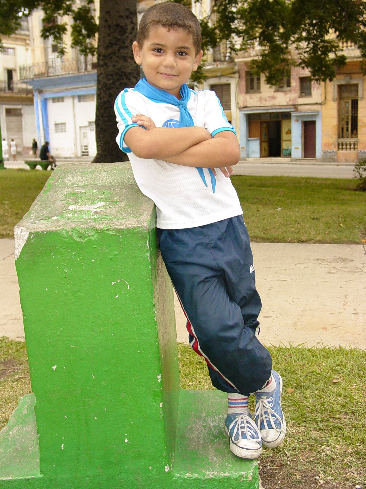

# Social Emotional Development in Early Childhood

<style>
div.solid {
border: 5px solid #FFA500;
border-radius: 5px;
padding: 20px;
}
</style>

<div class = "solid">

After reading this chapter, you should be able to:

1. Describe how preschoolers view themselves.

2. Summarize Erikson’s stage of initiative versus guilt.

3. Discuss the progression of social emotional development during early childhood.

4. Explain how children develop their understanding of gender.

5. Compare and contrast different styles of parenting.

6. Define characteristics of high quality child care.

7. Discuss the role of siblings and peers.

8. Describe the types of play.

9. Summarize the influence on social and emotional competence.

10. Identify the effects of stress on three- to five-year olds.


In early childhood, children’s understanding of themselves and their role in the world expands greatly.

</div>
<br/>

## Social and Emotional Milestones

That expanding understanding of themselves and others develops with age. Here is a table of social and emotional milestones that children typically experience during early childhood. 

```{r include=F}

table_09_01 <- read_csv("tables/table-09-01.csv")

```


```{r table-9-1}

table_09_01 %>% 
        kable(caption = "Social and Emotional Milestones^[[Developmental Milestones](https://www.cdc.gov/ncbddd/actearly/milestones/index.html) by the [CDC](https://www.cdc.gov/) is in the public domain]") %>% 
        column_spec(1, background = "white") %>%
        collapse_rows(columns = 1, valign = "top")


```

Many things influence how children develop those milestones as how they view themselves and how they interact with those around them changes. Let’s look more at these.

## Interactionism and Views of Self 

Early childhood is a time of forming an initial sense of self. A **self-concept** or idea of who we are, what we are capable of doing, and how we think and feel is a social process that involves taking into consideration how others view us. So, in order to develop a sense of self, you must have interaction with others. Interactionist theorists, Cooley and Mead offer two interesting explanations of how a sense of self develops. 

### Cooley

Charles Horton Cooley (1964) suggests that our self-concept comes from looking at how others respond to us. This process, known as the **looking-glass self** involves looking at how others seem to view us and interpreting this as we make judgments about whether we are good or bad, strong or weak, beautiful or ugly, and so on. Of course, we do not always interpret their responses accurately so our self-concept is not simply a mirror reflection of the views of others. After forming an initial self-concept, we may use it as a mental filter screening out those responses that do not seem to fit our ideas of who we are. Some compliments may be negated, for example. The process of the looking-glass self is pronounced when we are preschoolers, or perhaps when we are in a new school or job or are taking on a new role in our personal lives and are trying to gauge our own performances. When we feel more sure of who we are, we focus less on how we appear to others.^[[Children’s Development](https://docs.google.com/document/d/1k1xtrXy6j9_NAqZdGv8nBn_I6-lDtEgEFf7skHjvE-Y/edit) by Ana R. Leon is licensed under [CC BY 4.0](http://opencourselibrary.org/econ-201/)]


```{r fig-9-1, out.width="50%", fig.cap="A child looking at herself wearing glasses in a mirror.^[[Image](https://pxhere.com/en/photo/1522835) is in the public domain]"}

knitr::include_graphics("https://c.pxhere.com/photos/84/3d/adult_baby_beautiful_child_cute_daylight_fun_girl-1522835.jpg!d")

```

### Mead

Herbert Mead (1967) offers an explanation of how we develop a social sense of self by being able to see ourselves through the eyes of others. There are two parts of the self: the “I” which is the part of the self that is spontaneous, creative, innate, and is not concerned with how others view us and the “me” or the social definition of who we are. 

When we are born, we are all “I” and act without concern about how others view us. But the socialized self begins when we are able to consider how one important person views us. This initial stage is called “taking the role of the significant other”. For example, a child may pull a cat’s tail and be told by his mother, “No! Don’t do that, that’s bad” while receiving a slight slap on the hand. Later, the child may mimic the same behavior toward the self and say aloud, “No, that’s bad” while patting his own hand. What has happened? The child is able to see himself through the eyes of the mother. As the child grows and is exposed to many situations and rules of culture, he begins to view the self in the eyes of many others through these cultural norms or rules. This is referred to as “taking the role of the generalized other” and results in a sense of self with many dimensions. The child comes to have a sense of self as student, as friend, as son, and so on. 

### Exaggerated Sense of Self

One of the ways to gain a clearer sense of self is to exaggerate those qualities that are to be incorporated into the self. Preschoolers often like to exaggerate their own qualities or to seek validation as the biggest, smartest, or child who can jump the highest. This exaggeration tends to be replaced by a more realistic sense of self in middle childhood. 

### Self-Esteem 

Early childhood is a time of forming an initial sense of self. **Self-concept** is our self-description according to various categories, such as our external and internal qualities. In contrast, **self- esteem** is an evaluative judgment about who we are. The emergence of cognitive skills in this age group results in improved perceptions of the self, but they tend to focus on external qualities, which are referred to as the **categorical self**. When researchers ask young children to describe themselves, their descriptions tend to include physical descriptors, preferred activities, and favorite possessions. Thus, the **self-description** of a 3-year-old might be a 3-year-old girl with red hair, who likes to play with blocks. However, even children as young as three know there is more to themselves than these external characteristics. 

Harter and Pike (1984) challenged the method of measuring personality with an open-ended question as they felt that language limitations were hindering the ability of young children to express their self-knowledge. They suggested a change to the method of measuring self-concept in young children, whereby researchers provide statements that ask whether something is true of the child (e.g., “I like to boss people around”, “I am grumpy most of the time”). They discovered that in early childhood, children answer these statements in an internally consistent manner, especially after the age of four (Goodvin, Meyer, Thompson & Hayes, 2008) and often give similar responses to what others (parents and teachers) say about the child (Brown, Mangelsdorf, Agathen, & Ho, 2008; Colwell & Lindsey, 2003). 

 
```{r fig-9-2, out.width="50%", fig.cap="Young children don’t always feel good about themselves.^[[Image](https://pixabay.com/photos/boy-looking-fence-chain-link-young-529065/) is licensed under [CC0](https://pixabay.com/en/service/terms/#usage)]"}

knitr::include_graphics("https://cdn.pixabay.com/photo/2014/11/13/06/10/boy-529065_960_720.jpg")

```

Young children tend to have a generally positive self-image. This optimism is often the result of a lack of social comparison when making self-evaluations (Ruble, Boggiano, Feldman, & Loeble, 1980), and with comparison between what the child once could do to what they can do now (Kemple, 1995). However, this does not mean that preschool children are exempt from negative self-evaluations. Preschool children with insecure attachments to their caregivers tend to have lower self-esteem at age four (Goodvin et al., 2008). Maternal negative affect (emotional state) was also found by Goodwin and her colleagues to produce more negative self-evaluations in preschool children. 

### Self-Control 

Self-control is not a single phenomenon, but is multi-facetted. It includes **response initiation**, the ability to not initiate a behavior before you have evaluated all of the information, **response inhibition**, the ability to stop a behavior that has already begun, and **delayed gratification**, the ability to hold out for a larger reward by forgoing a smaller immediate reward (Dougherty, Marsh, Mathias, & Swann, 2005). It is in early childhood that we see the start of self-control, a process that takes many years to fully develop. In the now classic “Marshmallow Test” (Mischel, Ebbesen, & Zeiss, 1972) children are confronted with the choice of a small immediate reward (a marshmallow) and a larger delayed reward (more marshmallows). Walter Mischel and his colleagues over the years have found that the ability to delay gratification at the age of four predicted better academic performance and health later in life (Mischel, et al., 2011). Self- control is related to executive function, discussed earlier in the chapter. As executive function improves, children become less impulsive (Traverso, Viterbori, & Usai, 2015). ^[[Lifespan Development: A Psychological Perspective](http://dept.clcillinois.edu/psy/LifespanDevelopment.pdf) by Martha Lally and Suzanne Valentine-French is licensed under [CC BY-NC-SA 3.0](https://creativecommons.org/licenses/by-nc-sa/3.0/)]


<style>
div.blue {background-color:#e6f0ff; border-radius: 5px; padding: 20px;}
</style>
<div class = "blue">

#### Self-Control and Play {-}

Thanks to the new Centre for Research on Play in Education, Development and Learning (PEDaL), Whitebread, Baker, Gibson and a team of researchers hope to provide evidence on the role played by play in how a child develops.

“A strong possibility is that play supports the early development of children’s self-control,” explains Baker. “These are our abilities to develop awareness of our own thinking processes – they influence how effectively we go about undertaking challenging activities.”

In a study carried out by Baker with toddlers and young preschoolers, she found that children with greater self-control solved problems quicker when exploring an unfamiliar set-up requiring scientific reasoning, regardless of their IQ. “This sort of evidence makes us think that giving children the chance to play will make them more successful and creative problem-solvers in the long run.”

If playful experiences do facilitate this aspect of development, say the researchers, it could be extremely significant for educational practices because the ability to self-regulate has been shown to be a key predictor of academic performance.

Gibson adds: “Playful behavior is also an important indicator of healthy social and emotional development. In my previous research, I investigated how observing children at play can give us important clues about their well being and can even be useful in the diagnosis of neurodevelopmental disorders like autism.”^[[Play’s the Thing](https://www.cam.ac.uk/research/features/plays-the-thing) by the [University of Cambridge](https://www.cam.ac.uk/) is licensed under [CC BY 4.0](http://creativecommons.org/licenses/by/4.0/)]

</div>

## Erikson: Initiative vs. Guilt

Psychologist Erik Erikson argues that children in early childhood go through a stage of “initiative vs. guilt”. If the child is placed in an environment where he/she can explore, make decisions, and initiate activities, they have achieved initiative. On the other hand, if the child is put in an environment where initiation is repressed through criticism and control, he/she will develop a sense of guilt.

 
```{r fig-9-3, out.width="50%", fig.cap="Children playing in the sand.^[[Image](https://commons.wikimedia.org/wiki/File:Nice_sweet_children_playing_in_sand.jpg) is in the public domain]"}

knitr::include_graphics("https://upload.wikimedia.org/wikipedia/commons/thumb/1/1a/Nice_sweet_children_playing_in_sand.jpg/800px-Nice_sweet_children_playing_in_sand.jpg")

```

The trust and autonomy of previous stages develop into a desire to take initiative or to think of ideas and initiative action. Children may want to build a fort with the cushions from the living room couch or open a lemonade stand in the driveway or make a zoo with their stuffed animals and issue tickets to those who want to come. Or they may just want to get themselves ready for bed without any assistance. To reinforce taking initiative, caregivers should offer praise for the child’s efforts and avoid being critical of messes or mistakes. Soggy washrags and toothpaste left in the sink pales in comparison to the smiling face of a five-year-old that emerges from the bathroom with clean teeth and pajamas!^[[Children’s Development](https://docs.google.com/document/d/1k1xtrXy6j9_NAqZdGv8nBn_I6-lDtEgEFf7skHjvE-Y/edit) by Ana R. Leon is licensed under [CC BY 4.0](http://opencourselibrary.org/econ-201/) (modified by Antoinette Ricardo)]


## Gender Identity, Gender Constancy, and Gender Roles 

Another important dimension of the self is the sense of self as male or female. Preschool-aged children become increasingly interested in finding out the differences between boys and girls both physically and in terms of what activities are acceptable for each. While 2 year olds can identify some differences and learn whether they are boys or girls, preschoolers become more interested in what it means to be male or female. This self-identification or **gender identity** is followed sometime later with **gender constancy** or the knowledge that gender does not change. **Gender roles** or the rights and expectations that are associated with being male or female are learned throughout childhood and into adulthood.

### Freud and the Phallic Stage

Freud believed that masculinity and femininity were learned during the phallic stage of psychosexual development. According to Freud, during the phallic stage, the child develops an attraction to the opposite-sex parent but after recognizing that that they cannot actually be romantically involved with that parent, the child learns to model their own behavior after the same-sex parent. The child develops his or her own sense of masculinity or femininity from this resolution. And, according to Freud, a person who does not exhibit gender appropriate behavior, such as a woman who competes with men for jobs or a man who lacks self-assurance and dominance, has not successfully completed this stage of development. Consequently, such a person continues to struggle with his or her own gender identity.

### Chodorow and Mothering

Chodorow, a Neo-Freudian, believed that mothering promotes gender stereotypic behavior. Mothers push their sons away too soon and direct their attention toward problem-solving and independence. As a result, sons grow up confident in their own abilities but uncomfortable with intimacy. Girls are kept dependent too long and are given unnecessary and even unwelcome assistance from their mothers. Girls learn to underestimate their abilities and lack assertiveness, but feel comfortable with intimacy.

 
```{r fig-9-4, out.width="50%", fig.cap="A boy showing independence and confidence.^[[Image](https://www.flickr.com/photos/adam_jones/3794427266) by [Adam Jones](https://www.flickr.com/photos/adam_jones/) is licensed under [CC BY-SA 2.0](https://creativecommons.org/licenses/by-sa/2.0/)]"}



```

```{r fig-9-5, out.width="50%", fig.cap="A girl showing dependence and comfort within a relationship.^[[Image](https://pixabay.com/photos/mom-daughter-woman-girl-lady-kid-863052/) by [Free-Photos](https://pixabay.com/en/users/Free-Photos-242387/) on [Pixabay](https://pixabay.com/)]"}

knitr::include_graphics("https://cdn.pixabay.com/photo/2015/07/27/18/52/mom-863052_960_720.jpg")

```

Both of these models assume that early childhood experiences result in lifelong gender self-concepts. However, gender socialization is a process that continues throughout life. Children, teens, and adults refine and can modify their sense of self based on gender.

### Learning through Reinforcement and Modeling

Learning theorists suggest that gender role socialization is a result of the ways in which parents, teachers, friends, schools, religious institutions, media and others send messages about what is acceptable or desirable behavior as males or females. This socialization begins early-in fact, it may even begin the moment a parent learns that a child is on the way. Knowing the sex of the child can conjure up images of the child’s behavior, appearance, and potential on the part of a parent. And this stereotyping continues to guide perception through life. Consider parents of newborns, shown a 7 pound, 20 inch baby, wrapped in blue (a color designating males) describe the child as tough, strong, and angry when crying. Shown the same infant in pink (a color used in the United States for baby girls), these parents are likely to describe the baby as pretty, delicate, and frustrated when crying. (Maccoby & Jacklin, 1987). Female infants are held more, talked to more frequently and given direct eye contact, while male infants play is often mediated through a toy or activity.

Sons are given tasks that take them outside the house and that have to be performed only on occasion while girls are more likely to be given chores inside the home such as cleaning or cooking that is performed daily. Sons are encouraged to think for themselves when they encounter problems and daughters are more likely to be given assistance even when they are working on an answer. This impatience is reflected in teachers waiting less time when asking a female student for an answer than when asking for a reply from a male student (Sadker and Sadker, 1994). Girls are given the message from teachers that they must try harder and endure in order to succeed while boys’ successes are attributed to their intelligence. Of course, the stereotypes of advisors can also influence which kinds of courses or vocational choices girls and boys are encouraged to make.

Friends discuss what is acceptable for boys and girls and popularity may be based on modeling what is considered ideal behavior or looks for the sexes. Girls tend to tell one another secrets to validate others as best friends while boys compete for position by emphasizing their knowledge, strength or accomplishments. This focus on accomplishments can even give rise to exaggerating accomplishments in boys, but girls are discouraged from showing off and may learn to minimize their accomplishments as a result.

Gender messages abound in our environment. But does this mean that each of us receives and interprets these messages in the same way? Probably not. In addition to being recipients of these cultural expectations, we are individuals who also modify these roles (Kimmel, 2008). Based on what young children learn about gender from parents, peers, and those who they observe in society, children develop their own conceptions of the attributes associated with maleness or femaleness which is referred to as **gender schemas**. 

How much does gender matter? In the United States, gender differences are found in school experiences (even into college and professional school, girls are less vocal in the classrooms and much more at risk for sexual harassment from teachers, coaches, classmates, and professors), in social interactions and in media messages. The **stereotypes** that boys should be strong, forceful, active, dominant, and rational and that girls should be pretty, subordinate, unintelligent, emotional, and gabby are portrayed in children’s toys, books, commercials, video games, movies, television shows and music. 

 
```{r fig-9-6, out.width="50%", fig.cap="Store shelves filled with pink and purple colors and girls’ toys.^[[Image](https://www.flickr.com/photos/janetmck/6826070922) by [Janet McKnight](https://www.flickr.com/photos/janetmck/) is licensed under [CC BY 2.0](https://creativecommons.org/licenses/by/2.0/)]"}


```

```{r fig-9-7, out.width="50%", fig.cap="Store shelves filled with primary colors and boys’ toys.^[[Image](https://www.flickr.com/photos/janetmck/6826071252/in/photostream/) by [Janet McKnight](https://www.flickr.com/photos/janetmck/) is licensed under [CC BY 2.0](https://creativecommons.org/licenses/by/2.0/)]"}


```

In adulthood, these differences are reflected in income gaps between men and women where women working full-time earn about 74 percent the income of men, in higher rates of women suffering rape and domestic violence, higher rates of eating disorders for females, and in higher rates of violent death for men in young adulthood. Each of these differences will be explored further in subsequent chapters.^[[Lifespan Development - Module 5: Early Childhood](https://courses.lumenlearning.com/lifespandevelopment2/chapter/module/) by [Lumen Learning](http://opencourselibrary.org/econ-201/) references [Psyc 200 Lifespan Psychology](http://opencourselibrary.org/econ-201/) by Laura Overstreet, licensed under [CC BY 4.0](https://creativecommons.org/licenses/by/4.0/); [Lifespan Development: A Psychological Perspective](http://dept.clcillinois.edu/psy/LifespanDevelopment.pdf) by Martha Lally and Suzanne Valentine-French is licensed under [CC BY-NC-SA 3.0](https://creativecommons.org/licenses/by-nc-sa/3.0/)]


### Gender Dysphoria

A growing body of research is now focused on Gender Dysphoria, or the distress accompanying a mismatch between one’s gender identity and biological sex (American Psychiatric Association, 2013). Although prevalence rates are low, at approximately 0.3 percent of the United States population (Russo, 2016), children who later identified as transgender, often stated that they were the opposite gender as soon as they began talking. Comments such as stating they prefer the toys, clothing and anatomy of the opposite sex, while rejecting the toys, clothing, and anatomy of their assigned sex are criteria for a diagnosis of Gender Dysphoria in children. Certainly, many young children do not conform to the gender roles modeled by the culture and even push back against assigned roles. However, they do not experience discomfort regarding their gender identity and would not be identified with Gender Dysphoria. A more comprehensive description of Gender Dysphoria, including current treatments, will be discussed in the chapter on adolescence.^[[Lifespan Development: A Psychological Perspective](http://dept.clcillinois.edu/psy/LifespanDevelopment.pdf) by Martha Lally and Suzanne Valentine-French is licensed under [CC BY-NC-SA 3.0](https://creativecommons.org/licenses/by-nc-sa/3.0/)]


## Family Life

Relationships between parents and children continue to play a significant role in children’s development during early childhood. We will explore two models of parenting styles.  Keep in mind that most parents do not follow any model completely. Real people tend to fall somewhere in between these styles. And sometimes parenting styles change from one child to the next or in times when the parent has more or less time and energy for parenting. Parenting styles can also be affected by concerns the parent has in other areas of his or her life. For example, parenting styles tend to become more authoritarian when parents are tired and perhaps more authoritative when they are more energetic. Sometimes parents seem to change their parenting approach when others are around, maybe because they become more self-conscious as parents or are concerned with giving others the impression that they are a “tough” parent or an “easy-going” parent. And of course, parenting styles may reflect the type of parenting someone saw modeled while growing up.

```{r fig-9-8, out.width="50%", fig.cap="A family playing outside together.^[[Image](https://www.airforcemedicine.af.mil/MTF/Buckley/News-Events/Article/1010224/premature-twin-miracles-refuse-to-accept-medical-odds/) by [Air Force Medical Service](https://www.airforcemedicine.af.mil/) is in the public domain]"}

# knitr::include_graphics("")

```

### Baumrind

Baumrind (1971) offers a model of parenting that includes four styles. The first, **authoritarian**, is the traditional model of parenting in which parents make the rules and children are expected to be obedient. Baumrind suggests that authoritarian parents tend to place maturity demands on their children that are unreasonably high and tend to be aloof and distant. Consequently, children reared in this way may fear rather than respect their parents and, because their parents do not allow discussion, may take out their frustrations on safer targets-perhaps as bullies toward peers.

**Permissive parenting** involves holding expectations of children that are below what could be reasonably expected from them. Children are allowed to make their own rules and determine their own activities. Parents are warm and communicative, but provide little structure for their children. Children fail to learn self-discipline and may feel somewhat insecure because they do not know the limits.

**Authoritative parenting** involves being appropriately strict, reasonable, and affectionate. Parents allow negotiation where appropriate and discipline matches the severity of the offense. A popular parenting program that is offered in many school districts is called “Love and Logic” and reflects the authoritative or democratic style of parenting just described. 

**Uninvolved parents** (also referred to as rejecting/neglecting) are disengaged from their children.  They do not make demands on their children and are non-responsive.  These children can suffer in school and in their relationships with their peers (Gecas & Self, 1991).

### Lemasters and Defrain

Lemasters and Defrain (1989) offer another model of parenting. This model is interesting because it looks more closely at the motivations of the parent and suggests that parenting styles are often designed to meet the psychological needs of the parent rather than the developmental needs of the child. 

The **martyr** is a parent who will do anything for the child; even tasks that the child should do for himself or herself. All of the good deeds performed for the child, in the name of being a “good parent”, may be used later should the parent want to gain compliance from the child. If a child goes against the parent’s wishes, the parent can remind the child of all of the times the parent helped the child and evoke a feeling of guilt so that the child will do what the parent wants. The child learns to be dependent and manipulative as a result. 

The **pal** is like the permissive parent described previously in Baumrind’s model. The pal wants to be the child’s friend. Perhaps the parent is lonely or perhaps the parent is trying to win a popularity contest against an ex-spouse. Pals let children do what they want and focus mostly on being entertaining and fun and set few limitations. Consequently, the child may have little self-discipline and may try to test limits with others.

The **police officer/drill sergeant** style of parenting is similar to the authoritarian parent described by Baumrind. The parent focuses primarily on making sure that the child is obedient and that the parent has full control of the child. Sometimes this can be taken to extreme by giving the child tasks that are really designed to check on their level of obedience. For example, the parent may require that the child fold the clothes and place items back in the drawer in a particular way. If not, the child might be scolded or punished for not doing things “right”. This type of parent has a very difficult time allowing the child to grow and learn to make decisions independently. And the child may have a lot of resentment toward the parent that is displaced on others.

The **teacher-counselor** parent is one who pays a lot of attention to expert advice on parenting and who believes that as long as all of the steps are followed, the parent can rear a perfect child. “What’s wrong with that?” you might ask. There are two major problems with this approach. First, the parent is taking all of the responsibility for the child’s behavior-at least indirectly. If the child has difficulty, the parent feels responsible and thinks that the solution lies in reading more advice and trying more diligently to follow that advice. 

Parents can certainly influence children, but thinking that the parent is fully responsible for the child’s outcome is misguided. A parent can only do so much and can never have full control over the child. Another problem with this approach is that the child may get an unrealistic sense of the world and what can be expected from others. For example, if a teacher-counselor parent decides to help the child build self-esteem and has read that telling the child how special he or she is or how important it is to compliment the child on a job well done, the parent may convey the message that everything the child does is exceptional or extraordinary. A child may come to expect that all of his efforts warrant praise and in the real world, this is not something one can expect. Perhaps children get more of a sense of pride from assessing their own performance than from having others praise their efforts.

 
```{r fig-9-9, out.width="50%", fig.cap="A father interacting with his son who is drawing a picture. He could be portraying the style of teacher-counselor or athletic coach^[[Image](https://www.afcent.af.mil/News/Article/220433/tc-manas-helps-nadjeshda-support-disabled-children/) by [U.S. Air Forces Central Command](https://www.afcent.af.mil/) is in the public domain]"}

knitr::include_graphics("https://media.defense.gov/2010/Apr/28/2000369753/780/780/0/100427-F-5608V-019.JPG")

```

So what is left? Lemasters and Defrain (1989) suggest that the **athletic coach** style of parenting is best. Before you draw conclusions here, set aside any negative experiences you may have had with coaches in the past. The principles of coaching are what are important to Lemasters and Defrain. A coach helps players form strategies, supports their efforts, gives feedback on what went right and what went wrong, and stands at the sideline while the players perform. Coaches and referees make sure that the rules of the game are followed and that all players adhere to those rules. Similarly, the athletic coach as parent helps the child understand what needs to happen in certain situations whether in friendships, school, or home life, and encourages and advises the child about how to manage these situations. The parent does not intervene or do things for the child. Their role is to provide guidance while the child learns firsthand how to handle these situations. And the rules for behavior are consistent and objective and presented in that way. So, a child who is late for dinner might hear the parent respond in this way, “Dinner was at six o’clock.” Rather than, “You know good and well that we always eat at six. If you expect me to get up and make something for you now, you have got another thing coming! Just who do you think you are showing up late and looking for food? You’re grounded until further notice!”

The most important thing to remember about parenting is that you can be a better, more objective parent when you are directing your actions toward the child’s needs and while considering what they can reasonably be expected to do at their stage of development. Parenting is more difficult when you are tired and have psychological needs that interfere with the relationship. Some of the best advice for parents is to try not to take the child’s actions personally and be as objective as possible.

### Cultural Influences on Parenting Styles

The impact of class and culture cannot be ignored when examining parenting styles. The two models of parenting described above assume that authoritative and athletic coaching styles are best because they are designed to help the parent raise a child who is independent, self-reliant and responsible. These are qualities favored in “individualistic” cultures such as the United States, particularly by the white middle class. African-American, Hispanic and Asian parents tend to be more authoritarian than non-Hispanic whites. 

 
```{r fig-9-10, out.width="50%", fig.cap="A family from a collectivistic culture.^[[Image](https://commons.wikimedia.org/wiki/File:Family_eating_a_meal_(1).jpg) by the [National Cancer Institute](https://en.wikipedia.org/wiki/National_Cancer_Institute) is in the public domain]"}

knitr::include_graphics("https://upload.wikimedia.org/wikipedia/commons/a/a2/Family_eating_a_meal_%281%29.jpg")

```

In “collectivistic” cultures such as China or Korea, being obedient and compliant are favored behaviors. Authoritarian parenting has been used historically and reflects cultural need for children to do as they are told. In societies where family members’ cooperation is necessary for survival, as in the case of raising crops, rearing children who are independent and who strive to be on their own makes no sense. But in an economy based on being mobile in order to find jobs and where one’s earnings are based on education, raising a child to be independent is very important.

Working class parents are more likely than middle class parents to focus on obedience and honesty when raising their children. In a classic study on social class and parenting styles called Class and Conformity, Kohn (1977) explains that parents tend to emphasize qualities that are needed for their own survival when parenting their children. Working class parents are rewarded for being obedient, reliable, and honest in their jobs. They are not paid to be independent or to question the management; rather, they move up and are considered good employees if they show up on time, do their work as they are told, and can be counted on by their employers. Consequently, these parents reward honesty and obedience in their children. 

Middle class parents who work as professionals are rewarded for taking initiative, being self-directed, and assertive in their jobs. They are required to get the job done without being told exactly what to do. They are asked to be innovative and to work independently. These parents encourage their children to have those qualities as well by rewarding independence and self-reliance. Parenting styles can reflect many elements of culture.^[[Lifespan Development - Module 5: Early Childhood](https://courses.lumenlearning.com/lifespandevelopment2/chapter/module/) by [Lumen Learning](http://opencourselibrary.org/econ-201/) references [Psyc 200 Lifespan Psychology](http://opencourselibrary.org/econ-201/) by Laura Overstreet, licensed under [CC BY 4.0](https://creativecommons.org/licenses/by/4.0/)]


<style>
div.blue { background-color:#e6f0ff; border-radius: 5px; padding: 20px;}</style>
<div class = "blue">

#### Spanking
Many adults can remember being spanked as a child. This method of discipline continues to be endorsed by the majority of parents (Smith, 2012). Just how effective is spanking, however, and are there any negative consequences? After reviewing the research, Smith (2012) states “many studies have shown that physical punishment, including spanking, hitting and other means of causing pain, can lead to increased aggression, antisocial behavior, physical injury and mental health problems for children” (p. 60). 

 
```{r fig-9-11, out.width="50%", fig.cap="A boy crying.^[[Image](https://www.pexels.com/photo/boy-child-crying-iraq-39815/) on [Pexels](https://www.pexels.com/)]"}

knitr::include_graphics("https://images.pexels.com/photos/39815/child-crying-kid-boy-39815.jpeg?auto=compress&cs=tinysrgb&dpr=2&h=650&w=940")

```

Gershoff, (2008) reviewed decades of research and recommended that parents and caregivers make every effort to avoid physical punishment and called for the banning of physical discipline in all U.S. schools. Gershoff and Grogan-Kaylor (2016) completed another metanalysis that looked at research over 160,927 children . They found increased risk for negative outcomes for children who are spanked and that effects of spanking were similar to that of physical abuse. 

In a longitudinal study that followed more than 1500 families from 20 U.S. cities, parents’ reports of spanking were assessed at ages three and five (MacKenzie, Nicklas, Waldfogel, & Brooks-Gunn, 2013). Measures of externalizing behavior (aggression and rule-breaking) and receptive vocabulary were assessed at age nine. 

Overall, 57% of mothers and 40% of fathers engaged in spanking when children were age 3, and 52% of mothers and 33% of fathers engaged in spanking at age 5. Maternal spanking at age 5, even at low levels, was associated with higher levels of aggression at age 9, even after an array of risks and earlier child behavior were controlled for. Father's high-frequency spanking at age 5 was associated with lower child receptive vocabulary scores at age 9. This study revealed the negative cognitive effects of spanking in addition to the increase in aggressive behavior. 

Internationally, physical discipline is increasingly being viewed as a violation of children’s human rights. Thirty countries have banned the use of physical punishment, and the United Nations Committee on the Rights of the Child (2014) called physical punishment “legalized violence against children” and advocated that physical punishment be eliminated in all settings. 

Alternatives to spanking are advocated by child development specialists and include: 

* Praising and modeling appropriate behavior 

* Providing time-outs for inappropriate behavior 

* Giving choices 

* Helping the child identify emotions and learning to calm down 

* Ignoring small annoyances 

* Withdrawing privileges 


</div>

### Changing Families in a Changing Society

The sociology of the family examines the family as an institution and a unit of socialization. Sociological studies of the family look at demographic characteristics of the family members: family size, age, ethnicity and gender of its members, social class of the family, the economic level and mobility of the family, professions of its members, and the education levels of the family members.

Currently, one of the biggest issues that sociologists study are the changing roles of family members. Often, each member is restricted by the gender roles of the traditional family. These roles, such as the father as the breadwinner and the mother as the homemaker, are declining. Now, the mother is often the supplementary provider while retaining the responsibilities of child rearing. In this scenario, females' role in the labor force is "compatible with the demands of the traditional family." Sociology studies the adaptation of males' role to caregiver as well as provider. The gender roles are increasingly interwoven.

#### Diverse Family Forms

A **single parent family** usually refers to a parent who has most of the day-to-day responsibilities in the raising of the child or children, who is not living with a spouse or partner, or who is not married. The dominant caregiver is the parent with whom the children reside the majority of the time. If the parents are separated or divorced, children live with their custodial parent and have visitation with their noncustodial parent. In western society in general, following separation a child will end up with the primary caregiver, usually the mother, and a secondary caregiver, usually the father. There is a growing community of single parent by choice families in which a family is built by a single adult (through foster care, adoption, donor gametes and embryos, and surrogacy).

```{r fig-9-12, out.width="50%", fig.cap="A single-parent family.^[[Image](http://www.publicdomainfiles.com/show_file.php?id=13520798416914) is in the public domain]"}

knitr::include_graphics("http://res.publicdomainfiles.com/pdf_view/43/13520798416914.jpg")

```

**Cohabitation** is an arrangement where two people who are not married live together in an intimate relationship, particularly an emotionally and/or sexually intimate one, on a long-term or permanent basis. Today, cohabitation is a common pattern among people in the Western world. More than two-thirds of married couples in the U.S. say that they lived together before getting married.

Gay and lesbian couples are categorized as **same-sex relationships**.^[[Children’s Development](https://docs.google.com/document/d/1k1xtrXy6j9_NAqZdGv8nBn_I6-lDtEgEFf7skHjvE-Y/edit) by Ana R. Leon is licensed under [CC BY 4.0](http://opencourselibrary.org/econ-201/)]
   After a Supreme Court ruling in 2015, all 50 states in the U.S. must recognize same-sex marriage, there are still some counties in several states that will not issue a marriage license to a same-sex couple.^[[Same-sex marriage](https://en.wikipedia.org/wiki/Same-sex_marriage) by [Wikipedia](https://en.wikipedia.org/wiki/Main_Page) is licensed under [CC BY SA 3.0](https://en.wikipedia.org/wiki/Wikipedia:Text_of_Creative_Commons_Attribution-ShareAlike_3.0_Unported_License)]

 
```{r fig-9-13, out.width="50%", fig.cap="A family with parents of the same sex.^[[Image](https://commons.wikimedia.org/wiki/File:Lesbian_family.jpg) by [Emily Walker](https://www.flickr.com/people/45889748@N00) is licensed under [CC BY-SA 2.0](https://creativecommons.org/licenses/by-sa/2.0/deed.en)]"}

knitr::include_graphics("https://upload.wikimedia.org/wikipedia/commons/thumb/9/9e/Lesbian_family.jpg/800px-Lesbian_family.jpg")

```

### Sibling Relationships

Siblings spend a considerable amount of time with each other and offer a unique relationship that is not found with same-age peers or with adults. Siblings play an important role in the development of social skills. Cooperative and pretend play interactions between younger and older siblings can teach empathy, sharing, and cooperation (Pike, Coldwell, & Dunn, 2005) as well as negotiation and conflict resolution (Abuhatoum & Howe, 2013). However, the quality of sibling relationships is often mediated by the quality of the parent-child relationship and the psychological adjustment of the child (Pike et al., 2005). For instance, more negative interactions between siblings have been reported in families where parents had poor patterns of communication with their children (Brody, Stoneman, & McCoy, 1994). Children who have emotional and behavioral problems are also more likely to have negative interactions with their siblings. However, the psychological adjustment of the child can sometimes be a reflection of the parent-child relationship. Thus, when examining the quality of sibling interactions, it is often difficult to tease out the separate effect of adjustment from the effect of the parent-child relationship. 

While parents want positive interactions between their children, conflicts are going to arise, and some confrontations can be the impetus for growth in children’s social and cognitive skills. The sources of conflict between siblings often depend on their respective ages. Dunn and Munn (1987) revealed that over half of all sibling conflicts in early childhood were disputes about property rights. By middle childhood this starts shifting toward control over social situations, such as what games to play, disagreements about facts or opinions, or rude behavior (Howe, Rinaldi, Jennings, & Petrakos, 2002). Researchers have also found that the strategies children use to deal with conflict change with age, but that this is also tempered by the nature of the conflict. 

Abuhatoum and Howe (2013) found that coercive strategies (e.g., threats) were preferred when the dispute centered on property rights, while reasoning was more likely to be used by older siblings and in disputes regarding control over the social situation. However, younger siblings also use reasoning, frequently bringing up the concern of legitimacy (e.g., “You’re not the boss”) when in conflict with an older sibling. This is a very common strategy used by younger siblings and is possibly an adaptive strategy in order for younger siblings to assert their autonomy (Abuhatoum & Howe, 2013). A number of researchers have found that children who can use non-coercive strategies are more likely to have a successful resolution, whereby a compromise is reached and neither child feels slighted (Ram & Ross, 2008; Abuhatoum & Howe, 2013). 

Not surprisingly, friendly relationships with siblings often lead to more positive interactions with peers. The reverse is also true. A child can also learn to get along with a sibling, with, as the song says “a little help from my friends” (Kramer & Gottman, 1992).^[[Lifespan Development: A Psychological Perspective](http://dept.clcillinois.edu/psy/LifespanDevelopment.pdf) by Martha Lally and Suzanne Valentine-French is licensed under [CC BY-NC-SA 3.0](https://creativecommons.org/licenses/by-nc-sa/3.0/)]


```{r fig-9-14, out.width="50%", fig.cap="Siblings.^[[Image](https://www.flickr.com/photos/16278399@N00/6802726188) by [LEONARDO DASILVA](https://www.flickr.com/photos/leonardodasilva/) is licensed under [CC BY 2.0](https://creativecommons.org/licenses/by/2.0/)]"}


```

### Child Care Concerns

About 77.3 percent of mothers of school-aged and 64.2 percent of mothers of preschool-aged children in the United States work outside the home (Cohen and Bianchi, 1999; Bureau of Labor Statistics, 2010). Seventy-five percent of children under age 5 are in scheduled childcare programs. Others are cared for by family members or friends. Older children are often in after school programs, before school programs, or stay at home alone after school once they are older.

Quality childcare programs can enhance a child’s social skills and can provide rich learning experiences. But long hours in poor quality care can have negative consequences, especially for young children. 

#### Quality of Care

What determines the quality of child care? One consideration is the **teacher/child ratio**. States specify the maximum number of children that can be supervised by one teacher. In general, the younger the children, the more teachers required for a given number of children. The lower the teacher to child ratio, the more time the teacher has for involvement with the children and the less stressed the teacher may be so that the interactions can be more relaxed, stimulating and positive.  Larger group sizes present challenges to quality as well. The program may be more rigid in rules and structure to accommodate the large number of children in the facility.

The **physical environment** should be engaging, clean, and safe. The **philosophy** of the organization and the **curriculum** available should be child-centered, positive, and stimulating. Providers should be trained in early childhood education. A majority of states do not require training for their childcare providers. And while formal education is not required for a person to provide a warm, loving relationship to a child, knowledge of a child’s development is useful for addressing their social, emotional, and cognitive needs in an effective way. 

 
```{r fig-9-15, out.width="50%", fig.cap="Children playing in a quality childcare environment.^[[Image](https://www.hurlburt.af.mil/News/Features/Display/Article/495550/hurlburt-cdc-teacher-inspires-children-for-29-years/) by [Hurlburt Field](https://www.hurlburt.af.mil/) is in the public domain]"}

knitr::include_graphics("https://media.defense.gov/2014/Jul/01/2000835765/780/780/0/140625-F-UN284-006.JPG")

```

By working toward improving the quality of childcare and increasing family-friendly workplace policies such as more flexible scheduling and perhaps childcare facilities at places of employment, we can accommodate families with smaller children and relieve parents of the stress sometimes associated with managing work and family life.^[[Lifespan Development - Module 5: Early Childhood](https://courses.lumenlearning.com/lifespandevelopment2/chapter/module/) by [Lumen Learning](http://opencourselibrary.org/econ-201/) references [Psyc 200 Lifespan Psychology](http://opencourselibrary.org/econ-201/) by Laura Overstreet, licensed under [CC BY 4.0](https://creativecommons.org/licenses/by/4.0/)]


## Peers

Relationships within the family (parent-child and siblings) are not the only significant relationships in a child’s life. Peer relationships are also important. Social interaction with another child who is similar in age, skills, and knowledge provokes the development of many social skills that are valuable for the rest of life (Bukowski, Buhrmester, & Underwood, 2011). In peer relationships, children learn how to initiate and maintain social interactions with other children. They learn skills for managing conflict, such as turn-taking, compromise, and bargaining. Play also involves the mutual, sometimes complex, coordination of goals, actions, and understanding. For example, as preschoolers engage in pretend play they create narratives together, choose roles, and collaborate to act out their stories. Through these experiences, children develop friendships that provide additional sources of security and support to those provided by their parents.


```{r fig-9-16, out.width="50%", fig.cap="Navigating dramatic play provides great opportunities to continue to develop social skills with same-age peers.^[[Image]() by [Seattle City Council](https://www.flickr.com/photos/seattlecitycouncil/) is in the public domain]"}

knitr::include_graphics("figures/figure-09-16.jpg")

```

However, peer relationships can be challenging as well as supportive (Rubin, Coplan, Chen, Bowker, & McDonald, 2011). Being accepted by other children is an important source of affirmation and self-esteem, but peer rejection can foreshadow later behavior problems (especially when children are rejected due to aggressive behavior).

Peer relationships require developing very different social and emotional skills than those that emerge in parent-child relationships. They also illustrate the many ways that peer relationships influence the growth of personality and self-concept.^[[Children’s Development](https://docs.google.com/document/d/1k1xtrXy6j9_NAqZdGv8nBn_I6-lDtEgEFf7skHjvE-Y/edit) by Ana R. Leon is licensed under [CC BY 4.0](http://opencourselibrary.org/econ-201/)]


## Play

Freud saw play as a means for children to release pent-up emotions and to deal with emotionally distressing situations in a more secure environment. Vygotsky and Piaget saw play as a way of children developing their intellectual abilities (Dyer & Moneta, 2006). Piaget created stages of play that correspond with his stages of cognitive development. The stages are:

```{r include=F}

table_09_02 <- read_csv("tables/table-09-02.csv")

```


```{r table-9-2}

table_09_02 %>% 
        kable(caption = "Piaget’s Stages of Play^[Cognitive and Social Types of Play (n.d.). Retrieved from [https://groundsforplay.com/cognitive-and-social-forms-play](https://groundsforplay.com/cognitive-and-social-forms-play)]") %>% 
        column_spec(1, width = "15em") %>%
        collapse_rows(columns = 1, valign = "top")


```


While Freud, Piaget, and Vygostsky looked at play slightly differently, all three theorists saw play as providing positive outcomes for children. 

Mildred Parten (1932) observed two to five year-old children and noted six types of play. Three types she labeled as non-social (unoccupied, solitary, and onlooker) and three types were categorized as social play (parallel, associative, and cooperative). The table below describes each type of play. Younger children engage in non-social play more than those who are older; by age five associative and cooperative play are the most common forms of play (Dyer & Moneta, 2006).^[[Lifespan Development - Module 5: Early Childhood](https://courses.lumenlearning.com/lifespandevelopment2/chapter/module/) by [Lumen Learning](http://opencourselibrary.org/econ-201/) references [Psyc 200 Lifespan Psychology](http://opencourselibrary.org/econ-201/) by Laura Overstreet, licensed under [CC BY 4.0](https://creativecommons.org/licenses/by/4.0/)]


```{r include=F}

table_09_03 <- read_csv("tables/table-09-03.csv")

```


```{r table-9-3}

table_09_03 %>% 
        kable(caption = "Parten’s Classification of Types of Play^[[Lifespan Development - Module 5: Early Childhood](https://courses.lumenlearning.com/lifespandevelopment2/chapter/module/) by [Lumen Learning](http://opencourselibrary.org/econ-201/) references [Psyc 200 Lifespan Psychology](http://opencourselibrary.org/econ-201/) by Laura Overstreet, licensed under [CC BY 4.0](https://creativecommons.org/licenses/by/4.0/)]
") %>% 
        column_spec(1, width = "15em")

```

## Social Understanding 

As we have seen, children’s experience of relationships at home and the peer group contributes to an expanding repertoire of social and emotional skills and also to broadened social understanding. In these relationships, children develop expectations for specific people (leading, for example, to secure or insecure attachments to parents), understanding of how to interact with adults and peers, and developing self-concept based on how others respond to them. These relationships are also significant forums for emotional development.

Remarkably, young children begin developing social understanding very early in life. Before the end of the first year, infants are aware that other people have perceptions, feelings, and other mental states that affect their behavior, and which are different from the child’s own mental states. Carefully designed experimental studies show that by late in the preschool years, young children understand that another’s beliefs can be mistaken rather than correct, that memories can affect how you feel, and that one’s emotions can be hidden from others (Wellman, 2011). Social understanding grows significantly as children’s theory of mind develops.

How do these achievements in social understanding occur? One answer is that young children are remarkably sensitive observers of other people, making connections between their emotional expressions, words, and behavior to derive simple inferences about mental states (e.g., concluding, for example, that what Mommy is looking at is in her mind) (Gopnik, Meltzoff, & Kuhl, 2001). This is especially likely to occur in relationships with people whom the child knows well, consistent with the ideas of attachment theory discussed above. 

 
```{r fig-9-17, out.width="50%", fig.cap="A father speaking to his child.^[[Image](https://pxhere.com/en/photo/646363) is in the public domain]"}

knitr::include_graphics("https://c.pxhere.com/photos/70/a6/man_portrait_person_one_looking_season_naturally_warm-646363.jpg!d")

```

Growing language skills give young children words with which to represent these mental states (e.g., “mad,” “wants”) and talk about them with others. Thus in conversation with their parents about everyday experiences, children learn much about people’s mental states from how adults talk about them (“Your sister was sad because she thought Daddy was coming home.”) (Thompson, 2006b). 

Developing social understanding is based on children’s everyday interactions with others and their careful interpretations of what they see and hear. There are also some scientists who believe that infants are biologically prepared to perceive people in a special way, as organisms with an internal mental life, and this facilitates their interpretation of people’s behavior with reference to those mental states (Leslie, 1994).

## Personality in Early Childhood

Parents often scrutinize their child’s preferences, characteristics, and responses for clues of a developing personality. They are quite right to do so, because temperament is a foundation for personality growth. But temperament (defined as early-emerging differences in reactivity and self-regulation) is not the whole story. Although temperament is biologically based, it interacts with the influence of experience from the moment of birth (if not before) to shape personality (Rothbart, 2011). Temperamental dispositions are affected, for example, by the support level of parental care. More generally, personality is shaped by the goodness of fit between the child’s temperamental qualities and characteristics of the environment (Chess & Thomas, 1999). For example, an adventurous child whose parents regularly take her on weekend hiking and fishing trips would be a good “fit” to her lifestyle, supporting personality growth. Personality is the result, therefore, of the continuous interplay between biological disposition and experience, as is true for many other aspects of social and personality development.

Personality develops from temperament in other ways (Thompson, Winer, & Goodvin, 2010). As children mature biologically, temperamental characteristics emerge and change over time. A newborn is not capable of much self-control, but as brain-based capacities for self-control advance, temperamental changes in self-regulation become more apparent. So an infant that cries frequently doesn’t necessarily have a grumpy personality. With sufficient parental support and increased sense of security, the child may develop into a content preschooler that is not likely to cry to get her needs met.

 
```{r fig-9-18, out.width="50%", fig.cap="A girl enjoying nature.^[[Image](https://unsplash.com/photos/tBWmzPuQo3w) by [Khanh Steven](https://unsplash.com/@khanhkhanhlv) on [Unsplash](https://unsplash.com/)]"}

knitr::include_graphics("https://images.unsplash.com/photo-1513791149369-f88da26c8e93?ixlib=rb-1.2.1&ixid=eyJhcHBfaWQiOjEyMDd9&auto=format&fit=crop&w=334&q=80")

```

In addition, personality is made up of many other features besides temperament. Children’s developing self-concept, their motivations to achieve or to socialize, their values and goals, their coping styles, their sense of responsibility and conscientiousness, and many other qualities are encompassed into personality. These qualities are influenced by biological dispositions, but even more by the child’s experiences with others, particularly in close relationships, that guide the growth of individual characteristics.

Indeed, personality development begins with the biological foundations of temperament but becomes increasingly elaborated, extended, and refined over time. The newborn that parents observed in wonder upon becomes an adult with a personality of depth and nuance.

## Social and Emotional Competence

Social and personality development is built from the social, biological, and representational influences discussed above. These influences result in important developmental outcomes that matter to children, parents, and society: a young adult’s capacity to engage in socially constructive actions (helping, caring, sharing with others), to curb hostile or aggressive impulses, to live according to meaningful moral values, to develop a healthy identity and sense of self, and to develop talents and achieve success in using them. These are some of the developmental outcomes that denote social and emotional competence.

These achievements of social and personality development derive from the interaction of many social, biological, and representational influences. Consider, for example, the development of conscience, which is an early foundation for moral development. 

Conscience consists of the cognitive, emotional, and social influences that cause young children to create and act consistently with internal standards of conduct (Kochanska, 2002). It emerges from young children’s experiences with parents, particularly in the development of a mutually responsive relationship that motivates young children to respond constructively to the parents’ requests and expectations. Biologically based temperament is involved, as some children are temperamentally more capable of motivated self-regulation (a quality called effortful control) than are others, while some children are more prone to the fear and anxiety that parental disapproval can evoke. The development of conscience is influenced by having good fit between the child’s temperamental qualities and how parents communicate and reinforce behavioral expectations. 

Conscience development also expands as young children begin to represent moral values and think of themselves as moral beings. By the end of the preschool years, for example, young children develop a “moral self” by which they think of themselves as people who want to do the right thing, who feel badly after misbehaving, and who feel uncomfortable when others misbehave. In the development of conscience, young children become more socially and emotionally competent in a manner that provides a foundation for later moral conduct (Thompson, 2012).

 
```{r fig-9-19, out.width="50%", fig.cap="This child might be experiencing a guilty conscience.^[[Image](https://www.publicdomainpictures.net/en/view-image.php?image=22661&picture=sad-child) by George Hodan is in the public domain]"}

knitr::include_graphics("https://www.publicdomainpictures.net/pictures/30000/velka/sad-child.jpg")

```

## Childhood Stress and Development

What is the impact of stress on child development?  Children experience different types of stressors. Normal, everyday stress can provide an opportunity for young children to build coping skills and poses little risk to development.  Even more long-lasting stressful events such as changing schools or losing a loved one can be managed fairly well. But children who experience **toxic stress** or who live in extremely stressful situations of abuse over long periods of time can suffer long-lasting effects.  The structures in the midbrain or limbic system such as the hippocampus and amygdala can be vulnerable to prolonged stress during early childhood (Middlebrooks and Audage, 2008).  High levels of the stress hormone cortisol can reduce the size of the hippocampus and effect the child's memory abilities. Stress hormones can also reduce immunity to disease. The brain exposed to long periods of severe stress can develop a low threshold making the child hypersensitive to stress in the future.  However, the effects of stress can be minimized if the child has the support of caring adults. Let's take a look at childhood stressors.

### Effects of Domestic Abuse

3.3 million children witness domestic violence each year in the US. There has been an increase in acknowledgment that children exposed to domestic abuse during their upbringing will suffer in their developmental and psychological welfare. Because of the awareness of domestic violence that some children have to face, it also generally impacts how the child develops emotionally, socially, behaviorally as well as cognitively. Some emotional and behavioral problems that can result due to domestic violence include increased aggressiveness, anxiety, and changes in how a child socializes with friends, family, and authorities. Bruises, broken bones, head injuries, lacerations, and internal bleeding are some of the acute effects of a domestic violence incident that require medical attention and hospitalization.

### Child Maltreatment

Child abuse is the physical, sexual, or emotional mistreatment or neglect of a child or children. Different jurisdictions have developed their own definitions of what constitutes child abuse for the purposes of removing a child from his/her family and/or prosecuting a criminal charge. There are four major categories of child abuse: neglect, physical abuse, psychological/emotional abuse, and sexual abuse. Neglect is the most common type of abuse in the United States and accounts for over 60 percent of child abuse cases.

 
```{r fig-9-20, out.width="50%", fig.cap="A child hiding.^[[Image](https://www.jber.jb.mil/News/News-Articles/Article/290797/child-abuse-preventing-a-hidden-crime/) by [Joint Base Elmendorf-Richardson Alaska](https://www.jber.jb.mil/) is in the public domain]"}

knitr::include_graphics("https://media.defense.gov/2012/Apr/05/2000163555/780/780/0/120405-F-FC540-001.JPG")

```

#### Physical Abuse

Physical abuse involves physical aggression directed at a child by an adult. Most nations with child-abuse laws consider the deliberate infliction of serious injuries, or actions that place the child at obvious risk of serious injury or death, to be illegal. Beyond this, there is considerable variation. The distinction between child discipline and abuse is often poorly defined. Cultural norms about what constitutes abuse vary widely among professionals as well as the wider public. Some professionals claim that cultural norms that sanction physical punishment are one of the causes of child abuse, and have undertaken campaigns to redefine such norms.

#### Sexual Abuse

Child sexual abuse is a form of child abuse in which an adult or older adolescent abuses a child for sexual stimulation. Effects of child sexual abuse include guilt and self-blame, flashbacks, nightmares, insomnia, and fear of things associated with the abuse. Approximately 15 percent to 25 percent of women and 5 percent to 15 percent of men were sexually abused when they were children.

#### Emotional Abuse

Out of all the possible forms of abuse, emotional abuse is the hardest to define. It could include name-calling, ridicule, degradation, destruction of personal belongings, torture or killing of a pet, excessive criticism, inappropriate or excessive demands, withholding communication, and routine labeling or humiliation.

#### Neglect

Neglect is a passive form of abuse in which a perpetrator is responsible to provide care for a victim who is unable to care for himself or herself, but fails to provide adequate care. Neglect may include the failure to provide sufficient supervision, nourishment, or medical care, or the failure to fulfill other needs for which the victim is helpless to provide for himself or herself. The term is also applied when necessary care is withheld by those responsible for providing it from animals, plants, and even inanimate objects. Neglect can have many long-term side effects, such as physical injuries, low self-esteem, attention disorders, violent behavior, and even death. In the U.S., neglect is defined as the failure to meet the basic needs of children: housing, clothing, food, and access to medical care. Researchers found over 91,000 cases of neglect in one year using information from a database of cases verified by protective services agencies. 

<br/>

<style>
div.solid {
border: 5px solid #FFA500;
border-radius: 5px;
padding: 20px;
}
</style>

<div class = "solid">

In this chapter we covered,

* The development of self-concept and self-esteem.

* Erikson’s psychosocial stage of initiative versus guilt.

* Gender identity, gender constancy, gender roles, and gender dysphoria.

* Family life, including parenting styles, diverse forms of families, using child care, and the role of siblings.

* The role of peers.

* The types of play.

* The social understanding of preschoolers.

* Personality development

* Social and emotional competences.

* The effects of stress on children, including maltreatment.

In the next chapter we begin exploring middle childhood and how children from 6 to 11 grow and develop.

</div>

<br/>
