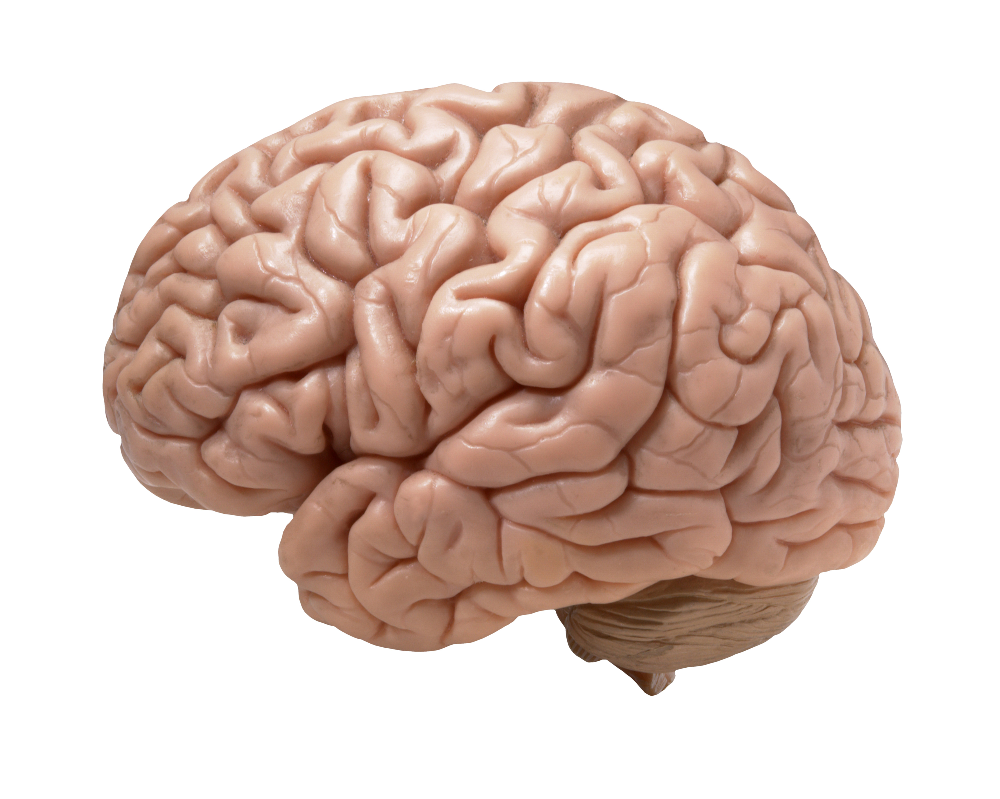
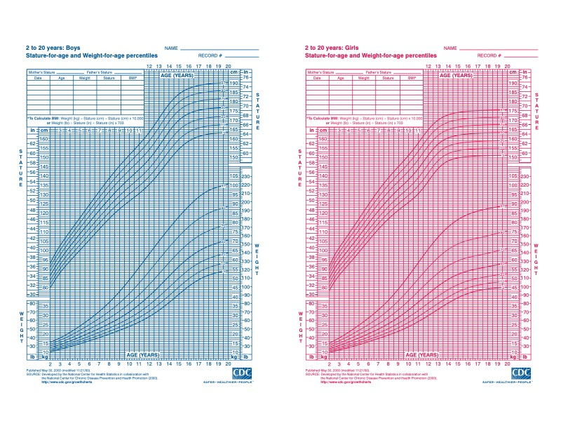
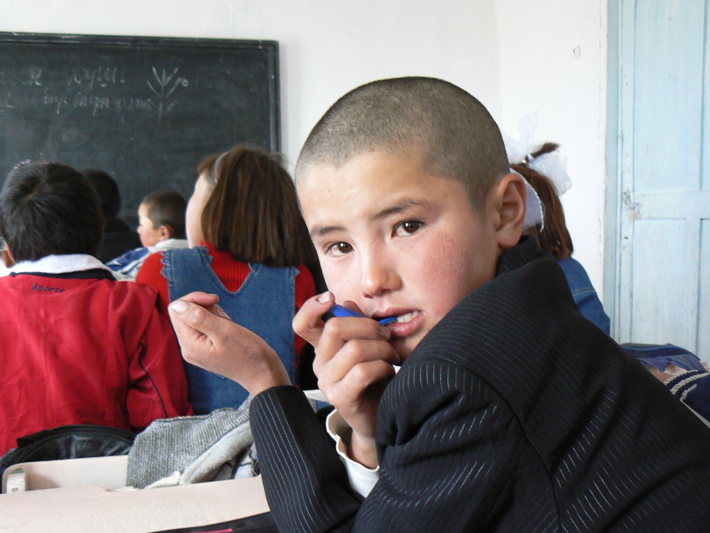
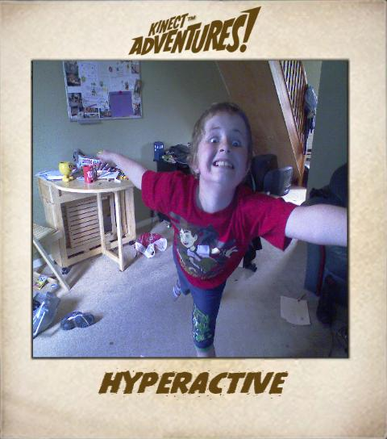

# Middle Childhood - Physical Development

<style>
div.solid {
border: 5px solid #FFA500;
border-radius: 5px;
padding: 20px;
}
</style>

<div class = "solid">

After this chapter, you should be able to:

1. Describe the patterns of physical growth 

2. Summarize nutrition needs

3. Explain the causes of obesity and the negative consequences of excessive weight gain

4. Discuss the pros and cons of organized sports

5. Compare and contrast developmental disorders

6. Summarize several different mental health disorders


Children in middle childhood go through tremendous changes in the growth and development of their brain.  During this period of development children’s bodies are not only growing, but they are becoming more coordinated and physically capable.  These children are more mindful of their greater abilities in school and are becoming more responsible for their health and diet.  Some children may be challenged with physical or mental health concerns. It’s important to know what typical development looks like in order to identify and to help those that are struggling with health concerns. 

</div>

<br/>

## Brain Development in Middle Childhood

The brain reaches its adult size at about age 7. Then between 10 and 12 years of age, the frontal lobes become more developed and improvements in logic, planning, and memory are evident (van der Molen & Molenaar, 1994). The school-aged child is better able to plan and coordinate activity using both the left and right hemispheres of the brain, which control the development of emotions, physical abilities, and intellectual capabilities. The attention span also improves as the prefrontal cortex matures. The myelin also continues to develop and the child's reaction time improves as well. Myelination improvement is one factor responsible for these growths. 

From age 6 to 12, the nerve cells in the association areas of the brain, that is those areas where sensory, motor, and intellectual functioning connect, become almost completely myelinated (Johnson, 2005). This myelination contributes to increases in information processing speed and the child’s reaction time. The **hippocampus**, which is responsible for transferring information from the short-term to long-term memory, also shows increases in myelination resulting in improvements in memory functioning (Rolls, 2000).

 
```{r fig-10-1, out.width="50%", fig.cap="The human brain.^[[Image](https://www.flickr.com/photos/flamephoenix1991/8376271918) by [_DJ_](https://www.flickr.com/photos/flamephoenix1991/8376271918) is licensed under [CC BY-SA 2.0](https://creativecommons.org/licenses/by-sa/2.0/)]"}



```

Changes in the brain during this age enable not only physical development, but also allow children to understand what others think of them and dealing socially with the positive and negative consequences of that.  Within this development period, children may struggle with mental health disorders or other health problems. As children are growing and becoming more capable, adults need to remember that children don’t grow physically in isolation. The development of their bodies isn't separate from the changes that are occurring socially, emotionally, and cognitively. Awareness and understanding of their other developmental domains and needs will support the child during these changes.^[[Children’s Development](https://docs.google.com/document/d/1k1xtrXy6j9_NAqZdGv8nBn_I6-lDtEgEFf7skHjvE-Y/edit) by Ana R. Leon is licensed under [CC BY 4.0](http://opencourselibrary.org/econ-201/) (modified by Dawn Rymond); [Lifespan Development: A Psychological Perspective](http://dept.clcillinois.edu/psy/LifespanDevelopment.pdf) by Martha Lally and Suzanne Valentine-French is licensed under [CC BY-NC-SA 3.0](https://creativecommons.org/licenses/by-nc-sa/3.0/)]


## Physical Growth in Middle Childhood

Middle childhood spans the years between early childhood and adolescence, children are approximately 6 to 11 years old.  These children come in all shapes and sizes: height, weight, abilities, and disabilities.  Physical growth rates are generally slow and steady during these years. However, growth spurts do occur during middle to late childhood (Spreen, Riser, & Edgell, 1995). Typically, a child will gain about 5-7 pounds a year and grow about 2 inches per year. They also tend to slim down and gain muscle strength. As bones lengthen and broaden and muscles strengthen, many children want to engage in strenuous physical activity and can participate for longer periods of time. In addition, the rate of growth for the extremities is faster than for the trunk, which results in more adult-like proportions. Long-bone growth stretches muscles and ligaments, which results in many children experiencing growing pains, at night, in particular.^[Polan EU, Taylor DR. Journey Across the LifeSpan: Human Development and Health Promotion. Philadelphia: F. A. Davis Company; 2003, 150–51]

Children between ages 6 and 9, show significant improvement in their abilities to perform motor skills. This development growth allows children to gain greater control over the movement of their bodies, mastering many gross and fine motor skills that were beyond that of the younger child. Riding a bike that is bigger or running longer and further is a big improvement in gross motor skills.  Eye-hand coordination and fine motor skills allow for children to become better at writing and cutting.  Sports and extracurricular activities may become a part of the lives of children during middle childhood due to their physical growth and capabilities. 

```{r fig-10-2, fig.cap="Stature for age and weight for age percentiles.^[[Images](https://www.cdc.gov/growthcharts/clinical_charts.htm#Set1) by the [CDC](https://www.cdc.gov/) is in the public domain]"}



```


## Nutritional Needs

A number of factors can influence children’s eating habits and attitudes toward food. Family environment, societal trends, taste preferences, and messages in the media all impact the emotions that children develop in relation to their diet. Television commercials can entice children to consume sugary products, fatty fast foods, excess calories, refined ingredients, and sodium. Therefore, it is critical that parents and caregivers direct children toward healthy choices.^[[Research on the Benefits of Family Meals.](https://www.co.dakota.mn.us/HealthFamily/HealthyLiving/DietNutrition/Documents/ReturnFamilyMeals.doc) Dakota County, Minnesota. . Updated April 30, 2012. Accessed December 4, 2017.]  

Parents greatly impact their child’s nutritional choices. This time in a child’s life provides an opportunity for parents and other caregivers to reinforce good eating habits and to introduce new foods into the diet, while remaining mindful of a child’s preferences. Parents should also serve as role models for their children, who will often mimic their behavior and eating habits. Parents must continue to help their school-aged child establish healthy eating habits and attitudes toward food. Their primary role is to bring a wide variety of health-promoting foods into the home, so that their children can make good choices.^[[Childhood](http://pressbooks-dev.oer.hawaii.edu/humannutrition/chapter/childhood/) by [University of Hawai’i at Mānoa Food Science and Human Nutrition Program](http://pressbooks-dev.oer.hawaii.edu/humannutrition/chapter/childhood/) is licensed under [CC BY-NC-SA 4.0](http://creativecommons.org/licenses/by-nc-sa/4.0/)]

Let’s think for a moment about what our parents and grandparents used to eat?  What are some of the differences that you may have experienced as a child?

One hundred years ago, as families sat down to dinner, they might have eaten boiled potatoes or corn, leafy vegetables such as cabbage or collards, fresh-baked bread, and, if they were fortunate, a small amount of beef or chicken. Young and old alike benefitted from a sound diet that packed a real nutritional punch. Times have changed. Many families today fill their dinner plates with fatty foods, such as French Fries cooked in vegetable oil, a hamburger that contains several ounces of ground beef, and a white-bread bun, with a single piece of lettuce and a slice or two of tomato as the only vegetables served with the meal.


```{r fig-10-3, out.width="50%",fig.cap="A modern meal.^[[Image](https://pxhere.com/en/photo/1386769) is licensed under [CC0](https://creativecommons.org/publicdomain/zero/1.0/)]"}

knitr::include_graphics("https://c.pxhere.com/photos/f8/cf/beef_burger_fries_yummy_delicious_dinner_tasty_cuisine-1386769.jpg!d")

```

Our diet has changed drastically as processed foods, which did not exist a century ago, and animal-based foods now account for a large percentage of our calories. Not only has what we eat changed, but the amount of it that we consume has greatly increased as well, as plates and portion sizes have grown much larger. All of these choices impact our health, with short- and long-term consequences as we age. Possible effects in the short-term include excess weight gain and constipation. The possible long-term effects, primarily related to obesity, include the risk of cardiovascular disease, diabetes, hypertension, as well as other health and emotional problems for children. Centers for Disease Control and Prevention. “Overweight and Obesity: Health Consequences.”^[[An Introduction to Nutrition](https://2012books.lardbucket.org/books/an-introduction-to-nutrition/s17-00-nutrition-through-the-life-cyc.html) by [Maureen Zimmerman and Beth Snow](https://2012books.lardbucket.org/books/an-introduction-to-nutrition/s01-about-the-authors.html) is licensed under [CC BY-NC-SA 3.0](http://creativecommons.org/licenses/by-nc-sa/3.0/)]

During middle childhood, a healthy diet facilitates physical and mental development and helps to maintain health and wellness. School-aged children experience steady, consistent growth, but at a slower rate than they did in early childhood. This slowed growth rate can have lasting a lasting impact if nutritional, caloric, and activity levels aren't adjusted in middle childhood which can lead to excessive weight gain early in life and can lead to obesity into adolescence and adulthood.^[[Childhood](http://pressbooks-dev.oer.hawaii.edu/humannutrition/chapter/childhood/) by [University of Hawai’i at Mānoa Food Science and Human Nutrition Program](http://pressbooks-dev.oer.hawaii.edu/humannutrition/chapter/childhood/) is licensed under [CC BY-NC-SA 4.0](http://creativecommons.org/licenses/by-nc-sa/4.0/) (modified by Dawn Rymond)]

Making sure that children have proper nutrients will allow for optimal growth and development.  Look at the figure below to familiarize yourself with food and the place setting for healthy meals.


```{r fig-10-4, out.width="50%",fig.cap="Nutrition guidelines from the USDA.^[[Image](https://www.choosemyplate.gov/browse-by-audience/view-all-audiences/children/kids) by the [USDA](https://www.usda.gov/) is in the public domain]"}

knitr::include_graphics("https://choosemyplate-prod.azureedge.net/sites/default/files/audiences/banner_KidsPage634wide.png")

```


One way to encourage children to eat healthy foods is to make meal and snack time fun and interesting. Parents should include children in food planning and preparation, for example selecting items while grocery shopping or helping to prepare part of a meal, such as making a salad. At this time, parents can also educate children about kitchen safety. It might be helpful to cut sandwiches, meats, or pancakes into small or interesting shapes. In addition, parents should offer nutritious desserts, such as fresh fruits, instead of calorie-laden cookies, cakes, salty snacks, and ice cream.  Studies show that children who eat family meals on a frequent basis consume more nutritious foods.^[[Research on the Benefits of Family Meals.](https://www.co.dakota.mn.us/HealthFamily/HealthyLiving/DietNutrition/Documents/ReturnFamilyMeals.doc) Dakota County, Minnesota. . Updated April 30, 2012. Accessed December 4, 2017.]

### Energy

Children’s energy needs vary, depending on their growth and level of physical activity. Energy requirements also vary according to gender. Girls require 1,200 to 1,400 calories a day from age 2 to 8 and 1,400-1,800 for age 9 to 13. Boys also need 1,200 to 1.400 calories daily from age 4 to 8 but their daily caloric needs go up to 1,600-2,000 from age 9 to 13. This range represents individual differences, including how active the child is.^[[Parent Tips – Calories Needed Each Day](https://www.nhlbi.nih.gov/health/educational/wecan/downloads/calreqtips.pdf) by the [NIH](https://www.nih.gov/) is in the public domain]

Recommended intakes of **macronutrients** (protein, carbohydrates, and fats) and most **micronutrients** (vitamins and minerals) are higher relative to body size, compared with nutrient needs during adulthood. Therefore, children should be provided nutrient-dense food at meal- and snack-time. However, it is important not to overfeed children, as this can lead to childhood obesity, which is discussed in the next section. 

### Children and Vegetarianism

Another issue that some parents face with school-aged children is the decision to encourage a child to become a vegetarian or a vegan. Some parents and caregivers decide to raise their children as vegetarians for health, cultural, or other reasons. Preteens and teens may make the choice to pursue vegetarianism on their own, due to concerns about animals or the environment. No matter the reason, parents with vegetarian children must take care to ensure vegetarian children get healthy, nutritious foods that provide all the necessary nutrients.

#### Types of Vegetarian Diets

There are several types of vegetarians, each with certain restrictions in terms of diet:

* **Ovo-vegetarians.** Ovo-vegetarians eat eggs, but do not eat any other animal products.

* **Lacto-ovo-vegetarians.** Lacto-ovo-vegetarians eat eggs and dairy products, but do not eat any meat.

* **Lacto-vegetarians.** Lacto-vegetarians eat dairy products, but do not eat any other animal products.

* **Vegans.** Vegans eat food only from plant sources, no animal products at all.


```{r fig-10-5, out.width="50%",fig.cap="An example of a school lunch.^[ [Image](https://commons.wikimedia.org/wiki/File:Lufthansa_Asian_vegetarian_meal,_July_2016.jpg) by [Sunnya343](https://commons.wikimedia.org/wiki/User:Sunnya343) is licensed under [CC BY-SA 4.0](https://creativecommons.org/licenses/by-sa/4.0/deed.en)]"}

knitr::include_graphics("https://upload.wikimedia.org/wikipedia/commons/thumb/0/00/Lufthansa_Asian_vegetarian_meal%2C_July_2016.jpg/800px-Lufthansa_Asian_vegetarian_meal%2C_July_2016.jpg")

```

Children who consume some animal products, such as eggs, cheese, or other forms of dairy, can meet their nutritional needs. For a child following a strict vegan diet, planning is needed to ensure adequate intake of protein, iron, calcium, vitamin B12, and vitamin D. Legumes and nuts can be eaten in place of meat, soy or almond milk fortified with calcium and vitamins D and B12 can replace cow’s milk. Parents must be informed and knowledgeable in order to support proper development for children with a vegetarian or vegan diet.^[[An Introduction to Nutrition](https://2012books.lardbucket.org/books/an-introduction-to-nutrition/s17-02-childhood-and-nutrition.html) by [Maureen Zimmerman and Beth Snow](https://2012books.lardbucket.org/books/an-introduction-to-nutrition/s01-about-the-authors.html) is licensed under [CC BY-NC-SA 3.0](http://creativecommons.org/licenses/by-nc-sa/3.0/)]

### Children and Malnutrition

Many may not know that malnutrition is a problem that many children face, in both developing nations and the developed world. Even with the wealth of food in North America, many children grow up malnourished, or even hungry. The US Census Bureau characterizes households into the following groups:

* food secure

* food insecure without hunger

* food insecure with moderate hunger

* food insecure with severe hunger

Millions of children grow up in food-insecure households with inadequate diets due to both the amount of available food and the quality of food. In the United States, about 20 percent of households with children are food insecure to some degree. In half of those, only adults experience food insecurity, while in the other half both adults and children are considered to be food insecure, which means that children did not have access to adequate, nutritious meals at times.^[Coleman-Jensen A, et al. Household Food Security in the United States in 2010. US Department of Agriculture, Economic Research Report, no. ERR-125; 2011.]

Growing up in a food-insecure household can lead to a number of problems. Deficiencies in iron, zinc, protein, and vitamin A can result in stunted growth, illness, and limited development. Federal programs, such as the National School Lunch Program, the School Breakfast Program, and Summer Feeding Programs, work to address the risk of hunger and malnutrition in school-aged children. They help to fill the gaps and provide children living in food-insecure households with greater access to nutritious meals.^[[Lifespan Development - Module 6: Middle Childhood](https://courses.lumenlearning.com/lifespandevelopment2/chapter/physical-development-2/) by [Lumen Learning](http://opencourselibrary.org/econ-201/) references [Psyc 200 Lifespan Psychology](http://opencourselibrary.org/econ-201/) by Laura Overstreet, licensed under [CC BY 4.0](https://creativecommons.org/licenses/by/4.0/) (modified by Dawn Rymond); [Childhood](http://pressbooks-dev.oer.hawaii.edu/humannutrition/chapter/childhood/) by [University of Hawai’i at Mānoa Food Science and Human Nutrition Program](http://pressbooks-dev.oer.hawaii.edu/humannutrition/chapter/childhood/) is licensed under [CC BY-NC-SA 4.0](http://creativecommons.org/licenses/by-nc-sa/4.0/) (modified by Dawn Rymond)]


<style>
div.blue {background-color:#e6f0ff; border-radius: 5px; padding: 20px;}
</style>
<div class = "blue">
#### School Lunch Programs^[[Lifespan Development - Module 6: Middle Childhood](https://courses.lumenlearning.com/lifespandevelopment2/chapter/physical-development-2/) by [Lumen Learning](http://opencourselibrary.org/econ-201/) references [Psyc 200 Lifespan Psychology](http://opencourselibrary.org/econ-201/) by Laura Overstreet, licensed under [CC BY 4.0](https://creativecommons.org/licenses/by/4.0/) (modified by Dawn Rymond); [Childhood](http://pressbooks-dev.oer.hawaii.edu/humannutrition/chapter/childhood/) by [University of Hawai’i at Mānoa Food Science and Human Nutrition Program](http://pressbooks-dev.oer.hawaii.edu/humannutrition/chapter/childhood/) is licensed under [CC BY-NC-SA 4.0](http://creativecommons.org/licenses/by-nc-sa/4.0/) (modified by Dawn Rymond)] {-}

Many school age children eat breakfast, snacks, and lunch at their schools. Therefore, it is important for schools to provide meals that are nutritionally sound. In the United States, more than thirty-one million children from low-income families are given meals provided by the National School Lunch Program. This federally funded program offers low-cost or free breakfast, snacks, and lunches to school facilities. School districts that take part receive subsidies from the US Department of Agriculture (USDA) for every meal they serve that must meet 2015 Dietary Guidelines for Americans. 

Knowing that many children in the United States buy or receive free lunches in the school cafeteria, it might be worthwhile to look at the nutritional content of school lunches. You can obtain this information through your local school district’s website. An example of a school menu from a school district in north central Texas is a meal consisting of pasta alfredo, bread stick, peach cup, tomato soup, a brownie, and 2% milk which is in compliance with Federal Nutritional Guidelines. Consider another menu from an elementary school in the state of Washington. This sample meal consists of chicken burger, tater tots, fruit, veggies, and 1% or nonfat milk. This meal is also in compliance with Federal Nutrition Guidelines but has about 300 fewer calories than the menu in Texas. This is a big difference in calories and nutritional value of these prepared lunches that are chosen and approved of by officials on behalf of children in these districts.

 
```{r fig-10-6, out.width="50%",fig.cap="Children eating lunch together at school.^[[Image](https://www.flickr.com/photos/usdagov/20041692904) by the [USDA](https://www.flickr.com/photos/usdagov/) is in the public domain]"}

# knitr::include_graphics("")

```

Healthy School Lunch Campaigns helps to promote children’s health. This is done by educating government officials, school officials, food-service workers, and parents and is sponsored by the Physicians Committee for Responsible Medicine. They educate and encourage schools to offer low-fat, cholesterol-free options in school cafeterias and in vending machines and work to improve the food served to children at school. Unfortunately, many school districts in the nation allow students to purchase chips, cookies, and ice cream along with their meals.  These districts rely on the sale of these items in the lunchrooms to earn additional revenues. Not only are they making money off of children and families with junk food, they are also adding additional empty calories to their daily intake.  These districts need to look at the menus and determine the rationale for offering additional snacks and desserts for children at their schools. Whether children receive free lunches, buy their own, or bring their lunch from home, quality nutrition is what is best for these growing bodies and minds.

</div>

### Food Allergies and Food Intolerance

Food intolerance and food allergies are an issue for some school-aged children. Recent studies show that three million children under age eighteen are allergic to at least one type of food.  Some of the most common **food allergies** come from foods that include peanuts, milk, eggs, soy, wheat, and shellfish. An allergy occurs when a protein in food triggers an immune response, which results in the release of antibodies, histamine, and other defenders that attack foreign bodies. Possible symptoms include itchy skin, hives, abdominal pain, vomiting, diarrhea, and nausea. Symptoms usually develop within minutes to hours after consuming a food allergen. Children can outgrow a food allergy, especially allergies to wheat, milk, eggs, or soy. ^[[Childhood](http://pressbooks-dev.oer.hawaii.edu/humannutrition/chapter/childhood/) by [University of Hawai’i at Mānoa Food Science and Human Nutrition Program](http://pressbooks-dev.oer.hawaii.edu/humannutrition/chapter/childhood/) is licensed under [CC BY-NC-SA 4.0](http://creativecommons.org/licenses/by-nc-sa/4.0/)]

**Anaphylaxis** is a life-threatening reaction that results in difficulty breathing, swelling in the mouth and throat, decreased blood pressure, shock, or even death. Milk, eggs, wheat, soybeans, fish, shellfish, peanuts, and tree nuts are the most likely to trigger this type of response. A dose of the drug epinephrine is often administered via a “pen” to treat a person who goes into anaphylactic shock.^[[Food Allergy Quick Facts.](http://www.niaid.nih.gov/topics/foodallergy/understanding/pages/quickfacts.aspx) [National Institutes of Health](https://www.nih.gov/), US Department of Health and Human Services.  Updated March 27, 2017. Accessed December 10, 2017.; [Childhood](http://pressbooks-dev.oer.hawaii.edu/humannutrition/chapter/childhood/) by [University of Hawai’i at Mānoa Food Science and Human Nutrition Program](http://pressbooks-dev.oer.hawaii.edu/humannutrition/chapter/childhood/) is licensed under [CC BY-NC-SA 4.0](http://creativecommons.org/licenses/by-nc-sa/4.0/)]

 
```{r fig-10-7, out.width="50%",fig.cap="An EpiPen.^[[Image](https://commons.wikimedia.org/wiki/File:Epipen.jpg) by [Sean William](http://pressbooks-dev.oer.hawaii.edu/humannutrition/chapter/childhood/) is licensed under [CC BY-SA 3.0](https://creativecommons.org/licenses/by-sa/3.0/deed.en)]"}

knitr::include_graphics("https://upload.wikimedia.org/wikipedia/commons/6/60/Epipen.jpg")

```

Some children experience a food intolerance, which does not involve an immune response. A food intolerance is marked by unpleasant symptoms that occur after consuming certain foods. Lactose intolerance, though rare in very young children, is one example. Children who suffer from this condition experience an adverse reaction to the lactose in milk products. It is a result of the small intestine’s inability to produce enough of the enzyme lactase. Symptoms of lactose intolerance usually affect the gastro-intestinal tract and can include bloating, abdominal pain, gas, nausea, and diarrhea. An intolerance is best managed by making dietary changes and avoiding any foods that trigger the reaction.^[[Lactose Intolerance.](http://digestive.niddk.nih.gov/ddiseases/pubs/lactoseintolerance/) [National Institute of Diabetes and Digestive and Kidney Diseases.](https://www.niddk.nih.gov/)  Updated June 2014. Accessed December 4, 2017.; [Childhood](http://pressbooks-dev.oer.hawaii.edu/humannutrition/chapter/childhood/) by [University of Hawai’i at Mānoa Food Science and Human Nutrition Program](http://pressbooks-dev.oer.hawaii.edu/humannutrition/chapter/childhood/) is licensed under [CC BY-NC-SA 4.0](http://creativecommons.org/licenses/by-nc-sa/4.0/)]


### Being Overweight and Obesity in Children

Excess weight and obesity in children is associated with a variety of medical conditions including high blood pressure, insulin resistance, inflammation, depression, and lower academic achievement (Lu, 2016).  Being overweight has also been linked to impaired brain functioning, which includes deficits in executive functioning, working memory, mental flexibility, and decision making (Liang, Matheson, Kaye, & Boutelle, 2014). Children who ate more saturated fats performed worse on relational memory tasks, while eating a diet high in omega-3 fatty acids promoted relational memory skills (Davidson, 2014). Using animal studies, Davidson et al. (2013) found that large amounts of processed sugars and saturated fat weakened the blood-brain barrier, especially in the hippocampus. This can make the brain more vulnerable to harmful substances that can impair its functioning. Another important executive functioning skill is controlling impulses and delaying gratification. Children who are overweight show less inhibitory control than normal weight children, which may make it more difficult for them to avoid unhealthy foods (Lu, 2016). Overall, being overweight as a child increases the risk for cognitive decline as one ages. 

 
```{r fig-10-8, out.width="50%",fig.cap="There are certain health risks associated with being overweight.^[[Image](https://www.flickr.com/photos/57826041@N03/7612551654) by [Gaulsstin](https://www.flickr.com/photos/57826041@N03/) is licensed under [CC BY 2.0](https://creativecommons.org/licenses/by/2.0/)]"}


```

The current measurement for determining excess weight is the **Body Mass Index (BMI)** which expresses the relationship of height to weight. According to the Centers for Disease Control and Prevention (CDC), childrens whose BMI is at or above the 85th percentile for their age are considered **overweight**, while children who are at or above the 95th percentile are considered **obese** (Lu, 2016). In 2011-2012 approximately 8.4% of 2-5 year-olds were considered overweight or obese, and 17.7% of 6-11 year-olds were overweight or obese (CDC, 2014b).^[[Lifespan Development: A Psychological Perspective](http://dept.clcillinois.edu/psy/LifespanDevelopment.pdf) by Martha Lally and Suzanne Valentine-French is licensed under [CC BY-NC-SA 3.0](https://creativecommons.org/licenses/by-nc-sa/3.0/)]
 

Obesity Rates for Children: About 16 to 33 percent of American children are obese (U. S. Department of Health and Human Services, 2005). This is defined as being at least 20 percent over their ideal weight.  The percentage of obesity in school-aged children has increased substantially since the 1960s and has in fact doubled since the 1980s. This is true in part because of the introduction of a steady diet of television and other sedentary activities. In addition, we have come to emphasize high fat, fast foods as a culture. Pizza, hamburgers, chicken nuggets and “lunchables” with soda have replaced more nutritious foods as staples. The decreased participation in school physical education and youth sports is just one of many factors that has led to an increase in children being overweight or obese.

#### Being Overweight Can Be a Lifelong Struggle

A growing concern is the lack of recognition from parents that children are overweight or obese. Katz (2015) referred to this as “**oblivobesity**”. Black et al. (2015) found that parents in the United Kingdom (UK) only recognized their children as obese when they were above the 99.7th percentile while the official cut-off for obesity is at the 85th percentile. Oude Luttikhuis, Stolk, and Sauer (2010) surveyed 439 parents and found that 75% of parents of overweight children said the child had a normal weight and 50% of parents of obese children said the child had a normal weight. For these parents, overweight was considered normal and obesity was considered normal or a little heavy. Doolen, Alpert, and Miller (2009) reported on several studies from the United Kingdom, Australia, Italy, and the United States, and in all locations parents were more likely to misperceive their children’s weight. Black, Park, and Gregson (2015) concluded that as the average weight of children rises, what parents consider normal also rises. If parents cannot identify if their children are overweight they will not be able to intervene and assist their children with proper weight management.  

An added concern is that the children themselves are not accurately identifying if they are overweight. In a United States sample of 8-15 year-olds, more than 80% of overweight boys and 70% of overweight girls misperceived their weight as normal (Sarafrazi, Hughes, & Borrud, 2014). Also noted was that as the socioeconomic status of the children rose, the frequency of these misconceptions decreased. It appeared that families with more resources were more conscious of what defines a healthy weight.

#### Results of Childhood Obesity

Children who are overweight tend to be rejected, ridiculed, teased and bullied by others (Stopbullying.gov, 2016). This can certainly be damaging to their self-image and popularity. In addition, obese children run the risk of suffering orthopedic problems such as knee injuries, and they have an increased risk of heart disease and stroke in adulthood (Lu, 2016). It is hard for a child who is obese to become a non-obese adult. In addition, the number of cases of pediatric diabetes has risen dramatically in recent years. 

Behavioral interventions, including training children to overcome impulsive behavior, are being researched to help overweight children (Lu, 2016). Practicing inhibition has been shown to strengthen the ability to resist unhealthy foods. Parents can help their overweight children the best when they are warm and supportive without using shame or guilt. They can also act like the child’s frontal lobe until it is developed by helping them make correct food choices and praising their efforts (Liang, et al., 2014). Research also shows that exercise, especially aerobic exercise, can help improve cognitive functioning in overweight children (Lu, 2016). Parents should take caution against emphasizing diet alone to avoid the development of any obsession about dieting that can lead to eating disorders. Instead, increasing a child's activity level is most helpful.

Dieting is not really the answer. If you diet, your basal metabolic rate tends to decrease thereby making the body burn even fewer calories in order to maintain the weight. Increased activity is much more effective in lowering the weight and improving the child’s health and psychological well-being. Exercise reduces stress and being an overweight child, subjected to the ridicule of others can certainly be stressful. Parents should take caution against emphasizing diet alone to avoid the development of any obsession about dieting that can lead to eating disorders as teens. Again, helping children to make healthy food choices and increasing physical activity will help prevent childhood obesity.^[[Lifespan Development: A Psychological Perspective](http://dept.clcillinois.edu/psy/LifespanDevelopment.pdf) by Martha Lally and Suzanne Valentine-French is licensed under [CC BY-NC-SA 3.0](https://creativecommons.org/licenses/by-nc-sa/3.0/) (modified by Dawn Rymond); [Lifespan Development - Module 6: Middle Childhood](https://courses.lumenlearning.com/lifespandevelopment2/chapter/physical-development-2/) by [Lumen Learning](http://opencourselibrary.org/econ-201/) references [Psyc 200 Lifespan Psychology](http://opencourselibrary.org/econ-201/) by Laura Overstreet, licensed under [CC BY 4.0](https://creativecommons.org/licenses/by/4.0/) (modified by Dawn Rymond)]


## Exercise, Physical Fitness, and Sports

**Recess and Physical Education:** Recess is a time for free play and Physical Education (PE) is a structured program that teaches skills, rules, and games. They’re a big part of physical fitness for school age children. For many children, PE and recess are the key component in introducing children to sports. After years of schools cutting back on recess and PE programs, there has been a turn around, prompted by concerns over childhood obesity and the related health issues. Despite these changes, currently only the state of Oregon and the District of Columbia meet PE guidelines of a minimum of 150 minutes per week of physical activity in elementary school and 225 minutes in middle school (SPARC, 2016).

 
```{r fig-10-10, out.width="50%",fig.cap="A girl running on a track field.^[[Image](https://www.laughlin.af.mil/News/Article-Display/Article/355576/laughlin-kids-run-in-honor-of-armed-forces-day/) by [Laughlin Air Force Base](https://www.laughlin.af.mil/) is in the public domain]"}

knitr::include_graphics("https://media.defense.gov/2009/May/21/2000567897/780/780/0/090520-F-5667C-004.JPG")

```

### Organized Sports: Pros and Cons

Middle childhood seems to be a great time to introduce children to organized sports, and in fact, many parents do. Nearly 3 million children play soccer in the United States (United States Youth Soccer, 2012). This activity promises to help children build social skills, improve athletically and learn a sense of competition. However, the emphasis on competition and athletic skill can be counterproductive and lead children to grow tired of the game and want to quit. In many respects, it appears that children's activities are no longer children's activities once adults become involved and approach the games as adults rather than children. The U. S. Soccer Federation recently advised coaches to reduce the amount of drilling engaged in during practice and to allow children to play more freely and to choose their own positions. The hope is that this will build on their love of the game and foster their natural talents. 

Sports are important for children. Children’s participation in sports has been linked to: 

* Higher levels of satisfaction with family and overall quality of life in children 

* Improved physical and emotional development 

* Better academic performance 

Yet, a study on children’s sports in the United States (Sabo & Veliz, 2008) has found that gender, poverty, location, ethnicity, and disability can limit opportunities to engage in sports. Girls were more likely to have never participated in any type of sport.

This study also found that fathers may not be providing their daughters as much support as they do their sons. While boys rated their fathers as their biggest mentor who taught them the most about sports, girls rated coaches and physical education teachers as their key mentors. Sabo and Veliz also found that children in suburban neighborhoods had a much higher participation in sports than boys and girls living in rural or urban centers. In addition, Caucasian girls and boys participated in organized sports at higher rates than minority children. With a renewed focus, males and females can benefit from all sports and physical activity.^[[Lifespan Development: A Psychological Perspective](http://dept.clcillinois.edu/psy/LifespanDevelopment.pdf) by Martha Lally and Suzanne Valentine-French is licensed under [CC BY-NC-SA 3.0](https://creativecommons.org/licenses/by-nc-sa/3.0/) (modified by Dawn Rymond)]
 

 
```{r fig-10-11, out.width="50%",fig.cap="Community sports.^[[Image](https://www.defense.gov/Explore/Inside-DOD/) by the [Department of Defense](http://www.dodlive.mil/) is in the public domain]"}

# knitr::include_graphics("")

```

### Welcome to the World of E-Sports

The recent Sport Policy and Research Collaborative (2016) report on the “State of Play” in the United States highlights a disturbing trend. One in four children between the ages of 5 and 16 rate playing computer games with their friends as a form of exercise. In addition, e-sports, which as SPARC writes is about as much a sport as poker, involves children watching other children play video games. Over half of males, and about 20% of females, aged 12-19, say they are fans of e-sports.  Play is an important part of childhood and physical activity has been proven to help children develop and grow. Adults and caregivers should look at what children are doing within their day to prioritize the activities that should be focused on.^[[Lifespan Development: A Psychological Perspective](http://dept.clcillinois.edu/psy/LifespanDevelopment.pdf) by Martha Lally and Suzanne Valentine-French is licensed under [CC BY-NC-SA 3.0](https://creativecommons.org/licenses/by-nc-sa/3.0/) (modified by Dawn Rymond)]
 

```{r fig-10-12, out.width="50%",fig.cap="A group of boys playing video sports.^[[Image](https://commons.wikimedia.org/wiki/File:Children_playing_video_games.jpg) by [Gamesingear](https://commons.wikimedia.org/w/index.php?title=User:Gamesingear&action=edit&redlink=1) is licensed under [CC BY-SA 3.0](https://creativecommons.org/licenses/by-sa/3.0/deed.en)]"}

knitr::include_graphics("https://upload.wikimedia.org/wikipedia/commons/thumb/d/de/Children_playing_video_games.jpg/800px-Children_playing_video_games.jpg")

```

## Physical Health 

### Vision and Hearing

The most common vision problem in middle childhood is being nearsighted, otherwise known as Myopic. 25% of children will be diagnosed by the end of middle childhood. Being nearsighted can be corrected by wearing glasses with corrective lenses. 


```{r fig-10-13, out.width="50%",fig.cap="A child receiving an eye exam.^[[Image](https://commons.wikimedia.org/wiki/File:US_Navy_090901-N-5617R-056_Navy_optometrist_Lt._Thuong_Le,_from_Dallas,_administers_a_slit_lamp_eye_exam_to_Ship%27s_Serviceman_Seaman_Alfernan_Fernandez_at_Branch_Medical_Clinic_Naval_Base_San_Diego.jpg) is in the public domain]"}

knitr::include_graphics("https://upload.wikimedia.org/wikipedia/commons/8/8e/US_Navy_090901-N-5617R-056_Navy_optometrist_Lt._Thuong_Le%2C_from_Dallas%2C_administers_a_slit_lamp_eye_exam_to_Ship%27s_Serviceman_Seaman_Alfernan_Fernandez_at_Branch_Medical_Clinic_Naval_Base_San_Diego.jpg")

```


Children may have many ear infections in early childhood, but it’s not as common within the 6-12 year age range.  Numerous ear infections during middle childhood may lead to headaches and migraines, which may result in hearing loss.^[Rathus, Spencer A. (2011).  Childhood & adolescence voyages in development.  Belmont, CA: Wadsworth Cengage Learning.] 

### Dental Health 

Children in middle childhood will start or continue to loose teeth.  They experience the loss of deciduous, or “baby,” teeth and the arrival of permanent teeth, which typically begins at age six or seven.  It is important for children to continue seeing a dentist twice a year to be sure that these teeth are healthy. 

The foods and nutrients that children consume are also important for dental health.  Offer healthy foods and snacks to children and when children do eat sugary or sticky foods, they should brush their teeth afterward.

 
```{r fig-10-14, out.width="50%",fig.cap="A boy brushing his teeth.^[[Image](https://commons.wikimedia.org/wiki/File:Nepalese_child_with_Down_Syndrome_practicing_oral_health_during_an_oral_health_promotion_activity.jpg) by [Latrobebohs](https://commons.wikimedia.org/w/index.php?title=User:Latrobebohs&action=edit&redlink=1) is licensed under [CC BY-SA 3.0](https://creativecommons.org/licenses/by-sa/3.0/deed.en)]"}

knitr::include_graphics("https://upload.wikimedia.org/wikipedia/commons/thumb/c/cf/Nepalese_child_with_Down_Syndrome_practicing_oral_health_during_an_oral_health_promotion_activity.jpg/450px-Nepalese_child_with_Down_Syndrome_practicing_oral_health_during_an_oral_health_promotion_activity.jpg")

```

Children should floss daily and brush their teeth at least twice daily: in the morning, at bedtime, and preferably after meals. Younger children need help brushing their teeth properly. Try brushing their teeth first and letting them finish. You might try using a timer or a favorite song so that your child learns to brush for 2 minutes. Parents or caregivers are encouraged to supervise brushing until your child is 7 or 8 years old to avoid tooth decay.

The best defense against tooth decay is flossing, brushing and adding fluoride; a mineral found in most tap water. If your water doesn’t have fluoride, ask a dentist about fluoride drops, gel or varnish.  Also ask your child’s dentist about sealants—a simple, pain-free way to prevent tooth decay. These thin plastic coatings are painted on the chewing surfaces of permanent back teeth. They quickly harden to form a protective shield against germs and food. If a small cavity is accidentally covered by a sealant, the decay won’t spread because germs trapped inside are sealed off from their food supply.

Children’s dental health needs continuous monitoring as children loose teeth and new teeth come in.  Many children have some malocclusion (when the way upper teeth aren’t correctly positioned slightly over the lower teeth, including under- and overbites) or malposition of their teeth, which can affect their ability to chew food, floss, and brush properly.  Dentists may recommend that it’s time to see an orthodontist to maintain proper dental health. Dental health is exceedingly important as children grow more independent by making food choices and as they start to take over flossing and brushing. Parents can ease this transition by promoting healthy eating and proper dental hygiene.^[[Chew on This - Healthy Teeth for Baby and Beyond](https://newsinhealth.nih.gov/2013/02/chew) by the [National Institutes of Health](https://www.nih.gov/) is in the public domain (modified by Dawn Rymond); [Childhood](http://pressbooks-dev.oer.hawaii.edu/humannutrition/chapter/childhood/) by [University of Hawai’i at Mānoa Food Science and Human Nutrition Program](http://pressbooks-dev.oer.hawaii.edu/humannutrition/chapter/childhood/) is licensed under [CC BY-NC-SA 4.0](http://creativecommons.org/licenses/by-nc-sa/4.0/) (modified by Dawn Rymond)]


### Diabetes in Childhood

Until recently diabetes in children and adolescents was thought of almost exclusively as type 1, but that thinking has evolved. Type 1 diabetes is the most common form of diabetes in children and is the result of a lack or production of insulin due to an overactive immune system. Type 2 diabetes is the most common form of diabetes in the U.S. It used to be referred to as adult-onset diabetes as it was not common during childhood. But with increasing rates of overweight and obesity in children and adolescents, more diagnoses are happening before adulthood. It is also important to note that Type 2 disproportionately affects minority youth.^[[Diabetes](https://www.niddk.nih.gov/about-niddk/research-areas/diabetes) by the [National Institute of Diabetes and Digestive and Kidney Diseases](https://www.niddk.nih.gov/about-niddk/research-areas/diabetes) is in the public domain; [Preventing Type 2 Diabetes - Steps Toward a Healthier Life](https://newsinhealth.nih.gov/2014/11/preventing-type-2-diabetes) by the [National Institutes of Health](https://www.nih.gov/) is in the public domain
]

 
```{r fig-10-15, out.width="50%",fig.cap="The finger-prick test.^[[Image](https://health.mil/News/Gallery/Photos/2016/11/21/Glucose-Screening) by the [U.S. Army](https://www.army.mil/) is in the public domain]"}

knitr::include_graphics("https://health.mil/-/media/Images/MHS/Photos/diabetes.ashx?h=428&la=en&w=720&hash=922C3B5D716C570BDC7013B998ACBE22B0D00985F10373B66B5224E094F788B3")

```


### Asthma

Childhood asthma that is unmanaged may make it difficult for children to develop to their fullest potential.  Asthma is a chronic lung disease that inflames and narrows the airways. Asthma causes recurring periods of wheezing (a whistling sound when you breathe), chest tightness, shortness of breath, and coughing. The coughing often occurs at night or early in the morning.  Asthma affects people of all ages, but it most often starts during childhood. In the United States, more than 25 million people are known to have asthma. About 7 million of these people are children.

To understand asthma, it helps to know how the airways work. The airways are tubes that carry air into and out of your lungs. People who have asthma have inflamed airways. The inflammation makes the airways swollen and very sensitive. The airways tend to react strongly to certain inhaled substances.  When the airways react, the muscles around them tighten. This narrows the airways, causing less air to flow into the lungs. The swelling also can worsen, making the airways even narrower. Cells in the airways might make more mucus than usual. Mucus is a sticky, thick liquid that can further narrow the airways.  This chain reaction can result in asthma symptoms. Symptoms can happen each time the airways are inflamed.

 
```{r fig-10-16, out.width="50%",fig.cap="**Figure A** shows the location of the lungs and airways in the body. **Figure B** shows a cross-section of a normal airway.  **Figure C** shows a cross-section of an airway during asthma symptoms.^[[Image](https://www.nhlbi.nih.gov/health-topics/asthma) by the [National Heart, Lung, and Blood Institute](https://www.nhlbi.nih.gov/) is in the public domain]"}

knitr::include_graphics("https://www.nhlbi.nih.gov/sites/default/files/inline-images/asthma_inflamed-bronchus_0.jpg")

```

Sometimes asthma symptoms are mild and go away on their own or after minimal treatment with asthma medicine. Other times, symptoms continue to get worse. When symptoms get more intense and/or more symptoms occur, you're having an asthma attack. Asthma attacks also are called flare-ups or exacerbations (eg-zas-er-BA-shuns).
 
```{r fig-10-17, out.width="50%",fig.cap="The different things that can trigger asthma.^[[Image](https://commons.wikimedia.org/wiki/File:Asthma_triggers_2.PNG) by [7mike5000](https://commons.wikimedia.org/wiki/User:7mike5000) is licensed under [CC BY-SA 3.0](https://creativecommons.org/licenses/by-sa/3.0/deed.en) (image modified by adding content from a [video](https://www.youtube.com/watch?time_continue=45&v=Lx_e5nXfi5w) by the [CDC](https://www.youtube.com/channel/UCiMg06DjcUk5FRiM3g5sqoQ), which is in the public domain)]"}

knitr::include_graphics("https://upload.wikimedia.org/wikipedia/commons/thumb/9/97/Asthma_triggers_2.PNG/678px-Asthma_triggers_2.PNG")

```

Treating symptoms when you first notice them is important. This will help prevent the symptoms from worsening and causing a severe asthma attack. Severe asthma attacks may require emergency care, and they can be fatal.  Asthma has no cure. Even when you feel fine, you still have the disease and it can flare up at any time.

However, with today's knowledge and treatments, most people who have asthma are able to manage the disease. They have few, if any, symptoms. They can live normal, active lives and sleep through the night without interruption from asthma.  If you have asthma, you can take an active role in managing the disease. For successful, thorough, and ongoing treatment, build strong partnerships with your doctor and other health care providers.^[[Asthma](https://www.nhlbi.nih.gov/health-topics/asthma) by the [National Heart, Lung, and Blood Institute](https://www.nhlbi.nih.gov/) is in the public domain]

### Childhood Stress 

Take a moment to think about how you deal with and how stress affects you. Now think about what the impact of stress may have on a child and their development?

Of course children experience stress and different types of stressors differently. Not all stress is bad.  Normal, everyday stress can provide an opportunity for young children to build coping skills and poses little risk to development. Even more long-lasting stressful events such as changing schools or losing a loved one can be managed fairly well. But children who experience toxic stress or who live in extremely stressful situations of abuse over long periods of time can suffer long-lasting effects.  The structures in the midbrain or limbic system such as the hippocampus and amygdala can be vulnerable to prolonged stress during early childhood (Middlebrooks and Audage, 2008).  High levels of the stress hormone cortisol can reduce the size of the hippocampus and effect the child’s memory abilities.  Stress hormones can also reduce immunity to disease.  If the brain is exposed to long periods of severe stress it can develop a low threshold making the child hypersensitive to stress in the future.  Whatever the effects of stress, it can be minimized if a child learns to deal with stressors and develop coping strategies with the support of caring adults. It’s easy to know when your child has a fever or other physical symptoms. However, a child’s mental health problems may be harder to identify.  In the next section, we’ll look at childhood Mental Health Disorders.^[[Lifespan Development - Module 5: Early Childhood](https://courses.lumenlearning.com/lifespandevelopment2/chapter/childhood-stress-and-development/) by [Lumen Learning](http://opencourselibrary.org/econ-201/) references [Psyc 200 Lifespan Psychology](http://opencourselibrary.org/econ-201/) by Laura Overstreet, licensed under [CC BY 4.0](https://creativecommons.org/licenses/by/4.0/)]


 
```{r fig-10-18, out.width="50%",fig.cap="High, constant levels of stress can negatively impact the brain.^[[Image](https://pixabay.com/photos/homeless-child-b-w-kid-sad-844215/) by [Leroy_Skalstad](https://pixabay.com/en/users/Leroy_Skalstad-1202818/) on Pixabay]"}

knitr::include_graphics("https://cdn.pixabay.com/photo/2015/07/14/06/13/homeless-844215_960_720.jpg")

```

## Childhood Mental Health

**Mental health** problems can disrupt daily life at home, at school or in the community. Without help, mental health problems can lead to school failure, alcohol or other drug abuse, family discord, violence or even suicide. However, help is available. Talk to your health care provider if you have concerns about your child’s behavior.

Mental health disorders are diagnosed by a qualified professional using the Diagnostic and Statistical Manual of Mental Disorders (DSM). This is a manual that is used as a standard across the profession for diagnosing and treating mental disorders.^[[Disease Prevention and Healthy Lifestyles](https://courses.lumenlearning.com/suny-diseaseprevention/chapter/mental-illness-in-children-and-adolescents/) by Judy Baker, Ph.D. is licensed under [CC BY-SA](https://creativecommons.org/licenses/by-sa/2.0/) (modified by Dawn Rymond)]


<style>
div.blue {background-color:#e6f0ff; border-radius: 5px; padding: 20px;}
</style>
<div class = "blue">
### When You Have a Concern About a Child. What’s in a Label?^[[Disease Prevention and Healthy Lifestyles](https://courses.lumenlearning.com/suny-diseaseprevention/chapter/mental-illness-in-children-and-adolescents/) by Judy Baker, Ph.D. is licensed under [CC BY-SA](https://creativecommons.org/licenses/by-sa/2.0/) (modified by Dawn Rymond)] {-}

Children are continually evaluated as they enter and progress through school. If a child is showing a need, they should be assessed by a qualified professional who would make a recommendation or diagnosis of the child and give the type of instruction, resources, accommodations, and support that they should receive. 

Ideally, a proper diagnosis or label is extremely beneficial for children who have educational, social, emotional, or developmental needs. Once their difficulty, disorder, or disability is labeled then the child will receive the help they need from parents, educators and any other professionals who will work as a team to meet the student’s individual goals and needs.

However, it’s important to consider that children that are labeled without proper support and accommodations or worse they may be misdiagnosed will have negative consequences. A label can also influence the child’s self-concept, for example, if a child is misdiagnosed as having a learning disability; the child, teachers, and family member interpret their actions through the lens of that label. Labels are powerful and can be good for the child or they can go detrimental for their development all depending on the accuracy of the label and if they are accurately applied. 

A team of people who include parents, teachers, and any other support staff will look at the child’s evaluation assessment in a process called an Individual Education Plan (IEP). The team will discuss the diagnosis, recommendations, and the accommodations or help and a decisions will be made regarding what is the best for the child. This is time when parents or caregivers decide if they would like to follow this plan or they can dispute any part of the process. During an IEP, the team is able to voice concerns and questions. Most parents feel empowered when they leave these meetings. They feel as if they are a part of the team and that they know what, when, why, and how their child will be helped. 

</div>

### Childhood Mental Health Disorders

Social and Emotional Disorders

* Phobias

* Anxiety 

* Post-Traumatic Stress Syndrome - PTSD 

* Obsessive Compulsive Disorder –OCD

* Depression


Developmental Disorders

* Autism Spectrum Disorder (ASD)

* Attention Deficit Disorder (ADHD)

* Pervasive Developmental Disorder (PDD)^[Content by Dawn Rymond is licensed under CC BY 4.0]

#### Phobias

When a child who has a **phobia** (an extreme or irrational fear of or aversion to something) is exposed to the phobic stimulus (the stimuli varies), it almost invariably provokes an immediate anxiety response, which may take the form of a situational bound or situational predisposed panic attack.  Children can show effects and characteristics when it comes to specific phobias. The effects of anxiety show up by crying, throwing tantrums, experiencing freezing, or clinging to the parent that they have the most connection with. Related Conditions include anxiety. 

#### Anxiety

Many children have fears and worries, and will feel sad and hopeless from time to time. Strong fears will appear at different times during development. For example, toddlers are often very distressed about being away from their parents, even if they are safe and cared for. Although fears and worries are typical in children, persistent or extreme forms of fear and sadness feelings could be due to anxiety or depression. Because the symptoms primarily involve thoughts and feelings, they are called **internalizing disorders**.

 
```{r fig-10-19, out.width="50%",fig.cap="An anxious child.^[[Image](https://pxhere.com/en/photo/716966) is in the public domain]"}

knitr::include_graphics("https://c.pxhere.com/photos/f2/94/person_human_girl_face_view_fear_emotions_expression-716966.jpg!d")

```

When children do not outgrow the fears and worries that are typical in young children, or when there are so many fears and worries that interfere with school, home, or play activities, the child may be diagnosed with an anxiety disorder. Examples of different types of anxiety disorders include:

* Being very afraid when away from parents (separation anxiety)

* Having extreme fear about a specific thing or situation, such as dogs, insects, or going to the doctor (phobias)

* Being very afraid of school and other places where there are people (social anxiety)

* Being very worried about the future and about bad things happening (general anxiety)

* Having repeated episodes of sudden, unexpected, intense fear that come with symptoms like heart pounding, having trouble breathing, or feeling dizzy, shaky, or sweaty (panic disorder)

Anxiety may present as fear or worry, but can also make children irritable and angry. Anxiety symptoms can also include trouble sleeping, as well as physical symptoms like fatigue, headaches, or stomachaches. Some anxious children keep their worries to themselves and, thus, the symptoms can be missed.

Related conditions include Obsessive-Compulsive Disorder and Post Traumatic Stress Disorder.

#### Post-Traumatic Stress Syndrome (PTSD)

Exposure to traumatic events can have major developmental influences on children. While the majority of children will not develop PTSD after a trauma, best estimates from the literature are that around a third of them will, higher than adult estimates. Some reasons for this could include more limited knowledge about the world, differential coping mechanisms employed, and the fact that children’s reactions to trauma are often highly influenced by how their parents and caregivers react. 

The impact of PTSD on children weeks after a trauma, show that up to 90% of children may experience heightened physiological arousal, diffuse anxiety, survivor guilt, and emotional liability. These are all normal reactions and should be understood as such (similar things are seen in adults.  Those children still having these symptoms three or four months after a disaster, however, may be in need of further assessment, particularly if they show the following symptoms as well.  For older children, warning signs of problematic adjustment include: repetitious play reenacting a part of the disaster; preoccupation with danger or expressed concerns about safety; sleep disturbances and irritability; anger outbursts or aggressiveness; excessive worry about family or friends; school avoidance, particularly involving somatic complaints; behaviors characteristic of younger children; and changes in personality, withdrawal, and loss of interest in activities.^[[Abnormal Psychology](https://courses.lumenlearning.com/abnormalpsychology/chapter/post-traumatic-stress-disorder-ptsd/) by [Lumen Learning](https://courses.lumenlearning.com/) references A[bnormal Psychology: An e-text!](http://abnormalpsych.wikispaces.com/) by Dr. Caleb Lack, licensed under [CC BY-NC-SA](https://creativecommons.org/licenses/by-nc-sa/4.0/)]

#### Obsessive Compulsive Disorder (OCD)

Although a diagnosis of OCD requires only that a person either has obsessions or compulsions, not both, approximately 96% of people experience both. For almost all people with OCD, being exposed to a certain stimuli (internal or external) will then trigger an upsetting or anxiety-causing obsession, which can only be relieved by doing a compulsion. For example, a person touches a doorknob in a public building, which causes an obsessive thought that they will get sick from the germs, which can only be relieved by compulsively washing their hands to an excessive degree. Some of the most common obsessions include unwanted thoughts of harming loved ones, persistent doubts that one has not locked doors or switched off electrical appliances, intrusive thoughts of being contaminated, and morally or sexually repugnant.^[[Disease Prevention and Healthy Lifestyles](https://courses.lumenlearning.com/suny-diseaseprevention/chapter/mental-illness-in-children-and-adolescents/) by Judy Baker, Ph.D. is licensed under [CC BY-SA](https://creativecommons.org/licenses/by-sa/2.0/)]

#### Depression

Occasionally being sad or feeling hopeless is a part of every child’s life. However, some children feel sad or uninterested in things that they used to enjoy, or feel helpless or hopeless in situations where they could do something to address the situations. When children feel persistent sadness and hopelessness, they may be diagnosed with depression.

 
```{r fig-10-20, out.width="50%",fig.cap="Persistent sadness is a symptom of depression.^[[Image](https://www.maxpixel.net/Male-Boy-Sad-Man-Young-People-Portrait-Handsome-2875725) is in the public domain]"}

knitr::include_graphics("https://www.maxpixel.net/static/photo/1x/Boy-Man-People-Sad-Male-Handsome-Portrait-Young-2875725.jpg")

```

##### Symptoms

We now know that youth who have depression may show signs that are slightly different from the typical adult symptoms of depression. Children who are depressed may complain of feeling sick, refuse to go to school, cling to a parent or caregiver, feel unloved, hopelessness about the future, or worry excessively that a parent may die. Older children and teens may sulk, get into trouble at school, be negative or grouchy, are irritable, indecisive, have trouble concentrating, or feel misunderstood. Because normal behaviors vary from one childhood stage to another, it can be difficult to tell whether a child who shows changes in behavior is just going through a temporary “phase” or is suffering from depression. 

##### Treatment

With medication, psychotherapy, or combined treatment, most youth with depression can be effectively treated. Youth are more likely to respond to treatment if they receive it early in the course of their illness.^[[Educational Psychology](https://cnx.org/contents/zmxetoTT@2.1:OvXoVZZ2@1/Selecting-appropriate-assessment-techniques-II-types-of-teacher-made-assessments) by Kelvin Seifert is licensed under [CC BY 3.0](http://creativecommons.org/licenses/by/3.0/); [Disease Prevention and Healthy Lifestyles](https://courses.lumenlearning.com/suny-diseaseprevention/chapter/mental-illness-in-children-and-adolescents/) by Judy Baker, Ph.D. is licensed under [CC BY-SA](https://creativecommons.org/licenses/by-sa/2.0/)]

### Developmental Disorders

#### Autism Spectrum Disorder

As introduced in chapter 8, autism spectrum disorder (ASD) is a developmental disorder that affects communication and behavior. Although autism can be diagnosed at any age, it is said to be a “developmental disorder” because symptoms generally appear in the first two years of life.

According to the Diagnostic and Statistical Manual of Mental Disorders (DSM-5), a guide created by the American Psychiatric Association used to diagnose mental disorders, people with ASD have:

* Difficulty with communication and interaction with other people

* Restricted interests and repetitive behaviors

* Symptoms that hurt the person’s ability to function properly in school, work, and other areas of life

Autism is known as a “spectrum” disorder because there is wide variation in the type and severity of symptoms people experience. ASD occurs in all ethnic, racial, and economic groups. Although ASD can be a lifelong disorder, treatments and services can improve a person’s symptoms and ability to function. The American Academy of Pediatrics recommends that all children be screened for autism.

##### Changes to the diagnosis of ASD
In 2013, a revised version of the [Diagnostic and Statistical Manual of Mental Disorders (DSM)](https://www.psychiatry.org/psychiatrists/practice/dsm) was released. This revision changed the way autism is classified and diagnosed. Using the previous version of the DSM, people could be diagnosed with one of several separate conditions:

* Autistic disorder

* Asperger’s’ syndrome

* Pervasive developmental disorder not otherwise specified (PDD-NOS)

In the current revised version of the DSM (the DSM-5), these separate conditions have been combined into one diagnosis called “autism spectrum disorder.” Using the DSM-5, for example, people who were previously diagnosed as having Asperger’s syndrome would now be diagnosed as having autism spectrum disorder. Although the “official” diagnosis of ASD has changed, there is nothing wrong with continuing to use terms such as Asperger’s syndrome to describe oneself or to identify with a peer group.

##### Signs and Symptoms of ASD

People with ASD have difficulty with social communication and interaction, restricted interests, and repetitive behaviors. The list below gives some examples of the types of behaviors that are seen in people diagnosed with ASD. Not all people with ASD will show all behaviors, but most will show several.

Social communication / interaction behaviors may include:


* Making little or inconsistent eye contact

* Tending not to look at or listen to people

* Rarely sharing enjoyment of objects or activities by pointing or showing things to others

* Failing to, or being slow to, respond to someone calling their name or to other verbal attempts to gain attention

* Having difficulties with the back and forth of conversation

* Often talking at length about a favorite subject without noticing that others are not interested or without giving others a chance to respond

* Having facial expressions, movements, and gestures that do not match what is being said

* Having an unusual tone of voice that may sound sing-song or flat and robot-like

* Having trouble understanding another person’s point of view or being unable to predict or understand other people’s actions

Restrictive / repetitive behaviors may include:

* Repeating certain behaviors or having unusual behaviors. For example, repeating words or phrases, a behavior called echolalia

* Having a lasting intense interest in certain topics, such as numbers, details, or facts

* Having overly focused interests, such as with moving objects or parts of objects

* Getting upset by slight changes in a routine

* Being more or less sensitive than other people to sensory input, such as light, noise, clothing, or temperature

People with ASD may also experience sleep problems and irritability. Although people with ASD experience many challenges, they may also have many strengths, including:

* Being able to learn things in detail and remember information for long periods of time

* Being strong visual and auditory learners

* Excelling in math, science, music, or art

##### Causes and Risk Factor

While scientists don’t know the exact causes of ASD, research suggests that genes can act together with influences from the environment to affect development in ways that lead to ASD. Although scientists are still trying to understand why some people develop ASD and others don’t, some risk factors include:

* Having a sibling with ASD

* Having older parents

* Having certain genetic conditions—people with conditions such as Down syndrome, fragile X syndrome, and Rett syndrome are more likely than others to have ASD

* Very low birth weight

##### Treatments and Therapies

Treatment for ASD should begin as soon as possible after diagnosis. Early treatment for ASD is important as proper care can reduce individuals’ difficulties while helping them learn new skills and make the most of their strengths.

The wide range of issues facing people with ASD means that there is no single best treatment for ASD. Working closely with a doctor or health care professional is an important part of finding the right treatment program.

A doctor may use medication to treat some symptoms that are common with ASD. With medication, a person with ASD may have fewer problems with:

* Irritability

* Aggression

* Repetitive behavior

* Hyperactivity

* Attention problems

* Anxiety and depression

People with ASD may be referred to doctors who specialize in providing behavioral, psychological, educational, or skill-building interventions. These programs are typically highly structured and intensive and may involve parents, siblings, and other family members. Programs may help people with ASD:

* Learn life-skills necessary to live independently


* Reduce challenging behaviors


* Increase or build upon strengths


* Learn social, communication, and language skills^[[Autism Spectrum Disorder](https://www.nimh.nih.gov/health/topics/autism-spectrum-disorders-asd/index.shtml) by the [NIH](https://www.nih.gov/) is in the public domain]

 
```{r fig-10-21, out.width="50%",fig.cap="Rich and Nubia Quick have put their autistic 8-year-old son, Matthew, through therapy to help him open up and relate more to others. The Quicks maintain a structured environment so Matthew can better adjust to the world around him. ^[[Image](https://www.af.mil/News/Article-Display/Article/134612/family-learns-life-lessons-through-autistic-son/) and caption by the [U.S. Air Force](https://www.af.mil/) is in the public domain]"}

knitr::include_graphics("https://media.defense.gov/2005/Apr/15/2000583499/780/780/0/050415-F-0000S-015.JPG")

```

#### Attention Deficit/Hyperactivity Disorder (AD/HD) 

The exact causes of AD/HD are unknown; however, research has demonstrated that factors that many people associate with the development of AD/HD do not cause the disorder including, minor head injuries, damage to the brain from complications during birth, food allergies, excess sugar intake, too much television, poor schools, or poor parenting. Research has found a number of significant risk factors affecting neurodevelopment and behavior expression. Events such as maternal alcohol and tobacco use that affect the development of the fetal brain can increase the risk for AD/HD. Injuries to the brain from environmental toxins such as lack of iron have also been implicated.

##### Symptoms 

People with AD/HD show a persistent pattern of inattention and/or hyperactivity–impulsivity that interferes with functioning or development:

1.	**Inattention: Six or more symptoms of inattention for children up to age 16, or five or more for adolescents 17 and older and adults; symptoms of inattention have been present for at least 6 months, and they are inappropriate for developmental level:**

* Often fails to give close attention to details or makes careless mistakes in schoolwork, at work, or with other activities.

* Often has trouble holding attention on tasks or play activities.

* Often does not seem to listen when spoken to directly.

* Often does not follow through on instructions and fails to finish schoolwork, chores, or duties in the workplace (e.g., loses focus, side-tracked).

* Often has trouble organizing tasks and activities.

* Often avoids, dislikes, or is reluctant to do tasks that require mental effort over a long period of time (such as schoolwork or homework).

* Often loses things necessary for tasks and activities (e.g. school materials, pencils, books, tools, wallets, keys, paperwork, eyeglasses, mobile telephones).

* Is often easily distracted

* Is often forgetful in daily activities.

 
```{r fig-10-22, out.width="50%",fig.cap="This child is exhibiting inattention.^[[Image](https://www.flickr.com/photos/benpaarmann/249100611) by [Ben Paarmann](https://www.flickr.com/photos/benpaarmann/) is licensed under [CC BY 2.0](https://creativecommons.org/licenses/by/2.0/)]"}



```

2.	**Hyperactivity and Impulsivity: Six or more symptoms of hyperactivity-impulsivity for children up to age 16, or five or more for adolescents 17 and older and adults; symptoms of hyperactivity-impulsivity have been present for at least 6 months to an extent that is disruptive and inappropriate for the person’s developmental level:**

* Often fidgets with or taps hands or feet, or squirms in seat.

* Often leaves seat in situations when remaining seated is expected.

* Often runs about or climbs in situations where it is not appropriate (adolescents or adults may be limited to feeling restless).

* Often unable to play or take part in leisure activities quietly.

* Is often “on the go” acting as if “driven by a motor”.

* Often talks excessively.

* Often blurts out an answer before a question has been completed.

* Often has trouble waiting his/her turn.

* Often interrupts or intrudes on others (e.g., butts into conversations or games)

 

```{r fig-10-23, out.width="50%",fig.cap="This child is exhibiting hyperactivity and impulsivity.^[[Image](https://www.flickr.com/photos/marczero1980/6354896307) by [Marc Lewis](https://www.flickr.com/photos/marczero1980/) is licensed under [CC BY-SA 2.0](https://creativecommons.org/licenses/by-sa/2.0/)]"}



```

In addition, the following conditions must be met:

* Several inattentive or hyperactive-impulsive symptoms were present before age 12 years.

* Several symptoms are present in two or more settings, (such as at home, school or work; with friends or relatives; in other activities).

* There is clear evidence that the symptoms interfere with, or reduce the quality of, social, school, or work functioning.

* The symptoms are not better explained by another mental disorder (such as a mood disorder, anxiety disorder, dissociative disorder, or a personality disorder). The symptoms do not happen only during the course of schizophrenia or another psychotic disorder.

Based on the types of symptoms, three kinds (presentations) of AD/HD can occur:

* **Combined Presentation**: if enough symptoms of both criteria inattention and hyperactivity-impulsivity were present for the past 6 months

* **Predominantly Inattentive Presentation**: if enough symptoms of inattention, but not hyperactivity-impulsivity, were present for the past six months

* **Predominantly Hyperactive-Impulsive Presentation**: if enough symptoms of hyperactivity-impulsivity, but not inattention, were present for the past six months.

Because symptoms can change over time, the presentation may change over time as well.^[[Symptoms and Diagnosis of ADHD](https://www.cdc.gov/ncbddd/adhd/diagnosis.html) by the [CDC](https://www.cdc.gov/) is in the public domain ] 
The diagnosis of AD/HD can be made reliably using well-tested diagnostic interview methods. However, as of yet, there is no independent valid test for ADHD.

Among children, AD/HD frequently occurs along with other learning, behavior, or mood problems such as learning disabilities, oppositional defiant disorder, anxiety disorders, and depression.

##### Treatment

A variety of medications and behavioral interventions are used to treat AD/HD. The most widely used medications are methylphenidate (Ritalin), D-amphetamine, and other amphetamines. These drugs are stimulants that affect the level of the neurotransmitter dopamine at the synapse. Nine out of 10 children improve while taking one of these drugs. 

 
```{r fig-10-24, out.width="50%",fig.cap="Brain scans of brains with and without ADHD.^[[Image](https://en.wikipedia.org/wiki/File:NewADHDpic.gif) by the [National Institutes of Health](https://www.nih.gov/) is in the public domain]"}

knitr::include_graphics("https://upload.wikimedia.org/wikipedia/commons/thumb/6/6f/NewADHDpic.gif/800px-NewADHDpic.gif")

```

In addition to the well-established treatments described above, some parents and therapists have tried a variety of nutritional interventions to treat AD/HD. A few studies have found that some children benefit from such treatments. Nevertheless, no well-established nutritional interventions have consistently been shown to be effective for treating AD/HD.^[[Disease Prevention and Healthy Lifestyles](https://courses.lumenlearning.com/suny-diseaseprevention/chapter/mental-illness-in-children-and-adolescents/) by Judy Baker, Ph.D. is licensed under [CC BY-SA](https://creativecommons.org/licenses/by-sa/2.0/)]

#### Pervasive Developmental Disorder (PDD) or PPD (NOS) Not Otherwise Specified PDD –NOS

Pervasive developmental disorder (PDD) is a term used to refer to difficulties in socialization and delays in developing communicative skills. This is usually recognized before 3 years of age. A child with PDD may interact in unusual ways with toys, people, or situations, and may engage in repetitive movement. PDD is diagnosed and treatment is similar to ADHA and ASD.  In 2013 the DSM- 5 discontinued using this as a diagnosis, however it is still used informally.^[[Lifespan Development: A Psychological Perspective](http://dept.clcillinois.edu/psy/LifespanDevelopment.pdf) by Martha Lally and Suzanne Valentine-French is licensed under [CC BY-NC-SA 3.0](https://creativecommons.org/licenses/by-nc-sa/3.0/) (modified by Dawn Rymond)]


## Managing Symptoms: Staying Healthy

Being healthy is important for all children and can be especially important for children with mental health disorders. In addition to getting the right treatment, leading a healthy lifestyle can play a role in managing symptoms. Here are some healthy behaviors that may help:

* Eating a healthful diet centered on fruits, vegetables, whole grains, legumes (for example, beans, peas, and lentils), lean protein sources, and nuts and seeds

* Participating in physical activity for at least 60 minutes each day

* Getting the recommended amount of sleep each night based on age

* Practicing mindfulness or relaxation techniques^[[Anxiety and Depression in Children](https://www.cdc.gov/childrensmentalhealth/depression.html) by the [CDC](https://www.cdc.gov/) is in the public domain]

 

```{r fig-10-25, out.width="50%",fig.cap="Staying healthy is critical for all children, especially those who may have mental health disorders.^[[Image](https://commons.wikimedia.org/wiki/File:Students,_families_walk_to_support_Autism_Awareness_Month_140404-M-ZZ999-331.jpg) by the [U.S. Marine Corps](https://www.marines.mil/) is in the public domain]"}

knitr::include_graphics("https://upload.wikimedia.org/wikipedia/commons/thumb/b/b3/Students%2C_families_walk_to_support_Autism_Awareness_Month_140404-M-ZZ999-331.jpg/718px-Students%2C_families_walk_to_support_Autism_Awareness_Month_140404-M-ZZ999-331.jpg")

```

<br/>

<style>
div.solid {
border: 5px solid #FFA500;
border-radius: 5px;
padding: 20px;
}
</style>

<div class = "solid">

In this chapter we looked at:

* Patterns of growth in the brain and body

* Health and nutrition 

* Causes and results of obesity 

* Exercise, fitness, and organized sports

* Physical health concerns

* Mental health disorders

In the next chapter we will be examining cognitive development theories and theorists.  We will learn about information processing; attention, memory, and planning in middle childhood.  We will also see how school age children learn language and how intelligence is measured.

</div>

<br/>
