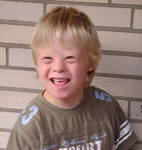
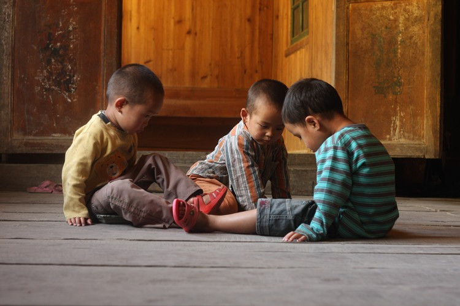
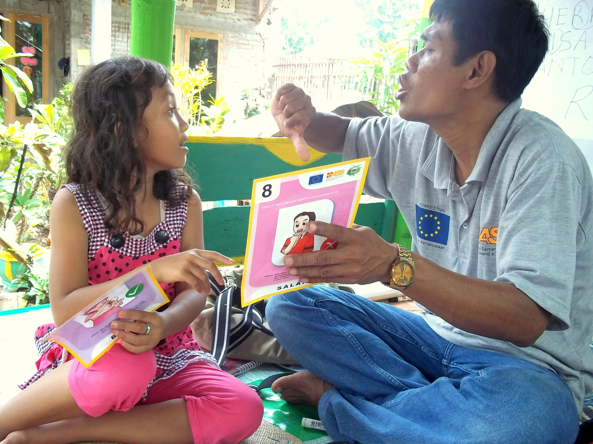

# Middle Childhood – Cognitive Development

<style>
div.solid {
border: 5px solid #FFA500;
border-radius: 5px;
padding: 20px;
}
</style>

<div class = "solid">

After this chapter, you should be able to:

1. Describe what cognitive theorists share about children and their thinking 

2. Explain how intelligence is measured, the tests used to assess intelligence, the extremes in intelligence, and the concern of bias

3. Describe the Information Processing Theory 

4. Explain several theories of language development

5. Compare typical language development with language difficulties 


Cognitive skills continue to expand in middle and late childhood. Children in middle childhood have thought processes that become more logical and organized when dealing with concrete information. Children at this age understand concepts such as past, present, and future, giving them the ability to plan and work toward goals. Additionally, they can process complex ideas such as addition and subtraction and cause-and effect relationships.^[[Lifespan Development: A Psychological Perspective](http://dept.clcillinois.edu/psy/LifespanDevelopment.pdf) by Martha Lally and Suzanne Valentine-French is licensed under [CC BY-NC-SA 3.0](https://creativecommons.org/licenses/by-nc-sa/3.0/)]

</div>

<br/>

## Cognitive Theories of Intelligence 

Theorists are able to give different perspectives to the cognitive development of children and psychologists have long debated how to best conceptualize and measure intelligence (Sternberg, 2003).  In the next section we’ll look at Piaget’s theory of cognitive development, Sternberg’s alternative view to intelligence, and Gardener’s theory of multiple intelligence.  Lastly, you’ll learn about the Information Processing Theory that looks at the cognitive function of children in middle childhood.

 
```{r fig-11-1, out.width="50%", fig.cap="Jean Piaget.^[[Image](https://commons.wikimedia.org/wiki/File:Valentine_et_Jean_Piaget_en_1932.jpg) is in the public domain]"}

knitr::include_graphics("https://upload.wikimedia.org/wikipedia/commons/e/e6/Valentine_et_Jean_Piaget_en_1932.jpg")

```

## Piaget’s Theory of Cognitive Development

### Concrete Operational Thought

As children continue into elementary school, they develop the ability to represent ideas and events more flexibly and logically. Their rules of thinking still seem very basic by adult standards and usually operate unconsciously, but they allow children to solve problems more systematically than before, and therefore to be successful with many academic tasks. In the concrete operational stage, for example, a child may unconsciously follow the rule: “If nothing is added or taken away, then the amount of something stays the same.” This simple principle helps children to understand certain arithmetic tasks, such as in adding or subtracting zero from a number, as well as to do certain classroom science experiments, such as ones involving judgments of the amounts of liquids when mixed. Piaget called this period the concrete operational stage because children mentally “operate” on concrete objects and events.^[[Educational Psychology](https://cnx.org/contents/zmxetoTT@2.1:9u2dcFad@2/Cognitive-development-the-theory-of-Jean-Piaget) by [OpenStax CNX](https://cnx.org/) is licensed under [CC BY 4.0](https://creativecommons.org/licenses/by/4.0/)]  


```{r fig-11-2, out.width="50%", fig.cap="Children studying.^[[Image](https://pxhere.com/en/photo/826374) is licensed under [CC0](https://creativecommons.org/publicdomain/zero/1.0/)]"}

knitr::include_graphics("https://c.pxhere.com/photos/35/e4/students_primary_school_village_laos_children_instruction_southern_laos_schoolchildren-826374.jpg!d")

```

The concrete operational stage is defined as the third in Piaget's theory of cognitive development. This stage takes place around 7 years old to 11 years of age, and is characterized by the development of organized and rational thinking. Piaget (1954a) considered the concrete stage a major turning point in the child's cognitive development, because it marks the beginning of logical or operational thought. The child is now mature enough to use logical thought or operations (i.e. rules) but can only apply logic to physical objects (hence concrete operational). Children gain the abilities of conservation (number, area, volume, orientation) and reversibility.^[[Lifespan Development: A Psychological Perspective](http://dept.clcillinois.edu/psy/LifespanDevelopment.pdf) by Martha Lally and Suzanne Valentine-French is licensed under [CC BY-NC-SA 3.0](https://creativecommons.org/licenses/by-nc-sa/3.0/)]

Let’s look at the following cognitive skills that children typically master during Piaget’s concrete operational stage.^[

[Concrete Operational Stage Image](https://www.simplypsychology.org/concrete-operational.html) by [Simply Psychology](https://www.simplypsychology.org/) is licensed under [CC BY-NC-ND 3.0](https://creativecommons.org/licenses/by-nc-nd/3.0/); [Lifespan Development: A Psychological Perspective](http://dept.clcillinois.edu/psy/LifespanDevelopment.pdf) by Martha Lally and Suzanne Valentine-French is licensed under [CC BY-NC-SA 3.0](https://creativecommons.org/licenses/by-nc-sa/3.0/)]: 

 
```{r fig-11-3, out.width="50%", fig.cap="The cognitive skills developed during the concrete operational stage.^[Image by [Ian Joslin](https://koolkoalaj.com/) is licensed under [CC BY 4.0](https://creativecommons.org/licenses/by/4.0/)]"}

# knitr::include_graphics("")

```

**Seriation:** Arranging items along a quantitative dimension, such as length or weight, in a methodical way is now demonstrated by the concrete operational child. For example, they can methodically arrange a series of different-sized sticks in order by length, while younger children approach a similar task in a haphazard way.^[[Lifespan Development: A Psychological Perspective](http://dept.clcillinois.edu/psy/LifespanDevelopment.pdf) by Martha Lally and Suzanne Valentine-French is licensed under [CC BY-NC-SA 3.0](https://creativecommons.org/licenses/by-nc-sa/3.0/)]


```{r fig-11-4, out.width="50%", fig.cap="Caption: Putting these rectangles from smallest to largest is seriation.^[[Image](https://commons.wikimedia.org/wiki/File:Seriation_task_w_shapes.jpg) by MehreenH is licensed [CC BY-SA 4.0](https://creativecommons.org/licenses/by-sa/4.0/deed.en)]"}

knitr::include_graphics("https://upload.wikimedia.org/wikipedia/commons/thumb/1/18/Seriation_task_w_shapes.jpg/569px-Seriation_task_w_shapes.jpg")

```

**Classification:** As children's experiences and vocabularies grow, they build **schema** and are able to organize objects in many different ways. They also understand classification hierarchies and can arrange objects into a variety of classes and subclasses. 

 
```{r fig-11-5, out.width="50%", fig.cap="This child might use classification if she sorts these toys by color.^[[Image](https://pxhere.com/en/photo/1365697) is licensed under [CC0](https://creativecommons.org/publicdomain/zero/1.0/)]"}

knitr::include_graphics("https://c.pxhere.com/photos/6c/b1/snowflake_puzzle_nursery_play_toys-1365697.jpg!d")

```

**Reversibility:** The child learns that some things that have been changed can be returned to their original state. Water can be frozen and then thawed to become liquid again. But eggs cannot be unscrambled. Arithmetic operations are reversible as well: 2 + 3 = 5 and 5 – 3 = 2. Many of these cognitive skills are incorporated into the school's curriculum through mathematical problems and in worksheets about which situations are reversible or irreversible.

 
```{r fig-11-6, out.width="50%", fig.cap="Understanding that ice cubes melt is an example of reversibility.^[[Image](https://www.flickr.com/photos/138248475@N03/23746727113) by [John Voo](https://www.flickr.com/photos/138248475@N03/) is licensed under [CC BY 2.0](https://creativecommons.org/licenses/by/2.0/)]"}


```


**Conservation:** An example of the preoperational child’s thinking; if you were to fill a tall beaker with 8 ounces of water this child would think that it was "more" than a short, wide bowl filled with 8 ounces of water? Concrete operational children can understand the concept of conservation, which means that changing one quality (in this example, height or water level) can be compensated for by changes in another quality (width). Consequently, there is the same amount of water in each container, although one is taller and narrower and the other is shorter and wider. 

 
```{r fig-11-7, out.width="50%", fig.cap="Beakers displaying the idea of conservation.^[[Image](https://commons.wikimedia.org/wiki/File:Conservation_of_Liquid.png) by [Ydolem2689](https://en.wikipedia.org/wiki/User:Ydolem2689) is licensed under [CC BY-SA 3.0](https://creativecommons.org/licenses/by-sa/3.0/deed.en)]"}

knitr::include_graphics("https://upload.wikimedia.org/wikipedia/commons/thumb/f/f4/Conservation_of_Liquid.png/619px-Conservation_of_Liquid.png")

```

**Decentration:** Concrete operational children no longer focus on only one dimension of any object (such as the height of the glass) and instead consider the changes in other dimensions too (such as the width of the glass). This allows for conservation to occur. 


```{r fig-11-8, out.width="50%", fig.cap="Children looking at these glasses demonstrate decentration when looking at more than one attribute i.e. tall, short, and wide narrow.^[[Image](https://commons.wikimedia.org/wiki/File:Conservation2.jpeg) by [Waterlily16](https://commons.wikimedia.org/w/index.php?title=User:Waterlily16&action=edit&redlink=1) is licensed under [CC BY-SA 3.0](https://creativecommons.org/licenses/by-sa/3.0/deed.en)]"}

knitr::include_graphics("https://upload.wikimedia.org/wikipedia/commons/thumb/4/4e/Conservation2.jpeg/799px-Conservation2.jpeg")

```


**Identity:** One feature of concrete operational thought is the understanding that objects have qualities that do not change even if the object is altered in some way. For instance, mass of an object does not change by rearranging it. A piece of chalk is still chalk even when the piece is broken in two.^[[Lifespan Development: A Psychological Perspective](http://dept.clcillinois.edu/psy/LifespanDevelopment.pdf) by Martha Lally and Suzanne Valentine-French is licensed under [CC BY-NC-SA 3.0](https://creativecommons.org/licenses/by-nc-sa/3.0/)]

 	 	 
```{r fig-11-9, out.width="50%", fig.cap="A broken egg is still an egg.^[[Image](https://www.flickr.com/photos/8047705@N02/5816198695) by [John Liu](https://www.flickr.com/photos/8047705@N02/) is licensed under [CC BY 2.0](https://creativecommons.org/licenses/by/2.0/)]"}

knitr::include_graphics("figures/figure-11-09.jpg")

```

```{r fig-11-10, out.width="50%", fig.cap="A deflated balloon is still a balloon.^[[Image](https://www.pexels.com/photo/ground-orange-balloon-deflated-4631/) is licensed under [CC0](https://www.pexels.com/creative-commons-images/)]"}

knitr::include_graphics("https://images.pexels.com/photos/4631/ground-orange-balloon-deflated.jpg?auto=compress&cs=tinysrgb&dpr=2&h=650&w=940")

```

```{r fig-11-11, out.width="50%", fig.cap="Broken chalk is still chalk.^[[Image](https://www.pexels.com/photo/blue-red-and-yellow-chalk-1107495/) from [Pexels](https://www.pexels.com/)]"}

knitr::include_graphics("https://images.pexels.com/photos/1107495/pexels-photo-1107495.jpeg?auto=compress&cs=tinysrgb&dpr=2&h=650&w=940")

```

**Transitivity:** Being able to understand how objects are related to one another is referred to as transitivity, or transitive inference. This means that if one understands that a dog is a mammal, and that a boxer is a dog, then a boxer must be a mammal.^[[Transitivity](http://oer2go.org/mods/en-boundless/www.boundless.com/psychology/definition/transitivity/index.html) by Boundless is licensed under [CC BY-SA 4.0](http://oer2go.org/mods/en-boundless/creativecommons.org/licenses/by-sa/4.0/index.html)]


```{r fig-11-12, out.width="50%", fig.cap="Transitivity allows children to understand that this boxer puppy, is a dog and a mammal.^[[Image](https://libreshot.com/boxer-puppy/) by [Martin Vorel](https://libreshot.com/about-libreshot/) is in the public domain]"}

knitr::include_graphics("https://libreshot.com/wp-content/uploads/2014/09/boxer-puppy.jpg")

```

#### Looking at Piaget’s Theory

Researchers have obtained findings indicating that cognitive development is considerably more continuous than Piaget claimed. Thus, the debate between those who emphasize discontinuous, stage-like changes in cognitive development and those who emphasize gradual continuous changes remains a lively one.^[[Lifespan Development: A Psychological Perspective](http://dept.clcillinois.edu/psy/LifespanDevelopment.pdf) by Martha Lally and Suzanne Valentine-French is licensed under [CC BY-NC-SA 3.0](https://creativecommons.org/licenses/by-nc-sa/3.0/)]


### Triarchic Theory of Intelligence

An alternative view of intelligence is presented by Sternberg (1997; 1999). Sternberg offers three types of intelligences. Sternberg provided background information about his view of intelligence in a conference, where he described his frustration as a committee member charged with selecting graduate students for a program in psychology. He was concerned that there was too much emphasis placed on aptitude test scores (we will discuss this later in the chapter) and believed that there were other, less easily measured, qualities necessary for success in a graduate program and in the world of work. Aptitude test scores indicate the first type of intelligence-academic

1. **Analytical** (componential) sometimes described as academic: includes the ability to solve problems of logic, verbal comprehension, vocabulary, and spatial abilities. 

2. **Creative** (experiential): the ability to apply newly found skills to novel situations

3. **Practical** (contextual): the ability to use common sense and to know what is called for in a situation.^[[Lifespan Development - Module 6: Middle Childhood](https://courses.lumenlearning.com/lifespandevelopment2/chapter/physical-development-2/) by [Lumen Learning](http://opencourselibrary.org/econ-201/) references [Psyc 200 Lifespan Psychology](http://opencourselibrary.org/econ-201/) by Laura Overstreet, licensed under [CC BY 4.0](https://creativecommons.org/licenses/by/4.0/)]


Analytical
 
```{r fig-11-13, out.width="50%", fig.cap="Reading supports analytical intelligence^[[Image](https://www.maxpixel.net/Smart-Kid-Beautiful-Kid-Cute-Kid-2811136) licensed under [CC0](https://creativecommons.org/publicdomain/zero/1.0/)]"}

knitr::include_graphics("https://www.maxpixel.net/static/photo/1x/Smart-Kid-Cute-Kid-Beautiful-Kid-2811136.jpg")

```

<br/>

Creative
```{r fig-11-14, out.width="50%", fig.cap="Building with shows creative intelligence^[[Image](https://www.maxpixel.net/Building-Child-Pieces-Lego-Toy-Playing-Creative-286231) licensed under [CC0](https://creativecommons.org/publicdomain/zero/1.0/)]"}

knitr::include_graphics("https://www.maxpixel.net/static/photo/1x/Building-Lego-Playing-Child-Creative-Toy-Pieces-286231.jpg")

```

<br/>

Practical
 
```{r fig-11-15, out.width="50%", fig.cap="Navigating social settings is practical intelligence^[[Image](https://www.flickr.com/photos/stevendepolo/29064084222) by [Steven Depolo](https://www.flickr.com/photos/stevendepolo/) is licensed under [CC BY 2.0](https://creativecommons.org/licenses/by/2.0/)]"}


```

## Howard Gardner’s Theory of Multiple Intelligences

Another champion of the idea of specific types of intelligences rather than one overall intelligence is the psychologist Howard Gardner (1983, 1999). Gardner argued that it would be evolutionarily functional for different people to have different talents and skills, and proposed that there are nine intelligences that can be differentiated from each other. 

 
```{r fig-11-16, out.height="50%", fig.cap="Howard Gardner.^[[Image](https://commons.wikimedia.org/wiki/File:Howard_Gardner.jpg) by [Interaction-Design.org](http://www.interaction-design.org/references/authors/howard_gardner.html) is licensed under [CC BY-SA 2.0](https://creativecommons.org/licenses/by-sa/2.0/deed.en)]"}

knitr::include_graphics("https://upload.wikimedia.org/wikipedia/commons/0/06/Howard_Gardner.jpg")

```

Gardner contends that these are also forms of intelligence. A high IQ does not always ensure success in life or necessarily indicate that a person has common sense, good interpersonal skills, or other abilities important for success.  Gardner investigated intelligences by focusing on children who were talented in one or more areas.  He identified these 9 intelligences based on other criteria including a set developmental history and psychometric findings.^[[Lifespan Development: A Psychological Perspective](http://dept.clcillinois.edu/psy/LifespanDevelopment.pdf) by Martha Lally and Suzanne Valentine-French is licensed under [CC BY-NC-SA 3.0](https://creativecommons.org/licenses/by-nc-sa/3.0/)]


Howard Gardner (1983, 1998, 1999) suggests that there are not one, but nine domains of intelligence. The first three are skills that are measured by IQ tests:

```{r include=F}

table_11_01 <- read_csv("tables/table-11-01.csv")

```


```{r table-11-1}

table_11_01 %>% 
        kable(caption = "Howard Gardner’s Multiple Intelligences^[[Lifespan Development: A Psychological Perspective](http://dept.clcillinois.edu/psy/LifespanDevelopment.pdf) by Martha Lally and Suzanne Valentine-French is licensed under [CC BY-NC-SA 3.0](https://creativecommons.org/licenses/by-nc-sa/3.0/); Table adapted from Gardner, H. (1999). Intelligence reframed: Multiple intelligences for the 21st century. New York, NY: Basic Books.]") 


```


The concept of multiple intelligences has been influential in the field of education, and teachers have used these ideas to try to teach differently for individual students. For instance, to teach math problems to students who have particularly good kinesthetic intelligence, a teacher might encourage the students to move their bodies or hands according to the numbers. On the other hand, some have argued that these “intelligences” sometimes seem more like “abilities” or “talents” rather than real intelligence. There is no clear conclusion about how many intelligences there are. Are a sense of humor, artistic skills, dramatic skills, and so forth also separate intelligences? 

## Information Processing: Learning, Memory, and Problem Solving

During middle and late childhood children make strides in several areas of cognitive function including the capacity of working memory, their ability to pay attention, and their use of memory strategies. Both changes in the brain and experience foster these abilities.  In this section, we will look at how children process information, think and learn, allowing them to increase their ability to learn and remember due to an improvement in the ways they attend to, store information, and problem solve.^[[Lifespan Development: A Psychological Perspective](http://dept.clcillinois.edu/psy/LifespanDevelopment.pdf) by Martha Lally and Suzanne Valentine-French is licensed under [CC BY-NC-SA 3.0](https://creativecommons.org/licenses/by-nc-sa/3.0/)]


**Working Memory**: The capacity of working memory expands during middle and late childhood, research has suggested that both an increase in processing speed and the ability to inhibit irrelevant information from entering memory are contributing to the greater efficiency of working memory during this age (de Ribaupierre, 2002). Changes in myelination and synaptic pruning in the cortex are likely behind the increase in processing speed and ability to filter out irrelevant stimuli (Kail, McBride-Chang, Ferrer, Cho, & Shu, 2013).^[[Lifespan Development: A Psychological Perspective](http://dept.clcillinois.edu/psy/LifespanDevelopment.pdf) by Martha Lally and Suzanne Valentine-French is licensed under [CC BY-NC-SA 3.0](https://creativecommons.org/licenses/by-nc-sa/3.0/)]


```{r fig-11-17, out.width="50%", fig.cap="Working memory expands during middle and late childhood.^[[Image](https://www.ncpedia.org/media/working-memory-illustration) by [Anchor](https://www.ncpedia.org/anchor/anchor) is licensed under [CC BY-NC-SA](https://www.ncpedia.org/category/licensing/creative-commons)]"}

knitr::include_graphics("https://www.ncpedia.org/sites/default/files//styles/anchor_images/public/working_memory.png?itok=1_eHUIfT")

```

**Attention**: As noted above, the ability to inhibit irrelevant information improves during this age group, with there being a sharp improvement in selective attention from age six into adolescence (Vakil, Blachstein, Sheinman, & Greenstein, 2009). Children also improve in their ability to shift their attention between tasks or different features of a task (Carlson, Zelazo, & Faja, 2013). A younger child who is asked to sort objects into piles based on type of object, car versus animal, or color of object, red versus blue, would likely have no trouble doing so. But if you ask them to switch from sorting based on type to now having them sort based on color, they would struggle because this requires them to suppress the prior sorting rule. An older child has less difficulty making the switch, meaning there is greater flexibility in their intentional skills. These changes in attention and working memory contribute to children having more strategic approaches to challenging tasks. 

**Memory Strategies**: Bjorklund (2005) describes a developmental progression in the acquisition and use of memory strategies. Such strategies are often lacking in younger children, but increase in frequency as children progress through elementary school. Examples of memory strategies include rehearsing information you wish to recall, visualizing and organizing information, creating rhymes, such as “i” before “e” except after “c”, or inventing acronyms, such as “roygbiv” to remember the colors of the rainbow. Schneider, Kron-Sperl, and Hünnerkopf (2009) reported a steady increase in the use of memory strategies from ages six to ten in their longitudinal study. Moreover, by age ten many children were using two or more memory strategies to help them recall information. Schneider and colleagues found that there were considerable individual differences at each age in the use of strategies, and that children who utilized more strategies had better memory performance than their same aged peers. 

## Cognitive Processes

As children enter school and learn more about the world, they develop more categories for concepts and learn more efficient strategies for storing and retrieving information. One significant reason is that they continue to have more experiences on which to tie new information. In other words, their **knowledge base**, knowledge in particular areas that makes learning new information easier, expands (Berger, 2014). 


```{r fig-11-18, out.width="50%", fig.cap="As children learn more about the world, their knowledge base grows.^[[Image](https://pxhere.com/en/photo/1084647) is licensed under [CC0](https://creativecommons.org/publicdomain/zero/1.0/)]"}

knitr::include_graphics("https://c.pxhere.com/photos/82/73/child_thoughtful_schoolchild_young_sitting_casual_thinking_pensive-1084647.jpg!d")

```

**Metacognition**: refers to the knowledge we have about our own thinking and our ability to use this awareness to regulate our own cognitive processes (Bruning, Schraw, Norby, & Ronning, 2004). Children in this developmental stage also have a better understanding of how well they are performing a task, and the level of difficulty of a task. As they become more realistic about their abilities, they can adapt studying strategies to meet those needs. Young children spend as much time on an unimportant aspect of a problem as they do on the main point, while older children start to learn to prioritize and gauge what is significant and what is not. As a result, they develop metacognition. 

Critical thinking, or a detailed examination of beliefs, courses of action, and evidence, involves teaching children how to think. The purpose of critical thinking is to evaluate information in ways that help us make informed decisions. Critical thinking involves better understanding a problem through gathering, evaluating, and selecting information, and also by considering many possible solutions. Ennis (1987) identified several skills useful in critical thinking. These include: Analyzing arguments, clarifying information, judging the credibility of a source, making value judgments, and deciding on an action. Metacognition is essential to critical thinking because it allows us to reflect on the information as we make decisions. 

Children differ in their cognitive process and these differences predict both their readiness for school, academic performance, and testing in school.  (Prebler, Krajewski, & Hasselhorn, 2013).^[[Lifespan Development: A Psychological Perspective](http://dept.clcillinois.edu/psy/LifespanDevelopment.pdf) by Martha Lally and Suzanne Valentine-French is licensed under [CC BY-NC-SA 3.0](https://creativecommons.org/licenses/by-nc-sa/3.0/)]
  

## Intelligence Testing: The What, the Why, and the Who 

### Measuring Intelligence: Standardization and the Intelligence Quotient 

The goal of most intelligence tests is to measure “g”, the general intelligence factor. Good intelligence tests are **reliable**, meaning that they are consistent over time, and also demonstrate **validity**, meaning that they actually measure intelligence rather than something else. Because intelligence is such an important part of individual differences, psychologists have invested substantial effort in creating and improving measures of intelligence, and these tests are now considered the most accurate of all psychological tests. 

Intelligence changes with age. A 3-year-old who could accurately multiply 183 by 39 would certainly be intelligent, but a 25-year-old who could not do so would be seen as unintelligent. Thus understanding intelligence requires that we know the norms or standards in a given population of people at a given age. The **standardization** of a test involves giving it to a large number of people at different ages and computing the average score on the test at each age level. 

Once the standardization has been accomplished, we have a picture of the average abilities of people at different ages and can calculate a person’s **mental age**, which is the age at which a person is performing intellectually. If we compare the mental age of a person to the person’s chronological age, the result is the **Intelligence Quotient (IQ)**, a measure of intelligence that is adjusted for age. A simple way to calculate IQ is by using the following formula: 

<center>

**IQ = mental age ÷ chronological age × 100.**

</center>

Thus a 10-year-old child who does as well as the average 10-year-old child has an IQ of 100 (10 ÷ 10 × 100), whereas an 8-year-old child who does as well as the average 10-year-old child would have an IQ of 125 (10 ÷ 8 × 100). Most modern intelligence tests are based on the relative position of a person’s score among people of the same age, rather than on the basis of this formula, but the idea of intelligence “ratio” or “quotient” provides a good description of the score’s meaning. 

<style>
div.blue {background-color:#e6f0ff; border-radius: 5px; padding: 20px;}
</style>
<div class = "blue">
#### The Flynn Effect{-}

It is important that intelligence tests be standardized on a regular basis, because the overall level of intelligence in a population may change over time. The Flynn effect refers to the observation that scores on intelligence tests worldwide have increased substantially over the past decades (Flynn, 1999). Although the increase varies somewhat from country to country, the average increase is about 3 IQ points every 10 years. There are many explanations for the Flynn effect, including better nutrition, increased access to information, and more familiarity with multiple-choice tests (Neisser, 1998). But whether people are actually getting smarter is debatable (Neisser,1997).^[[Introduction to Psychology - Measures of Intelligence](https://courses.lumenlearning.com/wsu-sandbox/chapter/measures-of-intelligence/) references [Psychology](https://cnx.org/contents/Sr8Ev5Og@4.100:F_mjYFfh@3/Preface) by [OpenStax CNX](https://cnx.org/), licensed under  [CC BY 4.0](https://creativecommons.org/licenses/by/4.0/) (modified by Dawn Rymond)]

</div>

### The Value of IQ Testing

The value of IQ testing is most evident in educational or clinical settings. Children who seem to be experiencing learning difficulties or severe behavioral problems can be tested to ascertain whether the child’s difficulties can be partly attributed to an IQ score that is significantly different from the mean for her age group. Without IQ testing—or another measure of intelligence—children and adults needing extra support might not be identified effectively. People also use IQ testing results to seek disability benefits from the Social Security Administration. 

While IQ tests have sometimes been used as arguments in support of insidious purposes, such as the eugenics movement, which was the science of improving a human population by controlled breeding to increase desirable heritable characteristics. However, the value of this test is important to help those in need.^[[Introduction to Psychology - Measures of Intelligence](https://courses.lumenlearning.com/wsu-sandbox/chapter/measures-of-intelligence/) references [Psychology](https://cnx.org/contents/Sr8Ev5Og@4.100:F_mjYFfh@3/Preface) by [OpenStax CNX](https://cnx.org/), licensed under  [CC BY 4.0](https://creativecommons.org/licenses/by/4.0/) (modified by Dawn Rymond)]

### Intelligence Tests and Those Who Created Them

#### Alfred Binet & Théodore Simon - Stanford- Binet Intelligence Test

From 1904- 1905 the French psychologist Alfred Binet (1857–1914) and his colleague Théodore Simon (1872–1961) began working on behalf of the French government to develop a measure that would identify children who would not be successful with the regular school curriculum. The goal was to help teachers better educate these students (Aiken, 1994). 

Binet and Simon developed what most psychologists today regard as the first intelligence test, which consisted of a wide variety of questions that included the ability to name objects, define words, draw pictures, complete sentences, compare items, and construct sentences. Binet and Simon (Binet, Simon, & Town, 1915; Siegler, 1992) believed that the questions they asked the children all assessed the basic abilities to understand, reason, and make judgments. 

 
```{r fig-11-19, out.width="50%", fig.cap="(a) Alfred Binet (b) This page is from a 1908 version of the Binet-Simon Intelligence Scale. Children being tested were asked which face, of each pair, was prettier.^[[Images](https://courses.lumenlearning.com/wsu-sandbox/chapter/measures-of-intelligence/) are in the public domain]"}

knitr::include_graphics("https://s3-us-west-2.amazonaws.com/courses-images-archive-read-only/wp-content/uploads/sites/902/2015/02/23224836/CNX_Psych_07_05_ChildIQ.jpg")

```

Soon after Binet and Simon introduced their test, the American psychologist Lewis Terman at Stanford University (1877–1956) developed an American version of Binet’s test that became known as the Stanford- Binet Intelligence Test. The Stanford-Binet is a measure of general intelligence made up of a wide variety of tasks including vocabulary, memory for pictures, naming of familiar objects, repeating sentences, and following commands.^[[Introduction to Psychology - Measures of Intelligence](https://courses.lumenlearning.com/wsu-sandbox/chapter/measures-of-intelligence/) references [Psychology](https://cnx.org/contents/Sr8Ev5Og@4.100:F_mjYFfh@3/Preface) by [OpenStax CNX](https://cnx.org/), licensed under  [CC BY 4.0](https://creativecommons.org/licenses/by/4.0/)]

#### David Wechsler- Wechsler-Bellevue Intelligence Scale

In 1939, David Wechsler, a psychologist who spent part of his career working with World War I veterans, developed a new IQ test in the United States. Wechsler combined several subtests from other intelligence tests used between 1880 and World War I. These subtests tapped into a variety of verbal and nonverbal skills, because Wechsler believed that intelligence encompassed “the global capacity of a person to act purposefully, to think rationally, and to deal effectively with his environment” (Wechsler, 1958, p. 7). He named the test the Wechsler-Bellevue Intelligence Scale (Wechsler, 1981). This combination of subtests became one of the most extensively used intelligence tests in the history of psychology. 

 
```{r fig-11-20, out.width="50%", fig.cap="David Wechsler^[[Image](https://commons.wikimedia.org/wiki/File:David_Wechsler_-_ETH-Bibliothek_Com_L10-0264-0005.tif) by Comet Photo AG (Zürich) is licensed under [CC BY-SA 4.0](https://creativecommons.org/licenses/by-sa/4.0/deed.en)]"}

knitr::include_graphics("https://upload.wikimedia.org/wikipedia/commons/thumb/3/39/David_Wechsler_-_ETH-Bibliothek_Com_L10-0264-0005.tif/lossy-page1-800px-David_Wechsler_-_ETH-Bibliothek_Com_L10-0264-0005.tif.jpg")

```

Today, there are three intelligence tests credited to Wechsler, the Wechsler Adult Intelligence Scale-fourth edition (WAIS-IV), the Wechsler Intelligence Scale for Children (WISC-V), and the Wechsler Preschool and Primary Scale of Intelligence—Revised (WPPSI-III) (Wechsler, 2002). These tests are used widely in schools and communities throughout the United States, and they are periodically normed and standardized as a means of recalibration. 

#### Bias of IQ Testing

Intelligence tests and psychological definitions of intelligence have been heavily criticized since the 1970s for being biased in favor of Anglo-American, middle-class respondents and for being inadequate tools for measuring non-academic types of intelligence or talent. Intelligence changes with experience, and intelligence quotients or scores do not reflect that ability to change. What is considered smart varies culturally as well, and most intelligence tests do not take this variation into account. For example, in the West, being smart is associated with being quick. A person who answers a question the fastest is seen as the smartest, but in some cultures being smart is associated with considering an idea thoroughly before giving an answer. A well- thought out, contemplative answer is the best answer.^[[Sociology: Brief Edition – Agents of Socialization](https://2012books.lardbucket.org/books/sociology-brief-edition-v1.0/s06-03-agents-of-socialization.html) by Steven E. Barkan is licensed under [CC BY-NC-SA 3.0](https://creativecommons.org/licenses/by-nc-sa/3.0/); [Introduction to Psychology - Measures of Intelligence](https://courses.lumenlearning.com/wsu-sandbox/chapter/measures-of-intelligence/) references [Psychology](https://cnx.org/contents/Sr8Ev5Og@4.100:F_mjYFfh@3/Preface) by [OpenStax CNX](https://cnx.org/), licensed under  [CC BY 4.0](https://creativecommons.org/licenses/by/4.0/)]

### A Spectrum of Intellectual Development 

The results of studies assessing the measurement of intelligence show that IQ is distributed in the population in the form of a Normal Distribution (or bell curve), which is the pattern of scores usually observed in a variable that clusters around its average. In a normal distribution, the bulk of the scores fall toward the middle, with many fewer scores falling at the extremes. The normal distribution of intelligence shows that on IQ tests, as well as on most other measures, the majority of people cluster around the average (in this case, where IQ = 100), and fewer are either very smart or very dull (see below). 


```{r fig-11-21, out.width="50%", fig.cap="The majority of people have an IQ score between 85 and 115.^[[Image](https://cnx.org/contents/Sr8Ev5Og@4.100:8iySjqqi@3/Measures-of-Intelligence) by [CNX Psychology](https://cnx.org/) is licensed under [CC BY 4.0](https://creativecommons.org/licenses/by/4.0/)]"}

knitr::include_graphics("https://openstax.org/resources/e71806cd71501f1cb0f5222c6e3519b111667cb6")

```

### Distribution of IQ Scores in the General Population

This means that about 2% of people score above an IQ of 130, often considered the threshold for giftedness, and about the same percentage score below an IQ of 70, often being considered the threshold for an intellectual disability. 

#### Intellectual Disabilities

One end of the distribution of intelligence scores is defined by people with very low IQ. **Intellectual disability** (or **intellectual developmental disorder**) is assessed based on cognitive capacity (IQ) and adaptive functioning. The severity of the disability is based on adaptive functioning, or how well the person handles everyday life tasks. About 1% of the United States population, most of them males, fulfill the criteria for intellectual developmental disorder, but some children who are given this diagnosis lose the classification as they get older and better learn to function in society. A particular vulnerability of people with low IQ is that they may be taken advantage of by others, and this is an important aspect of the definition of intellectual developmental disorder (Greenspan, Loughlin, & Black, 2001). 

One example of an intellectual developmental disorder is **Down syndrome**, a chromosomal disorder caused by the presence of all or part of an extra 21st chromosome. The incidence of Down syndrome is estimated at approximately 1 per 700 births, and the prevalence increases as the mother’s age increases (CDC, 2014a). People with Down syndrome typically exhibit a distinctive pattern of physical features, including a flat nose, upwardly slanted eye, a protruding tongue, and a short neck.

 
```{r fig-11-22, out.width="50%", fig.cap="Down Syndrome is caused by the presence of all or part of an extra 21st chromosome.^[Image by [Vanellus Foto](https://commons.wikimedia.org/wiki/User:Vanellus_Foto) is licensed under [CC BY-SA 3.0](https://creativecommons.org/licenses/by-sa/3.0/deed.en)]"}



```

Fortunately, societal attitudes toward individuals with intellectual disabilities have changed over the past decades. We no longer use terms such as “retarded,” “moron,” “idiot,” or “imbecile” to describe people with intellectual differences, although these were the official psychological terms used to describe degrees of what was referred to as mental retardation in the past. Laws such as the Americans with Disabilities Act (ADA) have made it illegal to discriminate on the basis of mental and physical disability.

The normal distribution of IQ scores in the general population shows that most people have about average intelligence, while very few have extremely high or extremely low intelligence.^[[Introduction to Psychology - Measures of Intelligence](https://courses.lumenlearning.com/wsu-sandbox/chapter/measures-of-intelligence/) references [Psychology](https://cnx.org/contents/Sr8Ev5Og@4.100:F_mjYFfh@3/Preface) by [OpenStax CNX](https://cnx.org/), licensed under  [CC BY 4.0](https://creativecommons.org/licenses/by/4.0/)]

#### Giftedness

Being **gifted** refers to children who have an IQ of 130 or higher (Lally & Valentine-French, 2015). Having an extremely high IQ is clearly less of a problem than having an extremely low IQ but there may also be challenges to being particularly smart. It is often assumed that school children who are labeled as “gifted” may have adjustment problems that make it more difficult for them to create and maintain social relationships. 

 
```{r fig-11-23, out.width="50%", fig.cap="Children who get a score on an intelligence test showing an IQ of 130 or higher are labeled as gifted.^[[Image](https://unsplash.com/photos/oXV3bzR7jxI) by [Ben Mullins](https://unsplash.com/@benmullins) on [Unsplash](https://unsplash.com/)]"}

knitr::include_graphics("https://images.unsplash.com/photo-1534644107580-3a4dbd494a95?ixlib=rb-1.2.1&auto=format&fit=crop&w=750&q=80")

```

As you might expect based on our discussion of intelligence, there are also different types and areas of intelligence and giftedness. Some children are particularly good at math or science, some at automobile repair or carpentry, some at music or art, some at sports or leadership, and so on. There is a lively debate among scholars about whether it is appropriate or beneficial to label some children as “gifted and talented” in school and to provide them with accelerated special classes and other programs that are not available to everyone. Although doing so may help the gifted kids (Colangelo & Assouline, 2009), it also may isolate them from their peers and make such provisions unavailable to those who are not classified as “gifted.” Testing for high IQ or for disabilities needs to be critically looked at so that the good that these tests were created for are not used for undesirable purposes.^[[Lifespan Development: A Psychological Perspective](http://dept.clcillinois.edu/psy/LifespanDevelopment.pdf) by Martha Lally and Suzanne Valentine-French is licensed under [CC BY-NC-SA 3.0](https://creativecommons.org/licenses/by-nc-sa/3.0/)]


How do we know so much about what children learn in schools?  In the next section we’ll look at the different types of tests and what the schools are testing.


### Testing in Schools

Children's academic performance is often measured with the use of standardized tests. Those tests include, but are not limited to Achievement and Aptitude tests.


```{r fig-11-24, out.width="50%", fig.cap="Standardized tests are used to measure academic performance.^[[Image](https://www.mcbhawaii.marines.mil/News/News-Article-Display/Article/586671/mokapu-elementary-moves-ahead-of-power-curve/) by [Marine Corps Base Hawaii](https://www.mcbhawaii.marines.mil/) is in the public domain]"}

knitr::include_graphics("https://media.defense.gov/2015/Apr/27/2001043595/750/422/0/150422-M-NV020-013.JPG")

```


Achievement tests are used to measure what a child has already learned. Achievement tests are often used as measures of teaching effectiveness within a school setting and as a method to make schools that receive tax dollars (such as public schools, charter schools, and private schools that receive vouchers) accountable to the government for their performance.

Aptitude tests are designed to measure a student’s ability to learn or to determine if a person has potential in a particular program. These are often used at the beginning of a course of study or as part of college entrance requirements. The Scholastic Aptitude Test (SAT) and Preliminary Scholastic Aptitude Test (PSAT) are perhaps the most familiar aptitude tests to students in grades 6 and above. Learning test taking skills and preparing for SATs has become part of the training that some students in these grades receive as part of their pre-college preparation. Other aptitude tests include the MCAT (Medical College Admission Test), the LSAT (Law School Admission Test), and the GRE (Graduate Record Examination). Intelligence tests are also a form of aptitude test, which designed to measure a person’s ability to learn.^[[Sociology: Brief Edition – Agents of Socialization](https://2012books.lardbucket.org/books/sociology-brief-edition-v1.0/s06-03-agents-of-socialization.html) by Steven E. Barkan is licensed under [CC BY-NC-SA 3.0](https://creativecommons.org/licenses/by-nc-sa/3.0/)]

#### What Happened to No Child Left Behind?

In 2001, President Bush signed into effect Public Law 107-110, better known as the **No Child Left Behind Act** mandating that schools administer achievement tests to students and publish those results so that parents have an idea of their children's performance. Additionally, the government would have information on the gaps in educational achievement between children from various social class, racial, and ethnic groups. 

Schools that showed significant gaps in these levels of performance were mandated to work toward narrowing these gaps. Educators criticized the policy for focusing too much on testing as the only indication of student performance. Target goals were considered unrealistic and set by the federal government rather than individual states. Because these requirements became increasingly unworkable for schools, changes to the law were requested. 

 	 
```{r fig-11-25, out.width="50%", fig.cap="The No Child Left Behind Act was signed into effect in 2001.^[[Image](https://commons.wikimedia.org/wiki/File:No_Child_Left_Behind_Act.jpg) is in the public domain]"}

knitr::include_graphics("https://upload.wikimedia.org/wikipedia/commons/2/2b/No_Child_Left_Behind_Act.jpg")

```


```{r fig-11-26, out.width="50%", fig.cap="The Every Student Succeeds Act was signed into effect in 2015.^[[Image](https://en.wikipedia.org/wiki/File:President_Barack_Obama_signs_Every_Student_Succeeds_Act_(ESSA).jpg) is in the public domain]"}

knitr::include_graphics("https://upload.wikimedia.org/wikipedia/commons/thumb/2/26/President_Barack_Obama_signs_Every_Student_Succeeds_Act_%28ESSA%29.jpg/800px-President_Barack_Obama_signs_Every_Student_Succeeds_Act_%28ESSA%29.jpg")

```

On December 12, 2015 President Obama signed into law the Every Student Succeeds Act (ESSA). This law is state driven and focuses on expanding educational opportunities and improving student outcomes, including in the areas of high school graduation, drop-out rates, and college attendance.^[[Lifespan Development: A Psychological Perspective](http://dept.clcillinois.edu/psy/LifespanDevelopment.pdf) by Martha Lally and Suzanne Valentine-French is licensed under [CC BY-NC-SA 3.0](https://creativecommons.org/licenses/by-nc-sa/3.0/)]
 

## Language Development in the School-Age Child

Human language is the most complex behavior on the planet and, at least as far as we know, in the universe. Language involves both the ability to comprehend (receptive) spoken and written (expressive) words and to create communication in real time when we speak or write. Most languages are oral, generated through speaking. Speaking involves a variety of complex cognitive, social, and biological processes including operation of the vocal cords, and the coordination of breath with movements of the throat and mouth, and tongue. Other languages are sign languages, in which the communication is expressed by movements of the hands. The most common sign language is American Sign Language (ASL), currently spoken by more than 500,000 people in the United States alone.

Although language is often used for the transmission of information (“turn right at the next light and then go straight,” “Place tab A into slot B”), this is only its most mundane function. Language also allows us to access existing knowledge, to draw conclusions, to set and accomplish goals, and to understand and communicate complex social relationships. Language is fundamental to our ability to think, and without it we would be nowhere near as intelligent as we are.

Language can be conceptualized in terms of sounds, meaning, and the environmental factors that help us understand it. Phonemes are the elementary sounds of our language, morphemes are the smallest units of meaning in a language, syntax is the set of grammatical rules that control how words are put together, and contextual information is the elements of communication that are not part of the content of language but that help us understand its meaning.  Understanding how language works means reaching across many branches of psychology—everything from basic neurological functioning to high-level cognitive processing. Language shapes our social interactions and brings order to our lives. Complex language is one of the defining factors that make us human.^[[Beginning Psychology – Intelligence and Language](https://2012books.lardbucket.org/books/beginning-psychology/s13-intelligence-and-language.html) by Charles Stangor is licensed under [CC BY-NC-SA 3.0](https://creativecommons.org/licenses/by-nc-sa/3.0/)]

## Introduction to Linguistics 

Language is such a special topic that there is an entire field, linguistics, devoted to its study. Linguistics views language in an objective way, using the scientific method and rigorous research to form theories about how humans acquire, use, and sometimes abuse language. There are a few major branches of linguistics, which it is useful to understand in order to learn about language from a psychological perspective.

### Major Branches of Linguistics

This diagram outlines the various subfields of linguistics, the study of language. These include phonetics, phonology, morphology, syntax, semantics, and pragmatics.


```{r fig-11-27, out.width="50%", fig.cap="Major branches of linguistics.^[[Image](https://commons.wikimedia.org/wiki/File:Major_levels_of_linguistic_structure.svg) is in the public domain]"}

knitr::include_graphics("https://upload.wikimedia.org/wikipedia/commons/thumb/7/79/Major_levels_of_linguistic_structure.svg/600px-Major_levels_of_linguistic_structure.svg.png")

```

#### Phonetics and Phonology

A **phoneme** is the smallest unit of sound that makes a meaningful difference in a language. The word “bit” has three phonemes, /b/, /i/, and /t/ (in transcription, phonemes are placed between slashes), and the word “pit” also has three: /p/, /i/, and /t/. In spoken languages, phonemes are produced by the positions and movements of the vocal tract, including our lips, teeth, tongue, vocal cords, and throat, whereas in sign languages phonemes are defined by the shapes and movement of the hands. English contains about 45 phonemes. 

Whereas phonemes are the smallest units of sound in language, phonetics is the study of individual speech sounds; **phonology** is the study of phonemes, which are the speech sounds of an individual language. These two heavily overlapping subfields cover all the sounds that humans can make, as well as which sounds make up different languages.

#### Morpheme and Morphology

A **morpheme** is a string of one or more phonemes that makes up the smallest units of meaning in a language. Some morphemes, such as one-letter words like “I” and “a,” are also phonemes, but most morphemes are made up of combinations of phonemes. Some morphemes are prefixes and suffixes used to modify other words. For example, the syllable “re-” as in “rewrite” or “repay” means “to do again,” and the suffix “-est” as in “happiest” or “coolest” means “to the maximum.”

**Morphology** is the study of words and other meaningful units of language like suffixes and prefixes. A morphologist would be interested in the relationship between words like “dog” and “dogs” or “walk” and “walking,” and how people figure out the differences between those words.

#### Syntax

**Syntax** is the set of rules of a language by which we construct sentences. Each language has a different syntax. The syntax of the English language requires that each sentence have a noun and a verb, each of which may be modified by adjectives and adverbs. Some syntaxes make use of the order in which words appear, while others do not.

Syntax is the study of sentences and phrases, or how people put words into the right order so that they can communicate meaningfully. All languages have underlying rules of syntax, which, along with morphological rules, make up every language’s grammar. An example of syntax coming into play in language is “Eugene walked the dog” versus “The dog walked Eugene.” The order of words is not arbitrary—in order for the sentence to convey the intended meaning, the words must be in a certain order. 

#### Semantics and Pragmatics

**Semantics**, generally, is about the meaning of sentences. Someone who studies semantics is interested in words and what real-world object or concept those words denote, or point to. 

**Pragmatics** is an even broader field that studies how the context of a sentence contributes to meaning. For example, someone shouting “Fire!” has a very different meaning if they are in charge of a seven-gun salute than it does if they are sitting in a crowded movie theater. Every language is different. In English, an adjective comes before a noun (“red house”), whereas in Spanish, the adjective comes after (“casa [house] roja [red].”) In German, you can put noun after noun together to form giant compound words; in Chinese, the pitch of your voice determines the meaning of your words. in American Sign Language, you can convey full, grammatical sentences with tense and aspect by moving your hands and face. But all languages have structural underpinnings that make them logical for the people who speak and understand them.^[[Child Development – Unit 6: Language Development](https://courses.lumenlearning.com/atd-hostos-childdevelopment/chapter/the-structure-of-language/) references [Psychology](file:///C:/Users/paris_j/Downloads/Psychology).by Boundless, licensed under [CC BY-SA 4.0](https://creativecommons.org/licenses/by-sa/4.0/)]

 
```{r fig-11-28, out.width="50%", fig.cap="As speakers of Chinese, these boys would understand the importance of pitch.^[[Image](https://www.flickr.com/photos/joanetvila/4011344291) by [joan vila](https://www.flickr.com/photos/joanetvila/) is licensed under [CC BY 2.0](https://creativecommons.org/licenses/by/2.0/)]"}



```
### Cognitive Language and Communication

When learning one or more languages in middle childhood, children are able to understand that there are many complex parts including comprehension, fluency, and meaning when communicating. The following are areas of cognitive language and communication. 

#### Lexicon

Every language has its rules, which act as a framework for meaningful communication. But what do people fill that framework up with? The answer is, of course, words. Every human language has a lexicon—the sum total of all of the words in that language. By using grammatical rules to combine words into logical sentences, humans can convey an infinite number of concepts.

#### Grammar

Because all language obeys a set of combinatory rules, we can communicate an infinite number of concepts. While every language has a different set of rules, all languages do obey rules. These rules are known as grammar. Speakers of a language have internalized the rules and exceptions for that language’s grammar. There are rules for every level of language—word formation (for example, native speakers of English have internalized the general rule that -ed is the ending for past-tense verbs, so even when they encounter a brand-new verb, they automatically know how to put it into past tense); phrase formation (for example, knowing that when you use the verb “buy,” it needs a subject and an object; “She buys” is wrong, but “She buys a gift” is okay); and sentence formation.

Older children are also able to learn new rules of grammar with more flexibility. While younger children are likely to be reluctant to give up saying "I goed there", older children will learn this rather quickly along with other rules of grammar.

##### Vocabulary

One of the reasons that children can classify objects in so many ways is that they have acquired a vocabulary to do so. By fifth grade, a child's vocabulary has grown to 40,000 words. It grows at a rate that exceeds that of those in early childhood. This language explosion, however, differs from that of younger children because it is facilitated by being able to associate new words with those already known, and because it is accompanied by a more sophisticated understanding of the meanings of a word. 

##### Context 

Words do not possess fixed meanings but change their interpretation as a function of the context in which they are spoken.  We use **contextual information**—the information surrounding language—to help us interpret it.  Context is how everything within language works together to convey a particular meaning. Context includes tone of voice, body language, and the words being used. Depending on how a person says something, holds his or her body, or emphasizes certain points of a sentence, a variety of different messages can be conveyed. For example, the word “awesome,” when said with a big smile, means the person is excited about a situation. “Awesome,” said with crossed arms, rolled eyes, and a sarcastic tone, means the person is not thrilled with the situation.^[[Beginning Psychology – Intelligence and Language](https://2012books.lardbucket.org/books/beginning-psychology/s13-intelligence-and-language.html) by Charles Stangor is licensed under [CC BY-NC-SA 3.0](https://creativecommons.org/licenses/by-nc-sa/3.0/)]

 
```{r fig-11-29, out.width="50%", fig.cap="Context helps us understand meaning.^[[Image](https://www.maxpixel.net/Winter-Grumpy-Winter-Coat-Crossed-Arms-Sisters-3677351) is licensed under [CC0](https://creativecommons.org/publicdomain/zero/1.0/)]"}

knitr::include_graphics("https://www.maxpixel.net/static/photo/1x/Winter-Coat-Sisters-Crossed-Arms-Grumpy-Winter-3677351.jpg")

```

##### New Understanding

Those in middle and late childhood are also able to think of objects in less literal ways. For example, if asked for the first word that comes to mind when one hears the word "pizza", the younger child is likely to say "eat" or some word that describes what is done with a pizza. However, the older child is more likely to place pizza in the appropriate category and say "food". This sophistication of vocabulary is also evidenced by the fact that older children tell jokes and delight in doing so. They may use jokes that involve plays on words such as "knock- knock" jokes or jokes with punch lines. Young children do not understand play on words and tell "jokes" that are literal or slapstick, such as "A man fell down in the mud! Isn't that funny?"^[[Lifespan Development - Module 6: Middle Childhood](https://courses.lumenlearning.com/lifespandevelopment2/chapter/physical-development-2/) by [Lumen Learning](http://opencourselibrary.org/econ-201/) references [Psyc 200 Lifespan Psychology](http://opencourselibrary.org/econ-201/) by Laura Overstreet, licensed under [CC BY 4.0](https://creativecommons.org/licenses/by/4.0/); [Beginning Psychology – Intelligence and Language](https://2012books.lardbucket.org/books/beginning-psychology/s13-intelligence-and-language.html) by Charles Stangor is licensed under [CC BY-NC-SA 3.0](https://creativecommons.org/licenses/by-nc-sa/3.0/)]
 

## Bilingualism - also known as Dual Language Learners or English Language Learners 

Although **monolingual** speakers (those that only speak one language) often do not realize it, the majority of children around the world are **bilingual**, (they understand and use two languages). (Meyers- Sutton, 2005). Even in the United States, which is a relatively monolingual society, more than 47 million people speak a language other than English at home, and about 10 million of these people are children or youth in public schools (United States Department of Commerce, 2003). The large majority of bilingual students (75%) are Hispanic, but the rest represent more than a hundred different language groups from around the world. In larger communities throughout the United States, it is therefore common for a single classroom to contain students from several language backgrounds at once. In classrooms, as in other social settings, bilingualism exists in different forms and degrees. 

 
```{r fig-11-30, out.width="50%", fig.cap="The Iceberg Analogy.^[[Image](https://en.wikipedia.org/wiki/File:The_Iceberg_Model.gif) by [LEAP](http://leap.tki.org.nz/Is-bilingualism-a-problem) is licensed under the [Free Art License](https://en.wikipedia.org/wiki/en:Free_Art_License)]"}

knitr::include_graphics("https://upload.wikimedia.org/wikipedia/commons/f/fa/The_Iceberg_Model.gif")

```

The student who speaks both languages fluently has a definite cognitive advantage. As you might suspect and research confirmed, a fully fluent bilingual student is in a better position to express concepts or ideas in more than one way, and to be aware of doing so (Jimenez, Garcia, & Pearson, 1995; Francis, 2006).  Having a large vocabulary in a first language has been shown to save time in learning vocabulary in a second language (Hansen, Umeda & McKinney, 2002).^[[Lifespan Development: A Psychological Perspective](http://dept.clcillinois.edu/psy/LifespanDevelopment.pdf) by Martha Lally and Suzanne Valentine-French is licensed under [CC BY-NC-SA 3.0](https://creativecommons.org/licenses/by-nc-sa/3.0/)]


## Theories of Language Development (Middle Childhood)

Humans, especially children, have an amazing ability to learn language. Within the first year of life, children will have learned many of the necessary concepts to have functional language, although it will still take years for their capabilities to develop fully. As we just explained, some people learn two or more languages fluently and are bilingual or multilingual. Here is a recap of the theorists and theories that have been proposed to explain the development of language, and related brain structures, in children.

### Skinner: Operant Conditioning

B. F. Skinner believed that children learn language through **operant conditioning**; in other words, children receive “rewards” for using language in a functional manner. For example, a child learns to say the word “drink” when she is thirsty; she receives something to drink, which reinforces her use of the word for getting a drink, and thus she will continue to do so. This follows the four-term contingency that Skinner believed was the basis of language development—motivating operations, discriminative stimuli, response, and reinforcing stimuli. Skinner also suggested that children learn language through imitation of others, prompting, and shaping.

### Chomsky: Language Acquisition Device

Noam Chomsky’s work discusses the biological basis for language and claims that children have innate abilities to learn language. Chomsky terms this innate ability the “language acquisition device.” He believes children instinctively learn language without any formal instruction. He also believes children have a natural need to use language, and that in the absence of formal language children will develop a system of communication to meet their needs. He has observed that all children make the same type of language errors, regardless of the language they are taught. Chomsky also believes in the existence of a “universal grammar,” which posits that there are certain grammatical rules all human languages share. However, his research does not identify areas of the brain or a genetic basis that enables humans’ innate ability for language.

### Piaget: Assimilation and Accommodation

Jean Piaget’s theory of language development suggests that children use both assimilation and accommodation to learn language. **Assimilation** is the process of changing one’s environment to place information into an already-existing schema (or idea). **Accommodation** is the process of changing one’s schema to adapt to the new environment. Piaget believed children need to first develop mentally before language acquisition can occur. According to him, children first create mental structures within the mind (schemas) and from these schemas, language development happens.

### Vygotsky: Zone of Proximal Development

Lev Vygotsky’s theory of language development focused on social learning and the **zone of proximal development (ZPD)**. The ZPD is a level of development obtained when children engage in social interactions with others; it is the distance between a child’s potential to learn and the actual learning that takes place. Vygotsky’s theory also demonstrated that Piaget underestimated the importance of social interactions in the development of language.
Piaget’s and Vygotsky’s theories are often compared with each other, and both have been used successfully in the field of education.

 
```{r fig-11-31, out.width="50%", fig.cap="This park ranger is using the ZPD to increase these boys understanding.^[[Image](https://www.nps.gov/grba/learn/index.htm) by the [National Park Service](https://www.nps.gov/index.htm) is in the public domain]"}

knitr::include_graphics("https://www.nps.gov/grba/learn/images/look-at-antsweb.jpg?maxwidth=1200&maxheight=1200&autorotate=false")

```

## Learning to Read

A huge milestone in middle childhood is learning to read and write. While the foundations of this were laid in infancy and early childhood, formal instruction on this process usually happens during the school-age years. There isn’t always complete agreement on how children are best taught to read. The following approaches to teaching reading are separated by their methodology, but today, models of reading strive for a balance between the two types of reading methods because they are both recognized as essential for learning to read. 

* A **phonics-based approach** teaches reading by making sure children can understand letter-sound correspondences (how letters sound), automatically recognize familiar words, and decode unfamiliar words. This ability to break the code of reading allows children to read words they have never heard spoken before. 

* The **whole-language approach** attempts to teach reading as naturally as possible. As the sounds of words don’t have meaning, the focus is on reading words and sentences in context (such as real books), rather than learning the sounds and phonemes that make up words.^[[Cognition and Instruction/Learning to Read](https://en.wikibooks.org/wiki/Cognition_and_Instruction/Learning_to_Read) by [Wikibooks](https://en.wikibooks.org/wiki/Main_Page) is licensed under [CC BY-SA 3.0](https://creativecommons.org/licenses/by-sa/3.0/)]

### Learning Difficulties 

When children don’t seem to be developing or learning in the typical pattern one might be assessed for a disorder or disability.  What is a learning disorder or disability?  In the next section we’ll learn about the spectrum of disorders and how they may impact many areas of the child's life. 

* A learning disorder is a classification of disorders in which a person has difficulty learning in a typical manner within one of several domains.  Types of learning disorders include difficulties in reading (dyslexia), mathematics (dyscalculia), and writing (dysgraphia). These disorders are diagnosed with certain criteria.  

* A learning disability has problems in a specific area or with a specific task or type of activity related to education. 

Children with learning challenges are usually identified in school because this is when their academic abilities are being tested, compared, and measured.  In the Diagnostic and Statistical Manual of Mental Disorders -DSM-5, a qualified person will make a diagnosis, identified causes, and will make a treatment plan for disorders and disabilities.  The diagnosis of specific learning disorder was added to the DSM-5 in 2013. 

The DSM does not require that a single domain of difficulty (such as reading, mathematics, or written expression) be identified—instead, it is a single diagnosis that describes a collection of potential difficulties with general academic skills, simply including detailed specifies for the areas of reading, mathematics, and writing. Academic performance must be below average in at least one of these fields, and the symptoms may also interfere with daily life or work. In addition, the learning difficulties cannot be attributed to other sensory, motor, developmental, or neurological disorders.^[[Lifespan Development: A Psychological Perspective](http://dept.clcillinois.edu/psy/LifespanDevelopment.pdf) by Martha Lally and Suzanne Valentine-French is licensed under [CC BY-NC-SA 3.0](https://creativecommons.org/licenses/by-nc-sa/3.0/)]


The following is an example of the DSM-5 - learning disorders.

Learning Disorders: 

* Dyslexia - Reading

* Dyscalculia – Mathematics 

* Dyspraxia - Motor Coordination

* Dysgraphia - Writing

* Auditory Processing Disorder - Hearing

* Visual Processing Disorder - Visual 

Speech and Language Disorders:  

* Aphasia - Loss of language - expressive and receptive

* Articulation Disorder - An articulation disorder 

* Fluency Disorders - Fluency disorders

* Voice Disorders - Disorders of the voice^[Content by Dawn Rymond is licensed under [CC BY 4.0](https://creativecommons.org/licenses/by/4.0/)] 

#### Learning Disorders or Disabilities

##### Dyslexia

Dyslexia, sometimes called “reading disorder,” is the most common learning disability; of all students with specific learning disabilities, 70%–80% have deficits in reading. The term "developmental dyslexia" is often used as a catchall term, but researchers assert that dyslexia is just one of several types of reading disabilities. A reading disability can affect any part of the reading process, including word recognition, word decoding, reading speed, prosody (oral reading with expression), and reading comprehension. 

##### Dyscalculia

**Dyscalculia** is a form of math-related disability that involves difficulties with learning math-related concepts (such as quantity, place value, and time), memorizing math-related facts, organizing numbers, and understanding how problems are organized on the page. Dyscalculics are often referred to as having poor "number sense."

##### Dyspraxia

Children who have motor skills substantially below what is expected for their age are diagnosed with **dyspraxia** – or developmental coordination disorder (DCD) as it is more formally known. They are not lazy, clumsy or unintelligent – in fact, their intellectual ability is in line with the general population – but they do struggle with everyday tasks that require coordination.

 
```{r fig-11-32, out.width="50%", fig.cap="Children with learning challenges are usually identified in school because this is when their academic abilities are being tested, compared, and measured.^[[Image](https://unsplash.com/photos/cEf2lvyhNAI) by [pan xiaozhen](https://unsplash.com/@zhenhappy) on [Unsplash](https://unsplash.com/)]"}

# knitr::include_graphics("")

```

##### Dysgraphia

The term **dysgraphia** is often used as an overarching term for all disorders of written expression. Individuals with dysgraphia typically show multiple writing-related deficiencies, such as grammatical and punctuation errors within sentences, poor paragraph organization, multiple spelling errors, and excessively poor penmanship.^[[Dyspraxi](https://theconversation.com/dyspraxi) by [The Conversation](https://theconversation.com/us) is licensed under [CC BY-ND 4.0](https://creativecommons.org/licenses/by-nd/4.0/)] 

##### Auditory Processing Disorder

A processing deficit in the auditory modality that spans multiple processes is **auditory processing disorder** (APD). To date, APD diagnosis is mostly based on the utilization of speech material.  Unfortunately, acceptable non-speech tests that allow differentiation between an actual central hearing disorder and related disorders such as specific language impairments are still not adequately available.

##### Visual Processing Disorder

Difficulty processing or interpreting visual information is referred to as **visual processing disorder** (VPD). Kids with visual processing issues may have difficulty telling the difference between two shapes or finding a specific piece of information on a page.^[Ludwig, A. A., Fuchs, M., Kruse, E., Uhlig, B., Kotz, S. A., & Rübsamen, R. (2014). [Auditory processing disorders with and without central auditory discrimination deficits](https://www.ncbi.nlm.nih.gov/pmc/articles/PMC4010590/). Journal of the Association for Research in Otolaryngology: JARO, 15(3), 441-64.; [Child Development – Unit 6: Language Development](https://courses.lumenlearning.com/atd-hostos-childdevelopment/chapter/human-language-and-the-brain/) references [Psychology](file:///C:/Users/Alexa/Desktop/Psychology).by Boundless, licensed under [CC BY-SA 4.0](https://creativecommons.org/licenses/by-sa/4.0/)]

```{r include=F}

table_11_02 <- read_csv("tables/table-11-02.csv")

```


```{r table-11-2}

table_11_02 %>% 
        kable(caption = "Summary of Learning Disabilities^[[Dyspraxi](https://theconversation.com/dyspraxi) by [The Conversation](https://theconversation.com/us) is licensed under [CC BY-ND 4.0](https://creativecommons.org/licenses/by-nd/4.0/)] ")


```

#### Speech and Language Disorders 

##### Aphasia

A loss of the ability to produce or understand language is referred to as **aphasia**.  Without the brain, there would be no language. The human brain has a few areas that are specific to language processing and production. When these areas are damaged or injured, capabilities for speaking or understanding can be lost, a disorder known as aphasia. These areas must function together in order for a person to develop, use, and understand language.

##### Articulation disorder 

**An articulation disorder** refers to the inability to correctly produce speech sounds (phonemes) because of imprecise placement, timing, pressure, speed, or flow of movement of the lips, tongue, or throat (NIDCD, 2016). Sounds can be substituted, left off, added or changed. These errors may make it hard for people to understand the speaker. They can range from problems with specific sounds, such as lisping to severe impairment in the phonological system. Most children have problems pronouncing words early on while their speech is developing. However, by age three, at least half of what a child says should be understood by a stranger. By age five, a child's speech should be mostly intelligible. Parents should seek help if by age six the child is still having trouble producing certain sounds. It should be noted that accents are not articulation disorders (Medline Plus, 2016a). 

##### Fluency disorders

**Fluency disorders** affect the rate of speech. Speech may be labored and slow, or too fast for listeners to follow. The most common fluency disorder is stuttering. 

**Stuttering** is a speech disorder in which sounds, syllables, or words are repeated or last longer than normal. These problems cause a break in the flow of speech, which is called dysfluency (Medline Plus, 2016b). About 5% of young children, aged two-five, will develop some stuttering that may last from several weeks to several years (Medline Plus, 2016c). Approximately 75% of children recover from stuttering. For the remaining 25%, stuttering can persist as a lifelong communication disorder (National Institute on Deafness and other Communication Disorders, NIDCD, 2016). This is called developmental stuttering and is the most common form of stuttering. 

Brain injury, and in very rare instances, emotional trauma may be other triggers for developing problems with stuttering. In most cases of developmental stuttering, other family members share the same communication disorder. Researchers have recently identified variants in four genes that are more commonly found in those who stutter (NIDCD, 2016). 

##### Voice disorders 

**Disorders of the voice** involve problems with pitch, loudness, and quality of the voice (American Speech-Language and Hearing Association, 2016). It only becomes a disorder when problems with the voice make the child unintelligible. In children, voice disorders are significantly more prevalent in males than in females. Between 1.4% and 6% of children experience problems with the quality of their voice. Causes can be due to structural abnormalities in the vocal cords and/or larynx, functional factors, such as vocal fatigue from overuse, and in rarer cases psychological factors, such as chronic stress and anxiety.^[[Lifespan Development: A Psychological Perspective](http://dept.clcillinois.edu/psy/LifespanDevelopment.pdf) by Martha Lally and Suzanne Valentine-French is licensed under [CC BY-NC-SA 3.0](https://creativecommons.org/licenses/by-nc-sa/3.0/)]
 

```{r fig-11-33, out.width="50%", fig.cap="Speech therapy.^[[Image](https://www.flickr.com/photos/eu_echo/8079181602) by [EU Civil Protection and Humanitarian Aid Operations](https://www.flickr.com/photos/eu_echo/) is licensed under [CC BY-SA 2.0](https://creativecommons.org/licenses/by-sa/2.0/)]"}



```

## Children with Disabilities: Legislation

Since the 1970s political and social attitudes have moved increasingly toward including people with disabilities into a wide variety of “regular” activities. In the United States, the shift is illustrated clearly in the Federal legislation that was enacted during this time. Three major laws were passed that guaranteed the rights of persons with disabilities, and of children and students with disabilities in particular. The third law has had the biggest impact on education.

### The Rehabilitation Act of 1973, Section 504

This law, the first of its kind, required that individuals with disabilities be accommodated in any program or activity that receives Federal funding (PL93-112, 1973). Although this law was not intended specifically for education, in practice it has protected students' rights in some extra-curricular activities (for older students) and in some childcare or after-school care programs (for younger students). If those programs receive Federal funding of any kind, the programs are not allowed to exclude children or youths with disabilities, and they have to find reasonable ways to accommodate the individuals' disabilities.

### Americans with Disabilities Act of 1990 (or ADA)

This legislation also prohibited discrimination on the basis of disability, just as Section 504 of the Rehabilitation Act had done (PL 101-336, 1990). Although the ADA also applies to all people (not just to students), its provisions are more specific and “stronger” than those of Section 504. In particular, ADA extends to all employment and jobs, not just those receiving Federal funding. It also specifically requires accommodations to be made in public facilities such as with buses, restrooms, and telephones. ADA legislation is therefore responsible for some of the “minor” renovations in schools that you may have noticed in recent years, like wheelchair-accessible doors, ramps, and restrooms, and public telephones with volume controls.

 
```{r fig-11-34, out.width="50%", fig.cap="President George H. W. Bush Signs the Americans with Disabilities Act, 07/26/1990.^[[Image](https://www.flickr.com/photos/usnationalarchives/11192009475) is in the public domain]"}

knitr::include_graphics("figures/figure-11-34.jpg")

```

### Individuals with Disabilities Education Act (or IDEA)

As its name implied this legislation was more focused on education than either Section 504 or ADA. It was first passed in 1975 and has been amended several times since, including most recently in 2004 (PL 108-446, 2004). In its current form, the law guarantees the following rights related to education for anyone with a disability from birth to age 21. 

The first two rights influence schooling in general, but the last three affect the work of classroom teachers rather directly: 

* **Free, appropriate education:** An individual or an individual's family should not have to pay for education simply because the individual has a disability, and the educational program should be truly educational; i.e., not merely caretaking or babysitting.

* **Due process:** In case of disagreements between an individual with a disability and the schools or other professionals, there must be procedures for resolving the disagreements that are fair and accessible to all parties, including the person himself or herself or the person's representative.

* **Fair evaluation of performance in spite of disability:** Tests or other evaluations should not assume test taking skills that a person with a disability cannot reasonably be expected to have, such as holding a pencil, hearing or seeing questions, working quickly, or understanding and speaking orally. Evaluation procedures should be modified to allow for these differences. This provision of the law applies both to evaluations made by teachers and to school-wide or “high-stakes” testing programs.

* **Education in the “least restrictive environment”:** Education for someone with a disability should provide as many educational opportunities and options for the person as possible, both in the short term and in the long term. In practice, this requirement has meant including students in regular classrooms and school activities as much as possible.

* **An Individualized Educational Plan (IEP):** Given that every disability is unique, instructional planning for a person with a disability should be unique or individualized as well. In practice, this provision has led to classroom teachers planning individualized programs jointly with other professionals (like reading specialists, psychologists, or medical personnel) as part of a team.^[[Lifespan Development: A Psychological Perspective](http://dept.clcillinois.edu/psy/LifespanDevelopment.pdf) by Martha Lally and Suzanne Valentine-French is licensed under [CC BY-NC-SA 3.0](https://creativecommons.org/licenses/by-nc-sa/3.0/)]


Special Education Process
 
```{r fig-11-35, out.width="50%", fig.cap="The special education process.^[Image by [Ian Joslin](https://koolkoalaj.com/) is licensed under [CC BY 4.0](https://creativecommons.org/licenses/by/4.0/)]"}

# knitr::include_graphics("")

```


<br/>

<style>
div.solid {
border: 5px solid #FFA500;
border-radius: 5px;
padding: 20px;
}
</style>

<div class = "solid">

In this chapter we looked at:

* Piaget’s concrete operational stage of cognitive development.

* Theories of intelligence.

* How children process information.

* Intelligence testing.

* The spectrum of intellectual abilities.

* Language and communication development.

* Learning difficulties. 

In the next chapter, we will be examining school-aged children’s developing understanding of themselves and the world around them and the widening influences on their social and emotional development.

</div>
<br/>
