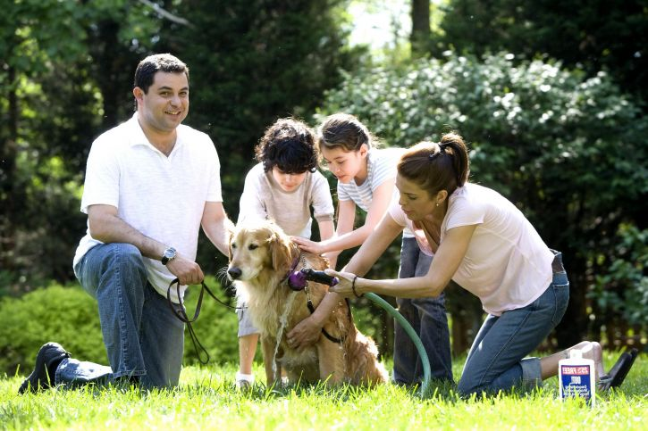
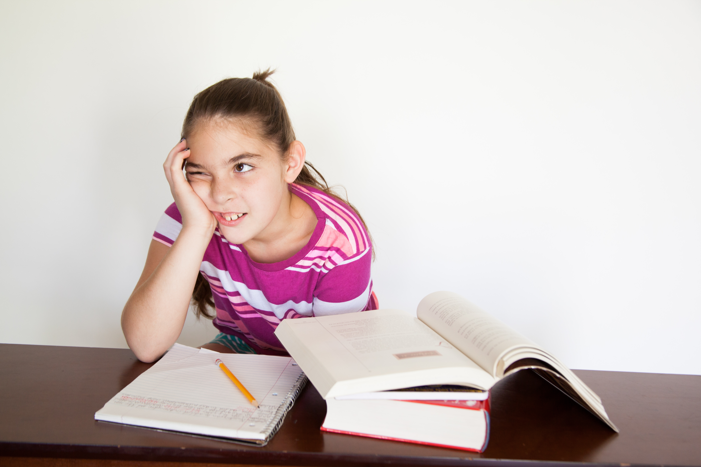
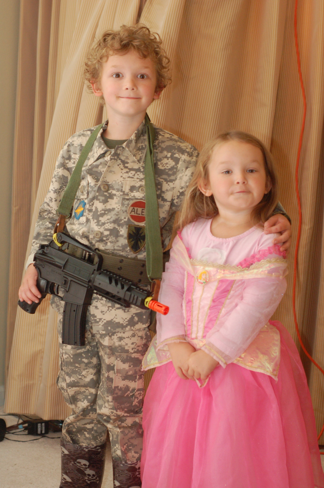
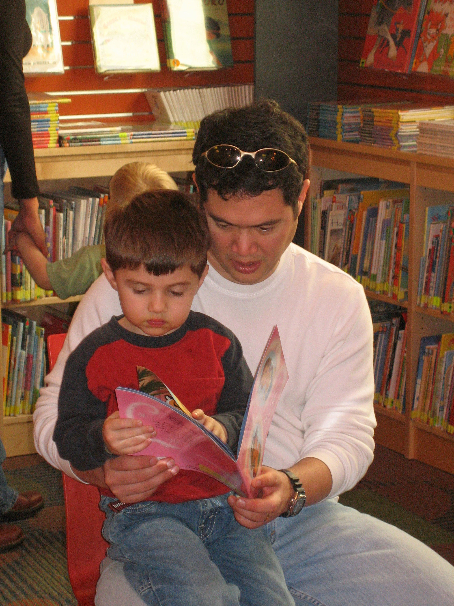
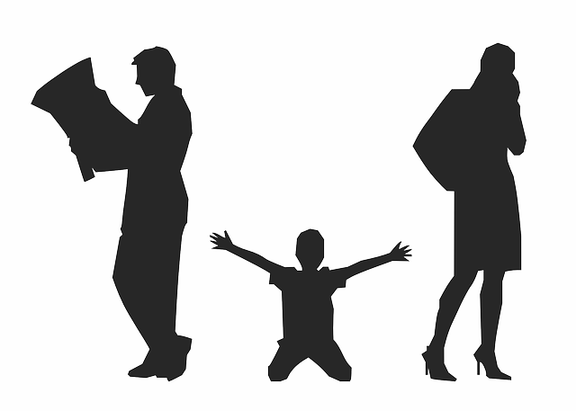
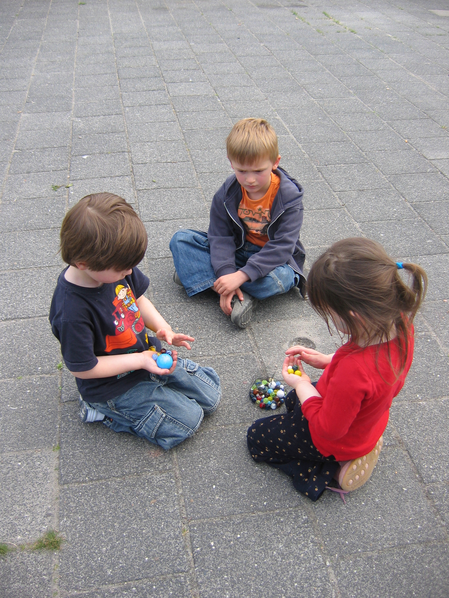

# Middle Childhood - Social Emotional Development

<style>
div.solid {
border: 5px solid #FFA500;
border-radius: 5px;
padding: 20px;
}
</style>

<div class = "solid">

After this chapter, you should be able to:

1. Describe the social emotional theories of development 

2. Examine the importance of positive friendships and peer relationships

3. Describe self-understanding in childhood

4. Identify the types of families children are part of

5. Explain aggression, antisocial behavior, and bullying 


As children get older, their experiences allow them to develop a more realistic understanding of themselves, including both their strengths and weaknesses. This developing self-concept is influenced by messages they receive from their peers, their family, and the media.

</div>

<br/>

## Social Emotional Theories of Development

### Erik Erikson- Industry vs. Inferiority

Erik Erikson proposed that we are motivated by a need to achieve competence in certain areas of our lives. As we’ve learned in previous chapters, Erikson’s psychosocial theory has eight stages of development over the lifespan, from infancy through late adulthood. At each stage there is a conflict, or task, that we need to resolve. Successful completion of each developmental task results in a sense of competence and a healthy personality. Failure to master these tasks leads to feelings of inadequacy.

During the elementary school stage (ages 6-12), children face the task of Industry versus Inferiority. Children begin to compare themselves to their peers to see how they measure up. 

 
```{r fig-12-1, out.width="50%", fig.cap="The academic award this boy is receiving may contribute to his sense of industry.^[[Image](https://commons.wikimedia.org/wiki/File:Best_Creative_Child_Award_2004_(2).jpg) by [Janarthanan kesavan](https://commons.wikimedia.org/w/index.php?title=User:Jana1991pj&action=edit&redlink=1) is licensed under [CC BY-SA 4.0](https://creativecommons.org/licenses/by-sa/4.0/deed.en)]"}

knitr::include_graphics("https://upload.wikimedia.org/wikipedia/commons/c/cc/Best_Creative_Child_Award_2004_%282%29.jpg")

```

They either develop a sense of pride and accomplishment in their schoolwork, sports, social activities, and family life, or they feel inferior and inadequate when they don’t measure up.^[[Psychology - 9.2: Lifespan Theories](https://cnx.org/contents/Sr8Ev5Og@5.121:Edod3PQm@6/Lifespan-Theories) by [CNX Psychology](https://cnx.org/) is licensed under [CC BY 4.0](https://creativecommons.org/licenses/by/4.0/)]

According to Erikson, children in middle childhood are very busy or industrious. They are constantly doing, planning, playing, getting together with friends, achieving. This is a very active time and a time when they are gaining a sense of how they measure up when compared with friends. Erikson believed that if these industrious children can be successful in their endeavors, they will get a sense of confidence for future challenges. If not, a sense of inferiority can be particularly haunting during middle childhood.^[[Sociology: Brief Edition – Explaining Socialization](https://2012books.lardbucket.org/books/sociology-brief-edition-v1.0/s06-02-explaining-socialization.html) by Steven E. Barkan is licensed under [CC BY-NC-SA 3.0](https://creativecommons.org/licenses/by-nc-sa/3.0/)]

### Sigmund Freud - Psychoanalytic Theory 

The great psychoanalyst Sigmund Freud (1856–1939) focused on unconscious, biological forces that he felt shape individual personality. Freud (1933) thought that the personality consists of three parts: the id, the ego, and the superego. The id is the selfish part of the personality and consists of biological instincts that all babies have, including the need for food and, more generally, the demand for immediate gratification. As babies get older, they learn that not all their needs can be immediately satisfied and thus develop the ego, or the rational part of the personality. As children get older still, they internalize society’s norms and values and thus begin to develop their superego, which represents society’s conscience. If a child does not develop normally and the superego does not become strong enough, the individual is more at risk for being driven by the id to commit antisocial behavior.^[[Sociology: Brief Edition – Explaining Socialization](https://2012books.lardbucket.org/books/sociology-brief-edition-v1.0/s06-02-explaining-socialization.html) by Steven E. Barkan is licensed under [CC BY-NC-SA 3.0](https://creativecommons.org/licenses/by-nc-sa/3.0/)]

 
```{r fig-12-2, out.width="50%", fig.cap="Development of the superego helps children overcome their unconscious desire to behave antisocially.^[[Image](https://unsplash.com/photos/0ojJUjSFNbI) by [Annie Spratt](https://unsplash.com/@anniespratt) on [Unsplash](https://unsplash.com/)]"}

knitr::include_graphics("https://images.unsplash.com/photo-1511886771084-37b8b33cf9fc?ixlib=rb-1.2.1&ixid=eyJhcHBfaWQiOjEyMDd9&auto=format&fit=crop&w=741&q=80")

```

### Lawrence Kohlberg’s Stages of Moral Development 

Kohlberg (1963) built on the work of Piaget and was interested in finding out how our moral reasoning changes as we get older. He wanted to find out how people decide what is right and what is wrong. Just as Piaget believed that children’s cognitive development follows specific patterns, Kohlberg (1984) argued that we learn our moral values through active thinking and reasoning, and that moral development follows a series of stages. Kohlberg's six stages are generally organized into three levels of moral reasons. To study moral development, Kohlberg looked at how children (and adults) respond to moral dilemmas. One of Kohlberg’s best known moral dilemmas is the Heinz dilemma: 

> In Europe, a woman was near death from a special kind of cancer. There was one drug that the doctors thought might save her. It was a form of radium that a druggist in the same town had recently discovered. The drug was expensive to make but the druggist was charging ten times what the drug cost him to make. He paid $200 for the radium and charged $2,000 for a small dose of the drug. The sick woman’s husband, Heinz, went to everyone he knew to borrow the money but he could only get together about $1,000, about half of what the drug cost. He told the druggist that his wife was dying and asked him to sell it cheaper or let him pay later. But the druggist said: “No, I discovered the drug and I’m going to make money from it.” Heinz got desperate and broke into the man’s store to steal the drug for his wife. Should the husband have done that? (Kohlberg, 1969, p. 379)^[[Psychology - 9.2: Lifespan Theories](https://cnx.org/contents/Sr8Ev5Og@5.121:Edod3PQm@6/Lifespan-Theories) by [CNX Psychology](https://cnx.org/) is licensed under [CC BY 4.0](https://creativecommons.org/licenses/by/4.0/)]

#### Level One - Preconventional Morality

In stage one, moral reasoning is based on concepts of punishment. The child believes that if the consequence for an action is punishment, then the action was wrong. In the second stage, the child bases his or her thinking on self-interest and reward ("You scratch my back, I'll scratch yours"). The youngest subjects seemed to answer based on what would happen to the man as a result of the act. For example, they might say the man should not break into the pharmacy because the pharmacist might find him and beat him. Or they might say that the man should break in and steal the drug and his wife will give him a big kiss. Right or wrong, both decisions were based on what would physically happen to the man as a result of the act. This is a self-centered approach to moral decision-making. He called this most superficial understanding of right and wrong **preconventional morality**.  Preconventional morality focuses on self-interest. Punishment is avoided and rewards are sought. Adults can also fall into these stages, particularly when they are under pressure. 

#### Level Two - Conventional Morality

Those tested who based their answers on what other people would think of the man as a result of his act, were placed in Level Two. For instance, they might say he should break into the store, then everyone would think he was a good husband, or he should not because it is against the law. In either case, right and wrong is determined by what other people think. In stage three, the person wants to please others. At stage four, the person acknowledges the importance of social norms or laws and wants to be a good member of the group or society. A good decision is one that gains the approval of others or one that complies with the law. This he called **conventional morality**, *people care about the effect of their actions on others*. Some older children, adolescents, and adults use this reasoning. 

Level Three, post conventional morality, is not included because it focuses on adolescence and adulthood. However, it is in the table below if you’d like an overview of Level Three - Stages 5 and 6.

```{r include=F}

table_12_01 <- read_csv("tables/table-12-01.csv")

```


```{r table-12-1}

table_12_01 %>% 
        kable(caption = "Lawrence Kohlberg’s Levels of Moral Reasoning") %>% 
        column_spec(1, background = "white") %>%
        collapse_rows(columns = 1, valign = "top")


```


Although research has supported Kohlberg’s idea that moral reasoning changes from an early emphasis on punishment and social rules and regulations to an emphasis on more general ethical principles, as with Piaget’s approach, Kohlberg’s stage model is probably too simple. For one, people may use higher levels of reasoning for some types of problems but revert to lower levels in situations where doing so is more consistent with their goals or beliefs (Rest, 1979). Second, it has been argued that the stage model is particularly appropriate for Western, rather than non-Western, samples in which allegiance to social norms, such as respect for authority, may be particularly important (Haidt, 2001). In addition, there is frequently little correlation between how we score on the moral stages and how we behave in real life. Perhaps the most important critique of Kohlberg’s theory is that it may describe the moral development of males better than it describes that of females (Jaffee & Hyde, 2000).^[[Lifespan Development: A Psychological Perspective](http://dept.clcillinois.edu/psy/LifespanDevelopment.pdf) by Martha Lally and Suzanne Valentine-French is licensed under [CC BY-NC-SA 3.0](https://creativecommons.org/licenses/by-nc-sa/3.0/)]
 

## Self-Understanding

Children in middle childhood have a more realistic sense of self than do those in early childhood. That exaggerated sense of self as “biggest” or “smartest” or “tallest” gives way to an understanding of one’s strengths and weaknesses. This can be attributed to greater experience in comparing one’s own performance with that of others and to greater cognitive flexibility. A child’s self-concept can be influenced by peers and family and the messages they send about a child’s worth. Contemporary children also receive messages from the media about how they should look and act. Movies, music videos, the internet, and advertisers can all create cultural images of what is desirable or undesirable and this too can influence a child’s self-concept.

 
```{r fig-12-3, out.width="50%", fig.cap="Interactions with the media children’s perception of themselves.^[[Image](https://commons.wikimedia.org/wiki/File:Children_at_school_(8720604364).jpg) by [Lucélia Ribeiro](https://www.flickr.com/people/95639384@N08) is licensed under [CC BY-SA 2.0](https://creativecommons.org/licenses/by-sa/2.0/deed.en)]"}

knitr::include_graphics("https://upload.wikimedia.org/wikipedia/commons/thumb/4/40/Children_at_school_%288720604364%29.jpg/800px-Children_at_school_%288720604364%29.jpg")

```


Remarkably, young children begin developing social understanding very early in life and are also able to include other peoples’ appraisals of them into their self-concept, including parents, teachers, peers, culture, and media. Internalizing others’ appraisals and creating social comparison affect children’s **self-esteem**, which is defined as an evaluation of one’s identity. Children can have individual assessments of how well they perform a variety of activities and also develop an overall, global self-assessment. If there is a discrepancy between how children view themselves and what they consider to be their ideal selves, their self-esteem can be negatively affected.^[[Lifespan Development - Module 6: Middle Childhood](https://courses.lumenlearning.com/lifespandevelopment2/chapter/physical-development-2/) by [Lumen Learning](http://opencourselibrary.org/econ-201/) references [Psyc 200 Lifespan Psychology](http://opencourselibrary.org/econ-201/) by Laura Overstreet, licensed under [CC BY 4.0](https://creativecommons.org/licenses/by/4.0/)]


**Self-concept** refers to beliefs about general personal identity (Seiffert, 2011). These beliefs include personal attributes, such as one’s age, physical characteristics, behaviors, and competencies. Children in middle and late childhood have a more realistic sense of self than do those in early childhood, and they better understand their strengths and weaknesses. This can be attributed to greater experience in comparing their own performance with that of others, and to greater cognitive flexibility. Children in middle and late childhood are also able to include other peoples’ appraisals of them into their self-concept, including parents, teachers, peers, culture, and media. 

Another important development in self-understanding is **self-efficacy**, which is the belief that you are capable of carrying out a specific task or of reaching a specific goal (Bandura, 1977, 1986, 1997). Large discrepancies between self-efficacy and ability can create motivational problems for the individual (Seifert, 2011). If a student believes that he or she can solve mathematical problems, then the student is more likely to attempt the mathematics homework that the teacher assigns. 

Unfortunately, the converse is also true. If a student believes that he or she is incapable of math, then the student is less likely to attempt the math homework regardless of the student's actual ability in math. Since self-efficacy is self-constructed, it is possible for students to miscalculate or misperceive their true skill, and these misperceptions can have complex effects on students' motivations. It is possible to have either too much or too little self-efficacy, and according to Bandura (1997) the optimal level seems to be either at, or slightly above, true ability.^[[Lifespan Development - Module 6: Middle Childhood](https://courses.lumenlearning.com/lifespandevelopment2/chapter/physical-development-2/) by [Lumen Learning](http://opencourselibrary.org/econ-201/) references [Psyc 200 Lifespan Psychology](http://opencourselibrary.org/econ-201/) by Laura Overstreet, licensed under [CC BY 4.0](https://creativecommons.org/licenses/by/4.0/)]
 
 
 
```{r fig-12-4, out.width="50%", fig.cap="Families can support children’s social and emotional skills.^[[Image](https://pixnio.com/people/parent-child-relations) is in the public domain]"}



```


As we have seen, children’s experience of relationships at home and the peer group contributes to an expanding repertoire of social and emotional skills and also to broadened social understanding. In these relationships, children develop expectations for specific people (leading, for example, to secure or insecure attachments to parents), understanding of how to interact with adults and peers, and self-concept based on how others respond to them. These relationships are also significant forums for emotional development.^[[Social and Personality Development in Childhood](https://nobaproject.com/modules/social-and-personality-development-in-childhood) by [NOBA](https://nobaproject.com/) is licensed under [CC BY 4.0](https://creativecommons.org/licenses/by/4.0/)]


## Motivation as Self-Efficacy 

In addition to being influenced by their goals, interests, and attributions, students’ motives are affected by specific beliefs about the student’s personal capacities. In **self-efficacy theory** the beliefs become a primary, explicit explanation for motivation (Bandura, 1977, 1986, 1997). **Self-efficacy** is the belief that you are capable of carrying out a specific task or of reaching a specific goal. As mentioned previously, the optimal level seems to be either at or slightly above true capacity (Bandura, 1997). As we indicate below, large discrepancies between self-efficacy and ability can create motivational problems for the individual.^[[Child Development – Unit 5: Theories (Part II)](https://courses.lumenlearning.com/atd-hostos-childdevelopment/chapter/motivation-as-self-efficacy/) by [Lumen Learning](https://courses.lumenlearning.com/) references [Educational Psychology](https://dl.dropboxusercontent.com/u/31779972/Educational Psychology.pdf) by Kelvin Seifert and Rosemary Sutton, licensed under [CC BY 4.0](https://creativecommons.org/licenses/by/4.0/)]

### Motivation

Motivation refers to a desire, need, or drive that contributes to and explains behavioral changes. In general, motivators provide some sort of incentive for completing a task. One definition of a motivator explains it as a force “acting either on or within a person to initiate behavior.” In addition to biological motives, motivations can be either intrinsic (arising from internal factors) or extrinsic (arising from external factors). 

#### Extrinsic vs. Intrinsic Motivation

Intrinsically motivated behaviors are performed because of the sense of personal satisfaction that they bring. According to Deci (1971), these behaviors are defined as ones for which the reward is the satisfaction of performing the activity itself. Intrinsic motivation thus represents engagement in an activity for its own sake. For example, if comforting a friend makes a child feel good, they are intrinsically motivated to respond to their friend’s distress.

Extrinsically motivated behaviors, on the other hand, are performed in order to receive something from others or avoid certain negative outcomes. The extrinsic motivator is outside of, and acts on, the individual. Rewards—such as a sticker, or candy—are good examples of extrinsic motivators. Social and emotional incentives like praise and attention are also extrinsic motivators since they are bestowed on the individual by another person.

 
```{r fig-12-5, out.width="50%", fig.cap="A lollipop can be an extrinsic motivator.^[[Image](https://pixabay.com/photos/girl-lollipop-childhood-emotions-2796977/) by [strausadolf](https://pixabay.com/users/strausadolf-6385615/) on [Pixabay](https://pixabay.com/)]"}

knitr::include_graphics("https://cdn.pixabay.com/photo/2017/09/28/21/06/girl-2796977_960_720.jpg")

```


### Learned Helplessness and Self-Efficacy

If a person’s sense of self-efficacy is very low, he or she can develop learned helplessness, a perception of complete lack of control in mastering a task. The attitude is similar to depression, a pervasive feeling of apathy and a belief that effort makes no difference and does not lead to success. Learned helplessness was originally studied from the behaviorist perspective of classical and operant conditioning by the psychologist Martin Seligman (1995). In people, learned helplessness leads to characteristic ways of dealing with problems. They tend to attribute the source of a problem to themselves, to generalize the problem to many aspects of life, and to see the problem as lasting or permanent. More optimistic individuals, in contrast, are more likely to attribute a problem to outside sources, to see it as specific to a particular situation or activity, and to see it as temporary or time-limited. Consider, for example, two students who each fail a test. The one with a lot of learned helplessness is more likely to explain the failure by saying something like: “I’m stupid; I never perform well on any schoolwork, and I never will perform well at it.” The other, more optimistic student is more likely to say something like: “The teacher made the test too hard this time, so the test doesn’t prove anything about how I will do next time or in other subjects.”

 
```{r fig-12-6, out.width="50%", fig.cap="If this girl thinks that studying won’t help her do well on the test, her low self-efficacy may develop into learned helplessness.^[[Image](https://www.flickr.com/photos/125892716@N05/14419606327/in/photostream/) by [amenclinicsphotos](https://www.flickr.com/photos/125892716@N05/) ac is licensed under [CC BY-SA 2.0](https://creativecommons.org/licenses/by-sa/2.0/)]"}



```

What is noteworthy about these differences in perception is how much the more optimistic of these perspectives resembles high self-efficacy and how much learned helplessness seems to contradict or differ from it. As already noted, high self-efficacy is a strong belief in one’s capacity to carry out a specific task successfully. By definition, therefore, self-efficacy focuses attention on a temporary or time-limited activity (the task), even though the cause of successful completion (oneself) is “internal.”^[[Child Development – Unit 5: Theories (Part II)](https://courses.lumenlearning.com/atd-hostos-childdevelopment/chapter/motivation-as-self-efficacy/) by [Lumen Learning](https://courses.lumenlearning.com/) references [Educational Psychology](https://dl.dropboxusercontent.com/u/31779972/Educational Psychology.pdf) by Kelvin Seifert and Rosemary Sutton, licensed under [CC BY 4.0](https://creativecommons.org/licenses/by/4.0/)]

## Gender Identity

The development of gender and gender identity is likewise an interaction among social, biological, and representational influences (Ruble, Martin, & Berenbaum, 2006). Young children learn about gender from parents, peers, and others in society, and develop their own conceptions of the attributes associated with maleness or femaleness (called **gender schemas**). They also negotiate biological transitions (such as puberty) that cause their sense of themselves and their sexual identity to mature.

 
```{r fig-12-7, out.width="50%", fig.cap="Social influences such as cultural norms impact children's interests, dress, style of speech and even life aspirations.^[[Image](https://www.flickr.com/photos/mandajuice/5139069106) by [Amanda Westmont](https://www.flickr.com/photos/mandajuice/) is licensed under [CC BY-NC-SA 2.0](https://creativecommons.org/licenses/by-nc-sa/2.0/)]"}



```

Each of these examples of the growth of social and emotional competence illustrates not only the interaction of social, biological, and representational influences, but also how their development unfolds over an extended period. Early influences are important, but not determinative, because the capabilities required for mature moral conduct, gender identity, and other outcomes continue to develop throughout childhood, adolescence, and even the adult years.

As the preceding sentence suggests, social and personality development continues through adolescence and the adult years, and it is influenced by the same constellation of social, biological, and representational influences discussed for childhood. Changing social relationships and roles, biological maturation and (much later) decline, and how the individual represents both experience and the self continue to form the bases for development throughout life. In this respect, when an adult looks forward rather than retrospectively to ask, “What kind of person am I becoming?”—A similarly fascinating, complex, multifaceted interaction of developmental processes lies ahead.^[[Social and Personality Development in Childhood](https://nobaproject.com/modules/social-and-personality-development-in-childhood) by [NOBA](https://nobaproject.com/) is licensed under [CC BY 4.0](https://creativecommons.org/licenses/by/4.0/)]

## Child and the Family 

The reason we turn out much like our parents, for better or worse, is that our families are such an important part of our socialization process. When we are born, our primary caregivers are almost always one or both of our parents. For several years we have more contact with them than with any other adults. Because this contact occurs in our most formative years, our parents’ interaction with us and the messages they teach us can have a profound impact throughout our lives. During middle childhood, children spend less time with parents and more time with peers. Parents may have to modify their approach to parenting to accommodate the child’s growing independence. Using reason and engaging in joint decision-making whenever possible may be the most effective approach (Berk, 2007).^[[Sociology: Brief Edition](https://2012books.lardbucket.org/books/sociology-brief-edition-v1.0/s06-03-agents-of-socialization.html) is licensed under [CC BY-NC-SA 3.0](http://creativecommons.org/licenses/by-nc-sa/3.0/)]

 
```{r fig-12-8a, out.width="50%", fig.cap="When children grow up to love reading, may have been influenced by the positive experiences of being read to in their families.^[[Image](https://www.flickr.com/photos/sanjoselibrary/2925237508) by [San José Public Library](https://www.flickr.com/photos/sanjoselibrary/) is licensed under [CC BY-SA 2.0](https://creativecommons.org/licenses/by-sa/2.0/)]"}



```


### Family Atmosphere
One of the ways to assess the quality of family life is to consider the tasks of families. Berger (2005) lists five family functions:

1. Providing food, clothing and shelter

2. Encouraging learning

3. Developing self-esteem

4. Nurturing friendships with peers

5. Providing harmony and stability

Notice that in addition to providing food, shelter, and clothing, families are responsible for helping the child learn, relate to others, and have a confident sense of self. The family provides a harmonious and stable environment for living. A good home environment is one in which the child’s physical, cognitive, emotional, and social needs are adequately met. Sometimes families emphasize physical needs but ignore cognitive or emotional needs. Other times, families pay close attention to physical needs and academic requirement, but may fail to nurture the child’s friendships with peers or guide the child toward developing healthy relationships. Parents might want to consider how it feels to live in the household. Is it stressful and conflict-ridden? Is it a place where family members enjoy being?^[[Lifespan Development: A Psychological Perspective](http://dept.clcillinois.edu/psy/LifespanDevelopment.pdf) by Martha Lally and Suzanne Valentine-French is licensed under [CC BY-NC-SA 3.0](https://creativecommons.org/licenses/by-nc-sa/3.0/)]


 
```{r fig-12-8b, out.width="50%", fig.cap="This mother is helping her son navigate using a tablet.^[[Image](https://commons.wikimedia.org/wiki/File:Child_and_mother_with_Apple_iPad.jpg) by [Intel Free Press](https://www.flickr.com/photos/intelfreepress/) is licensed under [CC BY-SA 2.0](https://creativecommons.org/licenses/by-sa/2.0/deed.en)]"}

knitr::include_graphics("https://upload.wikimedia.org/wikipedia/commons/thumb/7/7a/Child_and_mother_with_Apple_iPad.jpg/800px-Child_and_mother_with_Apple_iPad.jpg")

```

### The Family Stress Model

Family relationships are significantly affected by conditions outside the home. For instance, the **Family Stress Model** describes how financial difficulties are associated with parents’ depressed moods, which in turn lead to marital problems and poor parenting that contributes to poorer child adjustment (Conger, Conger, & Martin, 2010). Within the home, parental marital difficulty or divorce affects more than half the children growing up today in the United States. Divorce is typically associated with economic stresses for children and parents, the renegotiation of parent-child relationships (with one parent typically as primary custodian and the other assuming a visiting relationship), and many other significant adjustments for children. Divorce is often regarded by children as a sad turning point in their lives, although for most it is not associated with long-term problems of adjustment (Emery, 1999).

### Family Forms 

As discussed previously in chapter 9, the sociology of the family examines the family as an institution and a unit of socialization. Sociological studies of the family look at demographic characteristics of the family members: family size, age, ethnicity and gender of its members, social class of the family, the economic level and mobility of the family, professions of its members, and the education levels of the family members.

Currently, one of the biggest issues that sociologists study are the changing roles of family members. Often, each member is restricted by the gender roles of the traditional family. These roles, such as the father as the breadwinner and the mother as the homemaker, are declining. Now, the mother is often the supplementary provider while retaining the responsibilities of child rearing. In this scenario, females' role in the labor force is "compatible with the demands of the traditional family.” Sociology studies have examined the adaptation of males' role to caregiver as well as provider. The gender roles are becoming increasingly interwoven and various other family forms are becoming more common. 

What Families Look Like
 
```{r fig-12-09, out.width="50%", fig.cap="a childless family^[[Image](https://commons.wikimedia.org/wiki/File:Cozy_Young_Couple_-_Aramgah-e_Hafez_(Tomb_of_Hafez)_-_Shiraz_-_Central_Iran_(7426381248).jpg) by [Adam Jones](https://www.flickr.com/people/41000732@N04) is licensed under [CC BY-SA 2.0](https://creativecommons.org/licenses/by-sa/2.0/deed.en)]"}

knitr::include_graphics("https://upload.wikimedia.org/wikipedia/commons/thumb/4/4c/Cozy_Young_Couple_-_Aramgah-e_Hafez_%28Tomb_of_Hafez%29_-_Shiraz_-_Central_Iran_%287426381248%29.jpg/800px-Cozy_Young_Couple_-_Aramgah-e_Hafez_%28Tomb_of_Hafez%29_-_Shiraz_-_Central_Iran_%287426381248%29.jpg")

```


```{r fig-12-10,  out.width="50%", fig.cap="a single parent (father) family^[[Image](https://pxhere.com/en/photo/493398) is licensed under [CC0](https://creativecommons.org/publicdomain/zero/1.0/)]"}

knitr::include_graphics("https://c.pxhere.com/photos/43/84/father_child_children_girls_family_single_father_dad_lake-493398.jpg!d")

```
 

```{r fig-12-11, out.width="50%", fig.cap="an extended family^[[Image](https://www.jber.jb.mil/News/Commentaries/Display/Article/772274/winning-the-battle-family-surviving-breast-cancer/) by [Joint Base Elmendorf-Richardson](https://www.jber.jb.mil/) is in the public domain]"}

knitr::include_graphics("https://media.defense.gov/2013/Oct/24/2000901851/780/780/0/131023-F-XA488-001.JPG")

```


```{r fig-12-12, out.width="50%", fig.cap="a same-sex family^[[Image](https://commons.wikimedia.org/wiki/File:On_the_beach_with_the_Drewitt-Barlows.jpg) by [Surrogacy-UK](https://commons.wikimedia.org/w/index.php?title=User:Surrogacy-UK&action=edit&redlink=1) is licensed under [CC BY-SA 3.0](https://creativecommons.org/licenses/by-sa/3.0/deed.en)]"}

knitr::include_graphics("https://commons.wikimedia.org/wiki/File:On_the_beach_with_the_Drewitt-Barlows.jpg")

```
 

```{r fig-12-13, out.width="50%", fig.cap="a single parent (mother) family^[[Image](https://www.dvidshub.net/image/662020/bosp-helps-single-parent-soldiers-manage-army-and-family-life) is in the public domain]"}

knitr::include_graphics("https://cdn.dvidshub.net/media/thumbs/photos/1209/662020/1000w_q95.jpg")

```


```{r fig-12-14, out.width="50%", fig.cap="a two-parent (nuclear) family^[[Image](https://www.flickr.com/photos/armymedicine/13584554804) by [Army Medicine](https://www.flickr.com/photos/armymedicine/) is licensed under [CC BY 2.0](https://creativecommons.org/licenses/by/2.0/)]"}

knitr::include_graphics("figures/figure-12-14.jpg")

```


Throughout this textbook and in the preceding images, you can see a variety of types of families. A few of these family types (the ones that are not bolded) were introduced in Chapter 9. Here is a list of some of the diverse types of families: 

#### Families Without Children

**Singlehood family** contains a person who is not married or in a common law relationship. He or she may share a relationship with a partner but lead a single lifestyle.

Couples that are **childless** are often overlooked in the discussion of families.

#### Families with One Parent

A single parent family usually refers to a parent who has most of the day-to-day responsibilities in the raising of the child or children, who are not living with a spouse or partner, or who is not married. The dominant caregiver is the parent with whom the children reside for the majority of the time; if the parents are separated or divorced, children live with their custodial parent and have visitation with their noncustodial parent. In western society in general, following a separation a child will end up with the primary caregiver, usually the mother, and a secondary caregiver, usually the father.

Single parent by choice families refer to a family that a single person builds by choice. These families can be built with the use of assisted reproductive technology and donor gametes (sperm and/or egg) or embryos, surrogacy, foster or kinship care, and adoption. 

#### Two Parent Families

The nuclear family is often referred to as the traditional family structure. It includes two married parents and children. While common in industrialized cultures (such as the U.S.), it is not actually the most common type of family worldwide.^[[Types of Families](https://courses.lumenlearning.com/culturalanthropology/chapter/types-of-families/) by Lumen references [Cultural Anthropology/Social Institutions/Family](http://wikieducator.org/Cultural_Anthropology/Social_Institutions/Family) by [WikiEducator](http://wikieducator.org/Main_Page), which is licensed under [CC0](http://wikieducator.org/WikiEducator:Copyrights)]

**Cohabitation** is an arrangement where two people who are not married live together in an intimate relationship, particularly an emotionally and/or sexually intimate one, on a long-term or permanent basis. Today, cohabitation is a common pattern among people in the Western world. More than two-thirds of married couples in the U.S. say that they lived together before getting married.

Gay and lesbian couples with children have same-sex families. While now recognized legally in the United States, discrimination against same-sex families is not uncommon. According to the American Academy of Pediatrics, there is “ample evidence to show that children raised by same-gender parents fare as well as those raised by heterosexual parents. More than 25 years of research have documented that there is no relationship between parents' sexual orientation and any measure of a child's emotional, psychosocial, and behavioral adjustment. Conscientious and nurturing adults, whether they are men or women, heterosexual or homosexual, can be excellent parents. The rights, benefits, and protections of civil marriage can further strengthen these families.”^[[Same-sex marriage](https://en.wikipedia.org/wiki/Same-sex_marriage#Studies) by [Wikipedia](https://en.wikipedia.org/wiki/Main_Page) is licensed under [CC BY-SA 3.0](https://en.wikipedia.org/wiki/Wikipedia:Text_of_Creative_Commons_Attribution-ShareAlike_3.0_Unported_License)]

**Blended families** describe families with mixed parents: one or both parents remarried, bringing children of the former family into the new family.^[[Family](https://en.wikipedia.org/wiki/Family) by [Wikipedia](https://en.wikipedia.org/wiki/Main_Page) is licensed under [CC BY-SA 3.0](https://en.wikipedia.org/wiki/Wikipedia:Text_of_Creative_Commons_Attribution-ShareAlike_3.0_Unported_License)]  Blended families are complex in a number of ways that can pose unique challenges to those who seek to form successful stepfamily relationships (Visher & Visher, 1985). These families are also referred to as stepfamilies. 

#### Families That Include Additional Adults

**Extended families** include three generations, grandparents, parents, and children. This is the most common type of family worldwide.^[[Types of Families](https://courses.lumenlearning.com/culturalanthropology/chapter/types-of-families/) by Lumen references [Cultural Anthropology/Social Institutions/Family](http://wikieducator.org/Cultural_Anthropology/Social_Institutions/Family) by [WikiEducator](http://wikieducator.org/Main_Page), which is licensed under [CC BY-SA](http://wikieducator.org/WikiEducator:Copyrights)] 

**Families by choice** are relatively newly recognized. Popularized by the LGBTQ community to describe a family not recognized by the legal system. It may include adopted children, live-in partners, kin of each member of the household, and close friends. Increasingly family by choice is being practiced by those who see benefit to including people beyond blood relatives in their families.^[[Types of Families](https://courses.lumenlearning.com/culturalanthropology/chapter/types-of-families/) by Lumen references [Cultural Anthropology/Social Institutions/Family](http://wikieducator.org/Cultural_Anthropology/Social_Institutions/Family) by [WikiEducator](http://wikieducator.org/Main_Page), which is licensed under [CC BY-SA](http://wikieducator.org/WikiEducator:Copyrights)]  

While most families in the U.S. are **monogamous**, some families have more than two married parents. These families are **polygamous**^[[Family](https://en.wikipedia.org/wiki/Family) by [Wikipedia](https://en.wikipedia.org/wiki/Main_Page) is licensed under [CC BY-SA 3.0](https://en.wikipedia.org/wiki/Wikipedia:Text_of_Creative_Commons_Attribution-ShareAlike_3.0_Unported_License)].  Polygamy is illegal in all 50 states, but it is legal in other parts of the world.^[[Legality of polygamy](https://en.wikipedia.org/wiki/Legality_of_polygamy) by [Wikipedia](https://en.wikipedia.org/wiki/Main_Page) is licensed under [CC BY-SA 3.0](https://en.wikipedia.org/wiki/Wikipedia:Text_of_Creative_Commons_Attribution-ShareAlike_3.0_Unported_License)]

#### Additional Forms of Families

**Kinship families** are those in which the full-time care, nurturing, and protection of a child is provided by relatives, members of their Tribe or clan, godparents, stepparents, or other adults who have a family relationship to a child. When children cannot be cared for by their parents, research finds benefits to kinship care.^[[About Kinship Care](https://www.childwelfare.gov/topics/outofhome/kinship/about/) by the [Child Welfare Information Gateway](https://www.childwelfare.gov/) is in the public domain]

When a person assumes the parenting of another, usually a child, from that person's biological or legal parent or parents this creates **adoptive families**. Legal adoption permanently transfers all rights and responsibilities and is intended to affect a permanent change in status and as such requires societal recognition, either through legal or religious sanction. As introduced in Chapter 3, adoption can be done privately, through an agency, or through foster care and in the U.S. or from abroad. Adoptions can be closed (no contact with birth/biological families or open, with different degrees of contact with birth/biological families).  Couples, both opposite and same-sex, and single parents can adopt (although not all agencies and foreign countries will work with unmarried, single, or same-sex intended parents).^[[Adoption](https://en.wikipedia.org/wiki/Adoption) by [Wikipedia](https://en.wikipedia.org/wiki/Main_Page) is licensed under [CC BY-SA 3.0](https://en.wikipedia.org/wiki/Wikipedia:Text_of_Creative_Commons_Attribution-ShareAlike_3.0_Unported_License)] 

When parents are not of the same ethnicity, they build **interracial families**. Until the decision in  Loving v Virginia in 1969, this was not legal in the U.S. There are other parts of the world where marrying someone outside of your race (or social class) has legal and social ramifications.^[[Interracial marriage](https://simple.wikipedia.org/wiki/Interracial_marriage) by [Wikipedia](https://en.wikipedia.org/wiki/Main_Page) is licensed under [CC BY-SA 3.0](https://en.wikipedia.org/wiki/Wikipedia:Text_of_Creative_Commons_Attribution-ShareAlike_3.0_Unported_License)]  These families may experience issues unique to each individual family’s culture. 

### Changes in Families - Divorce

The tasks of families listed above are functions that can be fulfilled in a variety of family types—not just intact, two-parent households. Harmony and stability can be achieved in many family forms and when it is disrupted, either through divorce, or efforts to blend families, or any other circumstances, the child suffers (Hetherington & Kelly, 2002). Changes continue to happen, but for children they are especially vulnerable. Divorce and how it impacts children depends on how the caregivers handle the divorce as well as how they support the emotional needs of the child.

 
```{r fig-12-15, out.width="50%", fig.cap="How divorce impacts children largely depends on how parents handle it.^[[Image](https://www.flickr.com/photos/127478577@N02/16246527741) by [Tony Guyton]() is licensed under [CC BY 2.0](https://creativecommons.org/licenses/by/2.0/)]"}



```

#### Divorce

A lot of attention has been given to the impact of divorce on the life of children. The assumption has been that divorce has a strong, negative impact on the child and that single-parent families are deficient in some way. However, 75-80 percent of children and adults who experience divorce suffer no long-term effects (Hetherington & Kelly, 2002). An objective view of divorce, repartnering, and remarriage indicates that divorce, remarriage and life in stepfamilies can have a variety of effects.^[[Lifespan Development: A Psychological Perspective](http://dept.clcillinois.edu/psy/LifespanDevelopment.pdf) by Martha Lally and Suzanne Valentine-French is licensed under [CC BY-NC-SA 3.0](https://creativecommons.org/licenses/by-nc-sa/3.0/)]
 

##### Factors Affecting the Impact of Divorce

As you look at the consequences (both pro and con) of divorce and remarriage on children, keep these family functions in mind.  Some negative consequences are a result of financial hardship rather than divorce per se (Drexler, 2005).  Some positive consequences reflect improvements in meeting these functions.  For instance, we have learned that a positive self-esteem comes in part from a belief in the self and one’s abilities rather than merely being complimented by others.  In single-parent homes, children may be given more opportunity to discover their own abilities and gain independence that fosters self-esteem.  If divorce leads to fighting between the parents and the child is included in these arguments, their self-esteem may suffer.

The impact of divorce on children depends on a number of factors. The degree of conflict prior to the divorce plays a role. If the divorce means a reduction in tensions, the child may feel relief. If the parents have kept their conflicts hidden, the announcement of a divorce can come as a shock and be met with enormous resentment. Another factor that has a great impact on the child concerns financial hardships they may suffer, especially if financial support is inadequate. Another difficult situation for children of divorce is the position they are put into if the parents continue to argue and fight—especially if they bring the children into those arguments.

**Short-term consequences:** In roughly the first year following divorce, children may exhibit some of these short-term effects:

1. **Grief over losses suffered**. The child will grieve the loss of the parent they no longer see as frequently.  The child may also grieve about other family members that are no longer available.  Grief sometimes comes in the form of sadness but it can also be experienced as anger or withdrawal. Older children may feel depressed.

2. **Reduced Standard of Living**.  Very often, divorce means a change in the amount of money coming into the household. Children experience new constraints on spending or entertainment.  School-aged children, especially, may notice that they can no longer have toys, clothing or other items to which they’ve grown accustomed.  Or it may mean that there is less eating out or being able to afford cable television, and so on. The custodial parent may experience stress at not being able to rely on child support payments or having the same level of income as before.  This can affect decisions regarding healthcare, vacations, rents, mortgages and other expenditures.  And the stress can result in less happiness and relaxation in the home.  The parent who has to take on more work may also be less available to the children.

3. **Adjusting to Transitions**.  Children may also have to adjust to other changes accompanying a divorce.  The divorce might mean moving to a new home and changing schools or friends.  It might mean leaving a neighborhood that has meant a lot to them as well.

**Long-Term consequences:** Here are some effects that go beyond just the first year following divorce.

1. **Economic/Occupational Status.**  One of the most commonly cited long-term effects of divorce is that children of divorce may have lower levels of education or occupational status.  This may be a consequence of lower income and resources for funding education rather than to divorce per se. In those households where economic hardship does not occur, there may be no impact on economic status (Drexler, 2005).

2. **Improved Relationships with the Custodial Parent** (usually the mother): Most children of divorce lead happy, well-adjusted lives and develop stronger, positive relationships with their custodial parent (Seccombe and Warner, 2004). Others have also found that relationships between mothers and children become closer and stronger (Guttman, 1993) and suggest that greater equality and less rigid parenting is beneficial after divorce (Steward, Copeland, Chester, Malley, and Barenbaum, 1997).

3. **Greater emotional independence in sons.** Drexler (2005) notes that sons who are raised by mothers only develop an emotional sensitivity to others that is beneficial in relationships.

4. **Feeling more anxious in their own love relationships.** Children of divorce may feel more anxious about their own relationships as adults.  This may reflect a fear of divorce if things go wrong, or it may be a result of setting higher expectations for their own relationships.

5. **Adjustment of the custodial parent.**  Furstenberg and Cherlin (1991) believe that the primary factor influencing the way that children adjust to divorce is the way the custodial parent adjusts to the divorce.  If that parent is adjusting well, the children will benefit.  This may explain a good deal of the variation we find in children of divorce.^[[Lifespan Development - Module 6: Middle Childhood](https://courses.lumenlearning.com/lifespandevelopment2/chapter/physical-development-2/) by [Lumen Learning](http://opencourselibrary.org/econ-201/) references [Psyc 200 Lifespan Psychology](http://opencourselibrary.org/econ-201/) by Laura Overstreet, licensed under [CC BY 4.0](https://creativecommons.org/licenses/by/4.0/)]


 
```{r fig-12-16, out.width="50%", fig.cap="Jeanette Wilinski is the mother of Elizabeth, Logan and Alexis. As a single mom, she has to find a balance between taking care of the Air Force mission and taking care of her children.^[[Image](https://www.scott.af.mil/News/Features/Display/Article/162452/scott-sergeant-balances-work-and-single-motherhood/) by the [Scott Air Force Base](https://www.scott.af.mil/News/Features/Display/Article/162452/scott-sergeant-balances-work-and-single-motherhood/) is in the public domain]"}

knitr::include_graphics("https://media.defense.gov/2013/Feb/04/2000079025/780/780/0/130103-F-ES880-126.JPG")

```

Families are the most important part of the 6 to 11-year-old life. However, peers and friendships become more and more important to the child in middle childhood. 

## Friendships, Peers, and Peer groups

Parent-child relationships are not the only significant relationships in a child’s life. Friendships take on new importance as judges of one’s worth, competence, and attractiveness. Friendships provide the opportunity for learning social skills such as how to communicate with others and how to negotiate differences. Children get ideas from one another about how to perform certain tasks, how to gain popularity, what to wear, say, and listen to, and how to act. This society of children marks a transition from a life focused on the family to a life concerned with peers. Peers play a key role in a child’s self-esteem at this age as any parent who has tried to console a rejected child will tell you. No matter how complimentary and encouraging the parent may be, being rejected by friends can only be remedied by renewed acceptance.^[[Lifespan Development - Module 6: Middle Childhood](https://courses.lumenlearning.com/lifespandevelopment2/chapter/physical-development-2/) by [Lumen Learning](http://opencourselibrary.org/econ-201/) references [Psyc 200 Lifespan Psychology](http://opencourselibrary.org/econ-201/) by Laura Overstreet, licensed under [CC BY 4.0](https://creativecommons.org/licenses/by/4.0/)]
 

```{r fig-12-17, out.width="50%", fig.cap="Peers influence a child’s self-esteem.^[[Image](https://www.robins.af.mil/News/Features/Display/Article/840491/youth-center-caters-to-teens-school-aged-children/) by [Robins Air Force Base](https://www.robins.af.mil/) is in the public domain]"}

knitr::include_graphics("https://media.defense.gov/2016/Mar/11/2001482762/780/780/0/160304-F-UI543-030.JPG")

```

Children’s conceptualization of what makes someone a “friend” changes from a more egocentric understanding to one based on mutual trust and commitment. Both Bigelow (1977) and Selman (1980) believe that these changes are linked to advances in cognitive development. Bigelow and La Gaipa (1975) outline three stages to children’s conceptualization of friendship.^[[Lifespan Development - Module 6: Middle Childhood](https://courses.lumenlearning.com/lifespandevelopment2/chapter/physical-development-2/) by [Lumen Learning](http://opencourselibrary.org/econ-201/) references [Psyc 200 Lifespan Psychology](http://opencourselibrary.org/econ-201/) by Laura Overstreet, licensed under [CC BY 4.0](https://creativecommons.org/licenses/by/4.0/)]


```{r table-12-02, include=F}

table_12_02 <- read_csv("tables/table-12-02.csv")

```


```{r}

table_12_02 %>% 
        kable(caption = "Three Stages to Children’s Conceptualization of Friendship^[[Lifespan Development - Module 6: Middle Childhood](https://courses.lumenlearning.com/lifespandevelopment2/chapter/physical-development-2/) by [Lumen Learning](http://opencourselibrary.org/econ-201/) references [Psyc 200 Lifespan Psychology](http://opencourselibrary.org/econ-201/) by Laura Overstreet, licensed under [CC BY 4.0](https://creativecommons.org/licenses/by/4.0/)]
")


```

Friendships are very important for children. The social interaction with another child who is similar in age, skills, and knowledge provokes the development of many social skills that are valuable for the rest of life (Bukowski, Buhrmester, & Underwood, 2011).  In these relationships, children learn how to initiate and maintain social interactions with other children. They learn skills for managing conflict, such as turn-taking, compromise, and bargaining. Play also involves the mutual, sometimes complex, coordination of goals, actions, and understanding. Through these experiences, children develop friendships that provide additional sources of security and support to those provided by their parents.^[Content by Dawn Rymond is licensed under [CC BY 4.0](https://creativecommons.org/licenses/by/4.0/); ^[[Lifespan Development: A Psychological Perspective](http://dept.clcillinois.edu/psy/LifespanDevelopment.pdf) by Martha Lally and Suzanne Valentine-French is licensed under [CC BY-NC-SA 3.0](https://creativecommons.org/licenses/by-nc-sa/3.0/)]]

<style>
div.blue {background-color:#e6f0ff; border-radius: 5px; padding: 20px;}
</style>
<div class = "blue">

Five Stages of Friendship from Early Childhood through Adulthood^[[Lifespan Development: A Psychological Perspective](http://dept.clcillinois.edu/psy/LifespanDevelopment.pdf) by Martha Lally and Suzanne Valentine-French is licensed under [CC BY-NC-SA 3.0](https://creativecommons.org/licenses/by-nc-sa/3.0/)]{-}

Selman (1980) outlines five stages of friendship from early childhood through to adulthood. 

* In stage 0, **momentary physical interaction**, *a friend is someone who you are playing with at this point in time*. Selman notes that this is typical of children between the ages of three and six. These early friendships are based more on circumstances (e.g., a neighbor) than on genuine similarities. 

* In stage 1, **one-way assistance**, *a friend is someone who does nice things for you*, such as saving you a seat on the school bus or sharing a toy. However, children in this stage, do not always think about what they are contributing to the relationships. Nonetheless, having a friend is important and children will sometimes put up with a not so nice friend, just to have a friend. Children as young as five and as old as nine may be in this stage.

* In stage 2, **fair-weather cooperation**, children are very concerned with fairness and reciprocity, and thus, *a friend is someone who returns a favor*. In this stage, if a child does something nice for a friend there is an expectation that the friend will do something nice for them at the first available opportunity. When this fails to happen, a child may break off the friendship. Selman found that some children as young as seven and as old as twelve are in this stage.

* In stage 3, **intimate and mutual sharing**, typically between the ages of eight and fifteen, *a friend is someone who you can tell them things you would tell no one else*. Children and teens in this stage no longer “keep score,” and do things for a friend because they genuinely care for the person. If a friendship dissolves in this stage it is usually due to a violation of trust. However, children in this stage do expect their friend to share similar interests and viewpoints and may take it as a betrayal if a friend likes someone that they do not.

* In stage 4, **autonomous interdependence**, *a friend is someone who accepts you and that you accept as they are*. In this stage children, teens, and adults accept and even appreciate differences between themselves and their friends. They are also not as possessive, so they are less likely to feel threatened if their friends have other relationships or interests. Children are typically twelve or older in this stage. 


</div>

### Peer Groups

However, peer relationships can be challenging as well as supportive (Rubin, Coplan, Chen, Bowker, & McDonald, 2011). Being accepted by other children is an important source of affirmation and self-esteem, but peer rejection can foreshadow later behavior problems (especially when children are rejected due to aggressive behavior). With increasing age, children confront the challenges of bullying, peer victimization, and managing conformity pressures. Social comparison with peers is an important means by which children evaluate their skills, knowledge, and personal qualities, but it may cause them to feel that they do not measure up well against others. For example, a boy who is not athletic may feel unworthy of his football-playing peers and revert to shy behavior, isolating himself and avoiding conversation. Conversely, an athlete who doesn’t “get” Shakespeare may feel embarrassed and avoid reading altogether. 

 
```{r fig-12-18, out.width="50%", fig.cap="Social comparison with peers is an important means by which children evaluate their value.^[[Image](https://www.army.mil/article/84007/camp_provides_safety_adventures_to_last_kids_the_summer) by the [U.S Army](https://www.army.mil/) is in the public domain]"}

knitr::include_graphics("https://api.army.mil/e2/c/images/2012/07/20/256785/size0.jpg")

```

Also, with the approach of adolescence, peer relationships become focused on psychological intimacy, involving personal disclosure, vulnerability, and loyalty (or its betrayal)—which significantly affect a child’s outlook on the world. Each of these aspects of peer relationships require developing very different social and emotional skills than those that emerge in parent-child relationships. They also illustrate the many ways that peer relationships influence the growth of personality and self-concept.^[[Lifespan Development: A Psychological Perspective](http://dept.clcillinois.edu/psy/LifespanDevelopment.pdf) by Martha Lally and Suzanne Valentine-French is licensed under [CC BY-NC-SA 3.0](https://creativecommons.org/licenses/by-nc-sa/3.0/)]


## Peer Relationships

Most children want to be liked and accepted by their friends. Some popular children are nice and have good social skills. These popular-prosocial children tend to do well in school and are cooperative and friendly. Popular-antisocial children may gain popularity by acting tough or spreading rumors about others (Cillessen & Mayeux, 2004). Rejected children are sometimes excluded because they are shy and withdrawn. The withdrawn-rejected children are easy targets for bullies because they are unlikely to retaliate when belittled (Boulton, 1999). Other rejected children are ostracized because they are aggressive, loud, and confrontational. The aggressive-rejected children may be acting out of a feeling of insecurity. Unfortunately, their fear of rejection only leads to behavior that brings further rejection from other children. Children who are not accepted are more likely to experience conflict, lack confidence, and have trouble adjusting.

 
```{r fig-12-19, out.width="50%", fig.cap="Peer relationships are particularly important for children. They can be supportive but also challenging. Peer rejection may lead to behavioral problems later in life.^[[Image](https://www.flickr.com/photos/tupwanders/83092660/) by [tup wanders](https://www.flickr.com/photos/tupwanders/) is licensed under [CC BY 2.0](https://creativecommons.org/licenses/by/2.0/)]"}



```

Peer Relationships are studied using **sociometric assessment** (which measures attraction between members of a group). Children are asked to mention the three children they like to play with the most, and those they do not like to play with. The number of times a child is nominated for each of the two categories (like and do not like) is tabulated. Based on those tabulations, children are categorized into the following: 

```{r table-12-03, include=F}

table_12_03 <- read_csv("tables/table-12-03.csv")

```


```{r}

table_12_03 %>% 
        kable(caption = "Categories in Peer Relationships^[[Lifespan Development: A Psychological Perspective](http://dept.clcillinois.edu/psy/LifespanDevelopment.pdf) by Martha Lally and Suzanne Valentine-French is licensed under [CC BY-NC-SA 3.0](https://creativecommons.org/licenses/by-nc-sa/3.0/)]")


```

Unfortunately for rejected children, their fear of rejection only leads to behavior that brings further rejection from other children. Children who are not accepted are more likely to experience conflict, lack confidence, and have trouble adjusting. (Klima & Repetti, 2008; Schwartz, Lansford, Dodge, Pettit, & Bates, 2014).^[[Lifespan Development: A Psychological Perspective](http://dept.clcillinois.edu/psy/LifespanDevelopment.pdf) by Martha Lally and Suzanne Valentine-French is licensed under [CC BY-NC-SA 3.0](https://creativecommons.org/licenses/by-nc-sa/3.0/)]

## Aggression, Antisocial Behavior, Bullies, & Victims 

### Aggression and Antisocial Behavior

Aggression may be physical or verbal/emotional. Aggression is activated in large part by the amygdala and regulated by the prefrontal cortex. 

 
```{r fig-12-20, out.width="50%", fig.cap="This boy is threatening physical aggression.^[[Image](https://www.flickr.com/photos/34547181@N00/5653340435/) by [Philippe Put](https://www.flickr.com/photos/34547181@N00/) is licensed under [CC BY 2.0](https://creativecommons.org/licenses/by/2.0/)]"}

knitr::include_graphics("figures/figure-12-20.jpg")

```

Testosterone is associated with increased aggression in both males and females. Aggression is also caused by negative experiences and emotions, including frustration, pain, and heat. As predicted by principles of observational learning, research evidence makes it very clear that, on average, people who watch violent behavior become more aggressive. Early, antisocial behavior leads to befriending others who also engage in antisocial behavior, which only perpetuates the downward cycle of aggression and wrongful acts.^[[Sociology: Brief Edition](https://2012books.lardbucket.org/books/beginning-psychology/s18-04-chapter-summary.html) is licensed under [CC BY-NC-SA 3.0](http://creativecommons.org/licenses/by-nc-sa/3.0/)]

### Bullying and Victims

According to Stopbullying.gov (2016), a federal government website managed by the U.S. Department of Health & Human Services, bullying is defined as unwanted, aggressive behavior among school aged children that involves a real or perceived power imbalance. Further, the aggressive behavior happens more than once or has the potential to be repeated. There are different types of bullying, including verbal bullying, which is saying or writing mean things, teasing, name-calling, taunting, threatening, or making inappropriate sexual comments. Social bullying, also referred to as relational bullying, involves spreading rumors, purposefully excluding someone from a group, or embarrassing someone on purpose. Physical bullying involves hurting a person’s body or possessions. 

A more recent form of bullying is **cyberbullying**, which involves electronic technology. Examples of cyberbullying include sending mean text messages or emails, creating fake profiles, and posting embarrassing pictures, videos or rumors on social networking sites. Children who experience cyberbullying have a harder time getting away from the behavior because it can occur any time of day and without being in the presence of others (Stopbullying.gov, 2016).^[[Lifespan Development: A Psychological Perspective](http://dept.clcillinois.edu/psy/LifespanDevelopment.pdf) by Martha Lally and Suzanne Valentine-French is licensed under [CC BY-NC-SA 3.0](https://creativecommons.org/licenses/by-nc-sa/3.0/)]


```{r fig-12-21, out.width="50%", fig.cap="Cyberbullying can be devastating for children.^[[Image](https://pixabay.com/photos/bullying-hands-face-curl-up-her-679274/) on [Pixabay](https://pixabay.com/) ]"}

knitr::include_graphics("https://cdn.pixabay.com/photo/2015/03/18/13/04/bullying-679274_960_720.jpg")

```

#### Those at Risk for Bullying

Bullying can happen to anyone but some students are at an increased risk for being bullied, including lesbian, gay, bisexual, transgendered (LGBT) youth, those with disabilities, and those who are socially isolated. Additionally, those who are perceived as different, weak, less popular, overweight, or having low self-esteem, have a higher likelihood of being bullied. 

#### Those Who are More Likely to Bully

Bullies are often thought of as having low self-esteem, and then bully others to feel better about themselves. Although this can occur, many bullies in fact have high levels of self-esteem. They possess considerable popularity and social power and have well-connected peer relationships. They do not lack self-esteem, and instead lack empathy for others. They like to dominate or be in charge of others. 

#### Bullied Children 

Unfortunately, most children do not let adults know that they are being bullied. Some fear retaliation from the bully, while others are too embarrassed to ask for help. Those who are socially isolated may not know who to ask for help or believe that no one would care or assist them if they did ask for assistance. Consequently, it is important for parents and teachers to know the warning signs that may indicate a child is being bullied. These include: unexplainable injuries, lost or destroyed possessions, changes in eating or sleeping patterns, declining school grades, not wanting to go to school, loss of friends, decreased self-esteem and/or self-destructive behaviors.

<br/>
<style>
div.solid {
border: 5px solid #FFA500;
border-radius: 5px;
padding: 20px;
}
</style>

<div class = "solid">

In this chapter we looked at:

* Erikson’s fourth stage of industry vs. inferiority

* Kohlberg’s stages of moral development

* How school-age children continue to develop their self-understanding

* The role of the family and different forms of families

* Divorce and how it changes the family

* The importance of peers and friendships

* Children in peer groups and types of friendships

* Consequences of peer acceptance or rejection

In the next chapter we will be moving on to our last period of development and examining physical development in adolescence.

</div>

<br/>
