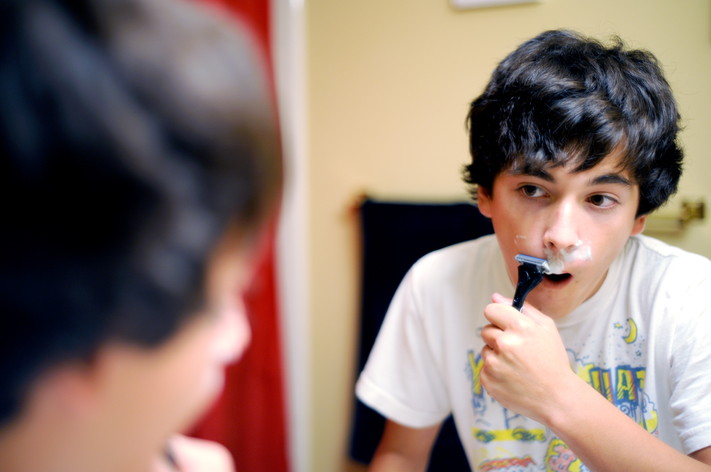
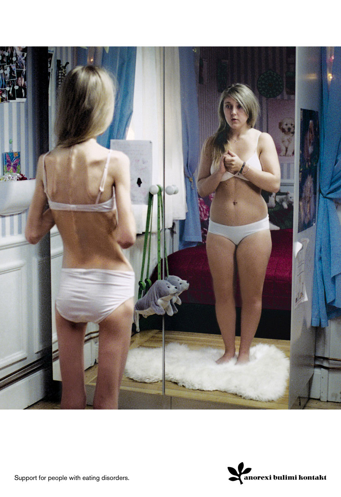
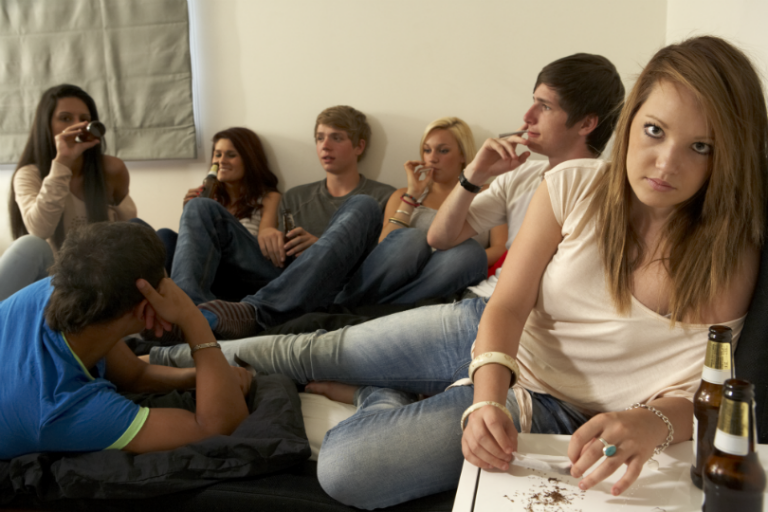
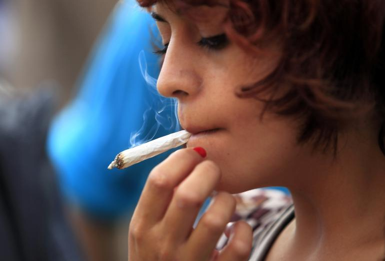

# Adolescence – Physical Development

<style>
div.solid {
border: 5px solid #FFA500;
border-radius: 5px;
padding: 20px;
}
</style>

<div class = "solid">

After this chapter, you should be able to:

1. Explain the changes in physical growth and brain growth 

2. Compare and contrast different male and female changes that occur during puberty 

3. Discuss teenage pregnancy, birth control, and sexual health 

4. Summarize adolescent health: sleep, diet, and exercise

5. Discuss drug and substance abuse

6. Explain the prevalence, risk factors, and consequences of adolescent pregnancy and sexual health

7. Describe several mental health issues for teens


Adolescence is often defined as the period that begins with puberty and ends with the transition to adulthood. The commonly accepted beginning age for this period of development is age 12. When adolescence ends is harder to pin down. When does adulthood truly begin? Are we an adult at 18 years of age? Or 20? Or even older?

Adolescence physical development has evolved historically, with evidence indicating that this stage is lengthening as individuals start puberty earlier and transition to adulthood later than in the past. Puberty today begins, on average, at age 10–11 years for girls and 11–12 years for boys. This average age of onset has decreased gradually over time since the 19th century by 3–4 months per decade, which has been attributed to a range of factors including better nutrition, obesity, increased father absence, and other environmental factors (Steinberg, 2013). Completion of formal education, financial independence from parents, marriage, and parenthood have all been markers of the end of adolescence and beginning of adulthood, and all of these transitions happen, on average, later now than in the past. 

</div>

<br/>

## Physical Growth in Adolescence

The **adolescent growth spurt** is a rapid increase in an individual’s height and weight during puberty resulting from the simultaneous release of growth hormones, thyroid hormones, and androgens. Males experience their growth spurt about two years later than females. The accelerated growth in various body parts happens at different times, but for all adolescents it has a fairly regular sequence. The first places to grow are the extremities (head, hands, and feet), followed by the arms and legs, and later the torso and shoulders. This non-uniform growth is one reason why an adolescent body may seem out of proportion. During puberty, bones become harder and more brittle.  

Before puberty, there are nearly no differences between males and females in the distribution of fat and muscle. During puberty, males grow muscle much faster than females, and females experience a higher increase in body fat. An adolescent’s heart and lungs increase in both size and capacity during puberty; these changes contribute to increased strength and tolerance for exercise. 

 
```{r fig-13-01, out.width="30%", fig.cap="An adolescent boy^[[Image](https://pixabay.com/photos/boy-teenager-teenage-boy-young-2691486/) on [Pixabay](https://pixabay.com/)]"}

knitr::include_graphics("https://cdn.pixabay.com/photo/2017/08/28/22/12/boy-2691486_960_720.jpg")

```

```{r fig-13-02, out.width="30%", fig.cap="An adolescent girl^[[Image](https://pixabay.com/photos/hijab-muslim-indonesia-ramadan-2355655/) on [Pixabay](https://pixabay.com/)]"}

knitr::include_graphics("https://cdn.pixabay.com/photo/2017/05/30/03/48/hijab-2355655_960_720.jpg")

```

## Brain Growth

Brain Growth continues into the early 20s. The development of the frontal lobe, in particular, is important during this stage. Adolescents often engage in increased risk-taking behaviors and experience heightened emotions during puberty; this may be due to the fact that the frontal lobes of their brains—which are responsible for judgment, impulse control, and planning—are still maturing until early adulthood (Casey, Tottenham, Liston, & Durston, 2005)

 
```{r fig-13-03, out.width="50%", fig.cap="The brain continues developing into early adulthood.^[[Image](https://commons.wikimedia.org/wiki/File:LobesCaptsLateral.png) by [Sebastian023](https://commons.wikimedia.org/w/index.php?title=User:Sebastian023&action=edit&redlink=1) is licensed under [CC BY-SA 3.0](https://creativecommons.org/licenses/by-sa/3.0/deed.en)]"}

knitr::include_graphics("https://upload.wikimedia.org/wikipedia/commons/thumb/4/46/LobesCaptsLateral.png/800px-LobesCaptsLateral.png")

```

The brain undergoes dramatic changes during adolescence. Although it does not get larger, it matures by becoming more interconnected and specialized (Giedd, 2015). The myelination and development of connections between neurons continues. This results in an increase in the white matter of the brain, and allows the adolescent to make significant improvements in their thinking and processing skills. Different brain areas become myelinated at different times. For example, the brain’s language areas undergo myelination during the first 13 years. Completed insulation of the axons consolidates these language skills but makes it more difficult to learn a second language. With greater myelination, however, comes diminished plasticity as a myelin coating inhibits the growth of new connections (Dobbs, 2012). 

Even as the connections between neurons are strengthened, synaptic pruning occurs more than during childhood as the brain adapts to changes in the environment. This **synaptic pruning** causes the gray matter of the brain, or the cortex, to become thinner but more efficient (Dobbs, 2012). The corpus callosum, which connects the two hemispheres, continues to thicken, allowing for stronger connections between brain areas. Additionally, the hippocampus becomes more strongly connected to the frontal lobes, allowing for greater integration of memory and experiences into our decision-making.^[[Lifespan Development: A Psychological Perspective](http://dept.clcillinois.edu/psy/LifespanDevelopment.pdf) by Martha Lally and Suzanne Valentine-French is licensed under [CC BY-NC-SA 3.0](https://creativecommons.org/licenses/by-nc-sa/3.0/)]
  

```{r fig-13-04, out.width="50%", fig.cap="During adolescence the brain becomes more interconnected and specialized.^[[Image](https://commons.wikimedia.org/wiki/File:Blausen_0102_Brain_Motor%26Sensory_(flipped).png) by [BruceBlaus](https://commons.wikimedia.org/wiki/User:BruceBlaus) is licensed under [CC BY 3.0](https://creativecommons.org/licenses/by/3.0/deed.en)]"}

knitr::include_graphics("https://upload.wikimedia.org/wikipedia/commons/thumb/b/bb/Blausen_0102_Brain_Motor%26Sensory_%28flipped%29.png/800px-Blausen_0102_Brain_Motor%26Sensory_%28flipped%29.png")

```

The **limbic system**, which regulates emotion and reward, is linked to the hormonal changes that occur at puberty. The limbic system is also related to novelty seeking and a shift toward interacting with peers. In contrast, the **prefrontal cortex**, which is involved in the control of impulses, organization, planning, and making good decisions, does not fully develop until the mid-20s. According to Giedd (2015) the significant aspect of the later developing prefrontal cortex and early development of the limbic system is the “mismatch” in timing between the two. The approximately ten years that separates the development of these two brain areas can result in risky behavior, poor decision-making, and weak emotional control for the adolescent. When puberty begins earlier, this mismatch extends even further. 

Teens often take more risks than adults and, according to research, it is because they weigh risks and rewards differently than adults do (Dobbs, 2012). For adolescents, the brain’s sensitivity to the neurotransmitter dopamine peaks, and **dopamine** is involved in reward circuits so the possible rewards outweigh the risks. Adolescents respond especially strongly to social rewards during activities, and they prefer the company of others their same age. In addition to dopamine, the adolescent brain is affected by **oxytocin**, which facilitates bonding and makes social connections more rewarding. With both dopamine and oxytocin engaged, it is no wonder that adolescents seek peers and excitement in their lives that could end up actually harming them. 

Because of all the changes that occur in the adolescent brain, the chances for abnormal development can occur, including mental illness. In fact, 50% of mental illness occurs by the age 14 and 75% occurs by age 24 (Giedd, 2015). Additionally, during this period of development the adolescent brain is especially vulnerable to damage from drug exposure. For example, repeated exposure to marijuana can affect cellular activity in the endocannabinoid system. Consequently, adolescents are more sensitive to the effects of repeated marijuana exposure (Weir, 2015).

However, researchers have also focused on the highly adaptive qualities of the adolescent brain, which allow the adolescent to move away from the family towards the outside world (Dobbs, 2012; Giedd, 2015). Novelty seeking and risk taking can generate positive outcomes including meeting new people and seeking out new situations. Separating from the family and moving into new relationships and different experiences are actually quite adaptive for society.^[[An Introduction to Nutrition- Nutrition through the Life Cycle: From Pregnancy to the Toddler Years](https://2012books.lardbucket.org/books/an-introduction-to-nutrition/s16-00-nutrition-through-the-life-cyc.html) by [Maureen Zimmerman and Beth Snow](https://2012books.lardbucket.org/books/an-introduction-to-nutrition/s01-about-the-authors.html) is licensed under [CC BY-NC-SA 3.0](https://creativecommons.org/licenses/by-nc-sa/3.0/)]

 
```{r fig-13-05, out.width="50%", fig.cap="Adolescents prefer the company of others their same age.^[[Image](https://unsplash.com/photos/kRXb0rFoXMc) by [Bailey Torres](https://unsplash.com/@bailstorres) on [Unsplash](https://unsplash.com/)]"}

knitr::include_graphics("https://images.unsplash.com/photo-1527090820885-efdd40ab2657?ixlib=rb-1.2.1&ixid=eyJhcHBfaWQiOjEyMDd9&auto=format&fit=crop&w=750&q=80")

```

The physical growth and the changes of puberty mark the onset of adolescence (Lerner & Steinberg, 2009). For both boys and girls, these changes include a growth spurt in height, growth of pubic and underarm hair, and skin changes (e.g., pimples). Hormones drive these pubescent changes, particularly the increase in testosterone for boys and estrogen for girls.^[[Adolescent Development](https://nobaproject.com/modules/adolescent-development) by [Jennifer Lansford](https://2012books.lardbucket.org/books/beginning-psychology/s01-about-the-author.html) is licensed under [CC BY-NC-SA 4.0](https://creativecommons.org/licenses/by-nc-sa/4.0/deed.en_US)]

## Physical Changes in Adolescence 

Adolescence begins with the onset of **puberty**, a developmental period in which hormonal changes cause rapid physical alterations in the body, culminating in sexual maturity.  Although the timing varies to some degree across cultures, the average age range for reaching puberty is between 9 and 14 years for girls and between 10 and 17 years for boys (Marshall & Tanner, 1986). This period of physical development of the adolescent age 9-13 is divided into two phases.^[[Adolescence: Developing Independence and Identity](https://2012books.lardbucket.org/books/beginning-psychology/s10-03-adolescence-developing-indepen.html) by [Charles Stangor](https://2012books.lardbucket.org/books/beginning-psychology/s01-about-the-author.html) is licensed under [CC BY-NC-SA 3.0](https://creativecommons.org/licenses/by-nc-sa/3.0/)]

 
```{r fig-13-06, out.width="75%", fig.cap="Puberty brings dramatic changes in the body, including the development of primary and secondary sex characteristics.^[[Image](www.opentextbooks.org.hk/ditatopic/26941) by the [Open University of Hong Kong](http://www.ouhk.edu.hk/) is licensed under [CC BY-SA 4.0](http://creativecommons.org/licenses/by-sa/4.0/)]"}

knitr::include_graphics("http://www.opentextbooks.org.hk/system/files/resource/18/18735/26941/media/image4.png")

```

The first phase of puberty begins when the pituitary gland begins to stimulate the production of the male sex hormone **testosterone** in boys and the female sex hormones **estrogen** and **progesterone** in girls. The release of these sex hormones triggers the development of the **primary sex characteristics**, the sex organs concerned with reproduction.  It also involves height increases from 20 to 25 percent. Puberty is second to the prenatal period in terms of rapid growth as the long bones stretch to their final, adult size. Girls grow 2–8 inches (5–20 centimeters) taller, while boys grow 4–12 inches (10–30 centimeters) taller. 

**Secondary sexual characteristics** are visible physical changes not directly linked to reproduction but signal sexual maturity. The growth spurt for girls usually occurs earlier than that for boys, with some boys continuing to grow into their 20s. For males this includes broader shoulders, an enlarged Adam’s apple, and a lower voice as the **larynx** grows. Boys typically begin to grow facial hair between ages 14 and 16, which becomes coarser and darker, and hair growth occurs in the pubic area, under the arms, and on the face.

For females the enlargement of breasts is usually the first sign of puberty and, on average, occurs between ages 10 and 12 (Marshall & Tanner, 1986). Girl’s hips broaden and pubic and underarm hair develops and becomes darker and coarser. Both boys and girls experience a rapid growth spurt during this stage. Males and females may begin shaving during this time period as well as showing signs of acne on their faces and bodies. 


```{r fig-13-07, out.width="50%", fig.cap="Males often start shaving during puberty.^[[Image](https://www.flickr.com/photos/alanant/3851416310) by [Antiporda Productions](https://www.flickr.com/photos/alanant/) is licensed under [CC BY 2.0](https://creativecommons.org/licenses/by/2.0/)]"}



```


**Acne** is an unpleasant consequence of the hormonal changes in puberty. **Acne** is defined as pimples on the skin due to overactive sebaceous (oil-producing) glands (Dolgin, 2011). These glands develop at a greater speed than the skin ducts that discharge the oil. Consequently, the ducts can become blocked with dead skin and acne will develop. According to the University of California at Los Angeles Medical Center (2000), approximately 85% of adolescents develop acne, and boys develop acne more than girls because of greater levels of testosterone in their systems (Dolgin, 2011). Hormones that are also responsible for sexual development can also wreak havoc on the teenage skin.^[[Lifespan Development: A Psychological Perspective](http://dept.clcillinois.edu/psy/LifespanDevelopment.pdf) by Martha Lally and Suzanne Valentine-French is licensed under [CC BY-NC-SA 3.0](https://creativecommons.org/licenses/by-nc-sa/3.0/)]


A major milestone in puberty for girls is menarche, the first menstrual period, typically experienced at around 12 or 13 years of age (Anderson, Dannal, & Must, 2003). The age of menarche varies substantially and is determined by genetics, as well as by diet and lifestyle, since a certain amount of body fat is needed to attain menarche. Girls who are very slim, who engage in strenuous athletic activities, or who are malnourished may begin to menstruate later. Even after menstruation begins, girls whose level of body fat drops below the critical level may stop having their periods. The sequence of events for puberty is more predictable than the age at which they occur. Some girls may begin to grow pubic hair at age 10 but not attain menarche until age 15.^[[Beginning Psychology - Growing and Developing](https://2012books.lardbucket.org/books/beginning-psychology/s10-growing-and-developing.html) by [Charles Stangor](https://2012books.lardbucket.org/books/beginning-psychology/s01-about-the-author.html) is licensed under [CC BY-NC-SA 3.0](http://creativecommons.org/licenses/by-nc-sa/3.0/)]

### Male Anatomy

Males have both internal and external genitalia that are responsible for procreation and sexual intercourse. Males produce their sperm on a cycle, and unlike the female's ovulation cycle, the male sperm production cycle is constantly producing millions of sperm daily. The male sex organs are the penis and the testicles, the latter of which produce semen and sperm. The semen and sperm, as a result of sexual intercourse, can fertilize an ovum in the female's body; the fertilized ovum (zygote) develops into a fetus, which is later born as a child. 


 
```{r fig-13-09, out.width="75%", fig.cap="Male Reproductive System^[[Image](https://courses.lumenlearning.com/boundless-ap/chapter/the-male-reproductive-system/) is in the public domain]"}

knitr::include_graphics("https://textimgs.s3.amazonaws.com/boundless-anatomy-and-physiology/male-anatomy-en.svg#fixme")

```

### Female Anatomy

Female external genitalia is collectively known as the vulva, which includes the mons veneris, labia majora, labia minora, clitoris, vaginal opening, and urethral opening. Female internal reproductive organs consist of the vagina, uterus, fallopian tubes, and ovaries. The uterus hosts the developing fetus, produces vaginal and uterine secretions, and passes the male's sperm through to the fallopian tubes while the ovaries release the eggs. A female is born with all her eggs already produced. The vagina is attached to the uterus through the cervix, while the uterus is attached to the ovaries via the fallopian tubes. Females have a monthly reproductive cycle; at certain intervals the ovaries release an egg, which passes through the fallopian tube into the uterus. If, in this transit, it meets with sperm, the sperm might penetrate and merge with the egg, fertilizing it. If not fertilized, the egg and the tissue that was lining the uterus is flushed out of the system through menstruation (around every 28 days). 


 
```{r fig-13-10, out.width="50%", fig.cap="Female Reproductive System^[[Image](https://commons.wikimedia.org/wiki/File:Blausen_0400_FemaleReproSystem_02.png) by [BruceBlaus](https://commons.wikimedia.org/wiki/User:BruceBlaus) is licensed under [CC BY-SA 3.0](https://creativecommons.org/licenses/by/3.0/deed.en)]"}

knitr::include_graphics("https://upload.wikimedia.org/wikipedia/commons/thumb/8/8e/Blausen_0400_FemaleReproSystem_02.png/733px-Blausen_0400_FemaleReproSystem_02.png")

```

### Effects of Puberty on Development

The age of puberty is getting younger for children throughout the world. A century ago the average age of a girl’s first period in the United States and Europe was 16, while today it is around 13. Because there is no clear marker of puberty for boys, it is harder to determine if boys are maturing earlier, too. In addition to better nutrition, less positive reasons associated with early puberty for girls include increased stress, obesity, and endocrine disrupting. 

Because rates of physical development vary so widely among teenagers, puberty can be a source of pride or embarrassment. Girls and boys who develop more slowly than their peers may feel self-conscious about their lack of physical development; some research has found that negative feelings are particularly a problem for late maturing boys, who are at a higher risk for depression and conflict with parents (Graber et al., 1997) and more likely to be bullied (Pollack & Shuster, 2000).  Additionally, problems are more likely to occur when the child is among the first in his or her peer group to develop. Because the preadolescent time is one of not wanting to appear different, early developing children stand out among their peer group and gravitate toward those who are older (Weir, 2016). 

Early maturing boys tend to be physically stronger, taller, and more athletic than their later maturing peers; this can contribute to differences in popularity among peers, which can in turn influence the teenager’s confidence. Some studies show that boys who mature earlier tend to be more popular and independent but are also at a greater risk for substance abuse and early sexual activity (Flannery, Rowe, & Gulley, 1993; Kaltiala-Heino, Rimpela, Rissanen, & Rantanen, 2001).

Early maturing girls may face increased teasing and sexual harassment related to their developing bodies, which can contribute to self-consciousness and place them at a higher risk for anxiety, depression, substance abuse, and eating disorders (Ge, Conger, & Elder, 2001; Graber, Lewinsohn, Seeley, & Brooks-Gunn, 1997; Striegel-Moore & Cachelin, 1999).^[[Adolescence Physical Growth](https://docs.google.com/document/d/12lBNpyyMvMXpwLrDkNxVvuK7Gf5hYuVYd69C3-cdbbk/edit) by Boundless.com is licensed under [CC BY-SA 4.0](https://creativecommons.org/licenses/by-sa/4.0/); [Lifespan Development: A Psychological Perspective](http://dept.clcillinois.edu/psy/LifespanDevelopment.pdf) by Martha Lally and Suzanne Valentine-French is licensed under [CC BY-NC-SA 3.0](https://creativecommons.org/licenses/by-nc-sa/3.0/)]


### The Brain and Sex

The brain is the structure that translates the nerve impulses from the skin into pleasurable sensations. It controls nerves and muscles used during sexual behavior. The brain regulates the release of hormones, which are believed to be the physiological origin of sexual desire. The cerebral cortex, which is the outer layer of the brain that allows for thinking and reasoning, is believed to be the origin of sexual thoughts and fantasies. Beneath the cortex is the limbic system, which consists of the amygdala, hippocampus, cingulate gyrus, and septal area. These structures are where emotions and feelings are believed to originate, and are important for sexual behavior. 

The **hypothalamus** is the most important part of the brain for sexual functioning. This is the small area at the base of the brain consisting of several groups of nerve-cell bodies that receives input from the limbic system. Studies with lab animals have shown that destruction of certain areas of the hypothalamus causes complete elimination of sexual behavior. One of the reasons for the importance of the hypothalamus is that it controls the pituitary gland, which secretes hormones that control the other glands of the body. 

 
```{r fig-13-11, out.width="50%", fig.cap="Hypothalamus controls the pituitary gland.^[[Image](https://commons.wikimedia.org/wiki/File:Hypothalamus.jpg) is in the public domain]"}

knitr::include_graphics("https://upload.wikimedia.org/wikipedia/commons/b/b6/Hypothalamus.jpg")

```

#### Hormones

Several important sexual hormones are secreted by the pituitary gland. Oxytocin, also known as the hormone of love, is released during sexual intercourse when an orgasm is achieved. Oxytocin is also released in females when they give birth or are breast-feeding; it is believed that oxytocin is involved with maintaining close relationships. Both prolactin and oxytocin stimulate milk production in females. Follicle-stimulating hormone (FSH) is responsible for ovulation in females by triggering egg maturity; it also stimulates sperm production in males. Luteinizing hormone (LH) triggers the release of a mature egg in females during the process of ovulation. 

In males, testosterone appears to be a major contributing factor to sexual motivation. Vasopressin is involved in the male arousal phase, and the increase of vasopressin during erectile response may be directly associated with increased motivation to engage in sexual behavior. 

The relationship between hormones and female sexual motivation is not as well understood, largely due to the overemphasis on male sexuality in Western research. Estrogen and progesterone typically regulate motivation to engage in sexual behavior for females, with estrogen increasing motivation and progesterone decreasing it. The levels of these hormones rise and fall throughout a woman's menstrual cycle. Research suggests that testosterone, oxytocin, and vasopressin are also implicated in female sexual motivation in similar ways as they are in males, but more research is needed to understand these relationships. 

 
```{r fig-13-12, out.width="50%", fig.cap="By the end of high school, more than half of boys and girls report engaging in sexual behaviors.^[[Image](https://www.flickr.com/photos/pedrosimoes7/2745939023) by [Pedro Ribeiro Simoes](https://www.flickr.com/photos/pedrosimoes7/) is licensed under [CC BY 2.0](https://creativecommons.org/licenses/by/2.0/)]"}


```

Sexuality will be discussed in Chapter 15, Adolescence Social Emotional Development. The following section will look at the reasons and the consequences of teenage pregnancy, forms of birth control, and sexually transmitted diseases. 

### Adolescent Pregnancy, Birth Control Methods, and Sexually Transmitted Infections

By the end of high school, more than half of boys and girls report having experienced sexual intercourse at least once, though it is hard to be certain of the proportion because of the sensitivity and privacy of the information. (Center for Disease Control, 2004; Rosenbaum, 2006). 

#### Teen Pregnancy

Although adolescent pregnancy rates have declined since 1991, teenage birth rates in the United States are higher than most industrialized countries. In 2014, females aged 15–19 years experienced a birth rate of 24.2 per 1,000 women. This is a drop of 9% from 2013. Birth rates fell 11% for those aged 15–17 years and 7% for 18–19 year-olds. It appears that adolescents seem to be less sexually active than in previous years, and those who are sexually active seem to be using birth control (CDC, 2016). 

```{r fig-13-13, out.width="60%", fig.cap="Birth rates for American teenagers.^[[Image](https://commons.wikimedia.org/wiki/File:US_birth_rates_for_teens_15-19_Years_by_Race-Ethnicity_1991_and_2009.png) is in the public domain]"}

knitr::include_graphics("https://upload.wikimedia.org/wikipedia/commons/thumb/2/26/US_birth_rates_for_teens_15-19_Years_by_Race-Ethnicity_1991_and_2009.png/638px-US_birth_rates_for_teens_15-19_Years_by_Race-Ethnicity_1991_and_2009.png")

```

```{r fig-13-14, out.width="60%", fig.cap="Birth rates by state.^[[Image](https://commons.wikimedia.org/wiki/File:US_teen_birth_rates_by_state_per_1000_girls_aged_15-19_years_2009.png) is in the public domain]"}

knitr::include_graphics("https://upload.wikimedia.org/wikipedia/commons/thumb/f/fd/US_teen_birth_rates_by_state_per_1000_girls_aged_15-19_years_2009.png/800px-US_teen_birth_rates_by_state_per_1000_girls_aged_15-19_years_2009.png")

```


##### Risk Factors for Adolescent Pregnancy

Miller, Benson, and Galbraith (2001) found that parent/child closeness, parental supervision, and parents' values against teen intercourse (or unprotected intercourse) decreased the risk of adolescent pregnancy. In contrast, residing in disorganized/dangerous neighborhoods, living in a lower SES family, living with a single parent, having older sexually active siblings or pregnant/parenting teenage sisters, early puberty, and being a victim of sexual abuse place adolescents at an increased risk of adolescent pregnancy. 

##### Consequences of Adolescent Pregnancy

After a child is born life can be difficult for a teenage mother. Only 40% of teenagers who have children before age 18 graduate from high school. Without a high school degree, her job prospects are limited and economic independence is difficult. Teen mothers are more likely to live in poverty and more than 75% of all unmarried teen mothers receive public assistance within 5 years of the birth of their first child. Approximately, 64% of children born to an unmarried teenage high-school dropout live in poverty. Further, a child born to a teenage mother is 50% more likely to repeat a grade in school and is more likely to perform poorly on standardized tests and drop out before finishing high school (March of Dimes, 2012).^[[Lifespan Development: A Psychological Perspective](http://dept.clcillinois.edu/psy/LifespanDevelopment.pdf) by Martha Lally and Suzanne Valentine-French is licensed under [CC BY-NC-SA 3.0](https://creativecommons.org/licenses/by-nc-sa/3.0/)]
 

 
```{r fig-13-15, out.width="50%", fig.cap="Effects and risks of teenage pregnancy.^[Image by [Ian Joslin](https://koolkoalaj.com/) is licensed under [CC BY 4.0](https://creativecommons.org/licenses/by/4.0/)]"}

# knitr::include_graphics("")

```

#### Sexually Transmitted Infections

**Sexually transmitted infections (STIs)**, also referred to as sexually transmitted diseases (STDs) or venereal diseases (VDs), are illnesses that have a significant probability of transmission by means of sexual behavior, including vaginal intercourse, anal sex, and oral sex.  It’s important to mention that some STIs can also be contracted by sharing intravenous drug needles with an infected person, through childbirth, or breastfeeding.  Common STIs include: 


* chlamydia; 

* herpes (HSV-1 and HSV-2); 

* human papillomavirus (HPV); 

* gonorrhea; 

* syphilis; 

* trichomoniasis; 

* HIV (human immunodeficiency virus) and AIDS (acquired immunodeficiency syndrome). 

According to the Centers for Disease Control and Prevention (CDC) (2014), there was an increase in the three most common types of STDs in 2014. Those most affected by STDS include younger, gay/bisexual males, and females. The most effective way to prevent transmission of STIs is to practice **abstinence**, (not participating in sexual intercourse), safe sex, and to avoid direct contact of skin or fluids which can lead to transfer with an infected partner. Proper use of safe-sex supplies (such as male condoms, female condoms, gloves, or dental dams) reduces contact and risk and can be effective in limiting exposure; however, some disease transmission may occur even with these barriers.  

Practicing safe sex is important to one’s physical health. In the following section we’ll look at elements of adolescent health, including sleep, diet, and exercise.

##### Contraceptive Methods and Protection from Sexually Transmitted Infection

There are many methods of **contraception** that sexually active adolescents can use to reduce the chances of pregnancy. 

```{r table-13-01, include=F}

table_13_01 <- read_csv("tables/table-13-01.csv")

```


```{r}

table_13_01 %>% 
        kable(caption = "Reversible Methods of Birth Control")


```


In choosing a birth control method, dual protection from the simultaneous risk for HIV and other STIs also should be considered. Although hormonal contraceptives and IUDs are highly effective at preventing pregnancy, they do not protect against STIs, including HIV. Consistent and correct use of the male latex condom reduces the risk for HIV infection and other STIs, including chlamydial infection, gonococcal infection, and trichomoniasis.


```{r fig-13-16, out.width="50%", fig.cap="There are many types of birth control methods.^[[Image](http://www.rexchimex.com/2017/01/family-planning-and-birth-control.html) by rexchimex is licensed under [CC BY 4.0](http://creativecommons.org/licenses/by/4.0/)]"}

knitr::include_graphics("https://1.bp.blogspot.com/-by9vjzNE6ws/WGij2HHBxMI/AAAAAAAAANE/xrFtMATzmE8cpkhOGg6e9-E8eNkidgv-ACLcB/s640/Family%2BPlanning%2Band%2BBirth%2BControl%2BMethods.png")

```

## Adolescent Health: Sleep, Diet, and Exercise

### Sleep Health

According to the National Sleep Foundation (NSF) (2016), adolescents need about 8 to 10 hours of sleep each night to function best. The most recent Sleep in America poll in 2006 indicated that adolescents between sixth and twelfth grade were not getting the recommended amount of sleep.  For the older adolescents, only about one in ten (9%) get an optimal amount of sleep, and they are more likely to experience negative consequences the following day. These include feeling too tired or sleepy, being cranky or irritable, falling asleep in school, having a depressed mood, and drinking caffeinated beverages (NSF, 2016). Additionally, they are at risk for substance abuse, car crashes, poor academic performance, obesity, and a weakened immune system (Weintraub, 2016). 

 
```{r fig-13-17, out.width="60%", fig.cap="Most teenagers aren’t sleeping enough.^[[Image](https://www.cdc.gov/features/students-sleep/infographic.html) by the [CDC](https://www.cdc.gov/) is in the public domain]"}

knitr::include_graphics("https://www.cdc.gov/features/students-sleep/students-sleep_b980px.png")

```

Why don’t adolescents get adequate sleep? In addition to known environmental and social factors, including work, homework, media, technology, and socializing, the adolescent brain is also a factor. As adolescents go through puberty, their circadian rhythms change and push back their sleep time until later in the evening (Weintraub, 2016). This biological change not only keeps adolescents awake at night, it makes it difficult for them to get up in the morning. When they are awake too early, their brains do not function optimally. Impairments are noted in attention, behavior, and academic achievement, while increases in tardiness and absenteeism are also demonstrated. Psychologists and other professionals have been advocating for later school times, and they have produced research demonstrating better student outcomes for later start times. More middle and high schools have changed their start times to better reflect the sleep research.^[[Lifespan Development: A Psychological Perspective](http://dept.clcillinois.edu/psy/LifespanDevelopment.pdf) by Martha Lally and Suzanne Valentine-French is licensed under [CC BY-NC-SA 3.0](https://creativecommons.org/licenses/by-nc-sa/3.0/)]


 
```{r fig-13-18, out.width="50%", fig.cap="If adolescents get too little sleep, their brain doesn’t function optimally.^[[Image](https://www.pexels.com/photo/man-wearing-green-printed-crew-neck-shirt-while-sleeping-296817/) by [John-Mark Smith](https://www.pexels.com/@jmark) on [Pexels](https://www.pexels.com/)]"}

knitr::include_graphics("https://www.pexels.com/photo/man-wearing-green-printed-crew-neck-shirt-while-sleeping-296817/")

```

### Eating: Healthy Habits = Healthy Lives

The Dietary Guidelines define late adolescence, as the period from ages fourteen to eighteen. After puberty, the rate of physical growth slows down. Girls stop growing taller around age sixteen, while boys continue to grow taller until ages eighteen to twenty. One of the psychological and emotional changes that take place during this life stage includes the desire for independence as adolescents develop individual identities apart from their families.  As teenagers make more of their dietary decisions, parents, caregivers, and authority figures should guide them toward appropriate, nutritious choices.

 
```{r fig-13-19, out.width="50%", fig.cap="Adolescent food choices may not be healthy.^[[Image](https://www.flickr.com/photos/garryknight/6351053972) by [Garry Knight](https://www.flickr.com/photos/garryknight/) is licensed under [CC BY 2.0](https://creativecommons.org/licenses/by/2.0/)]"}


```

Some adolescents don’t have all the food necessary for proper development and may be food insecure. Most people have access to fresh water in all except the most extreme situations; the need for food is the most fundamental and important human need. More than 1 in 10 U.S. households contain people who live without enough nourishing food and this lack of proper nourishment has profound effects on their abilities to lead lives that will allow them to develop to their fullest potential.  (Hunger Notes, n.d.). 

When people are extremely hungry, their motivation to attain food completely changes their behavior. Hungry people become listless and apathetic to save energy and then become completely obsessed with food. Ancel Keys and his colleagues (Keys, Brožek, Henschel, Mickelsen, & Taylor, 1950) found that volunteers who were placed on severely reduced-calorie diets lost all interest in sex and social activities, becoming preoccupied with food. According to Maslow, meeting one’s basic needs is vital for proper growth and development.^[[Nutrition through the Life Cycle: From Pregnancy to the Toddler Years](https://2012books.lardbucket.org/books/an-introduction-to-nutrition/s16-00-nutrition-through-the-life-cyc.html) by Maureen Zimmerman and Beth Snow is licensed under [CC BY-NC-SA 3.0](https://creativecommons.org/licenses/by-nc-sa/3.0/) (modified by Dawn Rymond)]  


<style>
div.blue { background-color:#e6f0ff; border-radius: 5px; padding: 20px;}
</style>
<div class = "blue">
#### Abraham Maslow’s Hierarchy of Needs {-}
Maslow’s theory is based on a simple premise: human beings have needs that are hierarchically ranked. There are some needs that are basic to all human beings, and in their absence, nothing else matters. We are ruled by these needs until they are satisfied. After we satisfy our basic needs, they no longer serve as motivators and we can begin to satisfy higher-order needs.

 
```{r fig-13-20, out.width="50%", fig.cap="Maslow’s Hierarchy of Needs.^[[Image](https://commons.wikimedia.org/wiki/File:Maslow%27s_hierarchy_of_needs.svg) by [J. Finkelstein](https://commons.wikimedia.org/wiki/User:J._Finkelstein) is licensed under [CC BY-SA 3.0](https://creativecommons.org/licenses/by-sa/3.0/deed.en)]"}

knitr::include_graphics("https://upload.wikimedia.org/wikipedia/commons/thumb/5/58/Maslow%27s_hierarchy_of_needs.svg/800px-Maslow%27s_hierarchy_of_needs.svg.png")

```

Maslow organized human needs into a pyramid that includes (from lowest-level to highest-level) physiological, safety, love/belonging, esteem, and self-actualization needs. According to Maslow, one must satisfy lower-level needs before addressing needs that occur higher in the pyramid. For example, if someone is starving, it is quite unlikely that he will spend a lot of time, or any time at all, wondering whether other people think he is a good person. Instead, all of his energies are geared toward finding something to eat.^[[Education, Society, & the K-12 Learner](https://courses.lumenlearning.com/teachereducationx92x1/chapter/maslows-hierarchy-of-needs/) by [Lumen Learning](https://lumenlearning.com/) references [Maslow's Hierarchy of Needs](https://www.boundless.com/psychology/textbooks/boundless-psychology-textbook/motivation-12/theories-of-motivation-65/maslow-s-hierarchy-of-needs-254-12789/) by Boundless, which is licensed under [CC BY-SA 4.0](https://creativecommons.org/licenses/by-sa/4.0/)]
</div>

### Weight Management 

Forming good eating habits and engaging in fitness or exercise programs will help maintain a healthy weight and develop lifelong habits.  Research says that the best way to control weight is: eat less (consume fewer calories) and exercise (burn more calories).  To maintain a healthy weight, restricting your diet alone is difficult and can be substantially improved when it is accompanied by increased physical activity. 

The energy (calorie) requirements for preteens differ according to gender, growth, and activity level. For ages nine to thirteen, girls should consume about 1,400 to 2,200 calories per day and boys should consume 1,600 to 2,600 calories per day. Physically active preteens who regularly participate in sports or exercise need to eat a greater number of calories to account for increased energy expenditures.^[[Beginning Psychology - Two Fundamental Human Motivations: Eating and Mating](https://2012books.lardbucket.org/books/beginning-psychology/s14-04-two-fundamental-human-motivati.html) by [Charles Stangor](https://2012books.lardbucket.org/books/beginning-psychology/s01-about-the-author.html) is licensed under [CC BY-NC-SA 3.0](http://creativecommons.org/licenses/by-nc-sa/3.0/)]

People who exercise regularly, and in particular those who combine exercise with dieting, are less likely to be obese (Borer, 2008).Borer, K. T. (2008).  Exercise not only improves our waistline, but also improves our overall mental health by lowering stress and improving feelings of well-being.  Exercise also increases cardiovascular capacity, lowers blood pressure, and helps improve diabetes, joint flexibility, and muscle strength (American Heart Association, 1998).  

For long lasting change, it’s important to plan healthy meals, limit snacking, and to schedule exercise into our daily lives.^[[Beginning Psychology - Two Fundamental Human Motivations: Eating and Mating](https://2012books.lardbucket.org/books/beginning-psychology/s14-04-two-fundamental-human-motivati.html) by [Charles Stangor](https://2012books.lardbucket.org/books/beginning-psychology/s01-about-the-author.html) is licensed under [CC BY-NC-SA 3.0](http://creativecommons.org/licenses/by-nc-sa/3.0/) (modified by Dawn Rymond)]

#### Diet Extremes - Obesity to Starvation

In this section, we’ll learn about the two ends of the spectrum (or extremes) of nutritional outcomes. 

##### Obesity 

Children need adequate caloric intake for growth, and it is important not to impose highly restrictive diets. However, exceeding caloric requirements on a regular basis can lead to childhood obesity, which has become a major problem in North America. Nearly one of three US children and adolescents are overweight or obese. (Let’s Move. “Learn the Facts.” Accessed March 5, 2012. http://www.letsmove.gov/learn-facts/epidemic-childhood-obesity.)

 
```{r fig-13-21, out.width="50%", fig.cap="Obesity can affect self-esteem, energy, and activity level.^[[Image](https://www.59mdw.af.mil/News/Article-Display/Article/407903/medical-centers-help-teens-with-weight-lost/) by the [59th Medical Wing](https://www.59mdw.af.mil/) is in the public domain"}

knitr::include_graphics("https://media.defense.gov/2009/Jul/10/2000526604/780/780/0/090629-A-0000B-001.JPG")

```

There are a number of reasons behind the problem of obesity, including: 

* larger portion sizes

* limited access to nutrient-rich foods

* increased access to fast foods and vending machines

* lack of breastfeeding support

* declining physical education programs in schools

* insufficient physical activity and a sedentary lifestyle

* media messages encouraging the consumption of unhealthy foods

Obesity has a profound effect on self-esteem, energy, and activity level. Even more importantly, it is a major risk factor for a number of diseases later in life, including cardiovascular disease, Type 2 diabetes, stroke, hypertension, and certain cancers. 

A percentile for body mass index (BMI) specific to age and sex is used to determine if a child is overweight or obese. If a child gains weight inappropriate to growth, parents and caregivers should limit energy-dense, nutrient-poor snack foods. In addition, it is extremely beneficial to increase a child’s physical activity and limit sedentary activities, such as watching television, playing video games, or surfing the Internet.  Programs to address childhood obesity can include behavior modification, exercise counseling, psychological support or therapy, family counseling, and family meal-planning advice.^[[An Introduction to Nutrition- Puberty and Nutrition](https://2012books.lardbucket.org/books/an-introduction-to-nutrition/s17-03-puberty-and-nutrition.html) by [Maureen Zimmerman and Beth Snow](https://2012books.lardbucket.org/books/an-introduction-to-nutrition/s01-about-the-authors.html) is licensed under [CC BY-NC-SA 3.0](https://creativecommons.org/licenses/by-nc-sa/3.0/)]

##### Eating Disorders 

Although eating disorders can occur in children and adults, they frequently appear during the teen years or young adulthood (National Institute of Mental Health (NIMH), 2016). Eating disorders affect both genders, although rates among women are 2 1⁄2 times greater than among men. Similar to women who have eating disorders, men also have a distorted sense of body image, including body dysmorphia or an extreme concern with becoming more muscular. (Hudson, Hiripi, Pope, & Kessler, 2007; Wade, Keski-Rahkonen, & Hudson, 2011). 

 
```{r fig-13-22, out.width="50%", fig.cap="This image portrays anorexia. No matter how thin she is, she will see herself being heavier.^[[Image](https://www.flickr.com/photos/kairos_of_tyre/6317725969) by [Flebilis Roxa](https://www.flickr.com/photos/kairos_of_tyre/) is licensed under [CC BY-NC-SA 2.0](https://creativecommons.org/licenses/by-nc-sa/2.0/)]"}



```

##### Risk Factors for Eating Disorders

Researchers are finding that eating disorders are caused by a complex interaction of genetic, biological, behavioral, psychological, and social factors (NIMH, 2016). Eating disorders appear to run in families, and researchers are working to identify DNA variations that are linked to the increased risk of developing eating disorders. Researchers have also found differences in patterns of brain activity in women with eating disorders in comparison with healthy women. 

The main criteria for the most common eating disorders: **Anorexia nervosa**, **bulimia nervosa**, and **binge-eating disorder** are described in the Diagnostic and Statistical Manual of Mental Disorders-Fifth Edition (DSM-5)(American Psychiatric Association, 2013) and listed in Table 6.1.^[[Lifespan Development: A Psychological Perspective](http://dept.clcillinois.edu/psy/LifespanDevelopment.pdf) by Martha Lally and Suzanne Valentine-French is licensed under [CC BY-NC-SA 3.0](https://creativecommons.org/licenses/by-nc-sa/3.0/)]
 

```{r table-13-02, include=F}

table_13_02 <- read_csv("tables/table-13-02.csv")

```


```{r}

table_13_02 %>% 
        kable(caption = "DSM-5 Eating Disorders") %>% 
        column_spec(1, width = "15em", background = "white") %>%
        collapse_rows(columns = 1, valign = "top")


```

##### Health Consequences of Eating Disorders 

For those suffering from anorexia, health consequences include an abnormally slow heart rate and low blood pressure, which increases the risk for heart failure. Additionally, there is a reduction in bone density (osteoporosis), muscle loss and weakness, severe dehydration, fainting, fatigue, and overall weakness. Individuals with this disorder may die from complications associated with Anorexia nervosa, which has the highest mortality rate of any psychiatric disorder. 

The binge and purging cycle of bulimia can affect the digestives system and lead to electrolyte and chemical imbalances that can affect the heart and other major organs. Frequent vomiting can cause inflammation and possible rupture of the esophagus, as well as tooth decay and staining from stomach acids. Lastly, binge eating disorder results in similar health risks to obesity, including high blood pressure, high cholesterol levels, heart disease, Type II diabetes, and gall bladder disease (National Eating Disorders Association, 2016). 

##### Eating Disorders Treatment

The foundations of treatment for eating disorders include adequate nutrition and discontinuing destructive behaviors, such as purging. Treatment plans are tailored to individual needs and include medical care, nutritional counseling, medications (such as antidepressants), and individual, group, and/or family psychotherapy (NIMH, 2016).^[[Lifespan Development: A Psychological Perspective](http://dept.clcillinois.edu/psy/LifespanDevelopment.pdf) by Martha Lally and Suzanne Valentine-French is licensed under [CC BY-NC-SA 3.0](https://creativecommons.org/licenses/by-nc-sa/3.0/)]
 

```{r fig-13_23, out.width="50%", fig.cap="Counseling is often a form of treatment for eating disorders.^[[Image](https://pxhere.com/en/photo/641914) is licensed under [CC0](https://creativecommons.org/publicdomain/zero/1.0/)]"}

knitr::include_graphics("https://c.pxhere.com/photos/be/d6/relax_relaxation_hands_group_of_people_therapy-641914.jpg!d")

```

#### Drug and Substance Abuse 

Drug use and the possibility of abuse and addiction primarily manifest as physical problems. However, the effects of these substances are not only physical, but also have long lasting consequences on cognitive development as well as effect social emotional development in a variety of ways. In the next section we’ll learn about what drugs are, the different kinds of drugs, and what the effects are of each.

##### Drug Experimentation

Drug use is, in part, the result of socialization. Adolescents may try drugs when their friends convince them to, and these decisions are based on social norms about the risks and benefits of various drugs. Despite the fact that young people have experimented with cigarettes, alcohol, and other dangerous drugs for many generations, it would be better if they did not. All recreational drug use is associated with at least some risks, and those who begin using drugs earlier are also more likely to use more dangerous drugs. They may develop an addiction or substance abuse problem later on.^[[Beginning Psychology - Altering Consciousness With Psychoactive Drugs](https://2012books.lardbucket.org/books/beginning-psychology/s09-02-altering-consciousness-with-ps.html) by [Charles Stangor](https://2012books.lardbucket.org/books/beginning-psychology/s01-about-the-author.html) is licensed under [CC BY-NC-SA 3.0](http://creativecommons.org/licenses/by-nc-sa/3.0/)]

 
```{r fig-13_24, out.width="50%", fig.cap="Social norms and peers influence adolescents’ drug use.^[[Image](https://www.flickr.com/photos/findrehabcenters/41626347984) by [Find Rehab Centers](https://www.flickr.com/photos/findrehabcenters/) is licensed under [CC BY 2.0](https://creativecommons.org/licenses/by/2.0/)]"}



```

##### What Are Drugs?

A **psychoactive drug** is a chemical that changes our states of consciousness, and particularly our perceptions and moods. These drugs are commonly found in everyday foods and beverages, including chocolate, coffee, and soft drinks, as well as in alcohol and in over-the-counter drugs, such as aspirin, Tylenol, and cold and cough medication. Psychoactive drugs are also frequently prescribed as sleeping pills, tranquilizers, and antianxiety medications, and they may be taken, illegally, for recreational purposes. The four primary classes of psychoactive drugs are stimulants, depressants, opioids, and hallucinogens.

###### Stimulants

A **stimulant** is a psychoactive drug that operates by blocking the reuptake of dopamine, norepinephrine, and serotonin in the synapses of the central nervous system (CNS). Because more of these neurotransmitters remain active in the brain, the result is an increase in the activity of the sympathetic division of the autonomic nervous system (ANS). Effects of stimulants include increased heart and breathing rates, pupil dilation, and increases in blood sugar accompanied by decreases in appetite. For these reasons, stimulants are frequently used to help people stay awake and to control weight.  

Used in moderation, some stimulants may increase alertness, but used in an irresponsible fashion they can quickly create dependency. A major problem is the “crash” that results when the drug loses its effectiveness and the activity of the neurotransmitters returns to normal. The withdrawal from stimulants can create profound depression and lead to an intense desire to repeat the high.


```{r table-13-03, include=F}

table_13_03 <- read_csv("tables/table-13-03.csv")

```


```{r}

table_13_03 %>% 
        kable(caption = "Stimulants") 

```

<style>
div.blue { background-color:#e6f0ff; border-radius: 5px; padding: 20px;}
</style>
<div class = "blue">

###### A Closer Look at the Danger of Adolescence Use of Nicotine {-}
Nicotine is a psychoactive drug found in the nightshade family of plants, where it acts as a natural pesticide. Nicotine is the main cause for the dependence-forming properties of tobacco use, and tobacco use is a major health threat. Nicotine creates both psychological and physical addiction and it is one of the hardest addictions to break. Nicotine content in cigarettes has slowly increased over the years, making quitting smoking more and more difficult. Nicotine is also found in smokeless (chewing) tobacco and electronic cigarettes (vaping).  

 
```{r fig-13_25, out.width="50%", fig.cap="Electronic devices are now common ways to consume nicotine.^[[Image](https://www.cdc.gov/tobacco/basic_information/e-cigarettes/Quick-Facts-on-the-Risks-of-E-cigarettes-for-Kids-Teens-and-Young-Adults.html) by the [CDC](https://www.cdc.gov/) is in the public domain]"}

knitr::include_graphics("https://www.cdc.gov/tobacco/basic_information/e-cigarettes/images/E-cigarettes-come-in-many-shapes-and-sizes.jpg")

```

Nicotine exposure can harm adolescent brain development by changing the way synapses form, which continues into the early to mid-20s. Using nicotine in adolescence may also increase risk for future addictions to other drugs. E-cigarette aerosol and cigarettes contain chemicals that are harmful to the lungs and chewing tobacco.

In many cases, people are able to get past the physical dependence, allowing them to quit using nicotine containing products at least temporarily. In the long run, however, the psychological enjoyment of smoking may lead to relapse.^[[Altering Consciousness With Psychoactive Drugs](http://www.opentextbooks.org.hk/zh-hant/ditatopic/27496) by [The Open University of Hong Kong](http://www.opentextbooks.org.hk/zh-hant) is licensed under [CC BY-NC-SA 4.0](http://creativecommons.org/licenses/by-nc-sa/4.0/); [About Electronic Cigarettes (E-Cigarettes)](https://www.cdc.gov/tobacco/basic_information/e-cigarettes/about-e-cigarettes.html) by the [CDC](https://www.cdc.gov/) is in the public domain; [Quick Facts on the Risks of E-cigarettes for Kids, Teens, and Young Adults](https://www.cdc.gov/tobacco/basic_information/e-cigarettes/Quick-Facts-on-the-Risks-of-E-cigarettes-for-Kids-Teens-and-Young-Adults.html) by the [CDC](https://www.cdc.gov/) is in the public domain] 

</div>

###### Depressants

In contrast to stimulants, which work to increase neural activity, a **depressant** slows down consciousness. A depressant is a psychoactive drug that reduces the activity of the CNS. Depressants are widely used as prescription medicines to relieve pain, to lower heart rate and respiration, and as anticonvulsants. The outcome of depressant use (similar to the effects of sleep) is a reduction in the transmission of impulses from the lower brain to the cortex (Csaky & Barnes, 1984).

```{r table-13-04, include=F}

table_13_04 <- read_csv("tables/table-13-04.csv")

```


```{r}

table_13_04 %>% 
        kable(caption = "Depressants")

```

<style>
div.blue { background-color:#e6f0ff; border-radius: 5px; padding: 20px;}
</style>
<div class = "blue">

###### A Closer Look at the Danger of Adolescent Alcohol Use {-}

Alcohol is the most commonly used of the depressants and is a colorless liquid, produced by the fermentation of sugar or starch that is the intoxicating agent in fermented drinks. Alcohol is the oldest and most widely used drug of abuse in the world. In low to moderate doses, alcohol first acts to remove social inhibitions by slowing activity in the sympathetic nervous system. In higher doses, alcohol acts on the cerebellum to interfere with coordination and balance, producing the staggering gait of drunkenness. At high blood levels, further CNS depression leads to dizziness, nausea, and eventually a loss of consciousness. High enough blood levels such as those produced by “guzzling” large amounts of hard liquor at parties can be fatal. Alcohol is not a “safe” drug by any means.^[[Altering Consciousness With Psychoactive Drugs](http://www.opentextbooks.org.hk/zh-hant/ditatopic/27496) by [The Open University of Hong Kong](http://www.opentextbooks.org.hk/zh-hant) is licensed under [CC BY-NC-SA 4.0](http://creativecommons.org/licenses/by-nc-sa/4.0/)] 

**Short-Term Health Risks**

Excessive alcohol use has immediate effects that increase the risk of many harmful health conditions. These are most often the result of binge drinking (drinking 4-5 drinks during a single occasion) and include the following:

* Injuries, such as motor vehicle crashes (1 in 5 teen drivers involved in fatal crashes had some alcohol in their system in 2010), falls, drownings, and burns.

* Violence, including homicide, suicide, sexual assault, and intimate partner violence.

* Alcohol poisoning, a medical emergency that results from high blood alcohol levels.

* Risky sexual behaviors, including unprotected sex or sex with multiple partners. These behaviors can result in unintended pregnancy or sexually transmitted diseases, including HIV.

* Miscarriage and stillbirth or fetal alcohol spectrum disorders (FASDs) among pregnant women. 

**Long-Term Health Risks**

Over time, excessive alcohol use can lead to the development of chronic diseases and other serious problems including:


* High blood pressure, heart disease, stroke, liver disease, and digestive problems.

* Cancer of the breast, mouth, throat, esophagus, liver, and colon.

* Learning and memory problems, including dementia and poor school performance.

* Mental health problems, including depression and anxiety.

* Social problems, including lost productivity, family problems, and unemployment.

* Alcohol dependence, or alcoholism.^[[Teen Drinking and Driving](https://www.cdc.gov/vitalsigns/teendrinkinganddriving/index.html) by the [CDC](https://www.cdc.gov/) is in the public domain; [Fact Sheets - Alcohol Use and Your Health](https://www.cdc.gov/alcohol/fact-sheets/alcohol-use.htm) by the [CDC](https://www.cdc.gov/) is in the public domain]
 

```{r fig-13_26, out.width="50%", fig.cap="Adolescent alcohol use poses many health risks.^[[Image](https://www.scott.af.mil/News/Features/Display/Article/162484/medical-group-moulage-experts-help-teens-understand-dangers-of-drinking-and-dri/) by [Scott Air Force Base](https://www.scott.af.mil/) is in the public domain]"}

knitr::include_graphics("https://media.defense.gov/2010/Apr/14/2000374666/780/780/0/100408-F-1426K-249.JPG")

```

</div>

###### Opioids

**Opioids** are chemicals that increase activity in opioid receptor neurons in the brain and in the digestive system, producing euphoria, analgesia, slower breathing, and constipation. Their chemical makeup is similar to the endorphins, the neurotransmitters that serve as the body’s “natural pain reducers.” Natural opioids are derived from the opium poppy, which is widespread in Eurasia, but they can also be created synthetically.


```{r table-13-05, include=F}

table_13_05 <- read_csv("tables/table-13-05.csv")

```


```{r}

table_13_05 %>% 
        kable(caption = "Opioids")

```

###### Hallucinogens

The drugs that produce the most extreme alteration of consciousness are the **hallucinogens**, psychoactive drugs that alter sensation and perception and that may create hallucinations. The hallucinogens are frequently known as “psychedelics.” Drugs in this class include lysergic acid diethylamide (LSD, or “Acid”), mescaline, and phencyclidine (PCP), as well as a number of natural plants including cannabis (marijuana), peyote, and psilocybin. The hallucinogens may produce striking changes in perception through one or more of the senses. The precise effects a user experiences are a function not only of the drug itself but also of the user’s preexisting mental state and expectations of the drug experience. In large part, the user tends to get out of the experience what he or she brings to it.  The hallucinations that may be experienced when taking these drugs are strikingly different from everyday experience and frequently are more similar to dreams than to everyday consciousness.

```{r table-13-06, include=F}

table_13_06 <- read_csv("tables/table-13-06.csv")

```


```{r}

table_13_06 %>% 
        kable(caption = "Hallucinogens")

```

<style>
div.blue { background-color:#e6f0ff; border-radius: 5px; padding: 20px;}
</style>
<div class = "blue">

###### A Closer Look at the Danger of Adolescent Marijuana Use^[[Altering Consciousness With Psychoactive Drugs](http://www.opentextbooks.org.hk/zh-hant/ditatopic/27496) by [The Open University of Hong Kong](http://www.opentextbooks.org.hk/zh-hant) is licensed under [CC BY-NC-SA 4.0](http://creativecommons.org/licenses/by-nc-sa/4.0/); [What You Need to Know About Marijuana Use in Teens](https://www.cdc.gov/marijuana/factsheets/teens.htm) by the [CDC](https://www.cdc.gov/) is in the public domain]{-}

**Marijuana** (cannabis) is the most widely used hallucinogen. Until it was banned in the United States under the Marijuana Tax Act of 1938, it was widely used for medical purposes. While medical and recreational marijuana is now legal in several American states, it is still banned under federal law, putting those states in conflict with the federal government. Marijuana also acts as a stimulant, producing giggling, laughing, and mild intoxication. It acts to enhance perception of sights, sounds, and smells, and may produce a sensation of time slowing down, and is much less likely to lead to antisocial acts than that other popular intoxicant, alcohol. 

Using marijuana—can have harmful and long-lasting effects on an adolescent’s health and well-being.

**Marijuana and the teen brain**

Unlike adults, the teen brain is actively developing and often will not be fully developed until the mid 20s. Marijuana use during this period may harm the developing teen brain.

Negative effects include:

* Difficulty thinking and problem solving.

* Problems with memory and learning.

* Impaired coordination.

* Difficulty maintaining attention.

 
```{r fig-13_27, out.width="50%", fig.cap="Marijuana is a commonly used hallucinogen.^[[Image](https://www.flickr.com/photos/cannabisculture/15582255270) by [Cannabis Culture](https://www.flickr.com/photos/cannabisculture/) is licensed under [CC BY 2.0](https://creativecommons.org/licenses/by/2.0/)]"}



```

**Negative effects on school and social life**

Marijuana use in adolescence or early adulthood can have a serious impact on an adolescent’s life.

* **Decline in school performance.** Students who smoke marijuana may get lower grades and may be more likely to drop out of high school than their peers who do not use.

* **Increased risk of mental health issues.** Marijuana use has been linked to a range of mental health problems in teens such as depression or anxiety. Psychosis has also been seen in teens at higher risk like those with a family history.

* **Impaired driving.** Driving while impaired by any substance, including marijuana, is dangerous. Marijuana negatively affects a number of skills required for safe driving, such as reaction time, coordination, and concentration.

* **Potential for addiction.** Research shows that about 1 in 6 teens who repeatedly use marijuana can become addicted, which means that they may make unsuccessful efforts to quit using marijuana or may give up important activities with friends and family in favor of using marijuana.

</div>

In some cases, the effects of psychoactive drugs mimic other naturally occurring states of consciousness. For instance, sleeping pills are prescribed to create drowsiness, and benzodiazepines are prescribed to create a state of relaxation. In other cases psychoactive drugs are taken for recreational purposes with the goal of creating states of consciousness that are pleasurable or that help us escape our normal consciousness.

The use of psychoactive drugs, and especially those that are used illegally, has the potential to create very negative side effects. This does not mean that all drugs are dangerous, but rather that all drugs can be dangerous, particularly if they are used regularly over long periods of time. Psychoactive drugs create negative effects not so much through their initial use but through the continued use, accompanied by increasing doses, that ultimately may lead to drug abuse.

##### Substance Abuse

Many drugs create **tolerance**: an increase in the dose required to produce the same effect, which makes it necessary for the user to increase the dosage or the number of times per day that the drug is taken. As the use of the drug increases, the user may develop a **dependence**, defined as a need to use a drug or other substance regularly. Dependence can be psychological, in which the drug is desired and has become part of the everyday life of the user, but no serious physical effects result if the drug is not obtained; or physical, in which serious physical and mental effects appear when the drug is withdrawn. Cigarette smokers who try to quit, for example, experience physical withdrawal symptoms, such as becoming tired and irritable, as well as extreme psychological cravings to enjoy a cigarette in particular situations, such as after a meal or when they are with friends.  Users may wish to stop using the drug, but when they reduce their dosage they experience **withdrawal**—negative experiences that accompany reducing or stopping drug use, including physical pain and other symptoms. When the user powerfully craves the drug and is driven to seek it out, over and over again, no matter what the physical, social, financial, and legal cost, we say that he or she has developed an addiction to the drug.

It is a common belief that addiction is an overwhelming, irresistibly powerful force, and that withdrawal from drugs is always an unbearably painful experience. But the reality is more complicated and in many cases less extreme. For one, even drugs that we do not generally think of as being addictive, such as caffeine, nicotine, and alcohol, can be very difficult to quit using, at least for some people. On the other hand, drugs that are normally associated with addiction, including amphetamines, cocaine, and heroin, do not immediately create addiction in their users. Even for a highly addictive drug like cocaine, only about 15% of users become addicted (Robinson & Berridge, 2003; Wagner & Anthony, 2002). Furthermore, the rate of addiction is lower for those who are taking drugs for medical reasons than for those who are using drugs recreationally. Patients who have become physically dependent on morphine administered during the course of medical treatment for a painful injury or disease are able to be rapidly weaned off the drug afterward, without becoming addicts.^[[Altering Consciousness With Psychoactive Drugs](http://www.opentextbooks.org.hk/zh-hant/ditatopic/27496) by [The Open University of Hong Kong](http://www.opentextbooks.org.hk/zh-hant) is licensed under [CC BY-NC-SA 4.0](http://creativecommons.org/licenses/by-nc-sa/4.0/)]

People have used, and often abused, psychoactive drugs for thousands of years. Perhaps this should not be surprising, because many people find using drugs to be enjoyable. Even when we know the potential costs of using drugs, we may engage in them anyway because the pleasures of using the drugs are occurring right now, whereas the potential costs are abstract and occur in the future.^[[Beginning Psychology - Altering Consciousness With Psychoactive Drugs]() by [Charles Stangor](https://2012books.lardbucket.org/books/beginning-psychology/s01-about-the-author.html) is licensed under [CC BY-NC-SA 3.0](http://creativecommons.org/licenses/by-nc-sa/3.0/)]

In the next section we will be looking at various psychological disorders. Learning about and supporting others seeking help when they have a substance abuse problem is just as important as seeking help when one is experiencing negative physical and mental health problems. 

## Maintaining Emotional Health

**Emotional regulation** is the ability to successfully control our emotions, which takes effort, but the ability to do so can have important positive health outcomes. Emotional responses such as the stress reaction are useful in warning us about potential danger and in mobilizing our response to it, so it is a good thing that we have them. However, we also need to learn how to control and regulate our emotions, to prevent them from letting our behavior get out of control.^[[Beginning Psychology - Stress: The Unseen Killer](https://2012books.lardbucket.org/books/beginning-psychology/s14-02-stress-the-unseen-killer.html) by [Charles Stangor](https://2012books.lardbucket.org/books/beginning-psychology/s01-about-the-author.html) is licensed under [CC BY-NC-SA 3.0](http://creativecommons.org/licenses/by-nc-sa/3.0/)]

**Stress** may not be a disorder, but if it continues and becomes more intense and debilitating, it may lead to a disorder. We experience stress in our everyday lives, including daily hassles. People who experience strong negative emotions as a result of these hassles, exhibit negative stress responses. Stress can be managed by using coping strategies and by becoming better at emotional regulation. The best antidote for stress is to think positively, have fun, and enjoy the company of others. People who express optimism, self-efficacy, and grit tend to cope better with stress and experience better health overall.^[[Beginning Psychology - Chapter Summary](https://2012books.lardbucket.org/books/beginning-psychology/s14-05-chapter-summary.html) by [Charles Stangor](https://2012books.lardbucket.org/books/beginning-psychology/s01-about-the-author.html) is licensed under [CC BY-NC-SA 3.0](http://creativecommons.org/licenses/by-nc-sa/3.0/)]  

## Disorders and Syndromes

A psychological disorder is an unusual, distressing, and dysfunctional pattern of thought, emotion, or behavior. Psychological disorders are often **co-occurring** or **comorbid**, meaning that a given person suffers from more than one disorder. Psychologists diagnose a disorder using the *Diagnostic and Statistical Manual of Mental Disorders (DSM)*. When diagnosed, people feel that a mental disorder is a stigma, but mental illness is not a “fault,” and it is important to work to help overcome the stigma associated with disorder.  The following are various disorders that may affect children, adolescence, and adults.


```{r table-13-07, include=F}

table_13_07 <- read_csv("tables/table-13-07.csv")

```

```{r}

table_13_07 %>% 
        kable(caption = "Disorders and Syndromes^[[Disease Prevention and Healthy Lifestyles – Mental Illness in Children and Adolescents](https://courses.lumenlearning.com/suny-diseaseprevention/chapter/mental-illness-in-children-and-adolescents/) by [Lumen Learning](https://lumenlearning.com/) references [Contemporary Health Issues](http://hlth21fall2012.wikispaces.com/) by: Judy Baker, Ph.D., which is licensed under [CC BY-SA 4.0](https://creativecommons.org/licenses/by-sa/4.0/)] and their Descriptions")

```


### The Importance of Maintaining Mental Health and Wellness

Most people don’t think twice before going to a doctor if they have an illness such as bronchitis, asthma, diabetes, or heart disease. However, many people who have a mental illness don’t get the treatment that would alleviate their suffering. Studies estimate that two-thirds of all young people with mental health problems are not receiving the help they need and that less than one-third of the children under age 18 who have a serious mental health problem receive any mental health services. Mental illness in adults often goes untreated, too.

#### Consequences of Mental Illness

The consequences of mental illness in children and adolescents can be substantial. Many mental health professionals speak of accrued deficits that occur when mental illness in children is not treated. To begin with, mental illness can impair a student’s ability to learn. Adolescents whose mental illness is not treated rapidly and aggressively tend to fall further and further behind in school. They are more likely to drop out of school and are less likely to be fully functional members of society when they reach adulthood. 

We also now know that depressive disorders in young people confer a higher risk for illness and interpersonal and psychosocial difficulties that persist after the depressive episode is over. Furthermore, many adults who suffer from mental disorders have problems that originated in childhood. Depression in youth may predict more severe illness in adult life. Attention deficit hyperactivity disorder, once thought to affect children and adolescents only, may persist into adulthood and may be associated with social, legal, and occupational problems. Mental illness impairs a student’s ability to learn. 
 
```{r fig-13_28, out.width="50%", fig.cap="Cycle of Depression: Negative emotions create negative behaviors, which lead people to respond negatively to the individual, creating even more depression.^[Image by [Ian Joslin](https://koolkoalaj.com/) is licensed under [CC BY 4.0](https://creativecommons.org/licenses/by/4.0/)]"}

# knitr::include_graphics("")

```

##### Self-Harm or Self-Injury  

Adolescents struggling with their mental health may engage in self-harm, or thinking about harming oneself. They may be distressed and have difficult feelings as well as the urge to hurt themselves. Some unhealthy ways people may try to relieve emotional pain include cutting, burning, or hitting themselves. These self-harm behaviors can be difficult to detect and are usually kept a secret by covering the wounds with clothing or jewelry. Self-injury is a sign that someone is struggling. People who are anxious, depressed, or have an eating disorder are also more likely to turn to self-injuring behaviors. 

Indicators of self-harm include:

* frequent unexplained injuries  

* clues like bandages in trash cans. 

* clothing inappropriate for the weather (long pants or sleeves when it’s hot) 

It’s important when someone confides in self-harm to try to be as nonreactive and nonjudgmental as possible.  At this time there are no medications for treating self-injuring behaviors. But some medications can help treat mental disorders that the person may be dealing with, like depression or anxiety. Mental health counseling or therapy can also help.^[[Hurtful Emotions](https://newsinhealth.nih.gov/2017/09/hurtful-emotions) by the [NIH](https://www.nih.gov/) is in the public domain]


```{r fig-13_29, out.width="50%", fig.cap="Self-injury can be difficult to detect because it can be hidden under clothing.^[[Image](https://commons.wikimedia.org/wiki/File:Auto-Mutilation.JPG) by [Degagebouche](https://commons.wikimedia.org/wiki/User:Degagebouche) is licensed under [CC BY-SA 3.0](https://creativecommons.org/licenses/by-sa/3.0/deed.en)]"}

knitr::include_graphics("https://upload.wikimedia.org/wikipedia/commons/thumb/9/9f/Auto-Mutilation.JPG/800px-Auto-Mutilation.JPG")

```


##### Suicidal Behavior 

Adolescence who feel like there is no possible resolution to their mental health struggles may consider, attempt, or commit suicide. Suicidal behavior causes immeasurable pain, suffering, and loss to individuals, families, and communities nationwide. On average, 112 Americans die by suicide each day. Suicide is the second leading cause of death among 15-24 year olds and more than 9.4 million adults in the United States had serious thoughts of suicide within the past 12 months. But suicide is preventable. 

**Warning Signs of Suicide**

If someone is showing one or more of the following behaviors, he or she may be thinking about suicide. The following warning signs should not be ignored. Help should be sought immediately. 

* Talking about wanting to die or to kill oneself

* Looking for a way to kill oneself

* Talking about feeling hopeless or having no reason to live

* Talking about feeling trapped or in unbearable pain

* Talking about being a burden to others

* Increasing the use of alcohol or drugs

* Acting anxious or agitated

* Behaving recklessly

* Sleeping too little or too much

* Withdrawing or feeling isolated

* Showing rage or talking about seeking revenge

* Displaying extreme mood swings^[[Suicidal Behavior](https://www.mentalhealth.gov/what-to-look-for/suicidal-behavior) by [MentalHealth.gov](MentalHealth.gov) is in the public domain; [Disease Prevention and Healthy Lifestyles – Mental Illness in Children and Adolescents](https://courses.lumenlearning.com/suny-diseaseprevention/chapter/mental-illness-in-children-and-adolescents/) by [Lumen Learning](https://lumenlearning.com/) references [Contemporary Health Issues](http://hlth21fall2012.wikispaces.com/) by: Judy Baker, Ph.D., which is licensed under [CC BY-SA 4.0](https://creativecommons.org/licenses/by-sa/4.0/)]

<style>
div.blue { background-color:#e6f0ff; border-radius: 5px; padding: 20px;}
</style>
<div class = "blue">
###### GET HELP {-}
If you or someone you know needs help, call the [National Suicide Prevention Lifeline](https://suicidepreventionlifeline.org/) at 1-800-273-TALK (8255). Trained crisis workers are available to talk 24 hours a day, 7 days a week.
</div>

<br/>

<style>
div.solid {
border: 5px solid #FFA500;
border-radius: 5px;
padding: 20px;
}
</style>

<div class = "solid">


In this chapter we looked at:

* Physical growth and the changes in the body during puberty

* Weight management, obesity, and eating disorders

* Risk factors, and consequences of adolescent pregnancy and sexual health 

* Substance and drug abuse

* Mental health issues for teens

In the next chapter we will look at adolescent cognitive development.

</div>

<br/>
