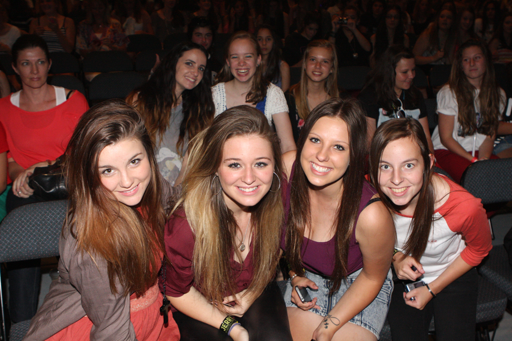
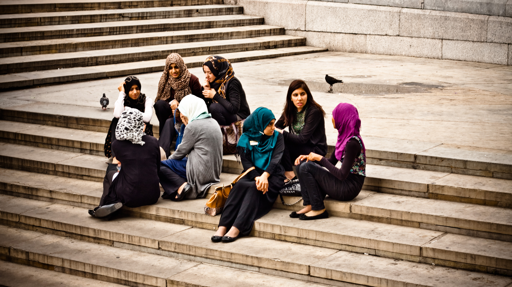
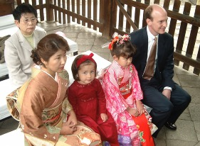
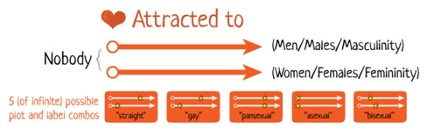

# Adolescence – Social Emotional Development

<style>
div.solid {
border: 5px solid #FFA500;
border-radius: 5px;
padding: 20px;
}
</style>

<div class = "solid">

After this chapter, you should be able to:

1. Compare Erikson and Marcia’s Theories 

2. Explain Identity and Self-concept

3. Summarize the Stages of Ethnic Identity Development

4. Explain the Development of Gender Identity

5. Summarize Sexuality Identity and Orientation 

6. Describe Antisocial Behaviors

7. Explain the Developmental Stage of Emerging Adulthood 


Adolescents continue to refine their sense of self as they relate to others. Adolescent’s main questions are “Who am I?” and “Who do I want to be?” Some adolescents adopt the values and roles that their parents expect of them. Other teens develop identities that align more with the peer groups rather than their parents’ expectations. This is common as adolescents work to form their identities. They pull away from their parents and the peer group becomes very important (Shanahan, McHale, Osgood, & Crouter, 2007). Despite spending less time with their parents, most teens report positive feelings toward them (Moore, Guzman, Hair, Lippman, & Garrett, 2004). Warm and healthy parent-child relationships have been associated with positive outcomes for the adolescent, such as better grades and fewer school behavior problems, in the United States as well as in other countries (Hair et al., 2005).^[[Adolescent Development](https://nobaproject.com/modules/adolescent-development?r=LDE2MjU3) by [Jennifer Lansford](https://nobaproject.com/authors/jennifer-lansford) is licensed under [CC BY-NC-SA 4.0](https://creativecommons.org/licenses/by-nc-sa/4.0/deed.en_US); [Developmental Psychology – Chapter 7: Adolescence](https://courses.lumenlearning.com/suny-hccc-ss-152-1/chapter/social-development/) by Laura Overstreet is licensed under [CC BY 3.0](https://creativecommons.org/licenses/by/3.0/)]


<br/>

```{r fig-15-01, out.width="50%", fig.cap="The relationships between this teen and his mom will have positive outcomes for him.^[[Image](https://www.29palms.marines.mil/Articles/Article/1459220/families-participate-in-teen-dating-violence-awareness-self-defense-class/) by the [Marines Corps](http://www.marines.mil/) is in the public domain]"}

knitr::include_graphics("https://media.defense.gov/2018/Mar/06/2001886728/750/422/0/180222-M-OY155-001.JPG")

```

</div>

<br/>


## Erik Erikson – Theory of Psychosocial Development


Erikson proposed that each period of life has a unique challenge or crisis that a person must face. This is referred to as a **psychosocial development**. According to Erikson, successful development involves dealing with and resolving the goals and demands of each of these crises in a positive way. These crises are usually called stages, although that is not the term Erikson used. If a person does not resolve a crisis successfully, it may hinder their ability to deal with later crises. For example, an individual who does not develop a clear sense of purpose and identity (Erikson’s fifth crisis - Identity vs. Role Confusion) may become self-absorbed and stagnate rather than working toward the betterment of others (Erikson’s seventh crisis - Generativity vs. Stagnation). However, most individuals are able to successfully complete the eight crises of his theory.^[[Introduction to Psychology](http://dept.clcillinois.edu/psy/IntroductionToPsychologyText.pdf) by Martha Lally and Suzanne Valentine-French is licensed under [CC BY-NC-SA 3.0](http://creativecommons.org/licenses/by-nc-sa/3.0/)]

### Identity vs. Role Confusion 

**Identity vs. Role Confusion** is a major stage of development where the child has to learn the roles he will occupy as an adult. In adolescence, children (ages 12–18) face the task of identity vs. role confusion. Success in this stage will lead to the virtue of **fidelity**. **Fidelity** involves being able to commit one's self to others on the basis of accepting others, even when there may be ideological differences. According to Erikson, an adolescent’s main task is developing a sense of self. Adolescents struggle with questions such as “Who am I?” and “What do I want to do with my life?” Along the way, most adolescents try on many different selves to see which ones fit; they explore various roles and ideas, set goals, and attempt to discover their “adult” selves. Adolescents who are successful at this stage have a strong sense of identity and are able to remain true to their beliefs and values in the face of problems and other people’s perspectives. When adolescents are apathetic, do not make a conscious search for identity, or are pressured to conform to their parents’ ideas for the future, they may develop a weak sense of self and experience role confusion. They will be unsure of their identity and confused about the future. Teenagers who struggle to adopt a positive role will likely struggle to “find” themselves as adults.^[[Education, Society, & the K-12 Learner – Part II: Educational Psychology](https://courses.lumenlearning.com/teachereducationx92x1/chapter/eriksons-stages-of-psychosocial-development/) references [Modification of Erickson’s Stages of Psychosocial Development](https://www.boundless.com/psychology/textbooks/boundless-psychology-textbook/human-development-14/theories-of-human-development-70/erikson-s-stages-of-psychosocial-development-269-12804/) by Boundless, which is licensed under [CC BY-SA 4.0](https://creativecommons.org/licenses/by-sa/4.0/)]

Erikson saw this as a period of confusion and experimentation regarding identity and how one navigates along life’s path. During adolescence, we experience **psychological moratorium**, where teens put their current identity on hold while they explore their options for identity. The culmination of this exploration is a more coherent view of oneself. Those who are unsuccessful at resolving this stage may either withdraw further into social isolation or become lost in the crowd. However, more recent research suggests, that few leave this age period with identity achievement, and that most identity formation occurs during young adulthood (Côtè, 2006).^[[Lifespan Development: A Psychological Perspective](http://dept.clcillinois.edu/psy/LifespanDevelopment.pdf) by Martha Lally and Suzanne Valentine-French is licensed under [CC BY-NC-SA 3.0](https://creativecommons.org/licenses/by-nc-sa/3.0/)]


## James Marcia – Theory of Identity Development 

One approach to assessing identity development was proposed by James Marcia. In his approach, adolescents are asking questions regarding their exploration of and commitment to issues related to occupation, politics, religion, and sexual behavior. Studies assessing how teens pass through Marcia’s stages show that although most teens eventually succeed in developing a stable identity, the path to it is not always easy and there are many routes that can be taken. Some teens may simply adopt the beliefs of their parents or the first role that is offered to them, perhaps at the expense of searching for other more promising possibilities (foreclosure status). Other teens may spend years trying on different possible identities (moratorium status) before finally choosing one.^[[Introduction to Psychology](http://dept.clcillinois.edu/psy/IntroductionToPsychologyText.pdf) by Martha Lally and Suzanne Valentine-French is licensed under [CC BY-NC-SA 3.0](http://creativecommons.org/licenses/by-nc-sa/3.0/)] 

Marcia identified four identity statuses that represent the four possible combinations of the dimension of commitment and exploration.^[[Lifespan Development: A Psychological Perspective](http://dept.clcillinois.edu/psy/LifespanDevelopment.pdf) by Martha Lally and Suzanne Valentine-French is licensed under [CC BY-NC-SA 3.0](https://creativecommons.org/licenses/by-nc-sa/3.0/)]


```{r table-15-01, include=F}

table_15_01 <- read_csv("tables/table-15-01.csv")

```


```{r}

table_15_01 %>% 
        kable(caption = "Identity Status")

```


The least mature status, and one common in many children, is identity diffusion. During high school and the college years, teens and young adults move from identity diffusion and foreclosure toward moratorium and achievement. The biggest gains in the development of identity are in college, as college students are exposed to a greater variety of career choices, lifestyles, and beliefs. This is likely to spur on questions regarding identity. A great deal of the identity work we do in adolescence and young adulthood is about values and goals, as we strive to articulate a personal vision or dream for what we hope to accomplish in the future (McAdams, 2013).^[[Lifespan Development: A Psychological Perspective](http://dept.clcillinois.edu/psy/LifespanDevelopment.pdf) by Martha Lally and Suzanne Valentine-French is licensed under [CC BY-NC-SA 3.0](https://creativecommons.org/licenses/by-nc-sa/3.0/); Table adapted from Marcia, J. (1980). Identity in adolescence. *Handbook of adolescent psychology, 5*, 145]
  

To help them work through the process of developing an identity, teenagers may try out different identities in different social situations. They may maintain one identity at home and a different type of persona when they are with their peers. Eventually, most teenagers do integrate the different possibilities into a single self-concept and a comfortable sense of identity (identity-achievement status). For teenagers, the peer group provides valuable information about the self-concept. For instance, in response to the question “What were you like as a teenager? (e.g., cool, nerdy, awkward?),” posed on the website Answerbag, one teenager replied in this way: 

I’m still a teenager now, but from 8th-9th grade I didn’t really know what I wanted at all. I was smart, so I hung out with the nerdy kids. I still do; my friends mean the world to me. But in the middle of 8th grade I started hanging out with which you may call the “cool” kids…and I also hung out with some stoners, just for variety. I pierced various parts of my body and kept my grades up. Now, I’m just trying to find who I am. I’m even doing my sophomore year in China so I can get a better view of what I want. (Answerbag, 2007). What were you like as a teenager? (e.g., cool, nerdy, awkward?). (Quoted from dojokills on http://www.answerbag.com/q_view/171753)

A big part of what the adolescent is learning is social identity, the part of the self-concept that is derived from one’s group memberships. Adolescents define their social identities according to how they are similar to and different from others, finding meaning in the sports, religious, school, gender, and ethnic categories they belong to.^[[Introduction to Psychology](http://dept.clcillinois.edu/psy/IntroductionToPsychologyText.pdf) by Martha Lally and Suzanne Valentine-French is licensed under [CC BY-NC-SA 3.0](http://creativecommons.org/licenses/by-nc-sa/3.0/)]


```{r fig-15-02, out.width="50%", fig.cap="^[[Image](https://pixabay.com/photos/cheerleader-high-school-girl-female-1648016/) on [Pixabay](https://pixabay.com/)]"}

knitr::include_graphics("https://cdn.pixabay.com/photo/2016/09/05/23/33/cheerleader-1648016_960_720.jpg")

```


```{r fig-15-03, out.width="50%", fig.cap="^[[Image](https://cdn.pixabay.com/photo/2014/01/05/02/44/teenage-girls-238963_960_720.jpg) on [Pixabay](https://pixabay.com/)]"}

knitr::include_graphics("https://cdn.pixabay.com/photo/2014/01/05/02/44/teenage-girls-238963_960_720.jpg")

```


```{r fig-15-03a, out.width="50%", fig.cap="^[[Image](https://www.flickr.com/photos/valeriebb/3498272313/) by [Valerie Everett](https://www.flickr.com/photos/valeriebb/) is licensed under [CC BY-SA 2.0](https://creativecommons.org/licenses/by-sa/2.0/)]"}


```


```{r fig-15-04, out.width="50%", fig.cap="^[[Image](https://unsplash.com/photos/HB7uRM0dIno) by [Adi Rahman](https://unsplash.com/@ceritadikit) on [Unsplash](https://unsplash.com/)]"}

# knitr::include_graphics("")

```


Adolescents search for stable attachments through the development of social identities.

## Development of Identity and Self Concept: Who am I? 

Developmental psychologists have researched several different areas of identity development for adolescence and some of the main areas include: 

### Religious Identity

The religious views of teens are often similar to that of their families (Kim- Spoon, Longo, & McCullough, 2012). Most teens may question specific customs, practices, or ideas in the faith of their parents, but few completely reject the religion of their families. 


	 
```{r fig-15-05, out.width="50%", fig.cap="A Muslim teen^[[Image](https://pixabay.com/photos/muslim-girl-smile-female-glasses-417317/) on [Pixabay](https://pixabay.com/)]"}

knitr::include_graphics("https://cdn.pixabay.com/photo/2014/08/13/08/55/muslim-417317_960_720.jpg")

```


```{r fig-15-06, out.width="50%", fig.cap="A Jewish teen^[[Image](https://commons.wikimedia.org/wiki/File:Michael%27s_Bar_Mitzvah_1.jpg) by [Eli](https://www.flickr.com/people/8088001@N02) is licensed under [CC BY 2.0](https://creativecommons.org/licenses/by/2.0/deed.en)]"}

knitr::include_graphics("https://upload.wikimedia.org/wikipedia/commons/thumb/0/08/Michael%27s_Bar_Mitzvah_1.jpg/800px-Michael%27s_Bar_Mitzvah_1.jpg")

```


```{r fig-15-07, out.width="50%", fig.cap="A Catholic teen^[[Image](https://commons.wikimedia.org/wiki/File:Teen_boys_at_altar_1666_(507901045).jpg) by [James Emery](https://www.flickr.com/people/62126383@N00) is licensed under [CC BY 2.0](https://creativecommons.org/licenses/by/2.0/deed.en)]"}

knitr::include_graphics("https://upload.wikimedia.org/wikipedia/commons/thumb/2/2c/Teen_boys_at_altar_1666_%28507901045%29.jpg/450px-Teen_boys_at_altar_1666_%28507901045%29.jpg")

```


```{r fig-15-08, out.width="50%", fig.cap="A Buddhist teen^[[Image](https://pxhere.com/en/photo/1332254) is licensed under [CC0 1.0](https://creativecommons.org/publicdomain/zero/1.0/)]"}

knitr::include_graphics("https://c.pxhere.com/photos/fe/f0/meditation_buddhist_boy_meditate_wat_temple_buddhism_thailand-1332254.jpg!d")

```


### Political Identity

 The political ideology of teens is also influenced by their parents’ political beliefs. A new trend in the 21st century is a decrease in party affiliation among adults. Many adults do not align themselves with either the democratic or republican party, but view themselves as more of an “independent”. Their teenage children are often following suit or becoming more apolitical (Côtè, 2006). 

### Vocational Identity

While adolescents in earlier generations envisioned themselves as working in a particular job, and often worked as an apprentice or part-time, this is rarely the case today. Vocational identity takes longer to develop, as most of today’s occupations require specific skills and knowledge that will require additional education or are acquired on the job itself. In addition, many of the jobs held by teens are not in professions that most teens will seek as adults. 

### Gender Identity

This is also becoming an increasingly prolonged task as attitudes and norms regarding gender keep changing. The roles appropriate for males and females are evolving. Some teens may foreclose on a gender identity as a way of dealing with this uncertainty, and they may adopt more stereotypic male or female roles (Sinclair & Carlsson, 2013). We will be looking more closely at gender identity later in the chapter.^[[Lifespan Development: A Psychological Perspective](http://dept.clcillinois.edu/psy/LifespanDevelopment.pdf) by Martha Lally and Suzanne Valentine-French is licensed under [CC BY-NC-SA 3.0](https://creativecommons.org/licenses/by-nc-sa/3.0/)]


### Self-Concept and Self-Esteem 

In adolescence, teens continue to develop their self-concept. Their ability to think of the possibilities and to reason more abstractly may explain the further differentiation of the self during adolescence. However, the teen’s understanding of self is often full of contradictions. Young teens may see themselves as outgoing but also withdrawn, happy yet often moody, and both smart and completely clueless (Harter, 2012). These contradictions, along with the teen’s growing recognition that their personality and behavior seem to change depending on who they are with or where they are, can lead the young teen to feel like a fraud. With their parents they may seem angrier and sullen, with their friends they are more outgoing and goofy, and at work they are quiet and cautious. “Which one is really me?” may be the refrain of the young teenager. Harter (2012) found that adolescents emphasize traits such as being friendly and considerate more than do children, highlighting their increasing concern about how others may see them. Harter also found that older teens add values and moral standards to their self-descriptions. 

 
```{r fig-15-09, out.width="50%", fig.cap="An adolescent’s understanding of their self is often full of contradictions.^[[Image](https://www.pexels.com/photo/girl-jeans-kid-loneliness-236215/) on [Pixabay](https://www.pexels.com/@pixabay)]"}

knitr::include_graphics("https://images.pexels.com/photos/236215/pexels-photo-236215.jpeg?auto=compress&cs=tinysrgb&dpr=2&h=650&w=940")

```


```{r fig-15-10, out.width="50%", fig.cap="Adolescents are more likely to emphasize values in their self-descriptions.^[[Image](https://pxhere.com/en/photo/609239) is licensed under [CC0 1.0](https://creativecommons.org/publicdomain/zero/1.0/)]"}

knitr::include_graphics("https://c.pxhere.com/photos/16/19/teenage_girl_cheerful_young_female_girl_happy_teenager_happiness-609239.jpg!d")

```

As self-concept develops, so does self-esteem. In addition to the academic, social, appearance, and physical/athletic dimensions of self-esteem in middle and late childhood, teens also add perceptions of their competency in romantic relationships, on the job, and in close friendships (Harter, 2006). Self-esteem often decreases when children transition from one school setting to another, such as shifting from elementary to middle school, or junior high to high school (Ryan, Shim, & Makara, 2013). These decreases are usually temporary, unless there are additional stressors such as parental conflict, or other family disruptions (De Wit, Karioja, Rye, & Shain, 2011). Self-esteem rises from mid to late adolescence for most teenagers, especially if they feel confident in their peer relationships, their appearance, and athletic abilities (Birkeland, Melkivik, Holsen, & Wold, 2012). 

## Development of Gender Identity

From birth, children are assigned a gender and are socialized to conform to certain gender roles based on their biological sex. “**Sex**,” refers to physical or physiological differences between males, females, and intersex persons, including both their primary and secondary sex characteristics. “**Gender**,” on the other hand, refers to social or cultural distinctions associated with a given sex. 

When babies are born, they are assigned a gender based on their biological sex—male babies are assigned as boys, female babies are assigned as girls, and **intersex** babies are born with sex characteristics that do not fit the typical definitions for male or female bodies, and are usually relegated into one gender category or another. Scholars generally regard gender as a **social construct**, meaning that it doesn’t exist naturally but is instead a concept that is created by cultural and societal norms. From birth, children are socialized to conform to certain gender roles based on their biological sex and the gender to which they are assigned.^[[Intersex](https://en.wikipedia.org/wiki/Intersex) by [Wikipedia](https://en.wikipedia.org/wiki/Main_Page) is licensed under [CC BY-SA 3.0](https://en.wikipedia.org/wiki/Wikipedia:Text_of_Creative_Commons_Attribution-ShareAlike_3.0_Unported_License)]

A person’s subjective experience of their own gender and how it develops, or **gender identity**, is a topic of much debate. It is the extent to which one identifies with a particular gender; it is a person’s individual sense and subjective experience of being a man, a woman, or other gender. It is often shaped early in life and consists primarily of the acceptance (or non-acceptance) of one’s membership into a gender category. In most societies, there is a basic division between gender attributes assigned to males and females. In all societies, however, some individuals do not identify with some (or all) of the aspects of gender that are assigned to their biological sex.

Those that identify with the gender that corresponds to the sex assigned to them at birth (for example, they are assigned female at birth and continue to identify as a girl, and later a woman) are called **cisgender**. In many Western cultures, individuals who identify with a gender that is different from their biological sex (for example, they are assigned female at birth but feel inwardly that they are a boy or a gender other than a girl) are called **transgender**. Some transgender individuals, if they have access to resources and medical care, choose to alter their bodies through medical interventions such as surgery and hormonal therapy so that their physical being is better aligned with their gender identity.

 
```{r fig-15-11, out.width="50%", fig.cap="This person identifies as genderqueer.^[[Image](https://commons.wikimedia.org/wiki/File:Genderqueer_person.jpg) by [Franziska Neumeister](https://www.flickr.com/photos/127085184@N05/) is licensed under [CC BY 2.0](https://creativecommons.org/licenses/by/2.0/deed.en)]"}

knitr::include_graphics("https://upload.wikimedia.org/wikipedia/commons/thumb/a/aa/Genderqueer_person.jpg/400px-Genderqueer_person.jpg")

```

Recent terms such as “genderqueer,” “genderfluid,” “gender variant,” “androgynous,” “agender,” and “gender nonconforming” are used by individuals who do not identify within the gender binary as either a man or a woman. Instead they identify as existing somewhere along a spectrum or continuum of genders, or outside of the spectrum altogether, often in a way that is continuously evolving.

### The Gender Continuum

Viewing gender as a continuum allows us to perceive the rich diversity of genders, from trans- and cisgender to gender queer and agender. Most Western societies operate on the idea that gender is a **binary**, that there are essentially only two genders (men and women) based on two sexes (male and female), and that everyone must fit one or the other. This social dichotomy enforces conformance to the ideals of masculinity and femininity in all aspects of gender and sex—gender identity, gender expression, and biological sex. 

According to supporters of **queer theory**, gender identity is not a rigid or static identity but can continue to evolve and change over time. Queer theory developed in response to the perceived limitations of the way in which identities are thought to become consolidated or stabilized (for instance, gay or straight), and theorists constructed queerness in an attempt to resist this. In this way, the theory attempts to maintain a critique rather than define a specific identity. While “queer” defies a simple definition, the term is often used to convey an identity that is not rigidly developed but is instead fluid and changing.^[B[oundless Psychology - Gender and Sexuality](https://courses.lumenlearning.com/boundless-psychology/chapter/gender/) references Curation and Revision by Boundless Psychology, which is licensed under [CC BY-SA 4.0](https://creativecommons.org/licenses/by-sa/4.0/)]


#### The Genderbread Person

In 2012, Sam Killerman created the Genderbread Person as an infographic to break down gender identity, gender expression, biological sex, and sexual orientation.^[[The Genderbread Person](https://www.itspronouncedmetrosexual.com/2012/01/the-genderbread-person/) by Sam Killermann is in the public domain]  In 2018, he updated it to version 2.0 to be more accurate, and inclusive.^[[The Genderbread Person v2.0](https://www.itspronouncedmetrosexual.com/2012/03/the-genderbread-person-v2-0/) by Sam Killermann is in the public domain ]

<!-- 

Gender Unicorn
http://transstudent.org/gender/

-->

```{r fig-15-12, fig.cap="The Genderbread Person explains gender identity, gender expression, biological sex, and sexual orientation.^[[Image](https://www.itspronouncedmetrosexual.com/2012/03/the-genderbread-person-v2-0/) by [it’s pronounced METROsexual](https://www.itspronouncedmetrosexual.com/about/)]"}

knitr::include_graphics("https://www.itspronouncedmetrosexual.com/wp-content/uploads/2012/03/Genderbread-2.1.jpg")

```


<style>
div.blue { background-color:#e6f0ff; border-radius: 5px; padding: 20px;}
</style>
<div class = "blue">
##### Gender Pronouns^[[Pronouns](https://nonbinary.wiki/wiki/Pronouns) by [Nonbinary Wiki](https://nonbinary.wiki/wiki/Main_Page) is licensed under [CC BY-SA 4.0](https://creativecommons.org/licenses/by-sa/4.0/)]

Pronouns are a part of language used to refer to someone or something without using proper nouns. In standard English, some singular third-person pronouns are "he" and "she," which are usually seen as gender-specific pronouns, referring to a man and a woman, respectively. A gender-neutral pronoun or gender-inclusive pronoun is one that gives no implications about gender, and could be used for someone of any gender. 

Some languages only have gender-neutral pronouns, whereas other languages have difficulty establishing any that aren't gender-specific. People with non-binary gender identities often choose new third-person pronouns for themselves as part of their transition. They often choose gender-neutral pronouns so that others won't see them as female or male. 

Here is a table based on the Rainbow Coalition of Yellowknife’s Handy Guide to Pronouns:


```{r table-15-02, include=F}

table_15_02 <- read_csv("tables/table-15-02.csv")

```


```{r}

table_15_02 %>% 
        kable(caption = "Guide to Pronouns^[Rainbow Coalition of Yellowknife. (n.d). Handy Guide to Pronouns [PDF files]. Retrieved from http://www.rainbowcoalitionyk.org/resources/.]") 
```

</div>

### Factors that Influence Gender Identity

Although the formation of gender identity is not completely understood, many factors have been suggested as influencing its development. Biological factors that may influence gender identity include pre- and post-natal hormone levels and genetic makeup. Social factors include ideas regarding gender roles conveyed by family, authority figures, mass media, and other influential people in a child’s life. According to social-learning theory, children develop their gender identity through observing and imitating the gender-linked behaviors of others; they are then “rewarded” for imitating the behaviors of people of the same gender and “punished” for imitating the behaviors of another gender. For example, male children will often be rewarded for imitating their father’s love of baseball but punished or redirected in some way if they imitate their older sister’s love of dolls. Children are shaped and molded by the people surrounding them, who they try to imitate and follow.

#### Gender Roles

The term “gender role” refers to society’s concept of how men and women are expected to act. As we grow, we learn how to behave from those around us. In this socialization process, children are introduced to certain roles that are typically linked to their biological sex. The term “gender role” refers to society’s concept of how men and women are expected to act and behave. Gender roles are based on norms, or standards, created by society. In American culture, masculine roles have traditionally been associated with strength, aggression, and dominance, while feminine roles have traditionally been associated with passivity, nurturing, and subordination.

#### Gender Socialization

The socialization process in which children learn these gender roles begins at birth. Today, our society is quick to outfit male infants in blue and girls in pink, even applying these color-coded gender labels while a baby is in the womb. It is interesting to note that these color associations with gender have not always been what they are today. Up until the beginning of the 20th century, pink was actually more associated with boys, while blue was more associated with girls—illustrating how socially constructed these associations really are.
Gender socialization occurs through four major agents: family, education, peer groups, and mass media. Each agent reinforces gender roles by creating and maintaining normative expectations for gender-specific behavior. Exposure also occurs through secondary agents, such as religion and the workplace. Repeated exposure to these agents over time leads people into a false sense that they are acting naturally based on their gender rather than following a socially constructed role.

#### Gender Stereotypes, Sexism, and Gender-Role Enforcement

The attitudes and expectations surrounding gender roles are not typically based on any inherent or natural gender differences, but on **gender stereotypes**, or oversimplified notions about the attitudes, traits, and behavior patterns of males and females. We engage in gender stereotyping when we do things like making the assumption that a teenage babysitter is female.

While it is somewhat acceptable for women to take on a narrow range of masculine characteristics without repercussions (such as dressing in traditionally male clothing), men are rarely able to take on more feminine characteristics (such as wearing skirts) without the risk of harassment or violence. This threat of punishment for stepping outside of gender norms is especially true for those who do not identify as male or female.


```{r fig-15-13, out.width="50%", fig.cap="Would girls likely pose this way for an image? What does this say about gender stereotypes?^[[Image](https://pixabay.com/photos/young-people-scream-fun-teenager-563026/) on [Pixabay](https://pixabay.com/)]"}

knitr::include_graphics("https://cdn.pixabay.com/photo/2014/12/10/11/04/young-people-563026_960_720.jpg")

```


Gender stereotypes form the basis of sexism, or the prejudiced beliefs that value males over females. Common forms of sexism in modern society include gender-role expectations, such as expecting women to be the caretakers of the household. Sexism also includes people’s expectations of how members of a gender group should behave. For example, girls and women are expected to be friendly, passive, and nurturing; when she behaves in an unfriendly or assertive manner, she may be disliked or perceived as aggressive because she has violated a gender role (Rudman, 1998). In contrast, a boy or man behaving in a similarly unfriendly or assertive way might be perceived as strong or even gain respect in some circumstances.^[[Lifespan Development: A Psychological Perspective](http://dept.clcillinois.edu/psy/LifespanDevelopment.pdf) by Martha Lally and Suzanne Valentine-French is licensed under [CC BY-NC-SA 3.0](https://creativecommons.org/licenses/by-nc-sa/3.0/)]


## Socialization Agents During Adolescence

Adolescence is a crucial period in social development, research shows there are four main types of relationships that influence an adolescent: parents, peers, community, and society.

### Parents and Teens: Autonomy and Attachment 

While most adolescents get along with their parents, they do spend less time with them (Smetana, 2011). This decrease in the time spent with families may be a reflection of a teenager’s greater desire for independence or **autonomy**. It can be difficult for many parents to deal with this desire for autonomy. However, it is normal for teenagers to increasingly distance themselves and establish relationships outside of their families in preparation for adulthood. 

Children in middle and late childhood are increasingly given greater freedom regarding basic decision making. This continues in adolescence, as teens demand more and more control over the decisions that affect their daily lives. Teens believe they should manage the areas that parents previously had considerable control over, which can increase tension between parents and their teenagers. Their arguments often center on issues of a power struggle or conflict in areas such as chores, homework, curfew, dating, personal appearance, and the right to privacy. 

 
```{r fig-15-14, out.width="50%", fig.cap="Teenagers report more conflicts with their mothers.^[[Image](https://www.wikihow.com/Argue-With-Parents-Successfully) by [Wikivisual](https://www.wikihow.com/User:Wikivisual) is licensed under [CC BY-NC-SA 3.0](https://creativecommons.org/licenses/by-nc-sa/3.0/)]"}

knitr::include_graphics("https://www.wikihow.com/images/thumb/5/5c/Calm-Down-Your-Mentally-Ill-Teen-Step-7.jpg/aid721291-v4-728px-Calm-Down-Your-Mentally-Ill-Teen-Step-7.jpg.webp")

```

As teens grow older, more compromise is reached between parents and teenagers (Smetana, 2011). Teens report more conflict with their mothers, as many mothers believe they should still have some control over many of these areas, yet often report their mothers to be more encouraging and supportive (Costigan, Cauce, & Etchison, 2007). Parents are more controlling of daughters, especially early maturing girls, than they are sons (Caspi, Lynam, Moffitt, & Silva, 1993). In addition, culture and ethnicity also play a role in how restrictive parents are with the daily lives of their children (Chen, Vansteenkiste, Beyers, Soensens, & Van Petegem, 2013).^[[Lifespan Development: A Psychological Perspective](http://dept.clcillinois.edu/psy/LifespanDevelopment.pdf) by Martha Lally and Suzanne Valentine-French is licensed under [CC BY-NC-SA 3.0](https://creativecommons.org/licenses/by-nc-sa/3.0/)]


Having supportive, less conflict ridden relationships with parents also benefits teenagers. Research on attachment in adolescence finds that teens who are still securely attached to their parents have less emotional problems (Rawatlal, Kliewer & Pillay, 2015), are less likely to engage in drug abuse and other criminal behaviors (Meeus, Branje & Overbeek, 2004), and have more positive peer relationships (Shomaker & Furman, 2009). This means that both parents and teenagers need to strike a balance between autonomy, while still maintaining close and caring familial relationships.^[[Lifespan Development: A Psychological Perspective](http://dept.clcillinois.edu/psy/LifespanDevelopment.pdf) by Martha Lally and Suzanne Valentine-French is licensed under [CC BY-NC-SA 3.0](https://creativecommons.org/licenses/by-nc-sa/3.0/)]


### The Parent-Child Relationship

The relationship with parents may be a mitigating factor of the negative influence by peers. Communicating family rules and parental style have been inversely associated to substance, alcohol, and tobacco consumption during adolescence. This influence is essential for adolescents’ development up to adulthood. Communication between parents and adolescents emerges as a protective factor for alcohol, tobacco, and substance use (Newman, Harrison & Dashiff, 2008). 

Sen (2010) observed that family meals could lead to creating a closer relation between parents and adolescents, by strengthening a positive relationship and avoiding certain risk behaviors, such as substance use amongst girls and alcohol consumption, physical violence, and robberies, amongst boys. These differences between genders may be due to a greater importance that girls attribute to family activities but they do not reveal that boys are indifferent to them, only that the relation between genders may differ. Huebner and Howell (2003) verified that parental monitoring and communication with parents protected adolescents of both genders from being involved in risk behaviors. 

 
```{r fig-15-15, out.width="50%", fig.cap="if this father monitors and communicates with his son, he can reduce the teen’s risky behaviors.^[[Image](https://www.flickr.com/photos/67835627@N05/) by [moodboard](https://www.flickr.com/photos/67835627@N05/) is licensed under [CC BY 2.0](https://creativecommons.org/licenses/by/2.0/)]"}


```

Parental monitoring can be defined as parents’ knowledge about their children’s activities, who they hang out with and what they do. It has been associated to protection of various risk behaviors throughout adolescence, such as substance use or sexual behaviors. The greater the parental monitoring, the lower the adolescents’ involvement in risk behavior. It may vary according to age, gender or ethnicity and it generally decreases with age (Westling, Andrews, Hampson & Peterson, 2008).^[[How Can Peer Group Influence the Behavior of Adolescents: Explanatory Model](http://www.ccsenet.org/journal/index.php/gjhs/article/view/12758) by Gina Tomé, Margarida Matos, Celeste Simões, José Diniz, and Inês Camacho is licensed under [CC BY 4.0](https://creativecommons.org/licenses/by/4.0/)]

### Relationships with Peers and Peer Groups

#### Peer Relationships

In addition, peers also serve as an important source of social support and companionship during adolescence. As children become adolescents, they usually begin spending more time with their peers and less time with their families, and these peer interactions are increasingly unsupervised by adults. The level of influence that peers can have over an adolescent makes these relationships particularly important in their personal development. Adolescents with positive peer relationships are happier and better adjusted than those who are socially isolated or have conflictual peer relationships.

Adolescents’ notions of friendship increasingly focus on intimate exchanges of thoughts and feelings, which are important to forming friendships; these high quality friendships may enhance a child’s development regardless of the particular characteristics of those friends. In addition, peers also serve as an important source of social support and companionship during adolescence. 

The peer group may serve as a model and influence behaviors and attitudes and also provide easy access, encouragement and an appropriate social setting for consumption (Glaser, Shelton & Bree, 2010). Social Learning Theory suggests that it is not necessary for adolescents to observe a given behavior and adopt it; it is sufficient to perceive that the peer group accepts it, in order to be able to opt for similar behaviors (Petraitis, Flay & Miller, 1995).^[[How Can Peer Group Influence the Behavior of Adolescents: Explanatory Model](http://www.ccsenet.org/journal/index.php/gjhs/article/view/12758) by Gina Tomé, Margarida Matos, Celeste Simões, José Diniz, and Inês Camacho is licensed under [CC BY 4.0](https://creativecommons.org/licenses/by/4.0/)]

Peers can serve both positive and negative functions during adolescence. Relationships with peers are valuable opportunities for adolescents to practice their social and conflict resolution skills. But negative peer pressure can lead adolescents to make riskier decisions or engage in more problematic behavior than they would alone or in the presence of their family. One of the most widely studied aspects of adolescent peer influence is known as deviant peer contagion (Dishion & Tipsord, 2011), which is the process by which peers reinforce problem behavior by laughing or showing other signs of approval that then increase the likelihood of future problem behavior.^[[Boundless Psychology - Adolescence](https://courses.lumenlearning.com/boundless-psychology/chapter/adolescence/) references Curation and Revision by Boundless Psychology, which is licensed under [CC BY-SA 4.0](https://creativecommons.org/licenses/by-sa/4.0/)]

Peers may strongly determine preference in the way of dressing, speaking, using illicit substances, sexual behavior, adopting and accepting violence, adopting criminal and anti-social behaviors, and in many other areas of the adolescent’s life (Padilla, Walker & Bean, 2009; Tomé, Matos & Diniz, 2008). An example of this is that the main motives for alcohol consumption given by adolescents are related to social events, which usually take place in the company of friends, namely: drinking makes holidays more fun, it facilitates approaching others, it helps relaxing or facilitates sharing experiences and feelings (Kuntsche, Knibbe, Gmel & Engels, 2005). Also, mimicking risk behaviors may be greater when consumption begins in the context of a social event (Larsen, Engels, Souren, Granic & Overbeek, 2010). 

 
```{r fig-15-16, out.width="50%", fig.cap="Adolescent boys drinking at a party.^[[Image](https://www.flickr.com/photos/opie/851920920) by [theopie](https://www.flickr.com/photos/opie/) is licensed under [CC BY 2.0](https://creativecommons.org/licenses/by/2.0/)]"}


```

On the other hand, having friends allows to share experiences and feelings and to learn how to solve conflicts. Not having friends, on the other hand, leads to social isolation and limited social contacts, as there are fewer opportunities to develop new relations and social interactional skills. 

Friendship is also positively associated to psychological well-being (Ueno, 2004), Stronger friendships may provide adolescents with an appropriate environment to development in a healthy way and to achieve good academic results. Adolescents with reciprocal friendships mention high levels of feelings of belonging in school; at the same time, reciprocity and feelings of belonging have positive effects in academic results (Vaquera & Kao, 2008). 

School is a setting where interpersonal relations are promoted, which are important for youngsters’ personal and social development (Ruini et al., 2009); it is responsible for the transmission of behavioral norms and standards and it represents an essential role in the adolescent’s socialization process. The school is able to gather different peer communities and to promote self-esteem and a harmonious development between adolescents, which makes it a privileged space for meetings and interactions (Baptista, Tomé, Matos, Gaspar & Cruz, 2008). Adolescents spend a great part of their time at school, which also makes it a privileged context for involvement in or protection from risk behaviors (Piko & Kovács, 2010). Camacho, Tomé, Matos, Gamito and Diniz (2010) confirmed that adolescents who like school were those that more often were part of a peer group without involvement in risk behaviors; while those that mentioned they did not have any friends reported that they liked school less and those in conflict with their peers had more negative health outcomes. 

 
```{r fig-15-17, out.width="50%", fig.cap="These teens are at a concert together.^[[Image](https://www.flickr.com/photos/evarinaldiphotography/6927134950) by [Eva Rinaldi](https://www.flickr.com/photos/evarinaldiphotography/) is licensed under [CC BY-SA 2.0](https://creativecommons.org/licenses/by-sa/2.0/)]"}



```

Despite the positive influence of the peer group during adolescence, the higher the adolescent’s autonomy from the peer group, the higher their resilience against its influence. This resilience seems to increase with age, which may mean that it is associated with youngsters’ maturity; and girls emerge in several studies as more resilient than boys (Sumter, Bokhorst, Steinberg & Westenberg, 2009). 

Another factor that may be found in the influence of the peer group is the type of friendship, which adolescents maintain with their peer group: if friends are close they have a greater influence on the other’s behaviors (Glaser, Shelton & Bree, 2010). When the friendship is perceived as reciprocal and of quality, exerts greater influence (Mercken, Snijders, Steglich, Vartiainen & Vries, 2010). Another factor, which has been identified as a possible way of decreasing peer influence, is assertive refusal. Adolescents that are able to maintain an assertive refusal are less susceptible to the group’s influence (Glaser, Shelton & Bree, 2010). These are only some variables identified as possible factors decreasing peer influence.^[[How Can Peer Group Influence the Behavior of Adolescents: Explanatory Model](http://www.ccsenet.org/journal/index.php/gjhs/article/view/12758) by Gina Tomé, Margarida Matos, Celeste Simões, José Diniz, and Inês Camacho is licensed under [CC BY 4.0](https://creativecommons.org/licenses/by/4.0/)]

#### Peers in Groups

During adolescence, it is common to have friends of the opposite sex much more than in childhood, peer groups evolve from primarily single-sex to mixed-sex. Teens within a peer group tend to be similar to one another in behavior and attitudes, which has been explained as a function of **homophily**, that is, adolescents who are similar to one another choose to spend time together in a “birds of a feather flock together” way. Adolescents who spend time together also shape each other’s behavior.

Crowds are an emerging level of peer relationships in adolescence. In contrast to friendships, which are reciprocal dyadic relationships, and **cliques**, which refer to groups of individuals who interact frequently, **crowds** are characterized by shared reputations or images (who people think they are). Crowds refer to different collections of people, like the “theater kids” or the “environmentalists.” In a way, they are kind of like clothing brands that label the people associated with that crowd.^[[Lifespan Development – Module 7: Adolescence](https://courses.lumenlearning.com/lifespandevelopment2/chapter/social-development/) by Lumen Learning is licensed under [CC BY 4.0](https://creativecommons.org/licenses/by/4.0/)] 

 
 
```{r fig-15-18, out.width="50%", fig.cap="Clique^[[Image](https://www.flickr.com/photos/barnigomez/9810828873) by [leonardo samrani](https://www.flickr.com/photos/barnigomez/) is licensed under [CC BY 2.0](https://creativecommons.org/licenses/by/2.0/)]"}

knitr::include_graphics("figures/figure-15-18.jpg")

```


 
 
```{r fig-15-19, out.width="50%", fig.cap="Crowd^[[Image](https://www.flickr.com/photos/garryknight/6058771534/) by [Garry Knight](https://www.flickr.com/photos/garryknight/) is licensed under [CC BY 2.0](https://creativecommons.org/licenses/by/2.0/)]"}



```

## Community, Society, and Culture

There are certain characteristics of adolescent development that are more rooted in culture than in human biology or cognitive structures. Culture is learned and socially shared, and it affects all aspects of an individual’s life. Social responsibilities, sexual expression, and belief-system development, for instance, are all likely to vary based on culture. Furthermore, many distinguishing characteristics of an individual (such as dress, employment, recreation, and language) are all products of culture.

 
```{r fig-15-20, out.width="50%", fig.cap="Culture is learned and socially shared.^[[Image](https://www.schriever.af.mil/News/Article-Display/Article/931127/schriever-engages-in-diversity-day/) by Sgt. Matthew Coleman-Foster is in the public domain]"}

knitr::include_graphics("https://media.defense.gov/2016/Aug/31/2001620837/780/780/0/160826-F-RH307-158.JPG")

```


Many factors that shape adolescent development vary by culture. For instance, the degree to which adolescents are perceived as autonomous, or independent beings varies widely in different cultures, as do the behaviors that represent this emerging autonomy. The lifestyle of an adolescent in a given culture is also profoundly shaped by the roles and responsibilities he or she is expected to assume. The extent to which an adolescent is expected to share family responsibilities, for example, is one large determining factor in normative adolescent behavior. Adolescents in certain cultures are expected to contribute significantly to household chores and responsibilities, while others are given more freedom or come from families with more privilege where responsibilities are fewer. Differences between families in the distribution of financial responsibilities or provision of allowance may reflect various socioeconomic backgrounds, which are further influenced by cultural norms and values.

Adolescents begin to develop unique belief systems through their interaction with social, familial, and cultural environments. These belief systems encompass everything from religion and spirituality to gender, sexuality, work ethics, and politics. The range of attitudes that a culture embraces on a particular topic affects the beliefs, lifestyles, and perceptions of its adolescents, and can have both positive and negative impacts on their development. 

### Development of Ethnic Identity

Adolescent development does not necessarily follow the same pathway for all individuals. Certain features of adolescence, particularly with respect to biological changes associated with puberty and cognitive changes associated with brain development, are relatively universal. But other features of adolescence depend largely on circumstances that are more environmentally variable. For example, adolescents growing up in one country might have different opportunities for risk taking than adolescents in a different country, and supports and sanctions for different behaviors in adolescence depend on laws and values that might be specific to where adolescents live. 

 
```{r fig-15-21, out.width="50%", fig.cap="These values of these adolescent girls’ families and communities will influence their development.^[[Image](https://nobaproject.com/modules/adolescent-development?r=LDE2MjU3) is licensed under [CC0](https://creativecommons.org/publicdomain/zero/1.0/)]"}

knitr::include_graphics("https://nobaproject.com/images/shared/images/000/002/547/original.jpg")

```

Different cultural norms regarding family and peer relationships shape adolescents’ experiences in these domains. For example, in some countries, adolescents’ parents are expected to remain in control over major decisions, whereas in other countries, adolescents are expected to begin sharing in or taking control of decision making . Even within the same country, adolescents’ gender, ethnicity, immigrant status, religion, sexual orientation, socioeconomic status, and personality can shape both how adolescents behave and how others respond to them, creating diverse developmental contexts for different adolescents.^[[Adolescent Development](https://nobaproject.com/modules/adolescent-development?r=LDE2MjU3) by [Jennifer Lansford](https://nobaproject.com/authors/jennifer-lansford) is licensed under [CC BY-NC-SA 4.0](https://creativecommons.org/licenses/by-nc-sa/4.0/deed.en_US)]

**Ethnic Identity** refers to how people come to terms with who they are based on their ethnic or racial ancestry. “The task of ethnic identity formation involves sorting out and resolving positive and negative feelings and attitudes about one’s own ethnic group and about other groups and identifying one’s place in relation to both” (Phinney, 2006, p. 119). When groups differ in status in a culture—those from the non-dominant group have to be cognizant of the customs and values of those from the dominant culture. The reverse is rarely the case. This makes ethnic identity far less important for members of the dominant culture. 

In the United States, those of European ancestry engage in less exploration of ethnic identity, than do those of non-European ancestry (Phinney, 1989). However, according to the U.S. Census (2012) more than 40% of Americans under the age of 18 are from ethnic minorities. For many ethnic minority teens, discovering one’s ethnic identity is an important part of identity formation. Phinney’s model of ethnic identity formation is based on Erikson and Marcia’s model of identity formation (Phinney, 1990; Syed & Juang, 2014). Through the process of exploration and commitment, individual’s come to understand and create an ethnic identity. 

#### Phinney’s Three Stages or Statuses of Ethnic Identity 

Phinney’s model of ethnic identity formation is based on Erikson’s and Marcia’s model of identity formation (Phinney, 1990; Syed & Juang, 2014). Through the process of exploration and commitment, individual’s come to understand and create an ethic identity. Phinney suggests three stages or statuses with regard to ethnic identity:

Table 15.3 - 
```{r table-15-03, include=F}

table_15_03 <- read_csv("tables/table-15-03.csv")

```


```{r}

table_15_03 %>% 
        kable(caption = "Phinney’s Three Stages of Ethnic Identity")

```

The development of ethnic identity takes time, with about 25% of tenth graders from ethnic minority backgrounds having explored and resolved the issues (Phinney, 1989). The more ethnically homogeneous the high school, the less identity exploration and achievement (Umana-Taylor, 2003). Moreover, even in more ethnically diverse high schools, teens tend to spend more time with their own group, reducing exposure to other ethnicities. This may explain why, for many, college becomes the time of ethnic identity exploration. “[The] transition to college may serve as a consciousness-raising experience that triggers exploration” (Syed & Azmitia, 2009, p. 618).

It is also important to note that those who do achieve ethnic identity may periodically reexamine the issues of ethnicity. This cycling between exploration and achievement is common not only for ethnic identity formation, but in other aspects of identity development (Grotevant, 1987) and is referred to (from Marcia’s Theory: Stages of Identity) as **MAMA cycling** or moving back and forth between moratorium and achievement.^[[Lifespan Development: A Psychological Perspective](http://dept.clcillinois.edu/psy/LifespanDevelopment.pdf) by Martha Lally and Suzanne Valentine-French is licensed under [CC BY-NC-SA 3.0](https://creativecommons.org/licenses/by-nc-sa/3.0/)]


### Bicultural/Multiracial Identity

Ethnic minorities must wrestle with the question of how, and to what extent, they will identify with the culture of their surroundings, thus society and with the culture of their family. Phinney (2006) suggests that people may handle it in different ways. Some may keep the identities separate, others may combine them in some way, while others may reject some of them. 

**Bicultural identity** means individuals sees themselves as part of both the ethnic minority group and the larger society. Those who are **multiracial**, that is whose parents come from two or more ethnic or racial groups, have a more challenging task. In some cases their appearance may be ambiguous. This can lead to others constantly asking them to categorize themselves. Phinney (2006) notes that the process of identity formation may start earlier and take longer to accomplish in those who are not **monoracial** or a single ethnicity.^[[Lifespan Development: A Psychological Perspective](http://dept.clcillinois.edu/psy/LifespanDevelopment.pdf) by Martha Lally and Suzanne Valentine-French is licensed under [CC BY-NC-SA 3.0](https://creativecommons.org/licenses/by-nc-sa/3.0/)]

 
```{r fig-15-22, fig.cap="A bicultural family.^[[Image](https://vimeo.com/121089942) (taken from video) by [ISSH](https://vimeo.com/issh) is licensed under [CC BY 3.0](https://creativecommons.org/licenses/by/3.0/)]"}



```

## Media: Influences on Teens

Media is another agent of socialization that influences our political views; our tastes in popular culture; our views of women, people of color, and the LGBTQ+ community; and many other beliefs and practices. In an ongoing controversy, the media is often blamed for youth violence and many other of society’s ills. The average child sees thousands of acts of violence on television and in the movies before reaching young adulthood. Rap lyrics often seemingly extol ugly violence, including violence against women. Commercials can greatly influence our choice of soda, shoes, and countless other products. The mass media may also reinforce racial and gender stereotypes, including the belief that women are sex objects and suitable targets of male violence. In the General Social Survey (GSS), about 28% of respondents said that they watch four or more hours of television every day, while another 46% watch 2-3 hours daily (see "Average Number of Hours of Television Watched Daily"). The media certainly are an important source of socialization that was unimaginable a half-century ago.

 

```{r fig-15-23, out.width="50%", fig.cap="Daily television viewing time.^[Data from General Social Survey, 2008. Image by [Ian Joslin](https://koolkoalaj.com/) is licensed under [CC BY 4.0](https://creativecommons.org/licenses/by/4.0/)]"}

# knitr::include_graphics("")

```

As the media socializes children, adolescents, and even adults, a key question is the extent to which media violence causes violence in our society. Studies consistently uncover a strong correlation between watching violent television shows and movies and committing violence. However, this does not necessarily mean that watching the violence actually causes violent behavior: perhaps people watch violence because they are already interested in it and perhaps even committing it. Scholars continue to debate the effect of media violence on youth violence. In a free society, this question is especially important, as the belief in this effect has prompted calls for monitoring the media and the banning of certain acts of violence. Civil libertarians argue that such calls smack of censorship that violates the First Amendment to the Constitution, while others argue that they fall within the First Amendment and would make for a safer society. Certainly the concern and debate over mass media violence will continue for years to come.^[[Sociology: Brief Edition – Agents of Socialization](https://2012books.lardbucket.org/books/sociology-brief-edition-v1.0/s06-03-agents-of-socialization.html) by Steven E. Barkan is licensed under [CC BY-NC-SA 3.0](https://creativecommons.org/licenses/by-nc-sa/3.0/)]

## Development of Sexual Identity

### Dating and Romantic Relationships 

Adolescence is the developmental period during which romantic relationships typically first emerge. By the end of adolescence, most American teens have dated others and have had at least one romantic relationship (Dolgin, 2011). However, culture does play a role as Asian Americans and Latinas are less likely to date than other ethnic groups (Connolly, Craig, Goldberg, & Pepler, 2004). Dating serves many purposes for teens, including having fun, companionship, status, socialization, intimacy, sexual experimentation, and partner selection for those in late adolescence (Dolgin, 2011). There are several stages in the dating process, beginning with engaging in mixed-sex group activities in early adolescence (Dolgin, 2011). 

```{r table-15-04, include=F}

table_15_04 <- read_csv("tables/table-15-04.csv")

```


```{r}

table_15_04 %>% 
        kable(caption = "Romantic Relationships in Adolescence")

```


Furthermore, romantic relationships are centrally connected to adolescents’ emerging sexuality. Parents, policymakers, and researchers have devoted a great deal of attention to adolescents’ sexuality, in large part because of concerns related to sexual intercourse, contraception, and preventing teen pregnancies. However, sexuality involves more than this narrow focus, for example, adolescence is often when individuals who are lesbian, gay, bisexual, or transgender come to understand and define what their sexual identity is (Russell, Clarke, & Clary, 2009). Thus, romantic relationships are a domain in which adolescents experiment with new behaviors and identities.^[[Lifespan Development: A Psychological Perspective](http://dept.clcillinois.edu/psy/LifespanDevelopment.pdf) by Martha Lally and Suzanne Valentine-French is licensed under [CC BY-NC-SA 3.0](https://creativecommons.org/licenses/by-nc-sa/3.0/); [Lifespan Development - Module 7: Adolescence](https://courses.lumenlearning.com/lifespandevelopment2/chapter/social-development/) by Lumen Learning is licensed under [CC BY 4.0](https://creativecommons.org/licenses/by/4.0/)]]


 

```{r fig-15-24, out.width="50%", fig.cap="Romantic relationships emerge in adolescence.^[[Image](https://unsplash.com/photos/HL4MRlEyqxU) by [Djim Loic](https://unsplash.com/@loic) on [Unsplash](https://unsplash.com/)]"}

knitr::include_graphics("https://images.unsplash.com/photo-1490129375591-2658b3e2ee50?ixlib=rb-1.2.1&ixid=eyJhcHBfaWQiOjEyMDd9&auto=format&fit=crop&w=822&q=80")

```

<style>
div.blue { background-color:#e6f0ff; border-radius: 5px; padding: 20px;}
</style>
<div class = "blue">
#### Violence by Someone You Know

Violence can be committed against someone that the victim knows well, referred to as an intimate, in many ways: an intimate can hit with their fists, slap with an open hand, throw an object, push or shove, or use or threaten to use a weapon. While we can never be certain of the exact number of intimates that are attacked, the U.S. Department of Justice estimates from its National Crime Victimization Survey that almost 600,000 acts of violence (2008 data) are committed annually by one intimate against another intimate.^[[Lifespan Development: A Psychological Perspective](http://dept.clcillinois.edu/psy/LifespanDevelopment.pdf) by Martha Lally and Suzanne Valentine-French is licensed under [CC BY-NC-SA 3.0](https://creativecommons.org/licenses/by-nc-sa/3.0/); [Lifespan Development - Module 7: Adolescence](https://courses.lumenlearning.com/lifespandevelopment2/chapter/social-development/) by Lumen Learning is licensed under [CC BY 4.0](https://creativecommons.org/licenses/by/4.0/)]]

According to a fact sheet from the National Coalition Against Domestic Violence that compiled the results of several studies:

* In 2013, 35% of 10th graders reported that they had been physically or verbally abused and 31% reported having perpetrated such abuse

* In 2014, 10% of teenage students in dating relationships reported being coerced into sexual intercourse in the previous year

* In 2015, 20.9% of female and 13.4% of male high school students reported being physically or sexually assaulted by a dating partner

* But only 33% of teenage dating abuse victims reported having ever told anyone about it (according to a 2005 study)^[Dating Abuse and Teen Violence (n.d.). Retrieved from https://www.speakcdn.com/assets/2497/dating_abuse_and_teen_violence_ncadv.pdf]

A 2010 report by the CDC shows the larger pictures of intimate partner violence

* 1 in 3 women and 1 in 4 women have been victims of some form of physical violence by an intimate partner in their lifetime

* 1 in 7 women and 1 in 18 men have been stalked by an intimate partner to the point that they were fearful for their safety^[Who is Doing What to Whom? Determining the Core Aggressor in Relationships Where Domestic Violence Exists. (n.d.). Retrieved from https://www.speakcdn.com/assets/2497/who_is_doing_what_to_whom.pdf]
 
```{r fig-15-25, out.width="50%", fig.cap="Almost a quarter of U.S. women have been physically assaulted by a spouse or partner.^[[Image](https://unsplash.com/photos/7I1wrtRz5QQ) by [Kat J](https://unsplash.com/@kj2018) on [Unsplash](https://unsplash.com/)]"}

knitr::include_graphics("https://images.unsplash.com/photo-1516585142943-4341daf22d5f?ixlib=rb-1.2.1&ixid=eyJhcHBfaWQiOjEyMDd9&auto=format&fit=crop&w=750&q=80")

```

This topic is an important one because “domestic violence is prevalent in every community, and affects all people regardless of age, socio-economic status, sexual orientation, gender, race, religion, or nationality. Physical violence is often accompanied by emotionally abusive and controlling behavior as part of a much larger, systematic pattern of dominance and control. Domestic violence can result in physical injury, psychological trauma, and even death. The devastating consequences of domestic violence can cross generations and last a lifetime.”^[National Child Traumatic Stress Network. (n.d.). National Domestic Violence Awareness Month. Retrieved from https://www.nctsn.org/resources/public-awareness/national-domestic-violence-awareness-month]


</div>

### Sexual Orientation

A person's **sexual orientation** is their emotional and sexual attraction to a particular sex or gender. A continuing pattern of romantic or sexual attraction (or a combination of these) to persons of a given sex or gender. According to the American Psychological Association (APA) (2016), sexual orientation also refers to a person's sense of identity based on those attractions, related behaviors, and membership in a community of others who share those attractions. Some specific orientation is defined in many ways, including **heterosexuality** (attraction to the opposite sex/gender), same-sex attraction (previously referred to as **homosexuality**, which is an outdated term that many people find offensive because it was previously classified as a mental illness), **bisexuality**, **polysexuality**, or **pansexuality** (attraction to two, multiple, or all sexes/genders respectively), and **asexuality** (no sexual attraction to any sex/gender).

#### Sexual Orientation on a Continuum

Sexuality researcher Alfred Kinsey was among the first to conceptualize sexuality as a continuum rather than a strict dichotomy of gay or straight. To classify this continuum of heterosexuality and homosexuality, Kinsey et al. (1948) created a seven-point rating scale that ranged from exclusively heterosexual to exclusively homosexual. Research done over several decades has supported this idea that sexual orientation ranges along a continuum, from exclusive attraction to the opposite sex/gender to exclusive attraction to the same sex/gender (Carroll, 2016). 

A more contemporary look at sexual orientation as infinite variations of attraction. A closer examination of The Genderbread Person v2.0 introduced earlier in the chapter illustrates this:

 
```{r fig-15-26, fig.cap="A spectrum of sexual orientation.^[Image by [it’s pronounced METROsexual](https://www.itspronouncedmetrosexual.com/about/)]"}



```

#### Development of Sexual Orientation

According to current scientific understanding, individuals are usually aware of their sexual orientation between middle childhood and early adolescence. However, this is not always the case, and some do not become aware of their sexual orientation until much later in life. It is not necessary to participate in sexual activity to be aware of these emotional, romantic, and physical attractions; people can be celibate and still recognize their sexual orientation. Some researchers argue that sexual orientation is not static and inborn, but is instead fluid and changeable throughout the lifespan. 


```{r fig-15-27, out.width="50%", fig.cap="This teen couple is at a LGBTQIA pride event.^[[Image](https://www.flickr.com/photos/blmurch/6323444574/) by [Beatrice Murch](https://www.flickr.com/photos/blmurch/) is licensed under [CC BY 2.0](https://creativecommons.org/licenses/by/2.0/)]"}


```

There is no scientific consensus regarding the exact reasons why an individual holds a particular sexual orientation. Research has examined possible biological, developmental, social, and cultural influences on sexual orientation, but there has been no evidence that links sexual orientation to one factor (APA, 2016). Biological explanations, that include genetics, hormones, and birth order, will be explored further. Excess or deficient exposure to hormones during prenatal development has also been theorized as an explanation for sexual orientation. One-third of females exposed to abnormal amounts of prenatal androgens, a condition called congenital adrenal hyperplasia (CAH), identify as bisexual or lesbian (Cohen-Bendahan, van de Beek, & Berenbaum, 2005). In contrast, too little exposure to prenatal androgens may affect male sexual orientation (Carlson, 2011). 

**Sexual Orientation Discrimination**: The United States is **heteronormative**, meaning that society supports heterosexuality as the norm. Consider, for example, that homosexuals are often asked, "When did you know you were gay?" but heterosexuals are rarely asked, "When did you know you were straight?" (Ryle, 2011). Living in a culture that privileges heterosexuality has a significant impact on the ways in which non-heterosexual people are able to develop and express their sexuality. 

<style>
div.blue { background-color:#e6f0ff; border-radius: 5px; padding: 20px;}
</style>
<div class = "blue">
##### Understanding the Acronyms: LGBT, LGBTQ, LGBTQ+

The letters LGBT refer to a group of individuals that identify as Lesbian, Gay, Bisexual, and Transgender. This community includes a diverse group of people from all backgrounds, races, ethnicities, ages, and socioeconomic statuses.

###### A Little History

LGB was used to replace the term, “Gay,” in the mid-1980s, but the acronym LGBT became common in the 1990s. However, recently the term has evolved with the preferred acronym to LGBTQ. The added “Q” means Questioning or Queer. The addition of “Q” as a term of questioning includes people that are in the process of exploring their gender or sexual orientation.

Additionally, the term, “Queer,” can be used as an umbrella term, as the community has accepted this word to represent anything outside of the dominant narrative. Queer is not specific to sexual orientation or gender identity and can be used to refer to the community as a whole. While Queer was used as a derogatory term for decades, it was reclaimed by the LGBTQ community in the 1990s with the rise of an organization called Queer Nation. As an activist group out of New York, Queer Nation opposed discrimination of the LGBTQ community and rejected the heteronormative ideals of society.

###### What does the plus sign mean?
Recently LGBTQ is also used as LGBTQ+. The plus sign, “+” accounts for many additional identifications in the community, including transsexual, two-spirit, intersex, asexual, pansexual, and gender queer. Gender Queer is an umbrella term that can be used for all gender identities not exclusive to masculine or feminine, including gender fluid, agender, bigender, pan gender, gender free, genderless, gender variant, and gender non-conforming. The plus also includes allies or people in support of the LGBTQ community.

While LGBTQ+ or Queer are currently the most common terms, additionally the term, Rainbow Community, may be used. The important takeaway is that the community will continue to evolve, and the terminology will evolve with it.^[Understanding the Acronyms: LGBT, LGBTQ, LGBTQ+. (2019). Retrieved from https://www.horizon-health.org/blog/2019/01/understanding-the-acronym-lgbtq/. ]

</div>


Open identification of one's sexual orientation may be hindered by **homophobia**, which encompasses a range of negative attitudes and feelings toward homosexuality or people who are identified or perceived as being lesbian, gay, bisexual, or transgender (LGBT). It can be expressed as antipathy, contempt, prejudice, aversion, or hatred; it may be based on irrational fear and is sometimes related to religious beliefs (Carroll, 2016). Homophobia is observable in critical and hostile behavior, such as discrimination and violence on the basis of sexual orientations that are non- heterosexual. Recognized types of homophobia include **institutionalized homophobia**, such as religious and state-sponsored homophobia, and **internalized homophobia** in which people with same-sex attractions internalize, or believe, society's negative views and/or hatred of themselves. 

Gay, lesbian, and bisexual people regularly experience stigma, harassment, discrimination, and violence based on their sexual orientation (Carroll, 2016). Research has shown that gay, lesbian, and bisexual teenagers are at a higher risk of depression and suicide due to exclusion from social groups, rejection from peers and family, and negative media portrayals of homosexuals (Bauermeister et al., 2010). Discrimination can occur in the workplace, in housing, at schools, and in numerous public settings. Much of this discrimination is based on stereotypes and misinformation. Major policies to prevent discrimination based on sexual orientation have only come into effect in the United States in the last few years.^[[Lifespan Development: A Psychological Perspective](http://dept.clcillinois.edu/psy/LifespanDevelopment.pdf) by Martha Lally and Suzanne Valentine-French is licensed under [CC BY-NC-SA 3.0](https://creativecommons.org/licenses/by-nc-sa/3.0/); [Boundless Psychology - Gender and Sexuality](https://courses.lumenlearning.com/boundless-psychology/chapter/sexuality/) references Curation and Revision by Boundless Psychology, which is licensed under [CC BY-SA 4.0](https://creativecommons.org/licenses/by-sa/4.0/)]


 

```{r fig-15-28, out.width="50%", fig.cap="This is an example of discrimination that is portrayed in a high school play. These students from Mercer Island High School are playing Westboro Baptist Church protestors in the play The Laramie Project that tells the story of the murder of a gay college student, Matthew Shephard.^[[Image](https://www.flickr.com/photos/91281489@N00/286552276/) by [Jeff Hitchcock](https://www.flickr.com/photos/91281489@N00/286552276/) is licensed under [CC BY 2.0](https://creativecommons.org/licenses/by/2.0/)]"}


```

#### Adolescent Sexuality 

**Human sexuality** refers to people's sexual interest in and attraction to others, as well as their capacity to have erotic experiences and responses. Sexuality may be experienced and expressed in a variety of ways, including thoughts, fantasies, desires, beliefs, attitudes, values, behaviors, practices, roles, and relationships. These may manifest themselves in biological, physical, emotional, social, or spiritual aspects. The biological and physical aspects of sexuality largely concern the human reproductive functions, including the human sexual-response cycle and the basic biological drive that exists in all species. Emotional aspects of sexuality include bonds between individuals that are expressed through profound feelings or physical manifestations of love, trust, and care. Social aspects deal with the effects of human society on one's sexuality, while spirituality concerns an individual's spiritual connection with others through sexuality. Sexuality also impacts, and is impacted by cultural, political, legal, philosophical, moral, ethical, and religious aspects of life. 

**The Human Sexual Response Cycle**: Sexual motivation, often referred to as **libido**, is a person's overall sexual drive or desire for sexual activity. This motivation is determined by biological, psychological, and social factors. In most mammalian species, sex hormones control the ability to engage in sexual behaviors. However, sex hormones do not directly regulate the ability *to have sexual intercourse* or to **copulate** in primates (including humans); rather, they are only one influence on the motivation to engage in sexual behaviors. Social factors, such as work and family also have an impact, as do internal psychological factors like personality and stress. Sex drive may also be affected by hormones, medical conditions, medications, lifestyle stress, pregnancy, and relationship issues. 

The **human sexual response cycle** is a model that describes the physiological responses that take place during sexual activity. According to Kinsey, Pomeroy, and Martin (1948), the cycle consists of four phases: excitement, plateau, orgasm, and resolution. 

```{r table-15-05, include=F}

table_15_05 <- read_csv("tables/table-15-05.csv")

```

```{r}

table_15_05 %>% 
        kable(caption = "Human Sexual Response Cycle")

```

**Societal Views on Sexuality:** Society's views on sexuality are influenced by everything from religion to philosophy, and they have changed throughout history and are continuously evolving. Historically, religion has been the greatest influence on sexual behavior in the United States; however, in more recent years, peers and the media have emerged as two of the strongest influences, particularly among American teens (Potard, Courtois, & Rusch, 2008). 

**Media Influences on Sexuality:** Media in the form of television, magazines, movies, music, online, etc., continues to shape what is deemed appropriate or normal sexuality, targeting everything from body image to products meant to enhance sex appeal. Media serves to perpetuate a number of social scripts about sexual relationships and the sexual roles of men and women, many of which have been shown to have both empowering and problematic effects on people's (especially women's) developing sexual identities and sexual attitudes.

**Cultural Differences with Sexuality:** In the West, premarital sex is normative by the late teens, more than a decade before most people enter marriage. In the United States and Canada, and in northern and Eastern Europe, cohabitation is also normative; most people have at least one cohabiting partnership before marriage. In southern Europe, cohabiting is still taboo, but premarital sex is tolerated in emerging adulthood. In contrast, both premarital sex and cohabitation remain rare and forbidden throughout Asia. Even dating is discouraged until the late twenties, when it would be a prelude to a serious relationship leading to marriage. In cross-cultural comparisons, about three fourths of emerging adults in the United States and Europe report having had premarital sexual relations by age 20, versus less than one fifth in Japan and South Korea (Hatfield & Rapson, 2006).^[[Introduction to Psychology](http://dept.clcillinois.edu/psy/IntroductionToPsychologyText.pdf) by Martha Lally and Suzanne Valentine-French is licensed under [CC BY-NC-SA 3.0](http://creativecommons.org/licenses/by-nc-sa/3.0/)]


## Antisocial Behavior in Adolescence

### Bullies, Victims, and the Bystander 

**Bullying** is defined as unwanted, aggressive behavior among school aged children that involves a real or perceived power imbalance. Further, the aggressive behavior happens more than once or has the potential to be repeated. There are different types of bullying. They are detailed in the table below.

```{r table-15-06, include=F}

table_15_06 <- read_csv("tables/table-15-06.csv")

```

```{r}

table_15_06 %>% 
        kable(caption = "Types of Bullying") %>% 
        column_spec(1, width = "15em", background = "white") %>%
        collapse_rows(columns = 1, valign = "top")

```


```{r fig-15-29, fig.cap="Cyberbullying.^[[Image](https://en.m.wikipedia.org/wiki/File:Email_final.jpg) by [Vivianlee2005](https://commons.wikimedia.org/w/index.php?title=User:Vivianlee2005&action=edit&redlink=1) is licensed under CC BY-SA 3.0]"}

knitr::include_graphics("https://upload.wikimedia.org/wikipedia/commons/thumb/b/b4/Email_final.jpg/800px-Email_final.jpg")

```

#### The Bystander Effect

The discussion of bullying highlights the problem of witnesses not intervening to help a victim. Researchers Latané and Darley (1968) described a phenomenon called the bystander effect. The bystander effect is a phenomenon in which a witness or bystander does not volunteer to help a victim or person in distress. Instead, they just watch what is happening. Social psychologists hold that we make these decisions based on the social situation, not our own personality variables. Why do you think bystanders don’t get help? What are the benefits to helping? What are the risks? It is very likely you listed more costs than benefits to helping. In many situations, bystanders likely feared for their own lives—if they went to help, the attacker might harm them. However, how difficult would it be to make a phone call to the police? Social psychologists claim that diffusion of responsibility is the likely explanation. Diffusion of responsibility is the tendency for no one in a group to help because the responsibility to help is spread throughout the group (Bandura, 1999). Have you ever passed an accident on the freeway and assumed that a victim or certainly another motorist has already reported the accident? In general, the greater the number of bystanders, the less likely any one person will help.^[[Psychology – 12.6 Aggression](https://cnx.org/contents/Sr8Ev5Og@9.33:A80TvPKV@9/Aggression) by [OpenStax](https://cnx.org/) is licensed under [CC BY 4.0](http://creativecommons.org/licenses/by/4.0/) ]

## Antisocial Behaviors, Violence, and Child Abuse

### Antisocial Behaviors

According to the American Academy of Psychiatry (2018), 

> Most kids will act up or become disruptive or defiant sometimes. Disruptive and conduct disorders, however, involve much more severe and longer-lasting behaviors than typical, short-lived episodes. Disruptive, impulse-control and conduct disorders refer to a group of disorders that include oppositional defiant disorder, conduct disorder, intermittent explosive disorder, kleptomania and pyromania. These disorders can cause people to behave angrily or aggressively toward people or property. They may have difficulty controlling their emotions and behavior and may break rules or laws. An estimated 6 percent of children are affected by oppositional defiant disorder or conduct disorder.^[What Are Disruptive, Impulse-Control and Conduct Disorders? (n.d.). Retrieved from https://www.psychiatry.org/patients-families/disruptive-impulse-control-and-conduct-disorders/what-are-disruptive-impulse-control-and-conduct-disorders. ]

**Oppositional Defiant Disorder (ODD):** There is a recurrent pattern of negative, defiant, disobedient, and hostile behavior toward authority figures. It is important to remember that this is toward authority figures and not their peers. This occurs outside of normal developmental levels and leads to impairment in functioning (Lack, 2010).^[[Abnormal Psychology – Child Psychology](https://courses.lumenlearning.com/abnormalpsychology/chapter/oppositional-defiant-disorder-odd-conduct-disorder-cd/) references [Abnormal Psychology: An e-text!](http://abnormalpsych.wikispaces.com/) by Caleb Lack, which is licensed under [CC BY-NC-SA 4.0](https://creativecommons.org/licenses/by-nc-sa/4.0/) ]

**Conduct Disorder (CD):** Children with Conduct Disorder (CD) show acts of aggression towards others and animals. Children with conduct disorder (CD) usually show little to no compassion or concern for others or their feelings. Also, concern for the well-being of others is at a minimum. Children also perceive the actions and intentions of others as more harmful and threatening than they actually are and respond with what they feel is reasonable and justified aggression. They may lack feelings of guilt or remorse. Since these individuals learn that expressing guilt or remorse may help in avoiding or lessening punishment, it may be difficult to evaluate when their guilt or remorse is genuine. Individuals will also try and place blame on others for the wrong doings that they had committed.

 
```{r fig-15-30, out.width="50%", fig.cap="Children with conduct disorders show acts of aggression towards others and animals.^[[Image](https://pixabay.com/photos/boy-teen-schoolboy-anger-angry-2736659/) by [AnnaKovalchuck](https://pixabay.com/users/annakovalchuk-5692419/) on [Pixabay](https://pixabay.com/)]"}

knitr::include_graphics("https://cdn.pixabay.com/photo/2017/09/10/19/09/boy-2736659_960_720.jpg")

```

Children with conduct disorders (CD) tend to have lower levels of self-esteem. Children diagnosed with conduct disorders (CD) are typically characterized as being easily irritable and often reckless, as well as having many temper tantrums despite their projected “tough” image portrayed to society. Conduct Disorder (CD) often accompanies early onset of sexual behavior, drinking, smoking, use of illegal drugs, and reckless acts. Illegal drug use may increase the risk of the disorder persisting. The disorder may lead to school suspension or expulsion, problems at work, legal difficulties, STD’s, unplanned pregnancy, and injury from fights or accidents. Suicidal ideation and attempts occur at a higher rate than expected.^[[Abnormal Psychology – Child Psychology](https://courses.lumenlearning.com/abnormalpsychology/chapter/oppositional-defiant-disorder-odd-conduct-disorder-cd/) references [Abnormal Psychology: An e-text!](http://abnormalpsych.wikispaces.com/) by Caleb Lack, which is licensed under [CC BY-NC-SA 4.0](https://creativecommons.org/licenses/by-nc-sa/4.0/) ]

## Violence and Abuse

Violence and abuse are among the most disconcerting of the challenges that today’s families face. Abuse can occur between spouses, between parent and child, as well as between other family members. The frequency of violence among families is difficult to determine because many cases of spousal abuse and child abuse go unreported. In any case, studies have shown that abuse (reported or not) has a major impact on families and society as a whole.^[[Lifespan Development – Module 7: Adolescence](https://courses.lumenlearning.com/lifespandevelopment2/chapter/social-development/) by Lumen Learning is licensed under [CC BY 4.0](https://creativecommons.org/licenses/by/4.0/)] 

### Adolescent Child Abuse

Children and teens are among the most helpless victims of abuse. In 2010, there were more than 3.3 million reports of child abuse involving an estimated 5.9 million children (Child Help 2011). Three-fifths of child abuse reports are made by professionals, including teachers, law enforcement personnel, and social services staff. The rest are made by anonymous sources, other relatives, parents, friends, and neighbors. Child abuse may come in several forms, the most common is neglect (78.3 percent), followed by physical abuse (10.8 percent), sexual abuse (7.6 percent), psychological maltreatment (7.6 percent), and medical neglect (2.4 percent) (Child Help 2011). Some children suffer from a combination of these forms of abuse. The majority (81.2 percent) of perpetrators are parents; 6.2 percent are other relatives.^[[Introduction to Sociology 2e](https://openstax.org/details/books/introduction-sociology-2e) by [OpenStax](https://openstax.org/) is licensed under [CC BY 4.0](https://creativecommons.org/licenses/by/4.0/)]


```{r fig-15-31, out.width="50%", fig.cap="Children and teens are among the most helpless victims of abuse.^[[Image](https://www.flickr.com/photos/savannahgrandfather/3028542512/sizes/o/) by [Bruce Tuten](https://www.flickr.com/photos/savannahgrandfather/) is licensed under [CC BY 2.0](https://creativecommons.org/licenses/by/2.0/)]"}

knitr::include_graphics("https://live.staticflickr.com/3072/3028542512_e017fa4e88_o.jpg")

```


<style>
div.blue {background-color:#e6f0ff; border-radius: 5px; padding: 20px;}
</style>
<div class = "blue">

Does Corporal Punishment Constitute Child Abuse?

Physical abuse in children may come in the form of beating, kicking, throwing, choking, hitting with objects, burning, or other methods. Injury inflicted by such behavior is considered abuse even if the parent or caregiver did not intend to harm the child. Other types of physical contact that are characterized as discipline (spanking, for example) are not considered abuse as long as no injury results (Child Welfare Information Gateway 2008).

This issue is rather controversial among modern-day people in the United States. While some parents feel that physical discipline, or corporal punishment, is an effective way to respond to bad behavior, others feel that it is a form of abuse. According to a poll conducted by ABC News, 65 percent of respondents approve of spanking and 50 percent said that they sometimes spank their child. But in the U.S., the majority of mental health professionals, as well as other professionals such as physicians and child welfare personnel, do not support the use of physical punishment.

Tendency toward physical punishment may be affected by culture and education. Those who live in the South are more likely than those who live in other regions to spank their child. Those who do not have a college education are also more likely to spank their child (Crandall 2011). Currently, 23 states officially allow spanking in the school system; however, many parents may object and school officials must follow a set of clear guidelines when administering this type of punishment (Crandall 2011). 

Decades of research have yielded more than 500 studies examining the impact of physical punishment on children (Gershoff & Grogan-Kaylor, 2016). Within the past 15 years, several meta-analyses have attempted to synthesize this body of research. In a highly publicized meta-analysis, Gershoff (2002) concluded that physical punishment is not only ineffective, but also harmful. It may lead to aggression by the victim, particularly in those who are spanked at a young age (Berlin 2009).

Debates about parental use of physical punishment have been ongoing in the USA for decades. Calls to “move beyond” the research, or to “end the debate,” have become commonplace (e.g., Durrant & Ensom, 2017; MacMillan & Mikton, 2017). Three questions, it seems, sit at the center of these debates. Is physical punishment of children a Human Rights Issue? Is physical punishment effective? Is physical punishment harmful?^[[Challenges Families Face](https://cnx.org/contents/X0Qbaq5o@5/Challenges-Families-Face) by [OpenStax](https://cnx.org/) is licensed under [CC BY 4.0](http://creativecommons.org/licenses/by/4.0/); [Physical punishment of children by US parents: moving beyond debate to promote children’s health and well-being](http://www.scielo.br/scielo.php?script=sci_arttext&pid=S0102-79722018000106301) by Cindy Miller Perrin and Robin Perrin is licensed under [CC BY 4.0](https://creativecommons.org/licenses/by/4.0/deed.en)]

</div>

## Emerging Adulthood: The Bridge Between Adolescence and Adulthood
The next stage of development is emerging adulthood and is characterized as an in-between time where identity exploration is focused on work and love, which occurs from approximately 18 years of age to the mid to late 20s. 

When does a person become an adult? There are many ways to answer this question. In the United States, you are legally considered an adult at 18 years old, but other definitions of adulthood vary widely; in sociology, for example, a person may be considered an adult when they become self-supporting, choose a career, get married, or start a family. The ages at which we achieve these milestones vary from person to person as well as from culture to culture. For example, 50 years ago, a young adult with a high school diploma could immediately enter the workforce and climb the corporate ladder. That is no longer the case, a Bachelor’s and even graduate degrees are required more and more often—even for entry-level jobs (Arnett, 2000). In addition, many students are taking longer (five or six years) to complete a college degree as a result of working and going to school at the same time. After graduation, many young adults return to the family home because they have difficulty finding a job. 

 
```{r fig-15-32, out.width="50%", fig.cap="Emerging adulthood.^[[Image](https://www.flickr.com/photos/30745127@N07/28986198764/) by [City Year](https://www.flickr.com/photos/cityyear/) is licensed under [CC BY-NC-ND 2.0](https://creativecommons.org/licenses/by-nc-nd/2.0/)]"}

knitr::include_graphics("figures/figure-15-32.jpg")

```

This is a relatively newly defined period of lifespan development, Jeffrey Arnett (2000) explains that emerging adulthood is neither adolescence nor is it young adulthood. Individuals in this age period have left behind the relative dependency of childhood and adolescence, but have not yet taken on the responsibilities of adulthood. “Emerging adulthood is a time of life when many different directions remain possible, when little about the future is decided for certain, when the scope of independent exploration of life’s possibilities is greater for most people than it will be at any other period of the life course” (Arnett, 2000, p. 469).^[[Psychology – 9.3: Stages of Development](https://cnx.org/contents/Sr8Ev5Og@9.33:b7opmCF3@13/Stages-of-Development) by [OpenStax](https://cnx.org/) is licensed under [CC BY 4.0](http://creativecommons.org/licenses/by/4.0/); [Lifespan Development: A Psychological Perspective](http://dept.clcillinois.edu/psy/LifespanDevelopment.pdf) by Martha Lally and Suzanne Valentine-French is licensed under [CC BY-NC-SA 3.0](https://creativecommons.org/licenses/by-nc-sa/3.0/)]

<br/>

<style>
div.solid {
border: 5px solid #FFA500;
border-radius: 5px;
padding: 20px;
}
</style>

<div class = "solid">

In this chapter we finished our exploration of childhood and adolescence having looked at:

* Theories from Erikson and Marcia

* Self-concept and identity

* Gender identity

* Ethnic identity

* Sexuality

* Parent and adolescent relationships

* Peers and peer groups

* Antisocial behaviors

* Emerging adulthood

</div>

<br/>
